## 블로그 사이트 최적화

### 아래의 것을 배운다.

- 로딩 성능 최적화
  - 이미지 사이즈 최적화
  - Code **Split**
  - 텍스트 압축
- 렌더링 성능 최적화
  - Bottleneck 코드 최적화
    - 병목 현상을 일으키는 코드를 찾아낸다!

### 분석 툴 소개

1. 크롬 Network 탭
   1. 네트워크 리소스의 정보를 알려준다.
2. 크롬 Performance 탭
   1. 웹 페이지 동작 시 실행되는 모든 작업을 보여준다.
3. 크롬 Audit 탭(Light house)
   1. 서비스의 성능 수준을 파악할 수 있다.
4. webpack-bundle-analyzer
   1. 웹팩으로 번들링된 파일 크기를 확인할 수 있다.

### 서비스 탐색 및 코드 분석

```bash
.
├── README.md
├── package-lock.json
├── package.json
├── public
│   ├── favicon.ico
│   ├── index.html
│   ├── manifest.json
│   └── robots.txt
├── server
│   ├── config.json
│   └── database.json
├── src
│   ├── App.css
│   ├── App.js
│   ├── components
│   │   ├── Article
│   │   │   ├── index.css
│   │   │   └── index.js
│   │   ├── ArticleList
│   │   │   ├── index.css
│   │   │   └── index.js
│   │   ├── Footer
│   │   │   ├── index.css
│   │   │   └── index.js
│   │   ├── Header
│   │   │   ├── index.css
│   │   │   └── index.js
│   │   └── markdowns
│   │       └── CodeBlock.js
│   ├── index.css
│   ├── index.js
│   ├── pages
│   │   ├── ListPage
│   │   │   ├── index.css
│   │   │   └── index.js
│   │   └── ViewPage
│   │       ├── index.css
│   │       └── index.js
│   └── templates
│       └── BasicTemplates.js
└── yarn.lock
```

실제 블로그 사이트 디렉토리 구조는 이러하다.
server 폴더는 데이터를 내려주는 서버역할을 담당하며 src 내부의 소스는 해당 화면을 처리하는 소스들이 담겨져있다.

### Lighthouse 툴을 이용한 페이지 감사

Lighthouse이라는 개발자 도구에 대해 알아보자. 사용법은 매우 간단하다.

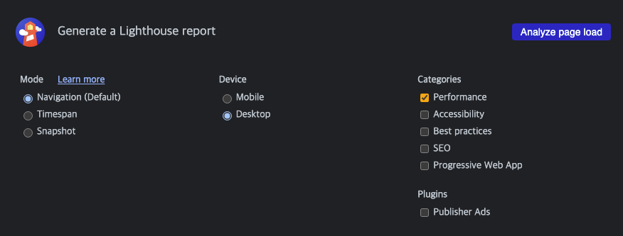

크롬 개발자 도구의 Lighthouse 탭을 연 뒤 검사할 환경을 설정한다. (우리는 주로 Performance 위주로 검사하므로 Performance 선택) 이후 상단 [Analyze page load] 버튼을 클릭하면 페이지에 대한 성능 검사가 시작된다.

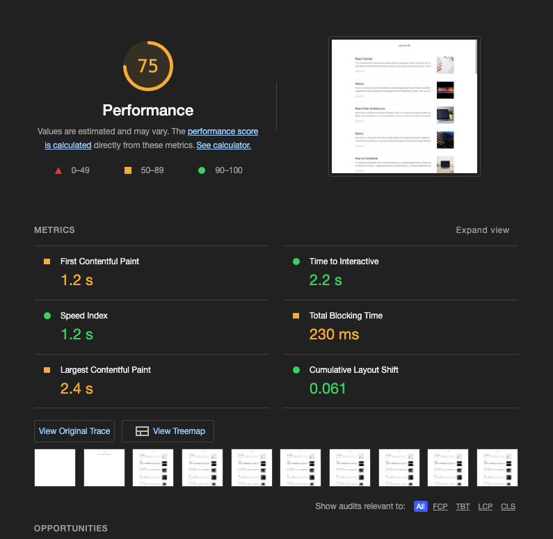

버튼을 누르면 위와 같이 현재 페이지에 대한 성능 검사에 대한 결과가 나온다.

- 가장 먼저 보이는 75의 숫자는 전체적인 성능 점수를 나타낸다.
- 페이지가 로드되는 화면을 순차적인 이미지로 보여준다.
- 다음으로 Oppotunities는 리소스적인 즉, 로딩 성능 최적화에 대한 가이드를 제공하고 Diagnostics는 페이지의 실행관점, 즉, 렌더링 성능 최적화와 연관이 있는 가이드를 제공한다.
- Passed Audits은 검사 시 통과한 항목에 대해 확인할 수 있다.

### 이미지 사이즈 최적화

이번에는 opportunities 항목을 자세히 분석해본다.

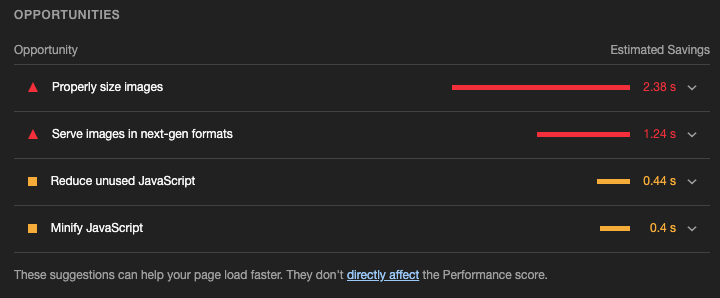

가장 먼저 이미지 사이즈 최적화 이슈를 확인할 수 있다. (Properly size images)
우측 토글 버튼을 누르면 최적화가 필요한 이미지가 리스트로 노출된다.

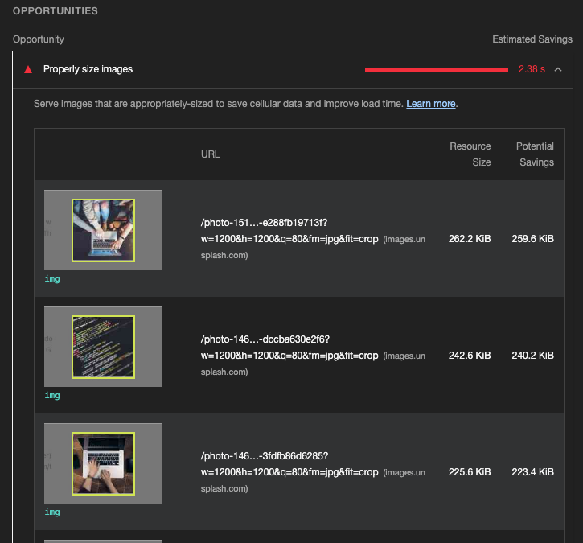

문제가 되는 이미지는 블로그 우측의 tiny image이다. 실제 해당 이미지 사이즈를 확인해보면 아래와 같다.

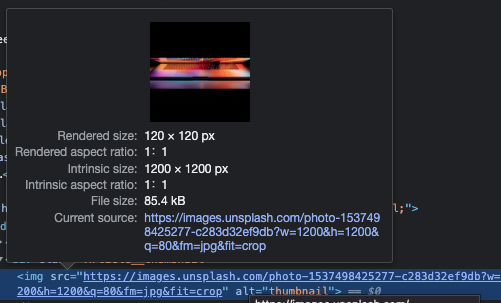

실제 다운로드된 이미지는 1200\*1200px의 고해상도 이미지이지만, 실제 노출되는 이미지 사이즈는 120\*120px이다. 실제 필요한 사이즈보다 100배 가량 큰 이미지인 것이다. 그렇다면 120\*120px이미지로 불러와야할까? 노노.. 요즘 레티나 디스플레이 등의 성능 강화로 인해 보통 2배 크기로 불러오는 것이 좋다. (240\*240px)

그런데 api로 받아오는 이미지를 어떻게 축소하여 최적화할 수 있을까?
먼저, image CDN을 이용해서 최적화할 수 있다.

> ⚠️ CDN(Contents Delivery Network)이란?
> 물리적 거리의 한계를 극복하기 위해 소비자(사용자)와 가까운 곳에 컨텐츠 서버를 두는 기술

image processing CDN은 기본 CDN 개념과는 살짝 다르다. 이미지를 사용자에게 보내기 전에 전처리 과정을 통해 가공하여 송출하는 방식을 의미한다. 아래와 같은 포맷으로 사용한다.

```
http://cdn.image.com?src=[img src]&width=200&height=100
```

실제 브런치 사이트의 경우도 image CDN을 사용하고 있는데, 포맷을 보면 아래와 같다.

```
https://img1.daumcdn.net/thumb/C240x0.fjpg/?fname=http://t1.daumcdn.net/brunch/service/user/eaka/image/OqblFWlX82j2Fraw-oNPi-Nbyro
```

위 포맷은 큰 이미지를 가로 240px에 맞춰 가공하여 내보내주도록 처리해주는 것을 확인할 수 있다.
실제 서비스에서는 직접 이미지 cdn을 구축하여 사용하지만 간단하게 img CDN 솔루션(imgix 등)을 사용하여 편하게 사용할 수 있다.

위 솔루션 사용은 실무에서 직접 적용해보는 것으로 하고, 실제 코드에서 어떻게 줄이는지 확인해보자.
해당 이미지 영역을 노출하는 코드를 보면 아래와 같다.

`index.js`

```jsx
/* 파라미터 참고: https://unsplash.com/documentation#supported-parameters */
function getParametersForUnsplash({ width, height, quality, format }) {
  return `?w=${width}&h=${height}&q=${quality}&fm=${format}&fit=crop`;
}

function Article(props) {
  const createdTime = new Date(props.createdTime);
  return (
    <div className={"Article"}>
      {/* codes.. */}
      <div className={"Article__thumbnail"}>
        {/*  */}
        
      </div>
    </div>
  );
}

export default Article;
```

이미지 경로를 넣는 영역에 `getParametersForUnsplash({width: 1200, height: 1200, quality: 80, format: 'jpg'})` 를 보면 실제 호출하는 이미지 크기를 설정하는 부분이 있는 것을 확인할 수 있음. `getParametersForUnsplash` 함수가 이미지 cdn 역할을 담당한다.

해당 설정을 240\*240px로 줄이면 아래와 같이 이미지가 조정되어 들어오는 것을 확인할 수 있다.

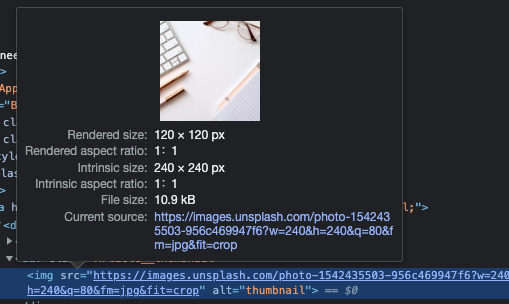

위와 같이 개선 후 lighthouse를 재 실행하면 기존의 이미지 성능 저하 경고가 사라진 것을 확인할 수 있다.

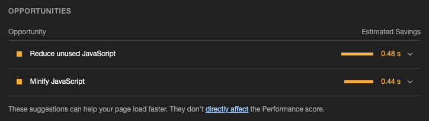

### bottleneck 코드 탐색

다음에 보이는 Minify JavaScript 는 번들링 작업 중 code compress 작업을 통해 minify나 drop console 작업을 수행할 수 있다. 해당 방법으로 개선하면 됨. 이 밖의 다양한 개선점을 opportunities와 diagnostics에서 확인할 수 있는데, 문제는 정확히 어떤 스크립트 코드에서 성능을 저하시키는지 알 수 없다는 것이다.

이 떄 우리는 Performance 탭을 이용한다. Performance에 retry 버튼을 누르면 페이지 로드 시 발생하는 다양한 과정을 프레임 차트로 보여준다.

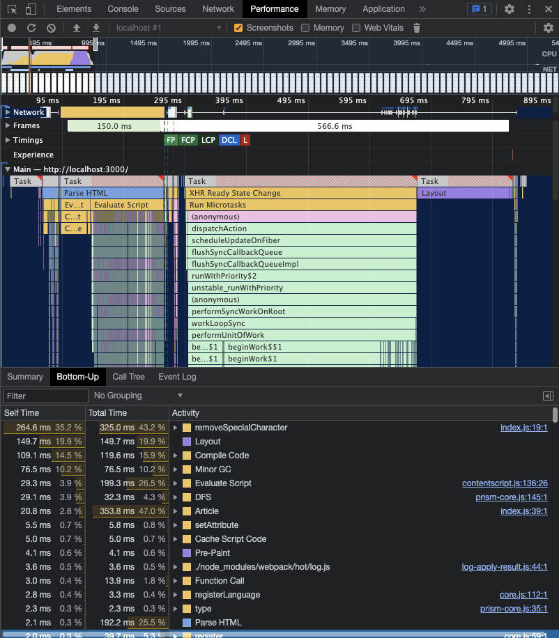

브라우저가 로드되는 과정을 자세하게 나눠놓은 해당 프레임 그래프를 확대해보면서 성능 저하를 일으키는 원인을 발견할 수 있다.

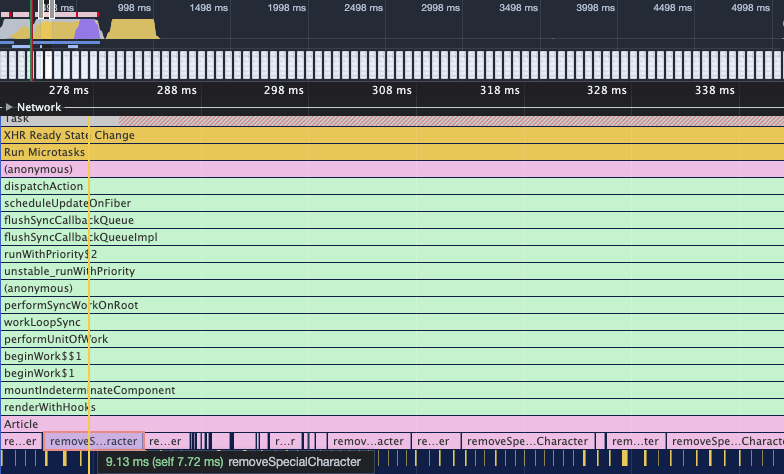

아래 이미지를 보면 페이지 로드 후 Article 컴포넌트에서 removeSpecialCharacter가 여러번 실행되는 것을 확인할 수 있다. 해당 이벤트는 한번 발생하는 이벤트이지만 사용하는 자원이 많아 중간중간 GC가 자원을 정리해주는 것을 확인할 수 있다.

### bottleneck 코드 최적화

이제 성능 저하를 일으키는 `Article` 컴포넌트를 뜯어볼 차례이다.

`src/components/Article/index.js`

```jsx
/*
 * 파라미터로 넘어온 문자열에서 일부 특수문자를 제거하는 함수
 * (Markdown으로 된 문자열의 특수문자를 제거하기 위함)
 * */
function removeSpecialCharacter(str) {
  const removeCharacters = ["#", "_", "*", "~", "&", ";", "!", "[", "]", "`", ">", "\n", "=", "-"];
  let _str = str;
  let i = 0,
    j = 0;

  for (i = 0; i < removeCharacters.length; i++) {
    j = 0;
    while (j < _str.length) {
      if (_str[j] === removeCharacters[i]) {
        _str = _str.substring(0, j).concat(_str.substring(j + 1));
        continue;
      }
      j++;
    }
  }

  return _str;
}
```

Article이라는 컴포넌트에서 성능 누수를 발생시키는 removeSpecialCharacter 코드는 위와 같다. 특정 특수문자가 있는지 전체 판별하여 제거해주는 removeSpecialCharacter 함수는 for문과 while 문을 중첩하여 사용하기 때문에 누수가 발생된다. 우리는 이를 1. 특수문자를 효율적으로 제거하는 것과 2. 작업하는 양을 줄이는 방법을 사용해서 bottleneck 코드를 개선할 수 있다.

1. 특수문자를 효율적으로 제거하기
   1. Replace 함수와 정규식을 사용 ✅
   2. 마크다운의 특수문자를 지워주는 라이브러리를 사용
      1. remove-markdown 등..
2. 작업하는 양 줄이기
   1. 가져오는 데이터 양 자체를 줄이는 방법! (최장 90021자에 달하는 컨텐츠를 모두 담아오지 않도록 한다.)

위 처리사항에 맞춰 아래와 같이 removeSpecialCharacter 함수를 수정해준다.

```jsx
/*
 * 파라미터로 넘어온 문자열에서 일부 특수문자를 제거하는 함수
 * (Markdown으로 된 문자열의 특수문자를 제거하기 위함)
 * */
function removeSpecialCharacter(str) {
  let _str = str.substring(0, 300);
  _str = _str.replace(/[\#\_\*\~\&\;\!\[\]\`\>\\n\=\-]/g, "");

  return _str;
}
```

이후 Performace 탭을 재실행시키면, 기존에 removeSpecialCharacter에서 발생하던 성능 누수 이슈가 사라진 것을 확인할 수 있다.

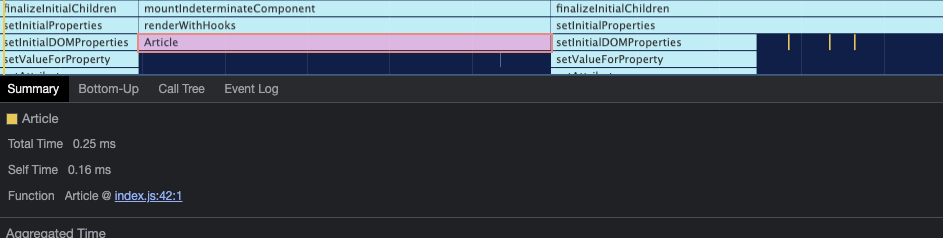

### bundle 파일 분석(bundle-analyzer)

이번시간에는 bundle 파일을 분석해본 뒤 파일을 적절히 분할해보도록 한다.
Performance 탭에 보면 .chunk.js 파일의 용량으로 인해 파일 로드 시간이 오래걸리는 것을 확인할 수 있다.

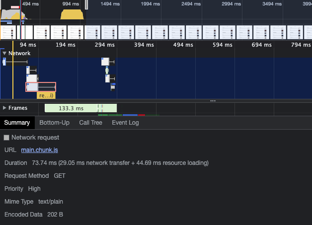

그러면 우린 이 파일을 어떻게 최적화하고 로드를 단축할 수 있을까? 그러기 위해서는 우린 해당 파일에 어떤 내용이 저장되는지 알아야한다. 이때 우리는 `webpack-bundle-analyzer`를 통해 번들링된 파일들이 어떻게 구성되어있는지를 확인할 수 있다.

그런데 해당 패키지를 사용하려면 직접 웹팩을 구성해야하는데, 우리는 cli의 기본 웹팩을 사용하고 있으므로 cli를 eject 하거나 별도의 패키지를 깔아야 한다. 다행히 `cli-bundle-analyzer`를 통해 별도로 커스텀하지 않아도 특정 패키지를 추가할 수 있게 되었다!

`cra-bundle-analyzer`에서 나온대로 패키지를 설치해본다.

```bash
> npm install --save-dev cra-bundle-analyzer
> npx cra-bundle-analyzer
```

위와 같이 프로젝트에서 실행해주면 해당 프로젝트에서 bundle-analyzer가 실행되어 분석한 결과가 페이지로 펼차진다!

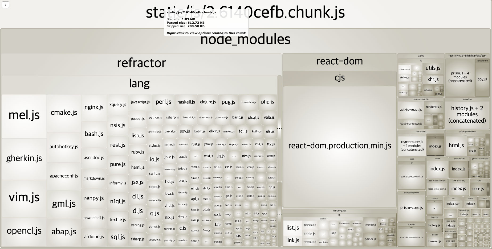

해당파일을 보면 가장 크게 2.6140cefb.chunk.js 파일이 있다는 것 확인 가능. 우측 파란색은 해당 파일에 속하는 컴포넌트가 어떤 것인지를 보여준다. 나머지는 npm을 통해 설치한 node_modules가 큰 영역을 차지하는 것을 확인할 수 있음.

위 이미지의 refractor는 뭐길래 용량의 절반을 차지할까? package-lock.json은 우리가 사용하는 패키지의 하위 디펜던시 패키지 목록을 가지고 있다. 해당 목록에서 refractor를 검색해보면 react-syntax-highlighter 패키지에서 사용하는 것을 확인할 수 있다.

`package-lock.json`

```json
"node_modules/react-syntax-highlighter": {
  "version": "12.2.1",
  "resolved": "https://registry.npmjs.org/react-syntax-highlighter/-/react-syntax-highlighter-12.2.1.tgz",
  "integrity": "sha512-CTsp0ZWijwKRYFg9xhkWD4DSpQqE4vb2NKVMdPAkomnILSmsNBHE0n5GuI5zB+PU3ySVvXvdt9jo+ViD9XibCA==",
  "dependencies": {
    "@babel/runtime": "^7.3.1",
    "highlight.js": "~9.15.1",
    "lowlight": "1.12.1",
    "prismjs": "^1.8.4",
    "refractor": "^2.4.1"
  }
},
```

그럼 react-syntax-highlighter 모듈이 어디에서 사용되고 있을까 ? 바로 아래 파일에서 사용되고 있다.

`src/components/markdowns/CodeBlock.js`

```jsx
import React from 'react'
import { Prism as SyntaxHighlighter } from 'react-syntax-highlighter'
import { coy } from 'react-syntax-highlighter/dist/esm/styles/prism'

function CodeBlock(props) {
  const { language, value } = props
  return (
    // ..
  )
}

export default CodeBlock
```

그렇다면 `CodeBlock`를 리스트페이지가 아닌 사용하는 상세페이지에서만 해당 패키지를 불러오면 성능이 훨씬 개선될 수 있을 것으로 보인다! 이처럼 사이즈를 많이 차지하는 영역이 어디에서 사용하는지 확인하고, 우리는 페이지별로 분리시켜 저장하고 필요할 떄마다 로드하면 바람직해보인다.
