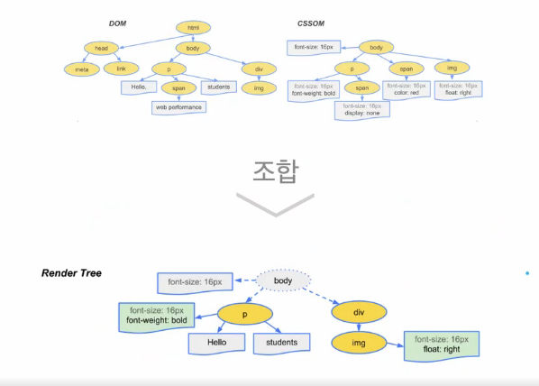
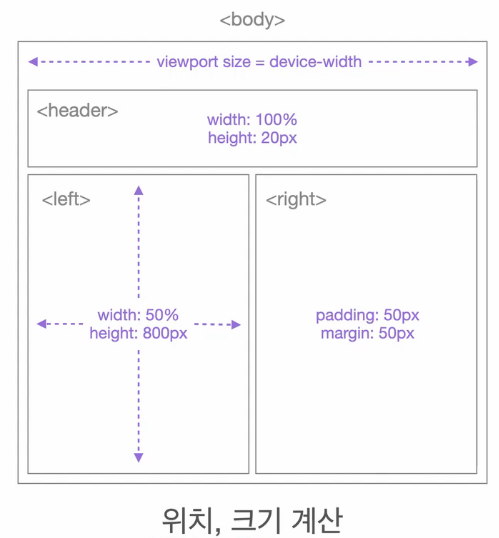
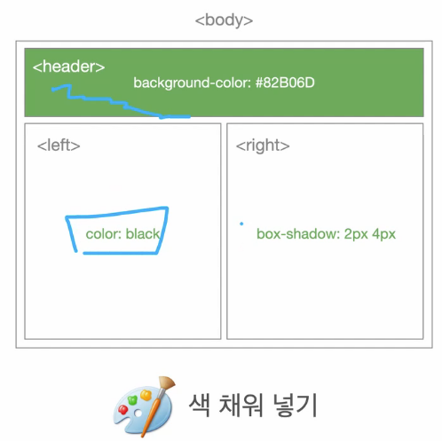
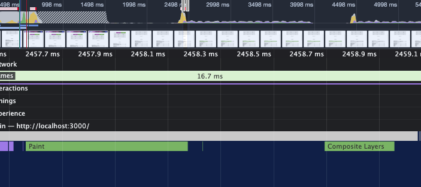
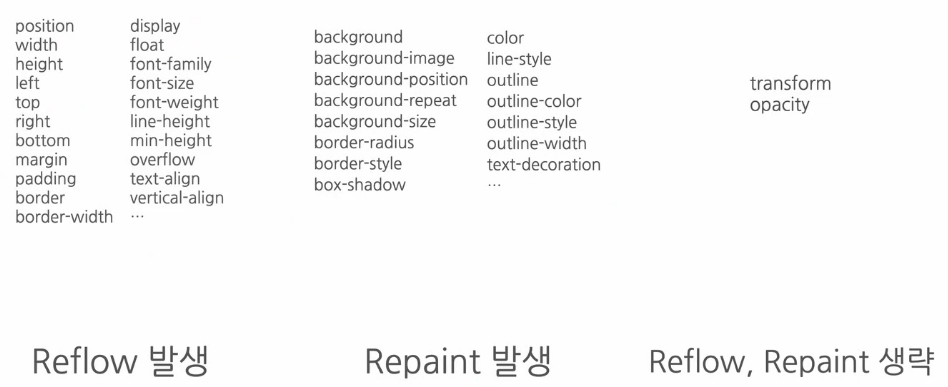
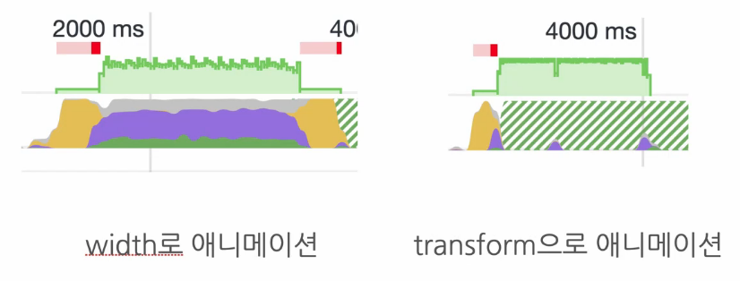
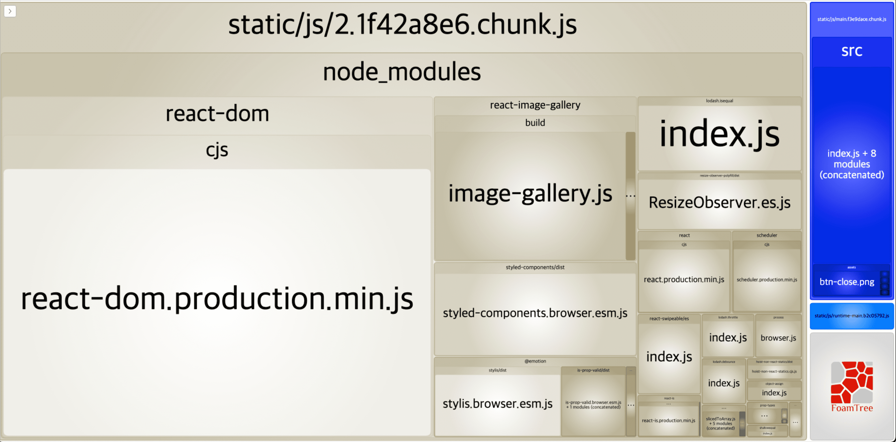
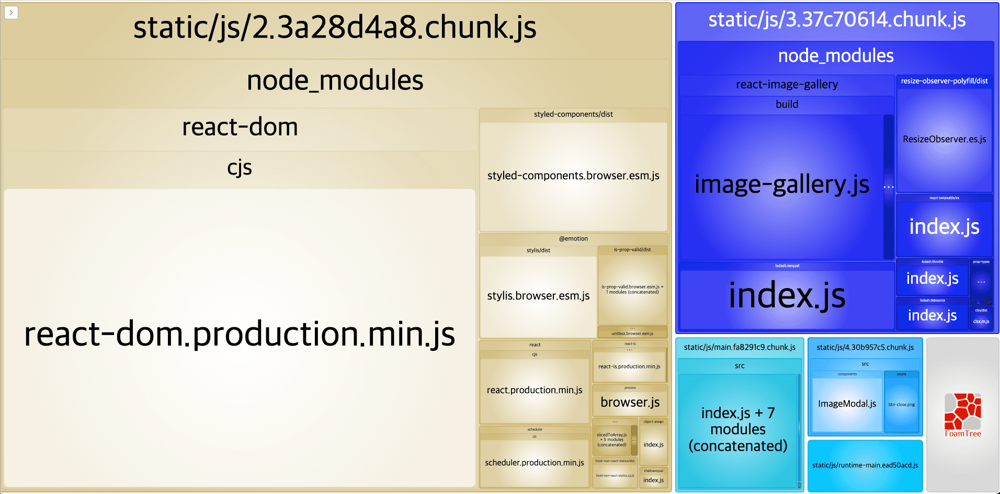

## 통계 사이트 최적화

### 실습 내용 & 분석 툴 소개

이번 강의에서는 애니메이션 최적화(Reflow, Repaint), 컴포넌트 Lazy Loading(code splittin), 컴포넌트 Preloading, 이미지 Preloading 등을 알아보고자 한다. 여기에서 애니메이션 최적화는 렌더링 성능을 최적화하며, 나머지 3가지는 로딩 성능 최적화를 돕는다.

이번 시간 분석 툴도 network, performance, webpack-bundle-analyzer을 이용해보고자 한다.

### 서비스 탐색 & 코드 분석

해당 프로젝트는 리우 올림픽과 런던 올림픽의 통계 데이터를 비교하는 사이트이다.
프로젝트는 적절히 clone 받았다면 코드 분석을 진행해본다.

`src/App.js`

```jsx
<div className="App">
  <Header />
  <InfoTable />
  <ButtonModal
    onClick={() => {
      setShowModal(true);
    }}
  >
    올림픽 사진 보기
  </ButtonModal>
  <SurveyChart />
  <Footer />
  {showModal ? (
    <ImageModal
      closeModal={() => {
        setShowModal(false);
      }}
    />
  ) : null}
</div>
```

위와 같은 구조로 메뉴가 구성되어 있다.

### 애니메이션의 분석 (Reflow와 Repaint 이론)

애니메이션을 분석하여 rellow와 repaint에 대해 알아보도록 한다. 사이트에서 애니메이션이 들어간 영역은 하단 설문 결과에 그래프 클릭 시 변경되는 수치데이터를 애니메이션으로 보여주는 부분이다.

해당 애니메이션 동작을 자세히보면 동작이 좀 버벅이는 것을 확인할 수 있다. 현상을 좀 더 확실히 확인하기 위해서는 Performance 탭에서 CPU 설정은 6x slowdown으로 설정하여 Record를 하면 더 버벅이는 것을 확인할 수 있다. 왜이럴까? 실제 코드를 보면 아래 바 형태에 transition이 걸려있는 것이 대부분이다.

---

```css
.hweFEX {
  -webkit-transition: width 1.5s ease;
  transition: width 1.5s ease;
  /* ... */
}
```

이유를 알기 위해서는 브라우저에서 애니메이션이 어떻게 동작하는지를 알아야 한다.

애니메이션은 여러가지 이미지가 연속적으로 바뀌면서 움직이는 것처럼 보이는 것을 의미한다.
이러한 애니메이션을 구현하는 다수의 프레임 중 하나가 사라진다면? 애니메이션이 뚝뚝 끊기게 보일 것이다.

보통 이를 쟁크현상이라고 하는데, 우리의 브라우저는 초당 60프레임(60FPS)을 그릴 수 있는데,
이것이 초당 30프레임 혹은 20프레임 등으로 적어져서 애니메이션이 버벅이는 쟁크현상이 발생하는 것이다.

브라우저는 왜 60프레임을 구현하지 못할까? 이를 알기위해서는 브라우저 렌더링 과정을 알아야 한다.
브라우저는 동작하기 위해 아래와 같은 렌더링 과정을 가진다.

DOM+CSSOM → Render Tree → Layout → Paint → Composite(각 레이어 합성)



DOM + CSSOM → Render Tree 과정



Layout 과정



Paint 과정

이러한 전체적인 과정을 Critical Rendering Path, Pixel Pipeline이라고 한다.
만약 완성된 화면에서 사용자의 이용으로 화면에 변화가 생기면, 이를 기반으로 새로운 브라우저 렌더링 과정을 거치게 되는 것이다. 이러한 과정을 밟는 가운데 60프레임을 빠른 시간안에 새로 생성하는 과정이 오래 걸리므로 브라우저가 몇 부분의 프레임을 자체적으로 실행하지 않아버린다. 따라서 쟁크 현상이 발생한다.



실제 애니메이션이 구현되는 것을 Performance 탭으로 확인해보면 Paint 과정과 Composite Layer 과정 이후 화면을 보여줘야 하지만,
아직 레이어 합성 단계가 끝나지 않은 상태이므로 Paint 과정에서 이전 화면을 보여주게되어 해당 현상이 발생한다.

그렇다면 브라우저에 부담을 주지않고 개선할 수 있는 방법은 뭐가 있을까? Layout, paint 등 일부 과정을 생략하는 것이다.
우선 width, height 요소가 변경되어 브라우저 렌더링의 모든 단계를 재실행하는 것은 Reflow 단계라고 하며, color, background-color 등의 단순 스타일 변경의 경우 브라우저 렌더링의 일부 단계(Layout)을 생략하여 성능을 높인다. 이를 Repaint 단계라고 한다.
이러한 Repaint 단계에서 더 나아가 Reflow, Repaint를 모두 피하는 방법도 있다. 바로 GPU의 도움을 받는 것이다. transform, opacity(GPU가 관여할 수 있는 속성) 변경될 경우 Layout, Paint 과정을 생략하게 된다.

- 각 속성에 대한 영향도
  

위와 같은 Reflow, Repaint 조건 등을 확인하여 최대한 성능적으로 애니메이션을 다루는 것이 바람직할 것이다.
이제 다시 css 코드를 보자.

```css
.hweFEX {
  -webkit-transition: width 1.5s ease;
  transition: width 1.5s ease;
  /* ... */
}
```

위 transition에는 width값을 수정하고 있다. 이는 reflow를 발생시키는 속성이다.
따라서 해당 애니메이션에서 쟁크현상이 발생할 경우 위 속성 영향도를 기준으로 현상을 개선할 수 있는 다른 방법으로 구현하는 것이 바람직하다. (tranform 사용 등)

### 애니메이션 최적화

이제 이 애니메이션을 최적화해본다. width를 직접 수정하는 방법이 아닌 다른 방법으로 해당 애니메이션을 구현하기 위해서는 어떤 것이 좋을까? Reflow나 repaint가 생략되는 transform의 scale 속성으로 해당 애니메이션 구현이 가능해보인다. scale은 비율로서 블록의 속성을 변경하는 것이다. 일반 막대그래프의 변형이므로 scaleX요소로 수정하면 가능할 것 같다.

`src/components/Bar.js`

```jsx
// 기존 BarGraph transition property
const BarGraph = styled.div`
  position: absolute;
  left: 0;
  top: 0;
  width: ${({ width }) => width}%;
  transition: width 1.5s ease;
  height: 100%;
  background: ${({ isSelected }) => (isSelected ? "rgba(126, 198, 81, 0.7)" : "rgb(198, 198, 198)")};
  z-index: 1;
`;

// 변경 후 transform property
const BarGraph = styled.div`
  /* ... */
  width: 100%;
  transform: scaleX(${({ width }) => width / 100});
  transform-origin: center left;
  transition: transform 1.5s ease;
`;
```

위와 같이 transform의 scaleX 속성으로 width 값을 주입하도록 변경한 뒤 애니메이션을 재동작해보면 훨씬 더 매끈하게 화면이 구현되는 것을 확인할 수 있다! 실제 성능 개선이 이루어진 것을 performance 탭에서도 확인할 수 있다.



수정 전에는 계속 프레임이 들어오면서 메인스레드에서 reflow가 다량 발생하는 것을 볼 수 있다. transform은 메인스레드가 하는 일이 많이 줄어들고 나머지 동작 스타일은 gpu가 애니메이션을 렌더링하고 있음을 확인할 수 있다.

### 컴포넌트 Lazy Loading(Code splitting)

지난 시간에 했던 것처럼 cra-bundle-analyzer를 통해 번들 파일이 어떻게 구성되어 있는지 확인해본다.

```bash
> npm install --save-dev cra-bundle-analyzer
```

설치가 완료되면 아래 명령어로 analyzer를 실행시킨다.

```bash
> npx cra-bundle-analyzer
```



해당 이미지를 보면 라이브러리를 담고있는 chunk 파일과 우리가 실제 구현한 소스코드가 담겨있는 chunk 파일이 담겨있다. 그런데 위 image-gallery 모듈은 초기 로드 시 필요한 라이브러리가 아니기 때문에 실행될 때 동작되도록 처리해본다.

`/src/App.js`

```jsx
import React, { useState, Suspense, lazy } from "react";
import styled from "styled-components";
import Header from "./components/Header";
import InfoTable from "./components/InfoTable";
import SurveyChart from "./components/SurveyChart";
import Footer from "./components/Footer";
// import ImageModal from './components/ImageModal'

const LazyImageModal = lazy(() => import("./components/ImageModal"));

function App() {
  const [showModal, setShowModal] = useState(false);

  return (
    <div className="App">
      {/* code .. */}
      <Suspense fallback={null}>
        {showModal ? (
          <LazyImageModal
            closeModal={() => {
              setShowModal(false);
            }}
          />
        ) : null}
      </Suspense>
    </div>
  );
}

export default App;
```

위와 같이 Suspence에 감싸서 ImageModal을 lazy loading 처리해주면 아래와 같이 번들 파일이 생성된다.
기존 chunk 파일에서 image-gallery가 별도로 분리된 것을 확인할 수 있다.



프로젝트 사이즈가 커질수록 lazy-loading 기능을 잘 활용하면 좋다.
