## 일반 홈페이지 최적화

### 이번 시간에는 이런 것을 배운다.

- 로딩 성능 최적화
  - 이미지 레이지(Lazy) 로딩
  - 이미지 사이즈 최적화
  - 동영상 최적화
  - 폰트 최적화
  - 캐시 최적화
  - 불필요한 CSS 제거
- 분석 툴
  - 크롬 Network,Performance, Lighthouse, Coverage 탭

### 코드 분석에 앞서

프로젝트 [링크](https://github.com/performance-lecture/lecture-3)에서 소스를 다운받은 뒤 `npm i`으로 프로젝트를 로컬에 클론해준다.

`package.json`

```json
"scripts": {
  "start": "npm run build:style && react-scripts start",
  "build": "npm run build:style && react-scripts build",
  "build:style": "postcss src/tailwind.css -o src/styles.css",
  "serve": "node ./server/server.js",
  "server": "node ./node_modules/json-server/lib/cli/bin.js --watch ./server/database.json -c ./server/config.json"
},
```

serve, server는 서버 관련한 실행을 의미. build:style은 스타일을 빌드하는 명령어임

```bash
> npm run build
> npm run serve
> npm run server
```

위 명령어들로 홈페이지를 로컬에서 실행시켜 화면을 확인해준다.

### 이미지 지연(lazy)로딩(intersection observer)

이번 시간에는 이미지 동적 로딩에 대해 배워본다. 이미지 동적 로딩을 하기 전에 현재 페이지에 뭐가 문제가 있는지 부터 분석해야 한다. 뭐가 문제인지 알아야 고치기 때문! 방법은 한 가지로 정해져있지 않고, 다양하게 확인할 수 있는데 보통 performance나 network 탭 등으로 현황을 파악할 수 있다.

이번에는 network 탭으로 현황을 파악해본다.
우선 현황 파악을 위해 네트워크 속도에 대한 사용제한을 추가하는데 아래와 같이 커스텀 프로필을 추가한 뒤 6,000으로 테스트를 해보자

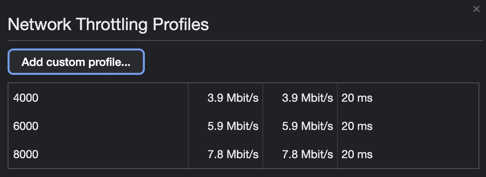

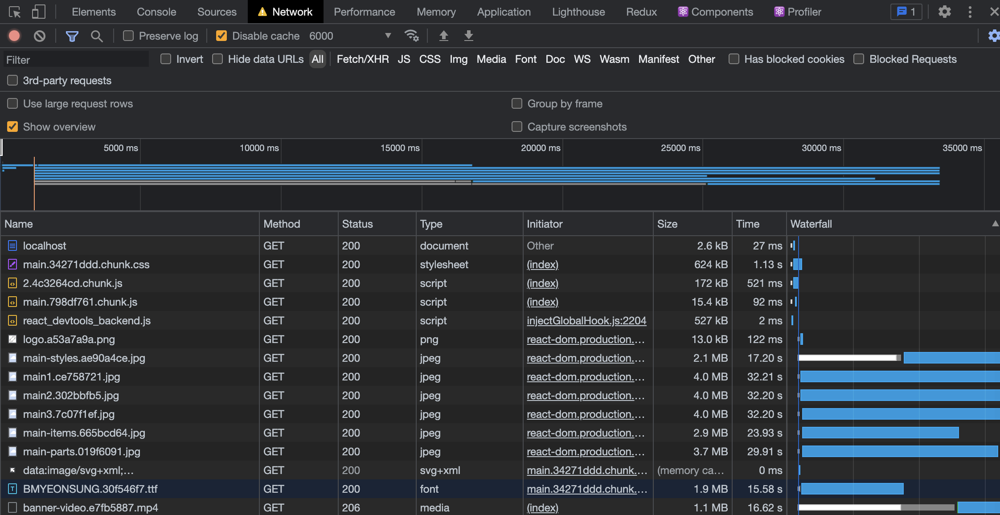

위와 같이 캐시 미사용까지 선택 후 페이지를 리로드하면 페이지 로드하는 과정을 network탭에서 확인할 수 있다.

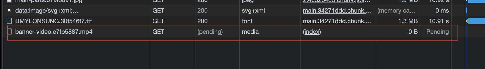

우리가 유심히 확인해야할 영역은 홈페이지의 가장 첫 장면에 위치한 `.mp4` 비디오 파일이다. 해당 파일은 네트워크 속도가 느리게 들어오면서 초기에는 Pending으로 처리되다가 다른 이미지 리소스가 모두 다운받아지고 나서 다운로드를 받기 시작한다.

가장 먼저 사용자에게 눈에 띄는 화면인데 나중에 로드가 되면 이는 UX에 좋지 않을 것이다. 그럼 이는 어떻게 해결할 수 있을까? 해결 방법으로는 크게 두가지를 생각할 수 있는데, 첫쨰, 앞서 로드하는 이미지를 빠르게 다운로드 받거나 둘째, 당장 사용하지 않는 이미지는 나중에 다운로드 받도록 처리하는 방법이 있다.

첫 번째 방법은 궁극적인 해결방법이라고 볼 수는 없으므로 두 번째 방법으로 개선을 해보도록 한다.

이미지 lazy loading은 필요하지 않은 이미지를 나중에 로드한다는 것을 의미한다. 즉, 홈페이지 상 필요하지 않는 이미지는 스크롤을 내렸을 때, 다시 말해 노출되어야 하는 시점에 로드되도록 하는 것이다. (이미지가 보여지는 곳까지 스크롤이 되었는지를 파악 후 맞는 시점에 노출) 하지만 스크롤을 할 때마다 이를 체크하도록 하는 함수가 실행되면 이는 되려 브라우저의 성능에 안좋을 수 있다.

이때 사용하는 것이 Intersection Observer API이다. Intersection Observer는 특정 엘리먼트를 Observer할 수 있고, 특정 엘리먼트가 스크롤을 하여 노출되는 시점을 따로 잡아낼 수 있다.

```jsx
function createObserver() {
  let observer

  let options = {
    root: null,
    rootMargin: "0px",
    threshold: buildThresholdList(),
  }

  observer = new IntersectionObserver(handleIntersect, options)
  observer.observe(boxElement) // boxElement에 관찰자를 적용시킨다.
}
```

위와 같이 boxElement를 Observe해주면 해당 구독이 시작되었을 때(initialize) 한 번, 해당 엘리먼트가 화면에 노출되었을 때 한 번, 사라졌을 때 한 번 호출이 된다. 이를 활용해서 lazy loading을 구현할 수 있는 것이다

`./src/components/Card.js`

```jsx
import React, { useEffect, useRef } from "react"

function Card(props) {
  const imgRef = useRef(null)

  useEffect(() => {
    const callback = (entries, observer) => {
      entries.forEach((entry) => {
        // Each entry describes an intersection change for one observed
        // target element:
        // entry.isIntersecting - 화면 안에 요소가 들어와있는지 알려주는 요소
        if (entry.isIntersecting) {
          console.log("is intersecting")
        }
      })

      console.log("callback")
    }
    const options = {}
    const observer = new IntersectionObserver(callback, options)
    observer.observe(imgRef.current)
  }, [])
  return (
    <div className="Card text-center">
      
      <div className="p-5 font-semibold text-gray-700 text-xl md:text-lg lg:text-xl keep-all">{props.children}</div>
    </div>
  )
}

export default Card
```

위와 같이 이미지에 `useRef`로 참조를 걸고, `observer`를 적용해주면 아래와 같이 해당 이미지 엘리먼트가 `isIntersecting` 하는 시점에 `console.log` 코드가 실행되는 것을 확인할 수 있다.

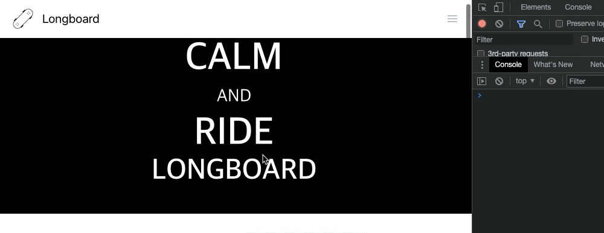

위 `isIntersecting`은 이미지가 노출되는 시점에만 코드가 실행되는 조건임을 참고하자.
이를 활용하여 이미지 로드를 실행하도록 아래와 같이 코드를 개선할 수 있다.

`./src/components/Card.js`

```jsx
//..
function Card(props) {
  const imgRef = useRef(null)

  useEffect(() => {
    const callback = (entries, observer) => {
      entries.forEach((entry) => {
        if (entry.isIntersecting) {
          console.log("is intersecting", entry.target.dataset.src)
          // data-set에 넣어둔 src를 실제 src에 주입 - 이미지 로드
          entry.target.src = entry.target.dataset.src
          // 이미지를 로드한 후 unobserve 처리
          observer.unobserve(imgRef.current)
        }
      })
    }
    // ..
  }, [])
  return (
    <div className="Card text-center">
      
      <div className="p-5 font-semibold text-gray-700 text-xl md:text-lg lg:text-xl keep-all">{props.children}</div>
    </div>
  )
}
```

위와 같이 intersecting 시 data-set 속성에 임시로 넣어둔 이미지 주소를 src에 대입해준 다음 1회만 로드되면 되므로 바로 unobserve를 실행시켜주면 원하는 이미지 노출 시점에 이미지를 1회 호출하도록 할 수 있다.

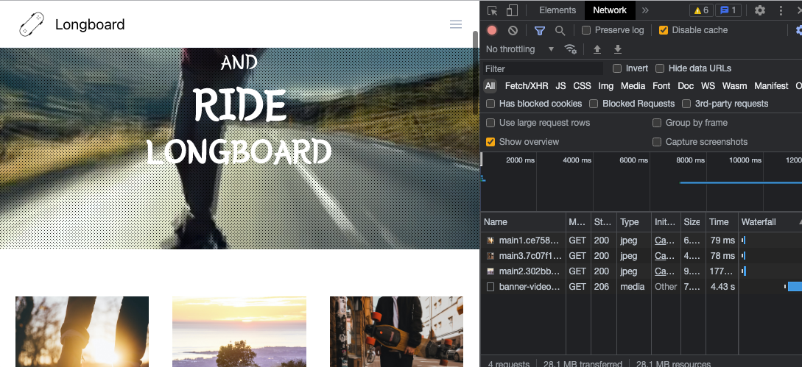

이 밖에 메인 페이지에 존재하는 모든 이미지에 대한 lazy loading을 아래와 같이 구현한다.

`./src/pages/MainPage.js`

```jsx
//..
function MainPage(props) {
  const imgRef_first = useRef(null)
  const imgRef_second = useRef(null)
  const imgRef_third = useRef(null)

  useEffect(() => {
    const options = {}
    const callback = (entries, observer) => {
      entries.forEach((entry) => {
        if (entry.isIntersecting) {
          console.log('is intersecting', entry.target.dataset.src)
          // data-set에 넣어둔 src를 실제 src에 주입 - 이미지 로드
          entry.target.src = entry.target.dataset.src
          // 이미지를 로드한 후 unobserve 처리
          observer.unobserve(entry.target)
        }
      })
    }
    const observer = new IntersectionObserver(callback, options)
    observer.observe(imgRef_first.current)
    observer.observe(imgRef_second.current)
    observer.observe(imgRef_third.current)
  }, [])

  return (
    <div className="MainPage -mt-16">
      <BannerVideo />
      <div className="mx-auto">
				{/* ... */}
        <TwoColumns
          bgColor={'#f4f4f4'}
          columns={[
            ,
            // ..
          ]}
        />
        <TwoColumns
          bgColor={'#fafafa'}
          columns={[
            // ..
            ,
          ]}
          mobileReverse={true}
        />
        <TwoColumns
          bgColor={'#f4f4f4'}
          columns={[
            ,
            // ..
            />,
          ]}
        />
      </div>
    </div>
  )
}

export default MainPage
```

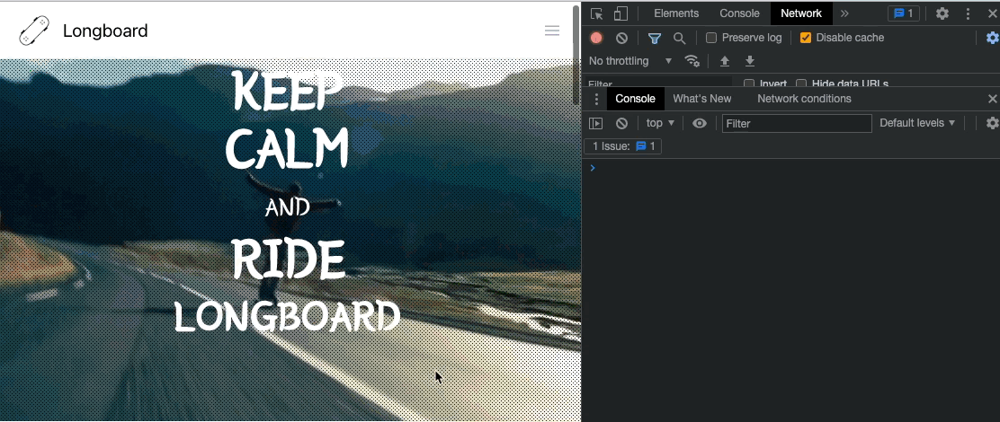

### 이미지 사이즈 최적화

앞서 스크롤에 따라 이미지가 나타나야 할 시점에 이미지를 로드하는 image lazy loading을 구현해보았다. 하지만, 이미지 크기 자체가 커서 스크롤 시 해당 리소스를 다운로드 받는 시간이 오래걸려 UX에 좋지 않아보인다. 이는 이미지 사이즈를 최적화하는 것으로 개선할 수 있다.

이미지 사이즈 최적화는 이미지 크기를 줄이고 이미지 용량을 줄여 효율적인 리소스 로딩을 하는 것을 의미한다.
현재 3946*3946 사이즈가 그대로 들어오고 있는데, 이를 300*300 사이즈로 줄이고 추가적인 이미지 압축을 통해 최대한 효율적인 리소스 다운로드를 구현할 수 있다.

이미지 사이즈 최적화를 위해서는 이미지 포맷의 특징에 대해 알아야 한다.

- PNG: 용량이 큼
- JPG: PNG보다 용량이 작음. 화질이 떨어짐
- WEBP: 구글에서 나온 차세대 이미지 포맷, JPG보다 더 좋은 이미지 포맷으로 소개됨

위와 같은 특징에 따라 이번 프로젝트에는 이미지를 WEBP로 사용해보려고 한다. 이미지 컨버터는 [squoosh.app](http://squoosh.app) 를 사용하여 이미지 사이즈를 최적화한다.

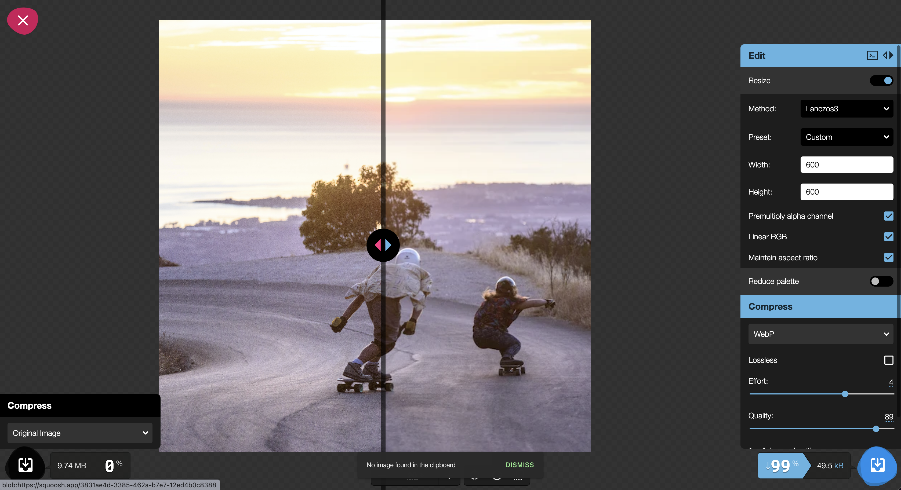

위처럼 상세한 이미지 변화를 살핀 후 가장 적절한 포맷과 Quality로 이미지사이즈를 줄인 뒤 다운로드받는다.
위와 같이 압축 후 이미지를 비교해보면 아래와 같이 큰 용량차이를 가지는 것을 확인할 수 있다.

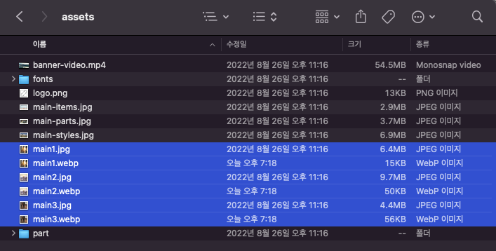

위 이미지를 `.jpg` 파일 대신 적용하여 스크롤 이벤트에 적용해주면 이미지가 빠르게 호출되어 렌더링이 완료되는 것을 확인할 수 있다

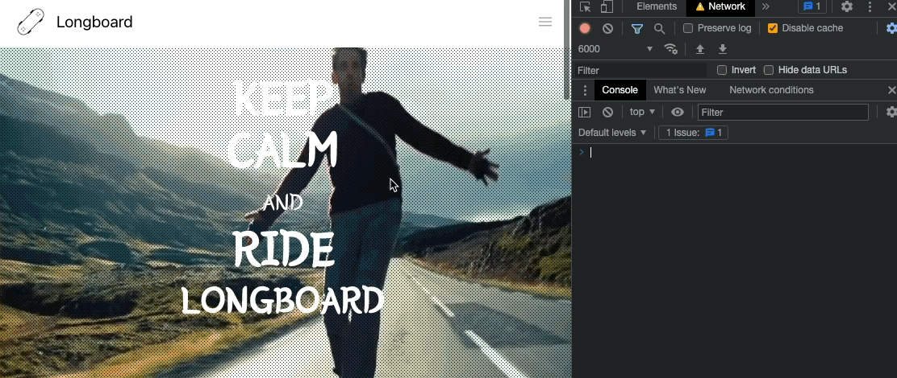

하지만 문제는 있다. .webp가 렌더링이 되지 않는 브라우저가 있는 것임.
따라서 현재 브라우저가 webp 이미지를 지원하는지 파악한 후 지원되지 않을 경우 기존의 이미지를 렌더링하도록 구현할 수 있다. 이러한 체크는 picture 태그를 통해 빠르게 확인할 수 있다.

```html
<picture>
  <source srcset="photo.avif" type="image/avif" />
  <source srcset="photo.webp" type="image/webp" />
  
</picture>
```

위와 같이 source 속성에 각종 조건을 달면 그에 맞는 이미지가 렌더링되도록 설정할 수 있다. 확장자에 대한 분기는 type attribute를 이용해서 조건을 나눌 수 있다. image/avif → image/webp → image.jpg 로 처리할 수 있다.

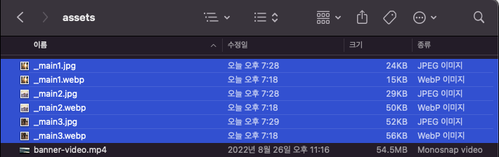

최후의 경우에 사용할 jpg 이미지도 함께 압축한 뒤 위 picure 태그를 사용하여 조건부 렌더링을 구현해보자

`./src/pages/MainPage.js`

```jsx
// ..
function MainPage(props) {
  // ...

  return (
    <div className="MainPage -mt-16">
      <BannerVideo />
      <div className="mx-auto">
        <ThreeColumns
          columns={[
            <Card webp={main1_webp} image={main1}>
              롱보드는 아주 재밌습니다.
            </Card>,
            <Card webp={main2_webp} image={main2}>
              롱보드를 타면 아주 신납니다.
            </Card>,
            <Card webp={main3_webp} image={main3}>
              롱보드는 굉장히 재밌습니다.
            </Card>,
          ]}
        />
        {/* ... */}
      </div>
    </div>
  )
}
```

위와 같이 Card 컴포넌트의 webp Props로 .webp 이미지 파일을 내려준 뒤 아래와 같이 수정한다.

`./src/components/Card.js`

```jsx
function Card(props) {
  const imgRef = useRef(null)

  useEffect(() => {
    const options = {}
    const callback = (entries, observer) => {
      entries.forEach((entry) => {
        if (entry.isIntersecting) {
          const target = entry.target
          target.src = target.dataset.src

          // srcset에 대한 조건 추가
          const previousSibling = target.previousSibling
          previousSibling.srcset = previousSibling.dataset.srcset

          // 이미지를 로드한 후 unobserve 처리
          observer.unobserve(target)
        }
      })
    }
    const observer = new IntersectionObserver(callback, options)
    observer.observe(imgRef.current)
  }, [])

  return (
    <div className="Card text-center">
      <picture>
        <source data-srcset={props.webp} type="image/webp" />
        
      </picture>
      {/* ... */}
    </div>
  )
}
```

위와 같이 처리해주면 .webp 파일이 다운로드되고, 만약 .webp 파일이 지원되지 않는 브라우저에서는 정상적으로 .jpg 파일이 다운로드되는 것을 확인할 수 있다!


### 동영상 사이즈 최적화

이번에는 동영상 최적화에 대해 구현해보자.
사진 사이즈를 최적화한 것처럼 동영상 크기를 줄이는 방법이다.

동영상을 압축하는 작업은 동영상의 화질을 저하시키므로, 메인 콘텐츠라면 고화질로 사용하고, 동영상이 메인 콘텐츠가 아닌 경우에만 최적화하는 것이 좋다. 해당 최적화 사이트는 [media.io](https://www.media.io/ko/video-compressor.html)에서 압축한다.

위에서 이미지를 .webp파일로 저장했는데, 비디오는 .webm 파일로 저장하면 웹 브라우저에 최적화 된 동영상으로 만들 수 있다.

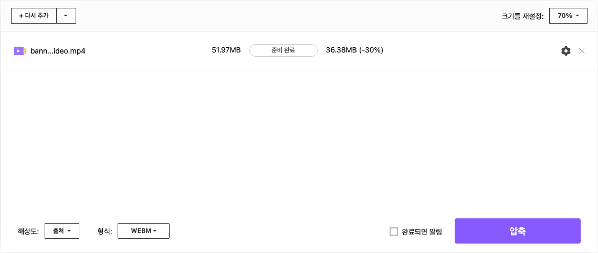

위처럼 수정하면 약 절반정도의 용량이 줄어든 것을 확인할 수 있다.

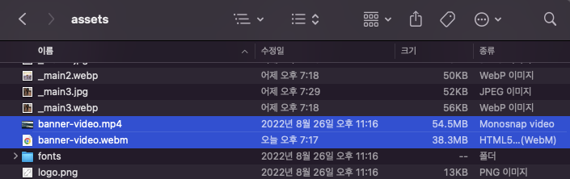

이를 `BannerVideo` 컴포넌트에 적용하면 되는데 .webm 파일 또한 미지원되는 브라우저가 있으므로 경우에 따라 .mp4파일을 재생하도록 설정해주어야 한다. 이는 `video` 태그를 사용하면 된다! (mp4도 동영상 압축 진행)

`./src/components/BannerVideo.js`

```jsx
import React from "react"
import video_webm from "../assets/banner-video.webm"
import video_mp4 from "../assets/banner-video.mp4"

function BannerVideo() {
  return (
    <div className="BannerVideo w-full h-screen overflow-hidden relative bg-texture">
      <div className="absolute h-screen w-full left-1/2">
        <video
          className="absolute translateX--1/2 h-screen max-w-none min-w-screen -z-1 bg-black min-w-full min-h-screen"
          autoPlay
          loop
          muted
        >
          <source src={video_webm} type="video/webm" />
          <source src={video_mp4} type="video/mp4" />
        </video>
      </div>
      {/* ... */}
    </div>
  )
}
```

위와 같이 처리하면 webm 유형이 지원되는 브라우저에서는 webm 파일이, 그렇지 않은 경우에는 mp4 파일이 실행된다. 만약 메인 콘텐츠 비디오에 렌더링을 해야할 경우 이미지 용량이 크다면 어떻게 하면 좋을까?

파일을 여러개의 조각으로 나눠서 실행하는 방법이나 화질을 줄인 비디오 상단에 그라데이션이나 불투명도 스타일을 부여(filter: blur나 작은 dot를 균일한 간격으로 채우는 등의 ui 가림처리 등을 활용)해서 화질 저하에 대한 리스크를 줄여보면 좋다.

### 폰트 최적화1 - 폰트 적용 시점 컨트롤

이번에는 웹폰트를 어떻게 최적화하여 쓸 수 있는지 알아보려고 한다.
현재 메인페이지 상단에 존재하는 타이틀 영역에만 별도의 `BMYEONSUNG.30f546f7.ttf` 체가 다운받아지는 것을 확인할 수 있다. 해당 글씨체는 위 상단에서만 사용되는데, 무려 `750kb`를 차지하므로 이를 최적화할 필요가 있다.

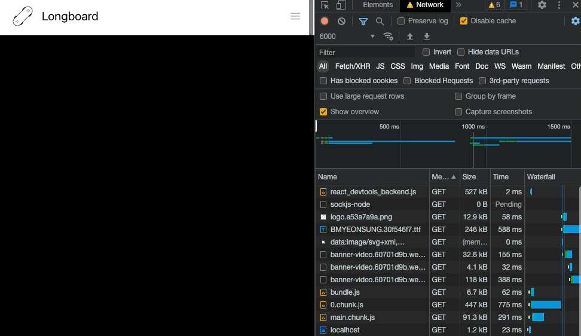

위 이미지를 보면 초기 로딩 시 폰트 파일을 가져오고 렌더링되는 과정이 그대로 노출되고 있는 것을 확인할 수 있다. 네트워크 환경에 따라 해당 현상이 더욱 불편하게 느껴질 수도 있다.

웹 폰트는 렌더링 시 FOUT(Flash of Unstyled Text) 이슈와 FOIT(Flash of Invisible Text) 이슈가 있다. FOUT는 기본 폰트로 노출되다가 폰트 리소스가 다운로드될 경우 해당 폰트 스타일로 적용되는 현상을 의미하고, FOIT는 폰트가 모두 다운로드되기 전까지 노출되지 않다가 폰트 적용이 완료된 후에 텍스트가 반영되는 것을 의미한다. 위 gif 파일에서 확인할 수 있는 현상은 FOUT를 의미한다.

우리는 이러한 FOUT, FOIT 현상을 1. 폰트 적용 시점 컨트롤하고 2. 폰트 사이즈 줄이는 방법으로 개선해볼 수 있다. 먼저 폰트 적용 시점을 컨트롤 하는 방법에 대해 알아보자.

이를 적용하기 위해서는 `font-display` 속성을 이용해서 구현할 수 있다.
`font-display`는 auto(브라우저 기본 동작), block(FOIT, timeout = 3s), wap(FOUT), fallback(FOIT, timeout = 0.1s, 0.1초 이후 기본 폰트 적용, 3초 후에도 불러오지 못했을 시, 기본 폰트로 유지 이후 캐시), optional(FOIT, timeout = 0.1s, 이후 네트워크 상태에 따라 기본 폰트로 유지할지 웹폰트를 적용할지 결정, 이후 캐시)

`./src/App.css`

```css
@font-face {
  font-family: BMYEONSUNG;
  src: url("./assets/fonts/BMYEONSUNG.ttf");
  font-display: block;
}
```

현재 홈페이지의 타이틀 영역은 매우 중요한 텍스트는 아니므로 우선 font-display를 block으로 처리한다. 그런 뒤 JavaScript로 폰트가 로드 시 부드럽게 화면에 렌더링될 수 있도록 스크립트를 추가해준다. 폰트가 다운로드 되었는지 파악할 수 있는 것은 패키지를 활용해서 구현할 수 있는데 fontfaceobserver라는 패키지를 설치해준다.

```css
> npm i fontfaceobserver
```

`./src/components/BannerVideo.js`

```jsx
import React, { useEffect, useState } from "react"
import FontFaceObserver from "fontfaceobserver"
// ..

function BannerVideo() {
  const [isFontLoaded, setIsFontLoaded] = useState(false)
  const font = new FontFaceObserver("BMYEONSUNG")

  useEffect(() => {
    font.load().then(function () {
      console.log("BMYEONSUNG has loaded")
      setIsFontLoaded(true)
    })
  }, [font])

  return (
    <div className="BannerVideo w-full h-screen overflow-hidden relative bg-texture">
      {/* ... */}
      <div
        className="w-full h-full flex justify-center items-center"
        style={{ opacity: isFontLoaded ? 1 : 0, transition: "opacity 0.5s ease" }}
      >
        <div className="text-white text-center">
          <div className="text-6xl leading-none font-semibold">KEEP</div>
          <div className="text-6xl leading-none font-semibold">CALM</div>
          <div className="text-3xl leading-loose">AND</div>
          <div className="text-6xl leading-none font-semibold">RIDE</div>
          <div className="text-5xl leading-tight font-semibold">LONGBOARD</div>
        </div>
      </div>
    </div>
  )
}
```

위처럼 useEffect와 useState를 활용해서 font.load 시점을 체크한 뒤 상태 변경에 따라 글씨 영역에 자연스럽게 노출되도록 style 요소를 추가해주면 아래와 같이 자연스러운 폰트 렌더링 구현이 가능해진다.

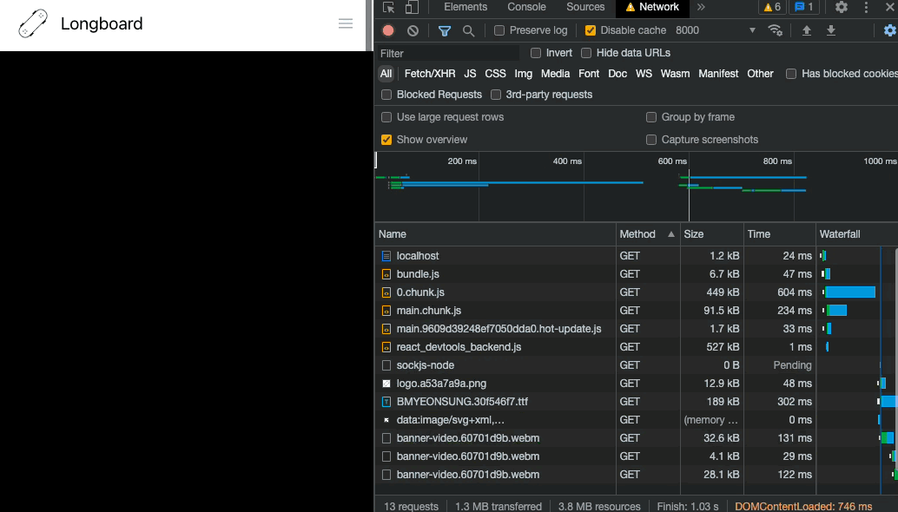

### 폰트 최적화2 - subset, unicode-range, data-uri

앞서 폰트 적용 시점에 대한 컨트롤을 조절해봤다면, 이번에는 폰트 사이즈를 줄이는 것을 해보려고 한다.
폰트 사이즈를 줄이는 방법으로는 1. 웹폰트 포멧 사용 2. local 폰트 사용 3. subset 사용, 4. unicode range 적용, 5. data-uri로 변환하는 방법 등이 있다.

폰트 사이즈를 줄이기 전에 우리가 주로 사용하는 폰트 포멧은 TTF/OTF, WOFF, WOFF2, EOT 등이 있다.

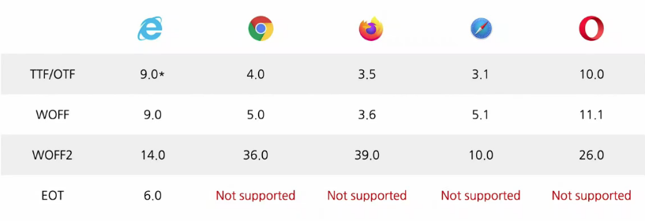

TTF/OTF는 압축이 되지 않은 폰트 파일이며, WOFF는 웹전용 폰트를 의미한다. WOFF는 압축된 상태이며, WOFF2는 더욱 효율이 증가한 웹폰트를 의미한다. 이외로 SVG 형식의 폰트도 있다.

파일크기: EOT > TTF/OTF > WOFF > WOFF2 라고 볼 수 있음

현재 우리 프로젝트에서는 BMYEONSUNG.ttf라는 1.9MB짜리 TTF/OTF 파일을 가지고 있는데, 이를 WOFF 파일 형식으로 변환해주는게 좋겠다. 변환은 transfonter.org에서 변환해보도록 한다.(편한거 사용)

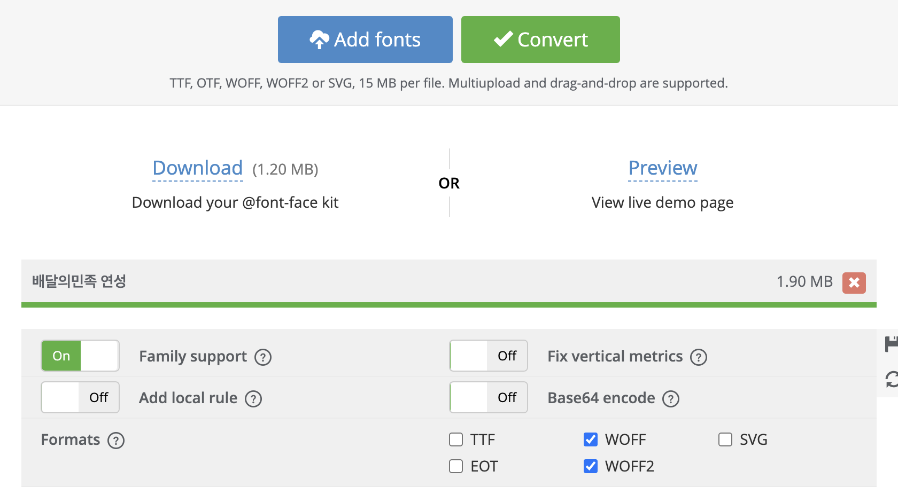

위처럼 TTF파일을 WOFF, WOFF2 형식으로 변환하여 다운받을 수 있다.

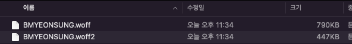

위처럼 변환된 파일을 확인해보면 기존 1.9MB보다 훨씬 작은 파일로 압축되어진 것을 확인할 수 있다.
해당 파일을 /src/assets/fons에 넣어두고 아래와 같이 넣어준다.

`./src/App.css`

```css
/* 폰트 지원 브라우저에 따른 다양한 적용을 아래처럼 분류할 수 있다. */
@font-face {
  font-family: BMYEONSUNG;
  src: url("./assets/fonts/BMYEONSUNG.woff2") format("woff2"), url("./assets/fonts/BMYEONSUNG.woff") format("woff"),
    url("./assets/fonts/BMYEONSUNG.ttf") format("truetype");
  font-display: block;
}
```

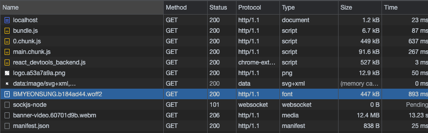

위와 같이 설정하면 woff2 파일이 크롬 브라우저에서 적절히 들어오는 것을 확인할 수 있다.
이처럼 더 빠른 폰트 로딩을 구현할 수 있다.

여기에서 추가로 이미 내 컴퓨터에 BMYEONSUNG를 가지고 있을 경우에는 컴퓨터의 폰트를 바로 가져와서 불러 쓸 수 있다. 아래와 같이 설정하면 됨

```
@font-face {
  font-family: BMYEONSUNG;
  src: local("BMYEONSUNG"), url("./assets/fonts/BMYEONSUNG.woff2") format("woff2"),
    url("./assets/fonts/BMYEONSUNG.woff") format("woff"), url("./assets/fonts/BMYEONSUNG.ttf") format("truetype");
  font-display: block;
}
```

위처럼 처리하면 내가 폰트를 컴퓨터 자체에서 가지고 있을 경우 별도의 폰트 다운로드 없이 바로 렌더링이 되는 것을 확인할 수 있다. 폰트 깨짐 현상없이 매우 빠르게 로드할 수 있게된다! 위 방법이 위 1, 2번 폰트 사이즈 줄이기 방법에 해당된다.

이외에도 3. subset 사용, 4. unicode range 적용 5. data-uri로 변환에 대한 방법을 알아본다.

만약 폰트 사용 시 특정 글자의 폰트만 웹에서 사용한다면 subset을 사용하면 리소스 낭비를 줄일 수 있다.


실제 작업하고 있는 홈페이지의 메인 영문 영역만 글자를 쓰므로 크게 A, B, C, D, E, G, I, K, L, M, N, O, P, R 만 가지고 있음 된다. (한글 폰트, 숫자 폰트 등 모두 제외 가능)

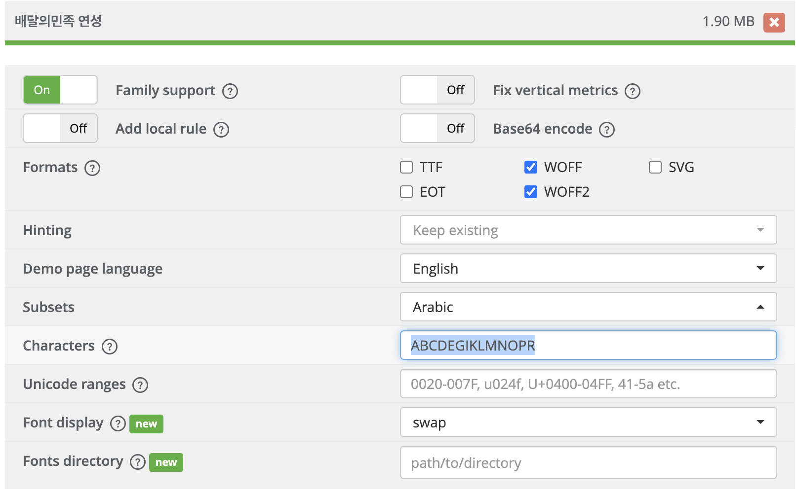

이 또한 transfonter.org에서 위와 같이 변환해준다. 위처럼 변환된 파일을 다운받아 demo.html을 살펴보면 위 Characters에 넣어둔 글자만 연성체가 적용되고, 그 외의 폰트는 일반 폰트로 적용되어있는 것을 확인할 수 있다.

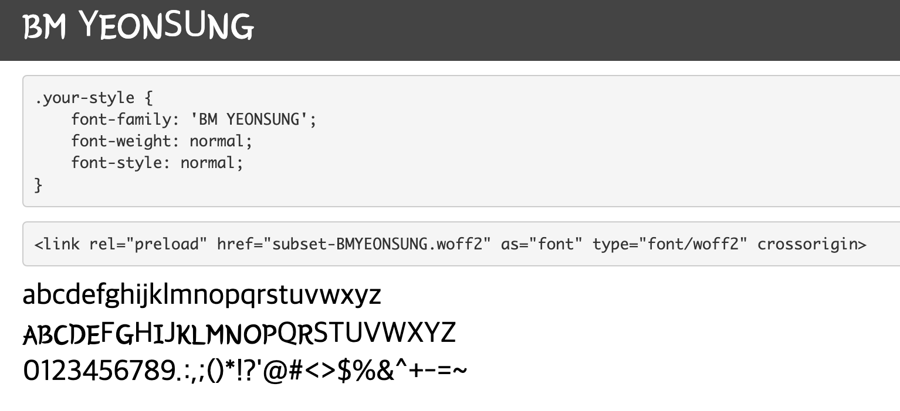

위와 같이 처리한 뒤 해당 파일을 assets 내부로 넣어준 다음 css에 아래와 같이 적용한다.

```css
@font-face {
  font-family: BMYEONSUNG;
  src: local("BMYEONSUNG"), url("./assets/fonts/subset-BMYEONSUNG.woff2") format("woff2"), url("./assets/fonts/subset-BMYEONSUNG.woff")
      format("woff"), url("./assets/fonts/BMYEONSUNG.ttf") format("truetype");
  font-display: block;
}
```

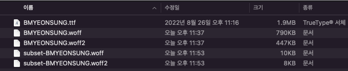

실제 적용된 폰트 파일이 8KB 밖에 되지 않는다..!
그런데 만약 item 카테고리 페이지에도 해당 폰트를 적용한다고 해보자.

`./src/App.css`

```css
/* ... */
.BannerImage {
  font-family: "BMYEONSUNG", sans-serif;
}
```

위처럼 BannerImage에도 폰트가 적용되도록 하면 아래처럼 변환폰트가 존재하는 `I`만 연성체로 변환된다.

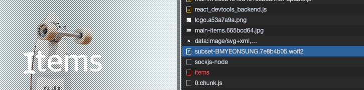

해당 영역을 소문자 `i`로 바꿔준다면 대문자만 변환하였으므로 폰트는 적용되지 않고 노출되는데, 문제는 해당 변환 폰트가 존재하지 않아도 woff2 파일을 다운받고 있다는 점을 확인할 수 있다.

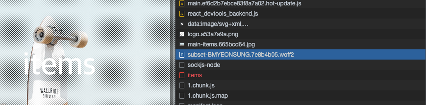

이때 `unicode-range`라는 속성을 이용해 개선할 수 있다.

`./src/App.css`

```css
@font-face {
  /* ... */
  unicode-range: u+0041; /* A */
}
```

위와 같이 unicode-range를 A글자에만 적용되도록 하면 메인에서도 A글자에만 폰트가 적용된 것을 확인할 수 있다. 아래 이미지 확인!


이를 활용해 아래와 같이 옵션을 추가해준다.
`Array.prototype.map.call('ABCDEGIKLMNOPR', c=> "u+" + ('0000' + c.charCodeAt(0).toString(16)).slice(-4)).join(', ')`

`./src/App.css`

```css
@font-face {
  /* ... */
  unicode-range: u+0041, u+0042, u+0043, u+0044, u+0045, u+0047, u+0049, u+004b, u+004c, u+004d, u+004e, u+004f, u+0050,
    u+0052;
}
```

위처럼 ABCDEGIKLMNOPR 폰트만 적용되도록 해주면 메인페이지에서는 모든 영문 텍스트가 잘적용되며,
해당 알파벳이 아닌 items 카테고리에서는 폰트가 적용되지도, 다운로드 되지도 않는다. 굿..!

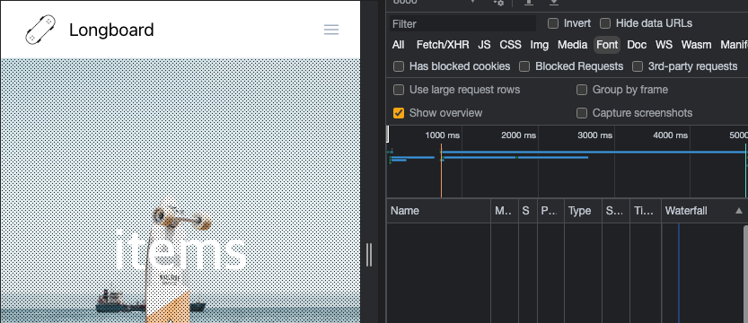

다음으로는 data-uri 변환방법에 대해 알아보자.
현재 사이트의 폰트를 보면 굉장히 크기가 작기 때문에 폰트 리소스를 별도로 다운받는 방식 대신에 페이지 자체에 폰트를 적용하여 불러오도록 처리하게 만들 수 있다. 이것이 `data-uri` 변환이라고 한다.

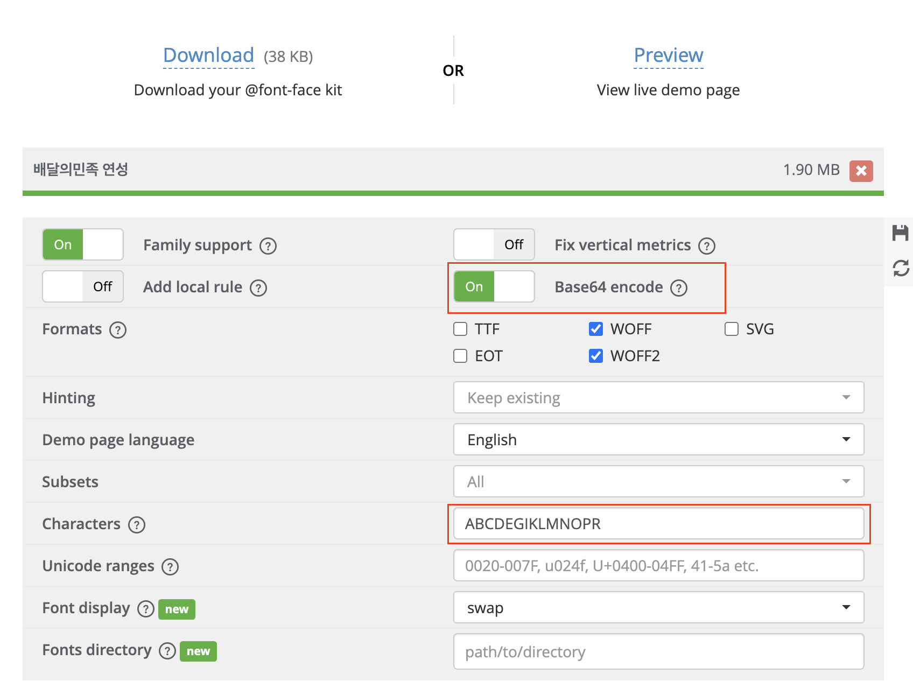

위처럼 변환 후 폰트 파일을 다운받아 stylesheet.css를 보면 아래와 같이 노출된다.

```css
@font-face {
  font-family: "BM YEONSUNG";
  src: url("")
      format("woff2"), url("")
      format("woff");
  font-weight: normal;
  font-style: normal;
  font-display: swap;
}

/*
	기존에는 아래와 같이 노출됐었음
**/
/*
@font-face {
    font-family: 'BM YEONSUNG';
    src: url('subset-BMYEONSUNG.woff2') format('woff2'),
        url('subset-BMYEONSUNG.woff') format('woff');
    font-weight: normal;
    font-style: normal;
    font-display: swap;
}
*/
```

기존에 url 파일로 불러오던 것을 base64 형태로 폰트를 아예 포함함으로써 폰트 리소스를 다운로드 받는 것이 아닌 파일 자체에 바로 적용이 되도록 구현할 수 있다. 네트워크 동작의 리소스를 줄일 수 있는 것이다. 위 내용을 복붙해서 `App.css`에 반영해주면 폰트파일의 별도 호출 없이 바로 적용되는 것을 확인할 수 있다.

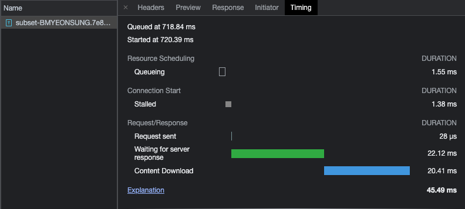

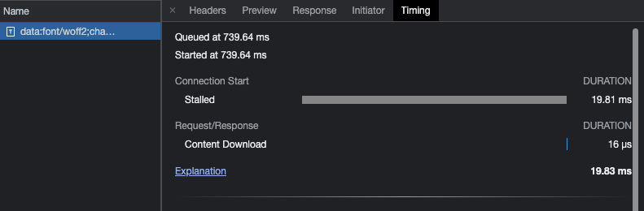

### 폰트 최적화3 - preload

이번 시간에는 폰트 preload에 대해 알아보고자 한다.

```html
<!DOCTYPE html>
<html lang="en">
  <head>
    <!-- ... -->
    <link rel="preload" href="BMYEONSUNG.woff2" as="font" type="font/woff2" crossorigin />
  </head>
</html>
```

위처럼 preload 하는 폰트 파일에 대한 정보를 `public/index.html`head 태그 내부로 넣어준다.
다음 css 파일 내부에 `data-uri` 형식으로 넣어둔 폰트 정보도 woff2 형식으로 불러오도록 수정해준다.

```css
@font-face {
  font-family: BMYEONSUNG;
  src: url("./assets/fonts/BMYEONSUNG.woff2") format("woff2"), url("./assets/fonts/BMYEONSUNG.woff") format("woff"),
    url("./assets/fonts/BMYEONSUNG.ttf") format("truetype");
  font-display: block;
  unicode-range: u+0041, u+0042, u+0043, u+0044, u+0045, u+0047, u+0049, u+004b, u+004c, u+004d, u+004e, u+004f, u+0050,
    u+0052;
}
```

이후 다시 파일을 빌드해주자

```bash
> npm run build
```

위와 같이 빌드 후 build 폴더에 생성된 index.htm을 보면 빌드된 파일 내 폰트 파일이 preload로 들어가있는 것을 확인할 수 있다. 해당 빌드 파일 내 폰트는 static 폴더 내부에 위치하므로 실제 폰트가 위치하는 경로에 맞춰준다.

`./build/index.html`

```html
<!DOCTYPE html>
<html lang="en">
  <head>
    <!-- ... -->
    <link rel="preload" href="./static/media/BMYEONSUNG.b184ad44.woff2" as="font" type="font/woff2" crossorigin />
    <link href="/static/css/main.96149ec3.chunk.css" rel="stylesheet" />
  </head>
</html>
```

이후 실제 빌드된 파일로 화면을 띄워본다.

```bash
> npx serve ./build
```

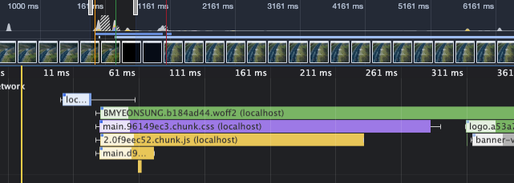

빌드 화면을 브라우저에서 오픈하면 폰트가 빠르게 적용되어 노출되는 것을 알 수 잇다.
이 시점이 preload 인지를 확인하기 위해 Performance 탭으로 확인하면 다른 어떤 css, js 파일보다 먼저 폰트파일이 로드 된 것을 확인할 수 있다.
원래 기본 css, js 이후에 다운받아져야 하는데, 개선된 점!

그럼 이전에는 어땠는지 눈으로 확인해본다.

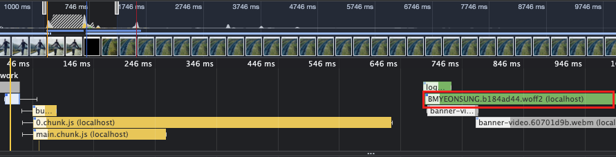

모든 파일이 다운로드 받아진 후 폰트 파일이 로드되고 있다.

그럼 이 방식을 매번 build 파일에서 경로를 수정해줘야할까? 그건 아니다. 웹팩 설정을 수정해주면 됨
먼저 관련 라이브러리르 추가로 설치해준다. (아래 과정에서 react-scripts 내부의 webpack 버전이 맞지 않아 다운로드 되지 않음. yarn으로 reInstall 하여 해결함)

```bash
> npm i react-app-rewired --save-dev
> npm i preload-webpack-plugin --save-dev
```

`package.json`

```json
"scripts": {
    "start": "npm run build:style && react-app-rewired start",
    "build": "npm run build:style && react-app-rewired build",
		//..
}
```

위처럼 `package.json`에 적용되는 데이터를 `react-scripts`에서 `react-app-rewired`로 바꿔준 다음 실제 웹팩 설정을 수정하기 위해 루트 폴더에 `config-overrides.js` 파일을 추가해준다.

`./config-overrides.js`

```jsx
const PreloadWebpackPlugin = require("preload-webpack-plugin")

module.exports = function override(config, env) {
  config.plugins.push(
    new PreloadWebpackPlugin({
      rel: "preload",
      as: "font",
      include: "allAssets",
      fileWhitelist: [/(.woff2?)/i],
    })
  )
  return config
}
```

위와 같이 작성 후 build를 해주면 `build/index.html` 내에 `/static/media/`로 path가 잘 변형되어 들어가는 것을 확인할 수 있다.

`./build/index.html`

```jsx
<!doctype html>
<html lang="en">
	<head>
	  <!-- ... -->
	  <link rel="preload" href="/static/media/BMYEONSUNG.b184ad44.woff2" as="font" type="font/woff2" crossorigin>
	  <link rel="preload" href="/static/media/BMYEONSUNG.b184ad44.woff" as="font" type="font/woff2" crossorigin>
	</head>
</html>
```

위와 같이 처리하면 Performance 탭에서 확인할 수 있듯 woff2, woff에 대한 폰트가 모두 preload 되었다.

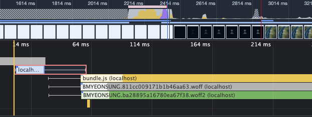

리소스 다운로드 시 두 가지 타입의 폰트가 다운로드 받아지는데, 이것은 바람직할까?
떄에 따라 이는 낭비가 될 수 있으므로, 각자 프로젝트의 지원 환경에 맞게 적절히 필요한 파일만 미리 다운받도록 한다.

### 캐시 최적화

이번에는 LightHouse를 통해 캐시가 어떻게 쌓이고 있는지 분석해보고자 한다.

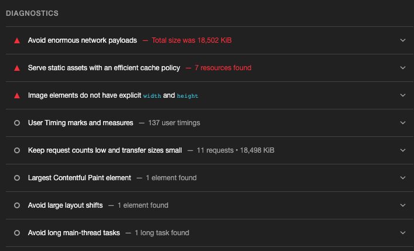

위 그림은 LightHouse로 분석한 Report 내용 중 일부인데, 위협요소에 Serve static assets with an efficient cahce policy라는 문구가 빨간색 텍스트로 노출되고 있다. 해당 문구는 효율적인 캐시정책이 적용되어있지 않다는 의미이다. 여기에서 static assets이란, 이미지나 동영상, js, css 파일 등이 속하며, 이러한 요소들이 캐시 정책을 제대로 적용하고 있지 않음을 의미한다.

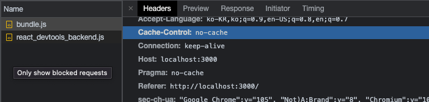

실제 main으로 동작하는 bundle.js의 경우 Request Headers 내용에 보면 Cache-control이 제대로 적용되어 있지 않은 상태라는 것을 알 수 있다. 그렇다면 캐시는 어떻게 설정할 수 있을까?

먼저 캐시란 ‘데이터나 값을 미리 복사해 놓는 임시 장소나 그런 동작’을 의미한다.
크롬 브라우저를 기준으로 웹 브라우저는 크게 1. 메모리 캐시, 2. 디스크 캐시로 캐싱을 한다. 메모리 캐시는 RAM 즉, 메모리에 데이터를 저장해두고 꺼내서 쓰는 방식이며, 디스크 캐시는 파일로 데이터를 저장하여 꺼내쓰는 방식이다. 이 두가지 방식은 사용자가 선택할 수 있는 옵션이 아니고 브라우저가 사용 빈도나 사용 사이드에 따라서 브라우저 자체의 알고리즘으로 처리된다.

먼저 캐시를 적용하려면 브라우저가 특정 서버에 전달받는 리소스에 캐시를 적용해달라는 설정을 해야하는데 이때 `cache-control` 옵션을 사용한다. cache-control 에는 아래와 같은 옵션이 들어갈 수 있다.

- no-cache: 캐시를 사용하기 전에 서버에 검사 후, 사용 결정
- no-store: 캐시 사용 안 함
- public: 모든 환경에서 캐시 사용 가능
- private: 브라우저 환경에서만 캐시 사용, 외부 캐시 서버에서는 사용 불가
- max-age: 캐시의 유효시간(60 → 60초, 600s → 10분)
  - cache-control: max-age=60
  - cache-control: private, max-age=600
  - cache-control: no-cache (max-age=0과 같음)

위 설정을 직접 프로젝트에 설정해보자. 이러한 설정은 서버상에서 설정해주는 것이니 참고하자.

`./server/server.js`

```jsx
const header = {
  setHeaders: (res, path) => {
    res.setHeader("Cache-Control", "private, no-cache, no-store, must-revalidate")
    res.setHeader("Expires", "-1")
    res.setHeader("Pragma", "no-cache")
  },
}
```

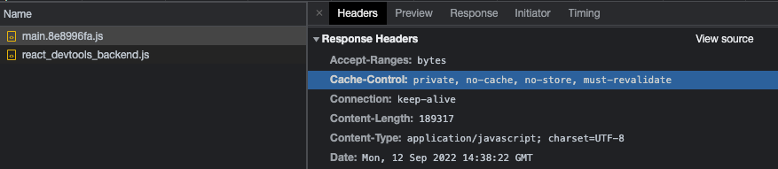

위와 같이 server.js 내 header 설정이 되어있으면 실제 브라우저의 Cache-control이 아래와 같이 잘 반영되어있는 것을 확인할 수 있다. 이를 아래와 같이 수정하면 웹 브라우저에서도 똑같이 반영된다.

```jsx
const header = {
  setHeaders: (res, path) => {
    res.setHeader("Cache-Control", "max-age=20")
    res.setHeader("Expires", "-1")
    res.setHeader("Pragma", "no-cache")
  },
}
```

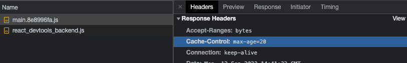

위처럼 처리 후 20초가 지나면 캐싱 없이 새롭게 리소스를 다운받을까? 리소스가 수정이 되지않았으므로 저장한 캐시 데이터를 그대로 사용하게 되는데 그때 304 status로 노출되는 점도 함께 확인하자.

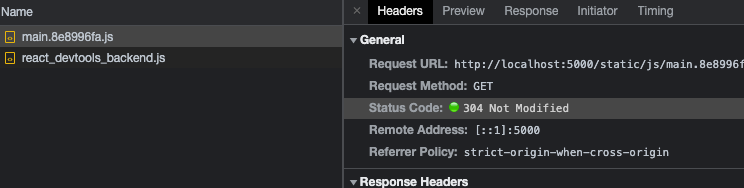

그렇다면 브라우저는 어떻게 서버 데이터와 기존 캐싱 데이터가 다르다는 것을 알 수 있을까? 이는 ETag를 통해 알 수 있다.

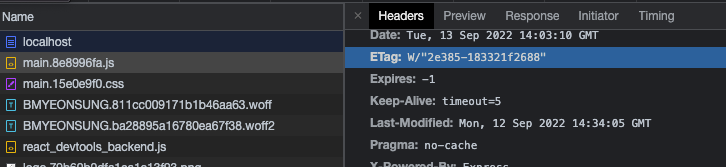

ETag는 리소스에 대한 일종의 hash 값이라고 생각할 수 있다. 만약 Etag가 AAA 였다가 서버에 리소스를 요청하기 전에 해당 데이터는 Etag 값으로 변화를 탐지하고, Etag가 다른 값으로 바뀌었을 경우 새로운 리소스를 다운로드 하도록 처리할 수 있는 것이다.

그런데, 위 setHeader 설정은 모든 리소스에 공통적으로 적용되도록 해놓은 옵션이다. 물론 Etag 때문에 캐시를 재로드 하는 과정은 줄어들지만 해시를 비교하는 로직은 계속 발생하므로 자원마다 다르게 적용되도록 구현해보는 것도 필요하다. (리소스가 잘 변경되지 않는 요소는 캐싱을 더 많이 처리할 수 있다)

먼저 프로젝트에서 주로 사용하는 리소스의 구조는 HTML, JS, CSS, IMG 등이 있다.

해당 파일에 변경사항이 발생하더라도 만약 캐싱이 1일 간 걸려있을 경우 해당 리소스를 새로 가져오지 않는다.
때문에 1) HTML은 보통 `no-cache`로 캐싱을 처리한다. 2) JS, CSS의 경우도 항상 최신으로 유지되어야 하는데, 그럼 이 파일도 `no-cache`로 처리할까? 아니다! 보통 JS, CSS의 경우 새로 빌드 시 파일값 뒤에 새로운 해시값이 붙기 때문에 HTML 리소스가 최신으로 유지가 되는 한 항상 최신의 JS, CSS를 요청한다고 판단할 수 있는 것이다. 따라서 max-age=31536000(1년)등으로 설정하므로써 무한대에 가까운 캐싱을 설정해준다. 3) IMG의 경우에도 자주 변경될 경우 cache 기간을 짧게 하거나 혹은 긴 기간 캐싱 처리 후 hash를 적용하여 처리하는 것이 바람직하다. 즉 캐싱 적용은 아래와 같은 정책으로 운영하기로 한다.

- HTML : no-cache
- JS / CSS / IMG : public, max-age=31536000 + hash

`./server/server.js`

```jsx
const header = {
  setHeaders: (res, path) => {
    if (path.endsWith(".html")) {
      res.setHeader("Cache-Control", "no-cache")
    } else if (path.endsWith(".js") || path.endsWith(".css") || path.endsWith(".webp")) {
      res.setHeader("Cache-Control", "public, max-age=31536000")
    } else {
      res.setHeader("Cache-Control", "no-store")
    }
  },
}
```

위와 같이 설정하면 파일별로 들어오는 Header 설정이 잘 변경되어 있는 것을 확인할 수 있다.

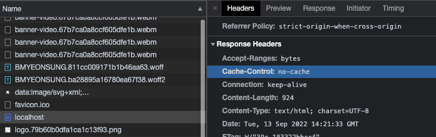
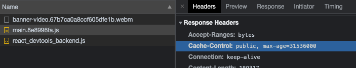
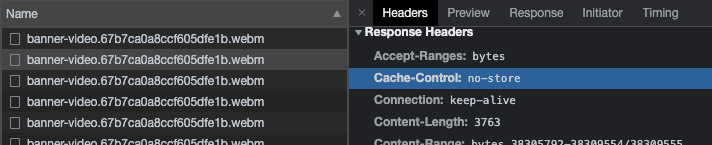
