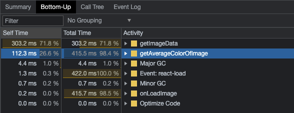
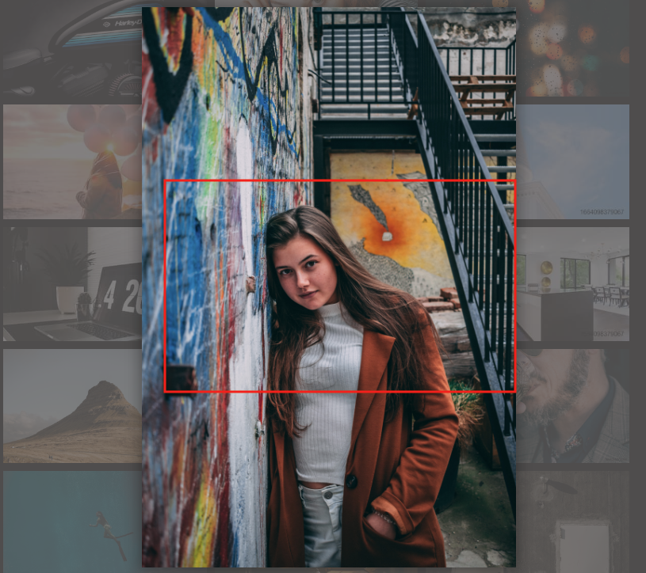

## 이미지 갤러리 서비스 최적화

### 실습 내용

- 로딩 성능 최적화
  - 이미지 지연(lazy) 로딩
- 렌더링 성능 최적화
  - Layout Shift 피하기
  - useSelector 렌더링 문제 해결
    - redux hooks 인 useSelector 이슈 개선
  - Redux Reselect를 통한 렌더링 최적화
  - 병목 함수에 memoization 적용
  - 병목 함수 로직 개선하기

### 분석 툴

- 크롬 Network 탭
- 크롬 Performance 탭
- Lighthouse
- React Developer Tools(Profiler)
- Redux DevTools

### 서비스 탐색 및 코드 분석

이번 프로젝트는 여러 사진을 갤러리형식으로 열어볼 수 있는 페이지이다. Random, Animals 등 여러 테마로 사진을 필터하여 확인할 수도 있다. 소스 구성을 먼저 확인해보자.

`./src/App.js`

```html
<AppWrap>
  <GlobalStyle />
  <header />
  <PhotoListContainer />
  <ImageModalContainer />
</AppWrap>
```

위와 같은 구조로 홈페이지가 구성되어 있다.
기본적인 카테고리 구조를 보여주는 Header 컴포넌트와 사진을 보여주는 PhotoListContainer, 그리고 상세 이미지를 보여주는 ImageModalContainer 컴포넌트로 구성되어 있다.


리덕스에서 동작하는 구조를 보면 가장 먼저 이미지를 가져오고, 이를 모달로 활성화 시킨 뒤 사진에 따른 배경 색을 조정하는 코드가 동작한다는 것을 확인할 수 있다.

SET_BG_COLOR의 경우 이미지 전체 색을 체크하여 그 중 평균 색감을 가져오므로 사진 크기가 클수록 더욱 비용이 올라가는 코드가 될 수 있다는 것을 참고 하자.

### Layout Shift 피하기

Layout Shift는 어떤 것일까? 이미지 갤러리 서비스에서 데이터 로드 속도가 느릴 때, 갤러리 이미지 로드 시 순서대로 이미지가 노출되지 않고 작은 용량부터 로드되면서 Layout이 뒤로 밀리는 현상을 의미한다. 이는 크롬 개발자도구의 Performance 탭에서도 확인할 수 있다.


이런 Layout Shift는 성능에 영향을 준다. 화면에서 해당 이미지에 대한 렌더링을 위해 계산을 다시 해야한다는 점과 원하는 이미지 클릭을 하지 못할 경우에 대한 사용성 정하가 바로 그 예이다.

LightHouse로 사이트를 검사해보았을 때에도 Cumulative layout Shift라는 메시지가 대략 0.309 로 나오는 것을 확인할 수 있다. (0~1 값, 가장 빠른 네트워크에서 검사한 것이므로 현저한 성능 저하 이슈라고 볼 수 있다) 또한 진단내역에 이와 관련된 메시지가 나오는 것도 확인할 수 있다. (이미지 요소에 width 및 height가 명시되어 있지 않습니다.)


Layout Shift의 원인은 아래와 같다.

- 사이즈가 정해져 있지 않은 이미지
- 사이즈가 정해져 있지 않은 광고
- 동적으로 삽입된 콘텐츠(api fetching)
- web font (FOIT, FOUT)

그렇다면 이러한 Layout Shift는 어떻게 개선할 수 있을까?
발생할 수 있는 레이아웃에 대한 위치나 사이즈를 지정하여 레이아웃 배치에 소요되는 비용을 줄여줄 수 있다.

현재 갤러리의 경우 이미지가 16:9 비율로 노출되므로 해당 비율을 그대로 코드에 적용해주면 된다.

`./src/components/PhotoItem.js`

```jsx
function PhotoItem({ photo: { urls, alt } }) {
  //...
  return (
    <ImageWrap>
      <Image src={urls.small + "&t=" + new Date().getTime()} alt={alt} onClick={openModal} />
    </ImageWrap>
  )
}

const ImageWrap = styled.div`
  width: 100%;
  padding-bottom: 56.25%;
  position: relative;
`

const Image = styled.img`
  cursor: pointer;
  width: 100%;
  position: absolute;
  width: 100%;
  height: 100%;
  top: 0;
  left: 0;
`
```

위처럼 ImageWrap에 padding 속성을 활용해 각 위치에 이미지가 들어가도록 처리해준다.


레이아웃이 밀리지 않고 제자리에 데이터가 들어가는 것을 확인할 수 있다. 위처럼 하면 기존 Performance 탭에서 발생하던 Layout Shift 메시지도 발생하지 않는 것을 확인할 수 있다.

### 이미지 지연(lazy) 로딩(react-lazyload)

이번에는 이미지 지연 로딩에 대해 구현해본다. 이전 시간에도 이미지 지연로드를 구현해보았는데, 그때는 intersectionObserver를 활용해서 스크롤에 따른 이미지 로드가 처리되도록 작업했다.

이번에는 비슷한 로직이지만 react-lazyload라는 라이브러리를 활용해서 구현해보도록 한다.

```bash
> npm i --save react-lazyload
```

`./src/components/PhotoItem.js`

```jsx
// ..
import LazyLoad from "react-lazyload"

export default PhotoItem({ photo: { urls, alt } }) {
	// ..
  return (
    <ImageWrap>
      <LazyLoad>
        <Image src={urls.small + "&t=" + new Date().getTime()} alt={alt} onClick={openModal} />
      </LazyLoad>
    </ImageWrap>
  )
}
```

위처럼 react-lazyload의 LazyLoad를 이미지영역에 감싸주면 스크롤에 따라 이미지가 순차적으로 로드되는 것을 확인할 수 있다.


스크롤 속도에 따라 fetch 되는 과정이 자주 보인다면 이미지 로드 시점을 조금 앞당기면 된다.

```jsx
// ..
import LazyLoad from "react-lazyload"

export default PhotoItem({ photo: { urls, alt } }) {
	// ..
  return (
    <ImageWrap>
      <LazyLoad offset={500}>
        <Image src={urls.small + "&t=" + new Date().getTime()} alt={alt} onClick={openModal} />
      </LazyLoad>
    </ImageWrap>
  )
}
```

하위로 500px 에 대한 이미지를 사전에 로드해오는 설정임.

### useSelector 렌더링 이슈 개선

이번 시간에는 `useSelector`가 렌더링에 미치는 영향에 대해 알아보고자 한다.
기본적으로 React는 화면을 렌더링하는 라이프사이클이 있다. 이는 성능에 큰 영향을 미치는 요인이 된다.

현재 사이트에 렌더링이 어떻게 동작하는지 확인하기 위해서는 개발자도구의 React Component 탭을 열어서 확인할 수 있다. Option에 `Highlight updates when components render.`를 활성화해주면 렌더링되는 레이아웃의 아웃라인이 highlight 처리되는 것을 확인할 수 있다.


위 이미지가 렌더링되는 예시이다. 카테고리를 클릭했을 때 하단 갤러리 영역의 이미지가 바뀌므로 다시 렌더링되는 것은 이해할 수 있지만, 이미지 상세 모달을 클릭했을 때 뒷 배경인 갤러리 영역이 제렌더링 처리가 되고 있는 것은 문제가 있어보인다.

이유는 redux에 이미지 데이터가 포함된 상태에서, 모달 상태 또한 redux의 값으로 변경되므로 상태가 변경되었다고 판단하여 함께 화면에 재렌더링 되는 것이다. 하지만 이는 문제가 있다. 모달의 상태를 갤러리 영역이 바라보지(구독하지) 않음에도 재렌더링이되기 때문.

이를 이해하기 위해서는 `useSelector`의 동작원리를 알아야 한다.


redux store에서 새로운 데이터가 dispatch되면 새로운 redux store로 refresh 된다.


새로운 state와 기존의 state를 비교해서 값이 다르면 렌더링을 새로 하는데, state 내부의 값을 이루는 object의 값이 내부 정보는 같더라도 새로운 객체라고 판단하여 값이 다르다고 처리하는 것이다. (c 라는 값이 변경되어도 a, b에 대한 값도 변경되었다고 판단)

그렇다면 useSelector 문제를 어떻게 해결할 수 있을까?

1. Object를 새로 만들지 않도록 State 쪼개기

   `./src/containers/ImageModalContainer.js`

   ```jsx
   // ..
   function ImageModalContainer() {
     /* const { modalVisible, bgColor, src, alt } = useSelector((state) => ({
       modalVisible: state.imageModal.modalVisible,
       bgColor: state.imageModal.bgColor,
       src: state.imageModal.src,
       alt: state.imageModal.alt,
     })) */

     /* object 내부로 넣지 않고, state를 따로 쪼갠다. */
     const modalVisible = useSelector((state) => state.imageModal.modalVisible)
     const bgColor = useSelector((state) => state.imageModal.bgColor)
     const src = useSelector((state) => state.imageModal.src)
     const alt = useSelector((state) => state.imageModal.alt)

     console.log("ImageModalContainer was rendered")

     return <ImageModal modalVisible={modalVisible} bgColor={bgColor} src={src} alt={alt} />
   }

   export default ImageModalContainer
   ```

   위처럼 하나의 object 내부에 데이터를 넣지 않고 state가 각자의 변수에 담기도록 처리하면 bgColor 하나만 바뀌어도 전체 데이터가 새로 렌더링되는 현상을 개선할 수 있다.

   

2. 새로운 Equality Function 사용

   이번에는 react-redux에서 제공하는 shallowEqual이라는 Euality Function을 활용하는 방법이다.

   `./src/containers/ImageModalContainer.js`

   ```jsx
   // ..
   import { useSelector, shallowEqual } from "react-redux"

   function ImageModalContainer() {
     /* 
   	const { modalVisible, bgColor, src, alt } = useSelector((state) => ({
       modalVisible: state.imageModal.modalVisible,
       bgColor: state.imageModal.bgColor,
       src: state.imageModal.src,
       alt: state.imageModal.alt,
     })) 
   	*/
     const { modalVisible, bgColor, src, alt } = useSelector(
       (state) => ({
         modalVisible: state.imageModal.modalVisible,
         bgColor: state.imageModal.bgColor,
         src: state.imageModal.src,
         alt: state.imageModal.alt,
       }),
       shallowEqual // 각 데이터가 달라졌는지 하나하나 확인해주는 equality Func
     )

     console.log("ImageModalContainer was rendered")

     return <ImageModal modalVisible={modalVisible} bgColor={bgColor} src={src} alt={alt} />
   }
   ```

   위처럼 반영하면 `shallowEqual`이라는 함수가 각 modalVisible, bgColor, src, alt 데이터가 달라졌는지 하나씩 확인하여 변경 시에만 렌더링을 발생시키도록 처리해줄 수 있다.

위와 같은 방법으로 Header와 PhotoListContainer 컴포넌트도 수정을 해준다.

`./src/components/Header.js`

```jsx
//..
function Header() {
  const dispatch = useDispatch()
  const category = useSelector((state) => state.category.category)

  return ( ... )
}

export default Header
```

`./src/components/PhotoListContainer.js`

```jsx
// ..

function PhotoListContainer() {
  // ..
  const { photos, loading } = useSelector(
    (state) => ({
      photos:
        state.category.category === "all"
          ? state.photos.data
          : state.photos.data.filter((photo) => photo.category === state.category.category),
      loading: state.photos.loading,
    }),
    shallowEqual
  )
  // ..
}
```

위처럼 처리하면 기본적인 컴포넌트 리렌더링을 개선할 수 있다. 하지만 이미지 모달을 띄웠을 때 확인해보면, PhotoListContainer 컴포넌트가 리렌더링되는 것을 확인할 수 있다.


shallowEqual을 넣었는데도 재렌더링되는 이유는 무엇일까?
이유는 `useSelector` 내부의 `filter` 함수 때문이다. `useSelector` 내부에서 데이터 변경 처리를 하므로 같은 값이더라도 변경된 데이터로 인식하는 것이다.

따라서 `filter`함수가 useSelector 외부에서 처리되도록 개선해준다.

`./src/containers/PhotoListContainer.js`

```jsx
//..

function PhotoListContainer() {
  // //
  const { category, allPhotos, loading } = useSelector(
    (state) => ({
      category: state.category.category,
      allPhotos: state.photos.data,
      loading: state.photos.loading,
    }),
    shallowEqual
  )

  const photos = category === "all" ? allPhotos : allPhotos.filter((photo) => photo.category === category)

  // ..
}
```

위처럼 filter가 외부에서 처리되도록 개선해준 뒤 화면을 확인해보면 아래와 같다.


모달 클릭 시 `PhotoListContainer was rendered`가 콘솔 로그로 찍히지 않는 것을 확인할 수 있다.

### Redux Reselect를 통한 렌더링 최적화

이번에는 Redux Reselect를 통해 렌더링을 최적화해본다. 이전 시간에 `PhotoListContainer` 컴포넌트에서 불필요한 상태 변화를 방지하기 위해 photos 필터를 `useSelector` 외부에서 처리하도록 개선해주었다.

이를 통해 렌더링을 최적화했다고 볼 수 있지만, 문제가 아예 없는 것이다.
먼저 category 데이터는 실제 컴포넌트에서 사용되지 않는 데이터라는 것이다. (filter를 위해 도출)

또한, PhotoListContainer에 다른 구조가 추가되는 경우 컴포넌트가 재 실행될 때마다 photos라는 데이터가 매번 새롭게 계산되어야 하므로 이는 좋지않다. (매번 Photos에 들어가는 500개의 이미지를 filter 해야 함)

이 때, 사용할 수 있는 것이 `reselect` 라이브러리이다. redux와 함께 사용하는 이 라이브러리는 useSelect 내부에서 filter 등의 기능이 매번 다른 객체로 인지하지 않게끔 해준다!

```bash
> npm i --save reselect
```

위 reselect를 아래와 같이 적용해준다.

`./src/components/PhotoListContainer.js`

```jsx
// ..
import { createSelector } from "reselect"

function PhotoListContainer() {
  // ..

  const selectFilteredPhotos = createSelector(
    [(state) => state.photos.data, (state) => state.category.category],
    (photos, category) => (category === "all" ? photos : photos.filter((photo) => photo.category === category))
  )

  const photos = useSelector(selectFilteredPhotos)
  const loading = useSelector((state) => state.photos.loading)

  console.log("PhotoListContainer rendered")

  // ..
}
```

위처럼 처리하면 이전 시간에 별도로 photos 계산을 하여 노출한 것처럼 불필요한 렌더링을 방지하게 해준다!

그렇다면 reselect는 어떻게 useSelector 내부에서 동작해도 상태변화를 일으키지 않는 것일까?
정답은 바로 memoization 기법을 활용하기 때문이다. reselect는 memoization 기법을 활용해서 함수에 똑같은 인자가 들어오면 이를 매번 계산하지 않고 미리 캐시된 값으로 반환을 해준다.

예를 들어 photos가 500개의 이미지라고 했을 때, API를 다시 fetching 하지 않는 이상 object reference가 같기 때문에 이러한 경우 새로 데이터를 가져오지 않고 기존에 캐싱해놓은 데이터를 리턴해주는 것이다.

1. (ref, ‘all’) ⇒ [500images]; → `(ref, ‘all’)` 유형의 이미지 500개를 가져옴
2. (ref, ‘all’) ⇒ [ caching images.. ]; : 인자가 `(ref, ‘all’)` 기존과 같으므로 캐싱된 500개 이미지 반환
3. (ref, ‘food’) ⇒ [ new images ]; → `(ref, ‘food’)`는 새로운 인자이므로 새로 이미지 500개를 가져옴

이는 아래와 같은 구조로 분리하여 많이 사용한다.

`./src/redux/selector/selectFilteredPhotos.js` \*생성

```jsx
import { createSelector } from "reselect"

export default createSelector([(state) => state.photos.data, (state) => state.category.category], (photos, category) =>
  category === "all" ? photos : photos.filter((photo) => photo.category === category)
)
```

`./src/components/PhotoListContainer.js`

```jsx
// ..
import selectFilteredPhotos from "../redux/selector/selectFilteredPhotos"

function PhotoListContainer() {
  const photos = useSelector(selectFilteredPhotos)
  // ..
}
```

각 기능에 대한 memoization 함수를 별도로 분리하는 방법임 !
memoization 기능은 신규 기술이 아니므로 요즘은 recoil 등에서 내부 기능으로도 제공하고 있다.

### 병목 함수에 memoization 적용

이번에는 직접 `memoization` 함수를 만들어보려고 한다.
`memoization`이란 어떤 input → output이 있다고 했을 때, 해당 input과, output을 기억해놓았다가 같은 input일 경우 같은 output을 반환해주도록 처리해주는 것이다.

위 memoization 함수를 현 서비스의 어디에 적용할 수 있을까? 이미지가 뜨는 부분을 memoization 처리할 수 있다. 처음 상세페이지에서 이미지를 다운로드 받는 속도는 어찌할 수 없다 치더라도, 이미지의 컬러를 도출하여 배경화면에 적용하는 과정은 계산이 많이 소요되므로 한번 계산된 뒤 같은 이미지를 모달로 띄울 때, 해당 이미지에 대한 배경색 값을 memoization하여 호출한다면 성능을 개선할 수 있을 것이다.

먼저 현재 구조를 살펴보면, 배경화면 색을 가져오는 함수는 `ImageModal`에서 사용하고 있는 `getAverageColorOfImage`라는 함수이다.

`./src/components/ImageModal.js`

```jsx
// ..
import { getAverageColorOfImage } from "../utils/getAverageColorOfImage"

function ImageModal({ modalVisible, src, alt, bgColor }) {
  const dispatch = useDispatch()
  const onLoadImage = (e) => {
    const averageColor = getAverageColorOfImage(e.target)
    // ..
  }

  // ..
}
```

`./src/utils/getAverageColorOfImage.js`

```jsx
export function getAverageColorOfImage(imgElement) {
  const canvas = document.createElement("canvas")
  const context = canvas.getContext && canvas.getContext("2d")
  const averageColor = {
    r: 0,
    g: 0,
    b: 0,
  }

  if (!context) {
    return averageColor
  }

  const width = (canvas.width = imgElement.naturalWidth || imgElement.offsetWidth || imgElement.width)
  const height = (canvas.height = imgElement.naturalHeight || imgElement.offsetHeight || imgElement.height)

  context.drawImage(imgElement, 0, 0)

  const imageData = context.getImageData(0, 0, width, height).data
  const length = imageData.length

  for (let i = 0; i < length; i += 4) {
    averageColor.r += imageData[i]
    averageColor.g += imageData[i + 1]
    averageColor.b += imageData[i + 2]
  }

  const count = length / 4
  averageColor.r = ~~(averageColor.r / count) // ~~ => convert to int
  averageColor.g = ~~(averageColor.g / count)
  averageColor.b = ~~(averageColor.b / count)

  return averageColor
}
```

즉 위 getAverageColorOfImage 함수에 memoization을 적용하려는 것이다.

`./src/utils/getAverageColorOfImage.js`

```jsx
const cache = {}

export function getAverageColorOfImage(imgElement) {
  if (cache.hasOwnProperty(imgElement.src)) {
    console.log("Cache has the key")
    return cache[imgElement.src] // cache된 값을 반환
  }

  console.log("Cache don't have the key")
  //..

  cache[imgElement.src] = averageColor // 저장
  return averageColor
}
```

위처럼 memoization 함수를 구현해보았다.
memoization 함수는 pure function이어야만 한다. (동일한 값을 반환하도록 하기 위해)
또한 cache 객체에 imgElement만 넣게될 경우 모든 이미지를 같은 이미지 객체로 인식하게 되므로 각 이미지의 src를 cache 데이터로 넣어 중복되지 않도록 처리해줄 수 있다.

실제 performance 탭에서도 초기에는 getLoadImage 함수가 계산되는데 약 4초 정도 소요되는 반면 이후 동작 시 훨씬 빠른 속도로 해당 함수가 동작하는 것을 로그로 확인할 수 있다.

이러한 memoization 함수는 다양한 타입에 삽입될 수 있으므로 이를 factory pattern으로 memoization 함수로 변경해주는 유틸 함수로 만들어 적용하는 것이 바람직한다.

`./src/utils/memoize.js`

```jsx
export default function memoize(fn) {
  const cache = {}

  return function (...args) {
    if (args.length !== 1) {
      return fn(...args)
    }
    if (cache.hasOwnProperty(args)) {
      return cache[args]
    }

    const result = fn(...args)
    cache[args] = result

    return fn(...args)
  }
}
```

`./src/utils/getAverageColorOfImage.js`

```jsx
import memoize from "./memoize"

export const getAverageColorOfImage = memoize(function (imgElement) {
  // ..
})
```

위처럼 적용해줄 수 있다. 단 memoization은 heavy한 함수에 캐싱을 도와 성능을 개선해주므로 1회성 데이터는 memoization 처리를 하는 것이 불필요하므로, 상황에 맞춰 적절히 함수를 사용하는 것이 바람직함!

### 병목 함수 로직 개선하기

이번에는 병목을 일으키는 함수에 대해 로직 개선을 해보고자 한다.
지난 시간의 getAverageColorOfImage 함수 내부 로직부터 개선해보고자 한다.
우선 공통의 memoiza 함수 적용을 제외한 직접 캐시를 적용한 함수 형태로 돌려둔다.

`./src/utils/getAverageColorOfImage.js`

```jsx
const cache = {}

export function getAverageColorOfImage(imgElement) {
  if (cache.hasOwnProperty(imgElement.src)) {
    return cache[imgElement.src]
  }

  // ..

  context.drawImage(imgElement, 0, 0) // 병목 발생: drawImage는 캔버스에 이미지를 그리는 과정
  const imageData = context.getImageData(0, 0, width, height).data // 병목 발생
  const length = imageData.length

  // 병목 발생
  for (let i = 0; i < length; i += 4) {
    averageColor.r += imageData[i]
    averageColor.g += imageData[i + 1]
    averageColor.b += imageData[i + 2]
  }

  //..

  cache[imgElement.src] = averageColor
  return averageColor
}
```



실제 위 함수는 Performance 탭에서 확인했을 때 4초 정도의 실행 시간을 가져가므로 병목을 일으키는 함수라고 볼 수 있다. 또한 위 함수의 병목을 일으키는 3가지 위치를 어떻게 개선해볼 수 있을까?

1. drawImage는 캔버스에 이미지를 그리는 과정

   1. 그리고자 하는 캔버스의 크기가 클수록 옮겨지는 속도가 느리므로 이미지의 사이즈를 작게해서 그림

      1. 아예 이미지를 작게 가져오거나 2) 이미지를 캔버스에 그릴 때, 이미지를 작게 그리거나

이는 ImageModal 내의 이미지 src를 가져오는 대신, PhotoItem 즉, 리스트에 존재하는 small 사이즈 이미지의 src를 가져와 처리하는 방법으로 개선할 수 있다.

`./src/components/PhotoItem.js`

```jsx
// ..

function PhotoItem({ photo: { id, urls, alt } }) {
  // ..

  const openModal = () => {
    dispatch(showModal({ src: urls.full, alt, id })) // id값 추가
  }

  return (
    <ImageWrap>
      <LazyLoad offset={500}>
        {/* id 속성 추가 */}
        <Image crossOrigin="*" id={id} src={urls.small + "&t=" + new Date().getTime()} alt={alt} onClick={openModal} />
      </LazyLoad>
    </ImageWrap>
  )
}
```

`./src/containers/ImageModalContainer.js`

```jsx
// ..

function ImageModalContainer() {
  // id 값 추가 호출
  const { modalVisible, bgColor, src, alt, id } = useSelector(
    (state) => ({
      // ..
      id: state.imageModal.id,
    }),
    shallowEqual
  )
  {
    /* id 속성 추가 */
  }
  return <ImageModal modalVisible={modalVisible} bgColor={bgColor} src={src} alt={alt} id={id} />
}
```

`./src/components/ImageModal.js`

```jsx
//..
function ImageModal({ modalVisible, src, alt, bgColor, id }) {
  // ..
  const onLoadImage = (e) => {
    // e.target 대신 small.image id 반영
    const averageColor = getAverageColorOfImage(document.querySelector(`#${id}`))
    dispatch(setBgColor(averageColor))
  }

  return (
    <Modal modalVisible={modalVisible} closeModal={closeModal} bgColor={bgColor}>
      <ImageWrap>
        <FullImage crossOrigin="*" src={src} alt={alt} onLoad={onLoadImage} />
      </ImageWrap>
    </Modal>
  )
}
```

그런데 여기 문제가 있다. 만약 리스트의 이미지 중 아래 이미지의 배경색을 추출했다고 하자.


이 이미지를 모달로 띄우면 원본 사진은 아래와 같다.



이미지의 중간 영역만 잘라져서 리스트에 반영된 상태로 배경색이 추출되었다고 할 수 있다.
함수 성능을 개선하면서 바라보는 이미지를 리스트 이미지로 변경했는데, 만약 이미지의 가운데와 위, 아래 영역이 색깔 대조가 많은 이미지라면? 그리고 이미지 전체의 평균 색상을 도출하는 것이 더 중요하다면 어떻게 해야할까?

이때는 이미지 전체를 작은 사이즈의 캔버스에 이미지를 그리고 해당 이미지에 대한 대표 색상을 도출할 수 있다.

`./src/components/ImageModal.js`

```jsx
// ..
import { getAverageColorOfImage } from "../utils/getAverageColorOfImage"

function ImageModal({ modalVisible, src, alt, bgColor, id }) {
  const onLoadImage = (e) => {
    const averageColor = getAverageColorOfImage(e.target) // roll-back
    dispatch(setBgColor(averageColor))
  }

  // ..
}
```

`./src/utils/getAverageColorOfImage.js`

```jsx
const cache = {}

export function getAverageColorOfImage(imgElement) {
  //..

  const width = imgElement.naturalWidth || imgElement.offsetWidth || imgElement.width
  const height = imgElement.naturalHeight || imgElement.offsetHeight || imgElement.height

  canvas.width = width / 2
  canvas.height = height / 2

  // drawImage(image: CanvasImageSource, dx: number, dy: number, dw: number, dh: number): void;
  context.drawImage(imgElement, 0, 0, canvas.width, canvas.height)

  // ..
}
```

위처럼 `drayImage` 시 width와, height 값을 인자로 설정하고, 기본 canvas 크기를 절반으로 줄여서 성능을 최적화할 수 있다.

두번째로 반복문을 개선할 수 있다.

`./src/utils/getAverageColorOfImage.js`

```jsx
const cache = {}

export function getAverageColorOfImage(imgElement) {
  //..

  for (let i = 0; i < length; i += 40) {
    // 빼경색 추출 픽셀 단위를 4에서 40으로 변경
    averageColor.r += imageData[i]
    averageColor.g += imageData[i + 1]
    averageColor.b += imageData[i + 2]
  }

  const count = length / 40
  // ..
}
```

이외로 Modal 내 색 변경 애니메이션에 transition 효과를 추가하여 UX를 보강한다.

`./src/components/Modal.js`

```jsx
//..

const ModalWrap = styled.div`
  // ..
  transition: background-color 1s;
`

export default Modal
```

위처럼하면 원본 사진을 기준으로 성능을 최적화하도록 할 수 있다.
다만 무조건 줄이는 것은 좋지 않다. 오히려 줄이는 과정에서 병목이 발생할 수 있으므로 적절한 시점을 찾아 함수 동작을 조절하도록 한다.
