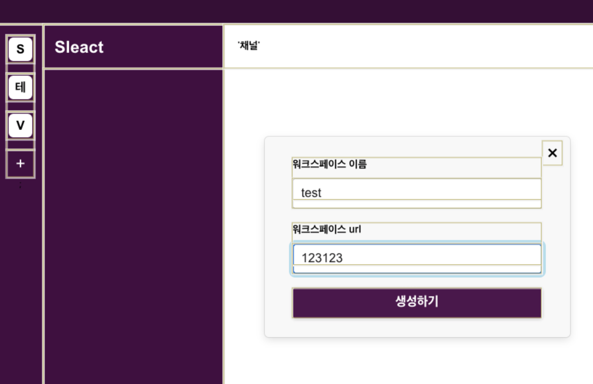
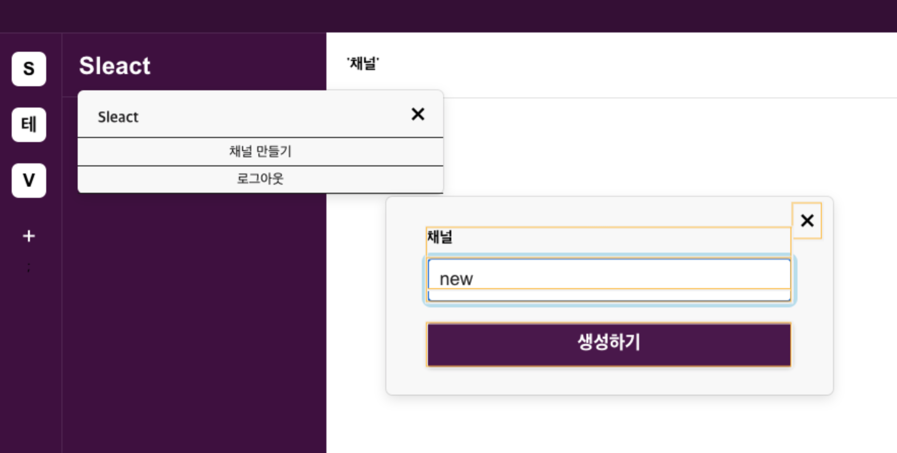

## 메뉴와 모달 구현

### 메뉴 만들기

상단 아이콘 영역이나 왼쪽 채널을 눌렀을 때 popover되는 메뉴를 만들어보자. 먼저 상단 아이콘 영역을 클릭했을 때 나타나는 메뉴창을 만들어보려고 한다. 해당 메뉴창은 다른 곳에서도 공통으로 쓰이므로 pages가 아닌 components에 넣어 작업한다.

공용 컴포넌트는 언제 나눠야할까? 특정 페이지에서만 사용되는 컴포넌트라면 별도로 분리할 필요는 없다. 단 여러 페이지에서 동일한 레이아웃을 구현해야할 때 해당 컴포넌트는 공용 컴포넌트로 만드는 것이 좋다. 이 부분은 작업자들과 협의해서 컴포넌트 추상화 시점과 정도를 맞추는 것이 좋다.

`front/components/Menu/index.tsx`

```tsx
import { CreateMenu, CloseModalButton } from "@components/Menu/styles";
import React, { CSSProperties, FC, PropsWithChildren, useCallback } from "react";

interface Props {
  show: boolean;
  onCloseModal: () => void;
  style: CSSProperties;
  closeButton?: boolean;
}

// 1. FC 타입에 별도의 커스텀 Props에 대한 타입을 합쳐준다.
const Menu: FC<Props> = ({ closeButton, style, show, children, onCloseModal }) => {
  // 2. 부모 태그로 이벤트 버블링 방지
  const stopPropagation = useCallback((e) => {
    e.stopPropagation();
  }, []);

  if (!show) {
    return null;
  }
  return (
    <CreateMenu onClick={onCloseModal}>
      <div onClick={stopPropagation} style={style}>
        {closeButton && <CloseModalButton onClick={onCloseModal}>&times;</CloseModalButton>}
        {children}
      </div>
    </CreateMenu>
  );
};
Menu.defaultProps = {
  closeButton: true,
};

export default Menu;
```

1. Menu 컴포넌트에는 children Props를 사용하므로 FC 타입을 지정해줘야한다. 이후 커스텀 속성이 생길 경우 별도로 타이핑을 해주지 않으면 타입에러가 발생한다. 위 Props 인터페이스 타입 처럼 정의해서 제네릭으로 추가해주어야 타입 에러가 발생하지 않는다.
2. 해당 모달은 모달 내부를 클릭했을 때 onCloseModal이 동작하면 안된다. 따라서 CreateMenu 컴포넌트 하위의 div 태그에 stopPropagation 이벤트를 주면 부모 태그로 이벤트 버블링이 되지 않도록 방지해준다.

`front/components/Menu/styles.tsx`

```tsx
import styled from "@emotion/styled";

export const CreateMenu = styled.div`
  position: fixed;
  top: 0;
  right: 0;
  left: 0;
  bottom: 0;
  z-index: 1000;

  & > div {
    position: absolute;
    display: inline-block;
    --saf-0: rgba(var(--sk_foreground_low, 29, 28, 29), 0.13);
    box-shadow: 0 0 0 1px var(--saf-0), 0 4px 12px 0 rgba(0, 0, 0, 0.12);
    background-color: rgba(var(--sk_foreground_min_solid, 248, 248, 248), 1);
    border-radius: 6px;
    user-select: none;
    min-width: 360px;
    z-index: 512;
    max-height: calc(100vh - 20px);
    color: rgb(29, 28, 29);
  }
`;

export const CloseModalButton = styled.button`
  position: absolute;
  right: 10px;
  top: 6px;
  background: transparent;
  border: none;
  font-size: 30px;
  cursor: pointer;
`;
```

위와 같이 생성한 Menu 컴포넌트를 Workspace에 넣어준다.

`front/layouts/Workspace/index.tsx`

```tsx
import Menu from "@components/Menu";

const Workspace: FC = ({ children }) => {
  const [showUserMenu, setShowUserMenu] = useState(false);

  // ..

  const onCloseUserProfile = useCallback((e) => {
    e.stopPropagation();
    setShowUserMenu(false);
  }, []);

  const onClickUserProfile = useCallback(() => {
    setShowUserMenu((prev) => !prev);
  }, []);

  return (
    <div>
      <Header>
        <RightMenu>
          <span onClick={onClickUserProfile}>
            <ProfileImg src={gravatar.url(data.email, { s: "28px", d: "retro" })} alt={data.nickname} />
            {/* Menu 컴포넌트 적용 */}
            {showUserMenu && (
              <Menu style={{ right: 0, top: 38 }} show={showUserMenu} onCloseModal={onCloseUserProfile}>
                <ProfileModal>
                  
                  <div>
                    <span id="profile-name">{data.nickname}</span>
                    <span id="profile-active">Active</span>
                  </div>
                </ProfileModal>
                <LogOutButton onClick={onLogout}>로그아웃</LogOutButton>
              </Menu>
            )}
          </span>
        </RightMenu>
      </Header>
      {/* codes.. */}
    </div>
  );
};

export default Workspace;
```

### 모달 만들기

Workspace의 좌측 채널 추가 시에는 Menu 컴포넌트가 아닌 Modal 컴포넌트가 나온다.
따라서 Modal 컴포넌트를 완성해보자

`front/components/Modal/index.tsx`

```tsx
import { CloseModalButton } from "@components/Menu/styles";
import React, { FC, useCallback } from "react";
import { CreateModal } from "./styles";

interface Props {
  show: boolean;
  onCloseModal: () => void;
}

const Modal: FC<Props> = ({ show, children, onCloseModal }) => {
  const stopPropagation = useCallback((e) => {
    e.stopPropagation();
  }, []);

  if (!show) {
    return null;
  }

  return (
    <CreateModal onClick={onCloseModal}>
      <div onClick={stopPropagation}>
        <CloseModalButton onClick={onCloseModal}>&times;</CloseModalButton>
        {children}
      </div>
    </CreateModal>
  );
};

export default Modal;
```

해당 컴포넌트와 Menu 컴포넌트에 중복적으로 사용되는 코드들이 존재한다. 이런 코드들을 중복없이 효율적으로 사용할 수 있는 방법은 없을까? 고민하는 프론트 개발자가 되는 것은 중요하다..!

`front/components/Modal/styles.tsx`

```tsx
import styled from "@emotion/styled";

export const CreateModal = styled.div`
  position: fixed;
  text-align: center;
  left: 0;
  bottom: 0;
  top: 0;
  right: 0;
  z-index: 1022;

  & > div {
    margin-top: 200px;
    display: inline-block;
    width: 440px;
    background: white;
    --saf-0: rgba(var(--sk_foreground_low, 29, 28, 29), 0.13);
    box-shadow: 0 0 0 1px var(--saf-0), 0 4px 12px 0 rgba(0, 0, 0, 0.12);
    background-color: rgba(var(--sk_foreground_min_solid, 248, 248, 248), 1);
    border-radius: 6px;
    user-select: none;
    max-width: 440px;
    padding: 30px 40px 0;
    z-index: 1012;
    position: relative;
  }
`;

export const CloseModalButton = styled.button`
  position: absolute;
  right: 10px;
  top: 6px;
  background: transparent;
  border: none;
  font-size: 30px;
  cursor: pointer;
`;
```

위에서 만든 Modal 컴포넌트를 Workspace에 적용해본다.

`front/layouts/Workspace/index.tsx`

```tsx
const Workspace = () => {
  // ..
  const [showCreateWorkspaceModal, setShowCreateWorkspaceModal] = useState(false);
  const [newWorkspace, onChangeNewWorkspace, setNewWorkspace] = useInput("");
  const [newUrl, onChangeNewUrl, setNewUrl] = useInput("");

  // ..
  const onClickCreateWorkspace = useCallback(() => setShowCreateWorkspaceModal(true), []);
  const onCreateWorkspace = useCallback((e) => {
    // todo ...
  }, []);
  const onCloseModal = useCallback(() => setShowCreateWorkspaceModal(false), []);

  if (!userData) {
    return <Redirect to="/login" />;
  }

  return (
    <div>
      <Header>{/* ... */}</Header>
      <WorkspaceWrapper>
        <Workspaces>
          {/* 채널 및 채널추가 버튼 */}
          {userData?.Workspaces.map((ws) => {
            return (
              <Link key={ws.id} to={`/workspace/${123}/channel/일반`}>
                <WorkspaceButton>{ws.name.slice(0, 1).toUpperCase()}</WorkspaceButton>
              </Link>
            );
          })}
          <AddButton onClick={onClickCreateWorkspace}>+</AddButton>;
        </Workspaces>
        {/* ... */}
      </WorkspaceWrapper>
      {/* 모달 삽입 */}
      <Modal show={showCreateWorkspaceModal} onCloseModal={onCloseModal}>
        <form onSubmit={onCreateWorkspace}>
          <Label id="workspace-label">
            <span>워크스페이스 이름</span>
            <Input id="workspace" value={newWorkspace} onChange={onChangeNewWorkspace} />
          </Label>
          <Label id="workspace-url-label">
            <span>워크스페이스 url</span>
            <Input id="workspace" value={newUrl} onChange={onChangeNewUrl} />
          </Label>
          <Button type="submit">생성하기</Button>
        </form>
      </Modal>
    </div>
  );
};

export default Workspace;
```

위와 같이 채널 리스트를 보여주고, 채널 추가하는 버튼과 그에 맞춰 동작하는 Modal을 구현헀다.
그런데 해당 화면을 렌더링 시킨 후 채널 추가를 하면 인풋에 글을 작성할 떄 useState 값이 바뀌므로 관련된 다른 컴포넌트들이 모두 리렌더링 되는 것을 확인할 수 있다. 따라서 인풋을 사용하는 컴포넌트는 별도로 빼서 관리하는 것이 효율적이다.

앞선 Modal 동작관련 이벤트 함수는 기본 골격만 만들었다. 이제 실제 채널을 추가하는 `onCreateWorkspace` 이벤트를 구현해볼 차례인데, 구현에 앞서 api 요청에 대한 성공, 실패 시 해당 내용을 고객에게 일정한 형식으로 알려주는 기능이 필요하므로 이 기능을 `react-toastify`를 사용해 구현해보려고 한다.

```bash
> npm i react-toastify
```

```tsx
// ..
import { toast, ToastContainer } from "react-toastify";
import "react-toastify/dist/ReactToastify.css";

const onCreateWorkspace = useCallback(
  (e) => {
    e.preventDefault();

    if (!newWorkspace || !newWorkspace.trim()) return;
    if (!newUrl || !newUrl.trim()) return;

    axios
      .post(
        "/api/workspaces",
        {
          workspace: newWorkspace,
          url: newUrl,
        },
        {
          withCredentials: true,
        }
      )
      .then(() => {
        revalidateUser();
        setShowCreateWorkspaceModal(false);
        setNewWorkspace("");
        setNewUrl("");
      })
      .catch((error) => {
        console.dir(error);
        toast.error(error.response?.data || "에러가 발생했습니다.", { position: "bottom-center" }); // toastify 설정
      });
  },
  [newWorkspace, newUrl]
);

const Workspace = () => {
  // ..

  return (
    <div>
      {/* ... */}
      <ToastContainer position="bottom-center" />
    </div>
  );
};
```

1. 위와 같이 돔 엘리먼트에 `toastify`를 위한 `ToastContainer` 삽입과 에러 시 하단에서 노출되도록 `toast.error`로 동작을 처리해주면 에러 시 UI에도 적절히 데이터가 노출 될 수 있다.
2. 해당 내용으로 채널 추가 액션 실행 시 좌측 채널 화면에 채널이 새롭게 추가되는 것을 확인할 수 있다.

### 채널 만드는 모달

기존 워크스페이스를 추가하는 모달의 경우 별도로 분리하지 않고, Workspace 컴포넌트에서 구현했다. 하나의 컴포넌트 안에서 다양한 액션을 구현하여 한번에 볼 수 있다는 장점이 있지만, 여러 모달을 만들어야 하는 상황에서 코드가 길어져서 안좋다는 단점도 존재한다. 또 하나의 문제가 더 있는데, 바로 아래의 이미지를 보면 알 수 있다.



모달 안의 인풋이 있을 경우 해당 인풋에 발생하는 onChange 이벤트가 발생할 때마다 상태가 바뀌므로 컴포넌트 리렌더링이 일어난다. 때문에 성능 최적화에 좋지 않은 아웃풋을 만들 수 있는 것이다. 어느정도의 컴포넌트 리렌더링은 성능면에 지대한 영향을 미치지 않지만, Workspace 처럼 모달이 많이 사용되는 곳에서 인풋이 포함된 모달은 별도의 컴포넌트로 분리해주는 것이 바람직하다.

따라서 이번에 워크스페이스 내부에서 채널을 생성하는 모달을 별도의 컴포넌트로 분리하여 작업해본다.

`front/components/CreateChannelModal/index.tsx`

```tsx
import React, { useCallback, VFC } from "react";
import Modal from "@components/Modal";
import useInput from "@hooks/useInput";
import { Button, Input, Label } from "@pages/SignUp/styles";

interface Props {
  show: boolean;
  onCloseModal: () => void;
}

const CreateChannelModal: VFC<Props> = ({ show, onCloseModal }) => {
  const [newChannel, onChangeNewChannel] = useInput("");
  const onCreateChannel = useCallback(() => {}, []);
  return (
    <Modal show={show} onCloseModal={onCloseModal}>
      <form onSubmit={onCreateChannel}>
        <Label id="channel-label">
          <span>채널</span>
          <Input id="channel" value={newChannel} onChange={onChangeNewChannel} />
        </Label>
        <Button type="submit">생성하기</Button>
      </form>
    </Modal>
  );
};

export default CreateChannelModal;
```

- children이 사용되지 않는 컴포넌트의 경우 VFC로 타이핑을 한 후 제네릭으로 Prop 타입을 추가해준다.

`front/layouts/Workspace/index.tsx`

```tsx
// ..
import CreateChannelModal from "@components/CreateChannelModal";

const Workspace: VFC = () => {
  // ..
  const [showCreateChannelModal, setShowCreateChannelModal] = useState(false);
  const [newWorkspace, onChangeNewWorkspace, setNewWorkspace] = useInput("");

  // onClick Events...

  // onCloseModal은 close modal event에 공통으로 사용됨
  const onCloseModal = useCallback(() => {
    setShowCreateWorkspaceModal(false);
    setShowCreateChannelModal(false);
  }, []);

  // Workspace 관리모달 toggle
  const toggleWorkspaceModal = useCallback(() => {
    setShowWorkspaceModal((prev) => !prev);
  }, []);

  // 채널추가 모달 toggle
  const onClickAddChannel = useCallback(() => {
    setShowCreateChannelModal(true);
  }, []);

  if (!userData) {
    return <Redirect to="/login" />;
  }

  // if문이나 반복문, 이벤트 핸들러 이벤트는 return이나 hooks 아래에 있으면 안된다.
  // Invalid hook call 발생

  return (
    <div>
      <Header>{/* codes.. */}</Header>
      <WorkspaceWrapper>
        <Workspaces>{/* codes.. */}</Workspaces>
        <Channels>
          <WorkspaceName onClick={toggleWorkspaceModal}>Sleact</WorkspaceName>
          <MenuScroll>
            <Menu show={showWorkspaceModal} onCloseModal={toggleWorkspaceModal} style={{ top: 95, left: 80 }}>
              <WorkspaceModal>
                <h2>Sleact</h2>
                {/* <button onClick={onClickInviteWorkspace}>워크스페이스에 사용자 초대</button> */}
                <button onClick={onClickAddChannel}>채널 만들기</button>
                <button onClick={onLogout}>로그아웃</button>
              </WorkspaceModal>
            </Menu>
          </MenuScroll>
        </Channels>
        <Chats>{/* codes.. */}</Chats>
      </WorkspaceWrapper>
      {/* codes.. */}
      <CreateChannelModal show={showCreateChannelModal} onCloseModal={onCloseModal} />
      <ToastContainer position="bottom-center" />
    </div>
  );
};

export default Workspace;
```

위에서 분리한 CreateChannelModal을 분리한 뒤 Workspace에 임포트하여 인풋 onChange 이벤트를 발생시키면 기존 CreateWorkspaceModal 에서 발생하던 무분별한 리렌더링이 발생하지 않는 것을 확인할 수 있다. 게다가 해당 모달로 onChange 이벤트들이 모두 나뉘어지면서 코드가 분리되어 가독성이 높아졌다.


