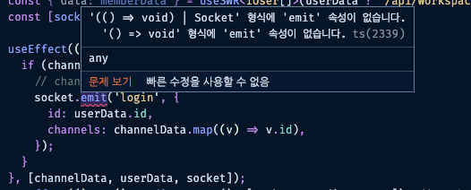
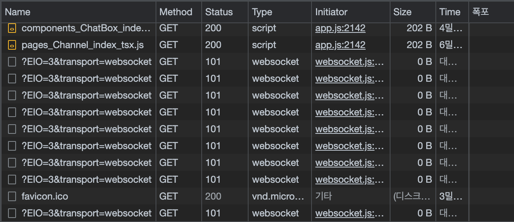
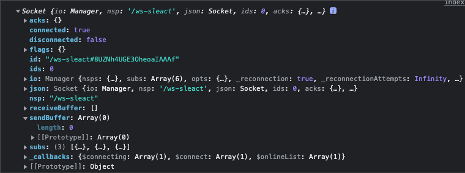
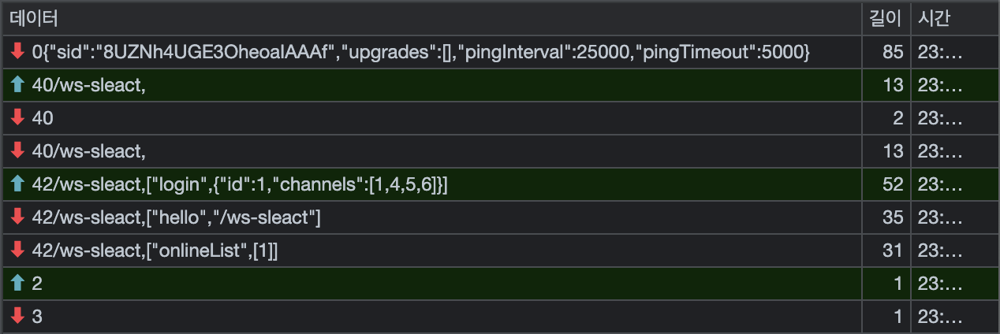

## socket.io 훅스 및 이벤트 연결

### WebSocket 사용하기

보통 서비스에서 제공되는 일반적인 기능의 대부분은 경우 프론트에서 어떤 기능을 실행 시켜 백에서 데이터를 받는 식의 단방향 흐름을 가진다.
하지만 웹소켓은 실시간으로 데이터를 주고받을 때 사용하는 것으로 데이터 흐름이 양방향인 것이 특징이다.

웹 소켓이 없었다면 프론트는 실시간 데이터를 받아오기 위해 주기적으로 요청(long-polling, 30초에 한번씩 확인)을 보내야 한다.
하지만 웹소켓이 나오면서 프론트와 서버 간에 한번만 연결을 맺어놓으면 양방향 데이터 교류가 가능하다. 먼저 라이브러리를 설치한다.

```bash
> npm i socket.io-client@2
> npm i -D @types/socket.io-client@1.4.35
```

socket.io는 사실 리액트와 socket.io은 그다지 어울리지 않는다. 더 정확히는 리액트의 컴포넌트 구조와 적합하지 않다.
이유는 socket.io은 한번 연결해두면 전역적인 특징을 띄기 때문에 하나의 컴포넌트에 연결했다가
다른 컴포넌트로 이동하면 연결이 끊어져버릴 수 있기 때문이다. 웹소켓의 경우 한번 연결을 해놓으면 끊어지지않고 유지되는 것이 특징이므로
어떤 컴포넌트에 종속되게 넣어버리면 해당 컴포넌트에서 이탈할 경우 연결이 끊어지므로 공통 컴포넌트에서 작업하는 것이 좋다.
예전에는 HOC를 써서 구현했지만 지금은 훅으로 구현한다.

`front/hooks/useSocket.ts`

```tsx
import io from "socket.io-client";
import { useCallback } from "react";
import axios from "axios";

// 타입스크립트는 빈 객체나 빈 배열은 타이핑을 해줘야 한다.
// [key: string] :: 어떤 키가 들어오든 문자열이기만 하면 된다.
const sockets: { [key: string]: SocketIOClient.Socket } = {}; // 1. sockets 객체 생성
const backUrl = "http://localhost:3095";

const useSocket = (workspace?: string) => {
  const disconnect = useCallback(() => {
    // 2. 연결이 되어있을 때에는 socket 연결을 끊는다.
    if (workspace) {
      sockets[workspace].disconnect();
      delete sockets[workspace];
    }
  }, [workspace]);

  if (!workspace) {
    return [undefined, disconnect];
  }

  sockets[workspace] = io.connect(`${backUrl}/ws-${workspace}`);

  return [sockets[workspace], disconnect];
};

export default useSocket;
```

1.  왜 `sockets` 객체를 왜 생성하는 것일까?
    슬랙의 경우 각 채널별, dm별 메시지 내용이 분리되어야 하므로 항상 맺고 끊는 것을 잘 해주어야 한다.
    A 채널의 내용이 B 채널로 가면 안되기 때문..! 따라서 특정 워크스페이스 단위로 웹소켓이 연결되도록 1과 같이 설정해준다.
    또한, `sockets`의 초기값이 빈 객체`{}` (혹은 빈 배열)일 떄는 반드시 타입을 지정해줘야 한다.
    `[key: string]` 은 워크스페이스가 어떤 이름인지 정의할 수 없으므로 문자열은 모두 key값으로 허용한다는 것을 의미한다.
2.  `disconnect` 함수에서는 A workspace에서 B workspace로 이동할 경우 기존의 연결을 끊는 코드를 `useCallback`을 통해 구현한다.

### socket.io 이벤트 연결하기

먼저 workspace에서 socket.io를 연결하는 코드를 useEffect를 통해 구현해본다.

`front/layouts/Workspace/index.tsx`

```tsx
const Workspace: VFC = () => {
  // ..
  const { data: userData, mutate: revalidateUser } = useSWR<IUser | false>('/api/users', fetcher });
  const { data: channelData } = useSWR<IChannel[]>(userData ? `/api/workspaces/${workspace}/channels` : null, fetcher);
  const { data: memberData } = useSWR<IUser[]>(userData ? `/api/workspaces/${workspace}/members` : null, fetcher);
  const [socket, disconnect] = useSocket(workspace);

  // 1. channelData와 userData, socket이 존재할 떄 socket.io로 연결한다.
  useEffect(() => {
    if (channelData && userData && socket) {
      socket.emit('login', {
        id: userData.id,
        channels: channelData.map((v) => v.id),
      });
    }
  }, [channelData, userData, socket]);

  // 2. workspace가 바뀌었을 때에는 disconnect 해준다.
  useEffect(() => () => disconnect(), [workspace, disconnect]);

  // ..

  return (
    <div>
      {/* .. */}
    </div>
  );
};

export default Workspace;
```

1.  해당 `useEffect`에서는 채널정보, 유저정보, `socket` 객체가 존재할 때 실제 웹소켓 연결이되도록 설정하는 코드가 담긴다.
    그런데 여기에서 emit 부분에 타입에러가 발생하는데 바로 리턴된 데이터에 emit 처리를 할 수 있는 속성이 없다는 메시지가 노출된다.
    

        이는 `socket` 객체가 실제 Socket 타입임을 알아차리지 못한 경우이므로 `useSocket`에서 리턴값에 대한 명확한 지정을 해주면 된다.

        `front/hooks/useSocket.ts`

        ```tsx
        // ..
        const useSocket = (workspace?: string): [SocketIOClient.Socket | undefined, () => void] => {
          // ..
          if (!workspace) {
            return [undefined, disconnect];
          }
        	// ..

          return [sockets[workspace], disconnect];
        };
        ```

2.  두번째 useEffect에서는 workspace가 변경되었을 때 기존 웹소켓 연결을 끊는 코드가 딤긴다.

### socket.io 연결에 따른 타인의 로그인 여부 받아오기

유저의 소켓 연결 정보를 DMList에 반영하는 것도 필요하다. (다른 사람이 로그인했을 때 dmlist 이름 우측에 불켜짐)
따라서 DMList 컴포넌트에서 socket 데이터를 가져와보자.

`front/components/DMList/index.tsx`

```tsx
// ..
import useSocket from "@hooks/useSocket";

const DMList = () => {
  // ..
  const [socket] = useSocket(workspace);

  useEffect(() => {
    // 1. 누가 온라인에 있는지
    socket?.on("onlineList", (data: number[]) => {
      setOnlineList(data);
    });
    // 2. 온라인 리스트 정리(clean-up),
    // off를 게을리 하면 이벤트리스너가 불필요하게 중복된다.
    return () => {
      socket?.off("onlineList");
    };
  }, [socket]);

  return <>{/* ... */}</>;
};

export default DMList;
```

위와 같이 설정 후 로그인을 하면 웹소켓 연결이 되는 것을 볼 수 있다. 그런데 문제는 한번만 연결되어야 할 웹소켓이 여러번 연결되는 현상이 발생한다.



### 웹소켓 설정 및 에러 개선

useSocket에서 웹소켓 연결이 여러번 시도되고 있는 것이므로 이런 경우 아래와 같이 개선해준다.

`front/hooks/useSocket.ts`

```tsx
const useSocket = (workspace?: string): [SocketIOClient.Socket | undefined, () => void] => {
  // ..
  // 1. 연결된 웹소켓이 있으면 그 정보를 return 없을 경우에만 connect 시도
  if (!sockets[workspace]) {
    sockets[workspace] = io.connect(`${backUrl}/ws-${workspace}`, {
      transports: ["websocket"], // 2. 초기 연결 시 polling(ie9) 제외하고 websocket만 사용하는 설정
    });
  }
  return [sockets[workspace], disconnect];
};

export default useSocket;
```

1. 1번과 같이 `socket[workspace]`가 없는 경우에만 `connect` 시도를 하도록 분기처리를 해주면 된다.
2. `transport` 설정은 초기 연결 시 웹소켓 객체가 지원되지 않는 브라우저(ie9)를 위한 사전 polling 작업이 진행되는 웹소켓 기본 설정을 하는 곳이다. 크롬 브라우저는 `websocket` 객체가 지원되므로 `websocket`만 바로 진행되도록 설정해주었다.

### socket.io 객체



1. connected, disconnected: 연결여부 확인
2. sendBuffer, receiveBuffer: 버퍼에 담긴 length가 길 경우 실제 전송되어야 할 데이터가 많음을 의미함
   (즉, 어딘가 문제가 있다는 것을 의미한다.) 또 socket.io는 일시적인 에러로 인해 연결이 되지 않을 경우 `sendBuffer`에 데이터를 담아두고 있다가 다시 연결이 되면 해당 정보를 서버에 보내준다. 반대로 서버에서 내보내줘야할 데이터도 `receiveBuffer` 에 담아뒀다가 보내준다.
3. callbacks: on했던 리스트들 들어있다. connect, connecting 은 기본, onlineList 등..
4. io: 연결에 대한 옵션들

### socket.io 메시지



`socket.io`가 정상적으로 연결되면 하나의 연결로 데이터를 메시지처럼 주고 받는다.
빨간 화살표가 서버로부터 전달받는 데이터, 초록색 화살표가 프론트가 서버로 전송하는 데이터를 의미한다.
login 정보를 `ws-sleact`에 전달하면 정상적으로 hello와 onlineList를 내려주는 것을 볼 수 있다.
(DMList 내 유저 이름 좌측 온라인 여부도 onlineList 정보로 처리. 테스트는 시크릿 창으로 해보자.)
