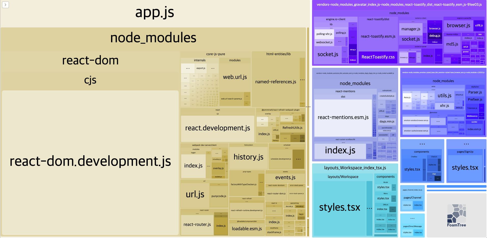
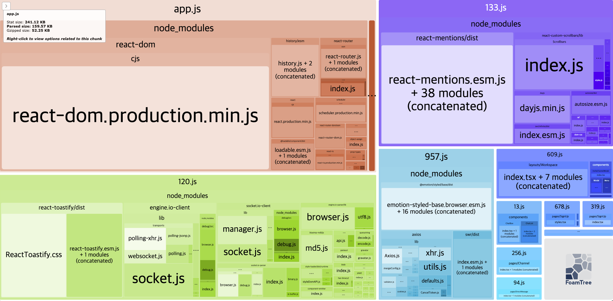

## 배포 준비하기

먼저 배포를 위해 webpack-bundle-analyzer를 설치한 뒤 webpack.config.ts에 주석을 해제해준다.

`front/webpack-bunlde-analyzer.ts`

```tsx
// ..
import { BundleAnalyzerPlugin } from "webpack-bundle-analyzer";

const config: Configuration = {
  // ..
};

// 개발 환경 플러그인
if (isDevelopment && config.plugins) {
  config.plugins.push(new webpack.HotModuleReplacementPlugin());
  config.plugins.push(new ReactRefreshWebpackPlugin());
  config.plugins.push(new BundleAnalyzerPlugin({ analyzerMode: "server", openAnalyzer: true }));
}
// 런타임 환경 플러그인
if (!isDevelopment && config.plugins) {
  config.plugins.push(new webpack.LoaderOptionsPlugin({ minimize: true })); // 구 플러그인 중 최적화되는 것들이 있어 추가
  config.plugins.push(new BundleAnalyzerPlugin({ analyzerMode: "static" })); // static 모드에서는 Html로 나온다.
}

export default config;
```

`front/package.json`

```json
{
  // ..
  "scripts": {
    "dev": "cross-env TS_NODE_PROJECT=\"tsconfig-for-webpack-config.json\" webpack serve --env development",
    // NODE_ENV=production 를 build 모드에 추가
    "build": "cross-env NODE_ENV=production TS_NODE_PROJECT=\"tsconfig-for-webpack-config.json\" webpack",
    "test": "echo \"Error: no test specified\" && exit 1"
  }
  // ..
}
```

위와 같이 BundleAnalyzerPlugin 코드를 주석 해제하고, NODE_ENV를 production 모드로 설정한 뒤 개발서버나 빌드를 돌리면 새 창에 번들링된 소스들의 크기가 UI로 구현되는 페이지가 생성된다.





실제 배포모드에서 동작한 `BundleAnalyzer`를 보면 훨씬 크기가 줄어있는 것을 볼 수 있음. 웹팩이 번들링되면서 배포모드일 경우 알아서 최적화해주는 것들이 많다. 위 `react-menions.esm.js`가 상대적으로 크기가 커보인다. 이럴 경우 구글에 'react-menions tree-shaking' 등으로 검색하여 나뭇가지의 잎들을 최대한 떨궈내준다. 보통 300KB ~ 500KB 정도로 빌드 파일을 유지해주는 것이 좋다.

빌드를 통해 웹팩으로 번들링된 소스들이 `front/dist` 폴더에 담기면 해당 파일과 `index.html`을 백엔드 개발자에게 전달해주거나 내부 배포 프로세스로 변경 파일들을 서빙해주면 된다 : )
