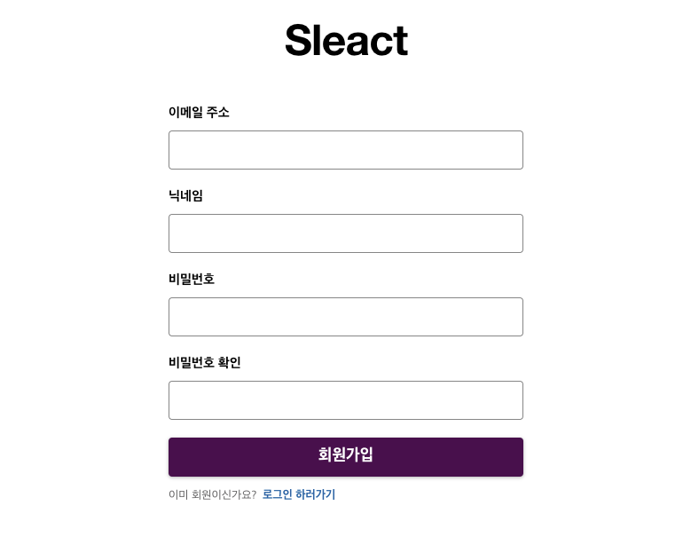

## 코드 스플리팅과 이모션 설정

### 코드 스플리팅

유저에게 빠르게 서비스를 제공하기 위해서는 코드를 적절히 나누는 것이 필요한데, 이를 code splitting이라고 한다. 예를 들어 서비스 규모가 커져서 동작해야하는 화면이 100여 개가 넘어간다고 했을 때 해당 코드를 한번에 불러오면 화면 로드까지의 시간이 오래걸릴 것이고, 이는 사용자 경험에 좋지 않다. 따라서 필요한 화면에서 필요한 코드를 불러오도록 코드 스플리팅을 적용해보도록 하자. (실무에서 이미 사용하고 있지만 이참에 한번 더 짚고 넘어가본다) 코드 스플리팅을 하는 기준은 페이지별로(pages/\*) 나눠도 좋고, SSR이 필요없는 것들(텍스트 에디터 등)을 나눠놓으면 서버의 용량을 아낄 수 있다.

```bash
$ npm i @loadable/component
$ npm i --save-dev @types/loadable__component
```

위와 같이 코드 스플리팅을 처리할 라이브러리인 `@loadable/component`를 설치한 뒤 `App.tsx`에서 적용해주면 알아서 코드를 분리하여 가져오게 된다.

### 이모션

이번 프로젝트에서는 `styled-component`, `emotion` 등 CSSinJS 방식을 사용한다. css 파일을 사용하지않고 자바스크립트로 스타일을 적용하는 방법이다. emotion을 설정이 비교적 간단하므로 프로젝트에 적용하기 수월하여 선택한 부분도 있는 것 같다.

```bash
$ npm i @emotion/react @emotion/styled
```

설치 후 각 페이지에 필요한 컴포넌트는 `pages` 하위에 생성해놓은 `styles.tsx`에 emotion을 적용하여 추가해준다.

`pages/SignUp/styles.tsx`

```tsx
import styled from "@emotion/styled";

export const Header = styled.header`
  text-align: center;
  font-family: Slack-Larsseit, Helvetica Neue, Helvetica, Segoe UI, Tahoma, Arial, sans-serif;
  font-weight: 700;
  font-size: 48px;
  line-height: 46px;
  letter-spacing: -0.75px;
  margin-top: 50px;
  margin-bottom: 50px;
`;

export const Form = styled.form`
  margin: 0 auto;
  width: 400px;
  max-width: 400px;
`;

export const Label = styled.label`
  margin-bottom: 16px;
  & > span {
    display: block;
    text-align: left;
    padding-bottom: 8px;
    font-size: 15px;
    cursor: pointer;
    line-height: 1.46666667;
    font-weight: 700;
  }
`;

export const Input = styled.input`
  border-radius: 4px;
  --saf-0: rgba(var(--sk_foreground_high_solid, 134, 134, 134), 1);
  border: 1px solid var(--saf-0);
  transition: border 80ms ease-out, box-shadow 80ms ease-out;
  box-sizing: border-box;
  margin: 0 0 20px;
  width: 100%;
  color: rgba(var(--sk_primary_foreground, 29, 28, 29), 1);
  background-color: rgba(var(--sk_primary_background, 255, 255, 255), 1);
  padding: 12px;
  height: 44px;
  padding-top: 11px;
  padding-bottom: 13px;
  font-size: 18px;
  line-height: 1.33333333;
  &:focus {
    --saf-0: rgba(var(--sk_highlight, 18, 100, 163), 1);
    box-shadow: 0 0 0 1px var(--saf-0), 0 0 0 5px rgba(29, 155, 209, 0.3);
  }
`;

export const Button = styled.button`
  margin-bottom: 12px;
  width: 100%;
  max-width: 100%;
  color: #fff;
  background-color: #4a154b;
  border: none;
  font-size: 18px;
  font-weight: 900;
  height: 44px;
  min-width: 96px;
  padding: 0 16px 3px;
  transition: all 80ms linear;
  user-select: none;
  outline: none;
  cursor: pointer;
  border-radius: 4px;
  box-shadow: 0 1px 4px rgba(0, 0, 0, 0.3);
  &:hover {
    background-color: rgba(74, 21, 75, 0.9);
    border: none;
  }
  &:focus {
    --saf-0: rgba(var(--sk_highlight, 18, 100, 163), 1);
    box-shadow: 0 0 0 1px var(--saf-0), 0 0 0 5px rgba(29, 155, 209, 0.3);
  }
`;

export const Error = styled.div`
  color: #e01e5a;
  margin: 8px 0 16px;
  font-weight: bold;
`;

export const Success = styled.div`
  color: #2eb67d;
  font-weight: bold;
`;

export const LinkContainer = styled.p`
  font-size: 13px;
  color: #616061;
  margin: 0 auto 8px;
  width: 400px;
  max-width: 400px;
  & a {
    color: #1264a3;
    text-decoration: none;
    font-weight: 700;
    &:hover {
      text-decoration: underline;
    }
  }
`;
```

만들어놓은 스타일 코드를 페이지에 아래와 같이 적용시킨다. (내용을 볼 필요는 없고, 적용되는 것만 데브서버로 확인하면 될 듯)

`pages/signUp/index.tsx`

```tsx
import React, { useState, useCallback } from "react";
import { Header, Form, Label, Input, Error, Button, LinkContainer } from "./styles";

const SignUp = () => {
  const [email] = useState("");
  const [nickname] = useState("");
  const [password] = useState("");
  const [passwordCheck] = useState("");

  const onChangeEmail = useCallback(() => {}, []);
  const onChangeNickname = useCallback(() => {}, []);
  const onChangePassword = useCallback(() => {}, []);
  const onChangePasswordCheck = useCallback(() => {}, []);
  const onSubmit = useCallback(() => {}, []);

  return (
    <div id="container">
      <Header>Sleact</Header>
      <Form onSubmit={onSubmit}>
        <Label id="email-label">
          <span>이메일 주소</span>
          <div>
            <Input type="email" id="email" name="email" value={email} onChange={onChangeEmail} />
          </div>
        </Label>
        <Label id="nickname-label">
          <span>닉네임</span>
          <div>
            <Input type="text" id="nickname" name="nickname" value={nickname} onChange={onChangeNickname} />
          </div>
        </Label>
        <Label id="password-label">
          <span>비밀번호</span>
          <div>
            <Input type="password" id="password" name="password" value={password} onChange={onChangePassword} />
          </div>
        </Label>
        <Label id="password-check-label">
          <span>비밀번호 확인</span>
          <div>
            <Input
              type="password"
              id="password-check"
              name="password-check"
              value={passwordCheck}
              onChange={onChangePasswordCheck}
            />
          </div>
          {/* {mismatchError && <Error>비밀번호가 일치하지 않습니다.</Error>}
          {!nickname && <Error>닉네임을 입력해주세요.</Error>}
          {signUpError && <Error>이미 가입된 이메일입니다.</Error>}
          {signUpSuccess && <Error>회원가입되었습니다! 로그인해주세요.</Error>} */}
        </Label>
        <Button type="submit">회원가입</Button>
      </Form>
      <LinkContainer>
        이미 회원이신가요? &nbsp;
        <a href="/login">로그인 하러가기</a>
      </LinkContainer>
    </div>
  );
};

export default SignUp;
```

데브서버 실행 후 localhost:3090/signup으로 진입하면 회원가입 페이지가 예쁘게 만들어져있는 것을 확인할 수 있다.



### emotion 추가설정

emotion은 아래와 같이 스타일 컴포넌트를 변수처럼 응용할 수도 있다.

```tsx
export const Form = styled.form`
  margin: 0 auto;
  width: 400px;
  max-width: 400px;
  & ${Label} {
    //...
  }
`;

export const Label = styled.label`
  // ...
`;
```

위 Form 컴포넌트에서 Label 컴포넌트 스타일을 하위 자식요소에 부여할 때 변수처럼 사용할 수 있는 것이다.
이것은 그냥 할 수 있는 것이 아니고 `@emotion/babel-plugin` 패키지 설치가 필요하다.

이 패키지를 사용하면 변수처럼 사용(components as selectors)할 수 있는 것 뿐만 아니라 파일 압축(MInification), 미사용 코드 삭제(Dead Code Elimination), 소스맵 생성(Source Maps), 클래스명 생성(Contextual Class Names)등이 가능하다.

```bash
$ npm i @emotion/babel-plugin
```

설치가 완료되면 해당 설정을 webpack 에 추가해준다.

`front/webpack.config.ts`

```tsx
const config: Configuration = {
  // ..
  module: {
    rules: [
      {
        // ...
        options: {
          // ...
          env: {
            development: {
              plugins: [["@emtion", { sourceMap: true }], require.resolve("react-refresh/babel")],
            },
            production: {
              plugins: ["@emotion"],
            },
          },
        },
        // ..
      },
      // ...
    ],
    // ..
  },
};
```
