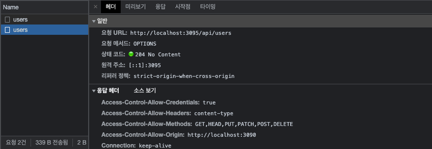
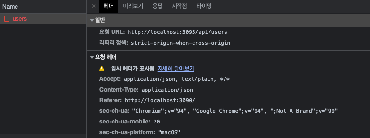
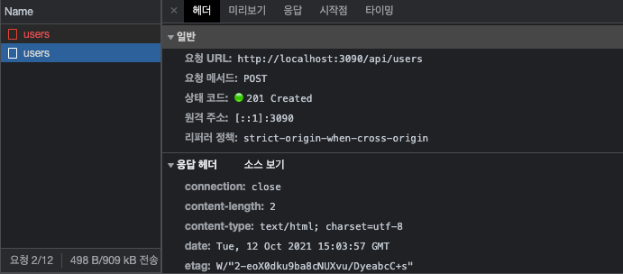

## Axios request와 CORS, Proxy 설정

기존 프로젝트에서는 상태관리를 리덕스를 사용해 관리해왔지만 이번 프로젝트에서는 리덕스를 사용하지 않는다.
보통 리덕스는 전체적인 상태를 관리하고, 비동기 요청이 있을 때 thunk, saga와 같은 미들웨어를 붙여 요청을 처리했다. 비동기 로직과 컴포넌트가 분리된다는 점에서 장점도 있지만 굳이 비동기로직을 컴포넌트에서 분리할 필요가 없을 경우도 많기 때문에 (특정 페이지에서만 쓰이는 비동기 요청) 이런 경우에는 직접 컴포넌트에서 비동기 처리를 해주면 코드를 더욱 간결하게 유지할 수 있다. (리덕스의 긴 코드를 줄일 수 있다)

먼저 비동기 요청을 위해 axios를 설치해준다.

```bash
$ npm i axios
```

`front/pages/SignUp/index.tsx`

```tsx
const SignUp = () => {
	// ..

  const onSubmit = useCallback(
    (e) => {
      e.preventDefault();
      if (!mismatchError && nickname) {
				// 회원가입 POST Request
        axios
          .post('http://localhost:3095/api/users', {
            email,
            nickname,
            password,
          })
          .then((response) => {
            console.log(response);
          })
          .catch((err) => {
            console.log(err.response);
          })
          .finally(() => {});
      }
    },
    [email, nickname, password, mismatchError],
  );

  return (
    // ..
  );
};

export default SignUp;
```

위와 같이 axios로 처리 후 로컬에서 회원가입을 동작시키면 정상적으로 회원가입이 되는 것을 확인할 수 있다. (비밀번호 같은 것이 개발자 도구에 노출되는 것은 https만 적용되면 괜찮음. 단 콘솔창에는 노출되지 않도록하자)



그런데 성공하고보니 users라는 API를 두번 실행시키는 것을 확인할 수 있다. (요청 메서드 OPTIONS) 이는 요청 포트가 다르면 요청을 한번씩 더 보내는 브라우저의 특징 때문이다. 원래는 포트가 다르면 CORS 에러가 나야 정상이지만, 지금은 CORS 에러는 나지않고 요청만 한번 더 보내는 상태이다.

이유는 백엔드 쪽에서 코드로 CORS를 허용해주고 있기 때문. 해당 부분을 주석 후 다시 회원가입을 해보자

`back/app.js`

```jsx
// ..

if (prod) {
  // ..
} else {
  app.use(morgan("dev"));
  // cors 설정 주석처리!
  /* app.use(
    cors({
      origin: true,
      credentials: true,
    })
  ); */
}
//..
```

그러면 기존에 동작하던 회원가입 request가 CORS 에러로 막히는 것을 확인할 수 있다.



이 CORS를 해결하는 방법은 위처럼 백엔드에서 CORS를 허용해주는 방법과 프론트에서 `devServer`의 `Proxy` 설정을 이용해 해결하는 방법이 있다.

### 데브서버에서 프록시 설정하기

프론트에서 Proxy 설정을 해보자.

`front/webpack.config.ts`

```tsx
const config: Configuration = {
  // ...
  devServer: {
    historyApiFallback: true,
    port: 3090,
    devMiddleware: { publicPath: "/dist/" },
    static: { directory: path.resolve(__dirname) },
    proxy: {
      "/api/": {
        target: "http://localhost:3095", // localhost:3095가 요청을 보낸 것처럼 설정
        changeOrigin: true,
        ws: true,
      },
    },
  },
};

// ...
```

위와 같이 프록시 설정 후 axios 요청을 아래와 같이 바꿔준다.

`front/pages/SignUp/index.tsx`

```tsx
const SignUp = () => {
  // ..

  const onSubmit = useCallback(
    (e) => {
      e.preventDefault();
      if (!mismatchError && nickname) {
        // /api/ 로 target 설정이 되었으므로 삭제
        axios
          .post("/api/users", {
            email,
            nickname,
            password,
          })
          .then((response) => {
            console.log(response);
          })
          .catch((err) => {
            console.log(err.response);
          })
          .finally(() => {});
      }
    },
    [email, nickname, password, mismatchError]
  );
  // ..
};

export default SignUp;
```

위와 같이 설정 후 프론트 서버를 재구동 시켜주면 아래와 같이 정상 처리되는 것을 확인할 수 있다.



게다가 프록시 설정을 이용하면 API request가 OPTIONS로 두 번 요청하는 것도 없어진다.
단 프록시로 활용할 수 있는 건 [localhost](http://localhost) 간의 요청만 속임수 처리가 가능하다. 만약 API 서버가 별도로 있는 경우 localhost에서 요청해도 CORS 에러가 발생함. 이때에는 백엔드에서 처리해주어야한다. 참고하자

### 회원가입 페이지 요청에 따른 상태 변경하기

이제 axios request에 따른 가이드 메시지 등 상태 처리를 추가해주면 된다.

`front/pages/SignUp/index.tsx`

```tsx
import React, { useState, useCallback } from "react";
import useInput from "@hooks/useInput"; // hook import
import axios from "axios";
import { Header, Form, Label, Input, Error, Button, LinkContainer, Success } from "./styles";

const SignUp = () => {
  // 1. 성공/실패 데이터 관련 useState 추가
  const [signUpError, setSignUpError] = useState("");
  const [signUpSuccess, setSignUpSuccess] = useState(false);

  // ..

  const onSubmit = useCallback(
    (e) => {
      e.preventDefault();
      if (!mismatchError && nickname) {
        // 2. 비동기 요청 안에서 state 변경 코드가 들어갈 경우
        //    코드 시작 전에 초기화 코드를 넣어주는 것이 좋다.
        setSignUpError("");
        setSignUpSuccess(false);
        axios
          .post("/api/users", {
            email,
            nickname,
            password,
          })
          .then((response) => {
            setSignUpSuccess(true); // 3. 성공
          })
          .catch((err) => {
            setSignUpError(err.response.data); // 3. 실패
          })
          .finally(() => {});
      }
    },
    [email, nickname, password, mismatchError]
  );

  return (
    <div id="container">
      <Header>Sleact</Header>
      <Form onSubmit={onSubmit}>
        {/* codes.. */}
        <Label id="password-check-label">
          <span>비밀번호 확인</span>
          <div>
            <Input
              type="password"
              id="password-check"
              name="password-check"
              value={passwordCheck}
              onChange={onChangePasswordCheck}
            />
          </div>
          {mismatchError && <Error>비밀번호가 일치하지 않습니다.</Error>}
          {!nickname && <Error>닉네임을 입력해주세요.</Error>}
          {/* 4. HTML update */}
          {signUpError && <Error>{signUpError}</Error>}
          {signUpSuccess && <Success>환영합니다! 이제 로그인해주세요.</Success>}
        </Label>
        <Button type="submit">회원가입</Button>
      </Form>
      {/* codes.. */}
    </div>
  );
};

export default SignUp;
```
