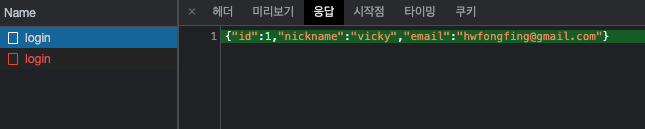

## 로그인 페이지와 swr 적용, 쿠키 공유

### 로그인 페이지 만들기

`front/pages/login/index.tsx`

```tsx
import React, { useState, useCallback } from "react";
import { Link } from "react-router-dom";
import axios from "axios";
import useInput from "@hooks/useInput";
import { Form, Error, Label, Input, LinkContainer, Button, Header } from "@pages/SignUp/styles";

const LogIn = () => {
  const [logInError, setLogInError] = useState(false);
  const [email, onChangeEmail] = useInput("");
  const [password, onChangePassword] = useInput("");

  const onSubmit = useCallback(
    (e) => {
      e.preventDefault();
      setLogInError(false);
      axios
        .post("/api/users/login", { email, password })
        .then((response) => {})
        .catch((error) => {
          setLogInError(error.response?.data?.statusCode === 401);
        });
    },
    [email, password]
  );

  // console.log(error, userData);
  // if (!error && userData) {
  //   console.log('로그인됨', userData);
  //   return <Redirect to="/workspace/sleact/channel/일반" />;
  // }

  return (
    <div id="container">
      <Header>Sleact</Header>
      <Form onSubmit={onSubmit}>
        <Label id="email-label">
          <span>이메일 주소</span>
          <div>
            <Input type="email" id="email" name="email" value={email} onChange={onChangeEmail} />
          </div>
        </Label>
        <Label id="password-label">
          <span>비밀번호</span>
          <div>
            <Input type="password" id="password" name="password" value={password} onChange={onChangePassword} />
          </div>
          {logInError && <Error>이메일과 비밀번호 조합이 일치하지 않습니다.</Error>}
        </Label>
        <Button type="submit">로그인</Button>
      </Form>
      <LinkContainer>
        아직 회원이 아니신가요?&nbsp;
        <Link to="/signup">회원가입 하러가기</Link>
      </LinkContainer>
    </div>
  );
};

export default LogIn;
```

위와 같이 로그인 페이지 생성 후 로그인을 실행해주면 정상적으로 로그인이 수행된다.



이후 같은 아이디로 로그인할 경우 이미 로그인되어 401 Unauthorized 에러가 발생하는데, 이때 로그인을 풀기 위해서는 백엔드 서버를 껐다 키거나 개발자도구 Application 탭에서 세션쿠키(express passport에서는 `connect.sid`)를 삭제해주면 로그인이 풀린다.


이처럼 로그아웃 원리는 곧 세션 쿠키를 삭제하면 되는 것이라고 보면 된다.
