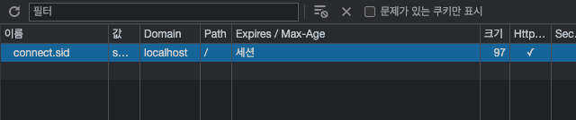
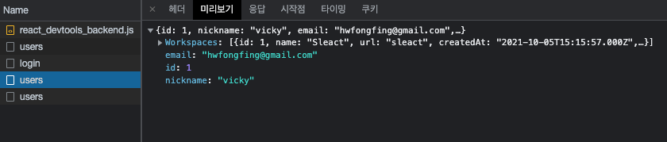

## 로그인 페이지와 swr 적용, 쿠키 공유

### 로그인 페이지 만들기

`front/pages/login/index.tsx`

```tsx
import React, { useState, useCallback } from "react";
import { Link } from "react-router-dom";
import axios from "axios";
import useInput from "@hooks/useInput";
import { Form, Error, Label, Input, LinkContainer, Button, Header } from "@pages/SignUp/styles";

const LogIn = () => {
  const [logInError, setLogInError] = useState(false);
  const [email, onChangeEmail] = useInput("");
  const [password, onChangePassword] = useInput("");

  const onSubmit = useCallback(
    (e) => {
      e.preventDefault();
      setLogInError(false);
      axios
        .post("/api/users/login", { email, password })
        .then((response) => {})
        .catch((error) => {
          setLogInError(error.response?.data?.statusCode === 401);
        });
    },
    [email, password]
  );

  // console.log(error, userData);
  // if (!error && userData) {
  //   console.log('로그인됨', userData);
  //   return <Redirect to="/workspace/sleact/channel/일반" />;
  // }

  return (
    <div id="container">
      <Header>Sleact</Header>
      <Form onSubmit={onSubmit}>
        <Label id="email-label">
          <span>이메일 주소</span>
          <div>
            <Input type="email" id="email" name="email" value={email} onChange={onChangeEmail} />
          </div>
        </Label>
        <Label id="password-label">
          <span>비밀번호</span>
          <div>
            <Input type="password" id="password" name="password" value={password} onChange={onChangePassword} />
          </div>
          {logInError && <Error>이메일과 비밀번호 조합이 일치하지 않습니다.</Error>}
        </Label>
        <Button type="submit">로그인</Button>
      </Form>
      <LinkContainer>
        아직 회원이 아니신가요?&nbsp;
        <Link to="/signup">회원가입 하러가기</Link>
      </LinkContainer>
    </div>
  );
};

export default LogIn;
```

위와 같이 로그인 페이지 생성 후 로그인을 실행해주면 정상적으로 로그인이 수행된다.


이후 같은 아이디로 로그인할 경우 이미 로그인되어 401 Unauthorized 에러가 발생하는데, 이때 로그인을 풀기 위해서는 백엔드 서버를 껐다 키거나 개발자도구 Application 탭에서 세션쿠키(express passport에서는 `connect.sid`)를 삭제해주면 로그인이 풀린다.



이처럼 로그아웃 원리는 곧 세션 쿠키를 삭제하면 되는 것이라고 보면 된다.

### swr 사용하기

로그인이 완료되면 로그인 된 정보는 전역에서 필요하다. 왜 전역에서 필요한가?
예를 들어 로그인 된 정보가 있는 상태이면 회원가입 페이지와 로그인 페이지를 보여줄 필요가 없다.
이를 체크하기 위한 정보는 전역에 저장되어 있어야 하는 것이다.

보통 이러한 전역 데이터, 전역 상태는 Redux를 통해 관리해왔으나 대안이 없는 것은 아니다.
전역 상태를 관리하기 위한 대안으로 swr이나 context API들이 있음.
이번 프로젝트에서는 swr로 상태 관리를 해본다. 이제 swr이 어떻게 전역 상태를 관리할 수 있는지 알아보자!

보통 swr은 GET request에 대해 데이터를 저장하여 관리한다.(물론 post, delete 등을 못하는 것은 아님)
그렇다면 POST request에서는 어떻게 데이터를 관리할 수 있을까? 여러 방법이 있겠지만 가장 간단한 방법으로는,
POST request를 할 경우 성공했을 떄 GET request를 쳐서 상태를 저장하는 방식으로 구현할 수 있다.

```bash
> npm i swr
```

먼저 컴포넌트에 swr로 GET 요청을 하는 예시는 아래와 같다.

`front/pages/Login/index.tsx`

```tsx
import useSWR from "swr";

const SignUp = () => {
  // 로그인 후 유저정보(/users/) GET request, fetcher에서 주소를 어떻게 처리할지 작성한다.
  // data가 없는 상태일 때를 로딩 중이라고 판단하면 된다.
  const { data, error } = useSWR("https://localhost:3095/api/users", fetcher);

  return <div id="container">{/* codes... */}</div>;
};

export default SignUp;
```

위와 같이 `useSWR` 함수 안에 요청 주소와 `fetcher` 함수를 작성하는데,
`fetcher` 안에서 첫번째 인자로 적은 url을 어떻게 처리할지 상세하게 작성해주면 된다. `fetcher` 함수를 유틸 함수로 만들어보자

`front/utils/fetcher.ts`

```tsx
import axios from "axios";

const fetcher = (url: string) => axios.get(url).then((response) => response.data); // response.data가 useSWR의 data가 된다.

export default fetcher;
```

위와 같이 `fetcher` 함수 구현 후 서버를 재구동하여 로그인 페이지를 진입하면 아래와 같이 /users 로 GET 요청이
동작 후 로그인 되지 않은 상태이므로 `response.data`로 false를 반환한다는 것을 확인할 수 있다.
(swr은 탭 간 이동 혹은 정해진 타임에 의해 지속적으로 재요청을 진행한다.)


그럼 로그인을 한 뒤 /users 요청을 하면 로그인 정보가 담겨있어야 할 것 같다.
하지만 이후에도 같은 false 값이 반환되는 것을 확인할 수 있다. 왜일까?


axios가 GET을 요청한 뒤에도, 프론트 서버 주소와 백엔드 서버 주소가 다르므로 로그인 쿠키가 전달되지 않는다.
백엔드에서 프론트로 쿠키를 생성할 수도 없고, 프론트에서 쿠키를 전달할 수도 없다.
이를 가능하게 하기 위해서는 axios 요청 시 `{ withCredentials: true }` 옵션을 넣어주어야 한다.

`front/utils/fetcher.ts`

```tsx
const fetcher = (url: string) =>
  axios
    .get(url, {
      withCredentials: true,
    })
    .then((response) => response.data);
```

`front/pages/Login/index.tsx`

```tsx
const LogIn = () => {
  const { data, error } = useSWR('http://localhost:3095/api/users', fetcher);
  // ..

  const onSubmit = useCallback(
    (e) => {
      e.preventDefault();
      setLogInError(false);
			// withCredentials 옵션 추가
      axios
        .post('/api/users/login', { email, password }, { withCredentials: true })
        .then((response) => {})
        .catch((error) => {
          setLogInError(error.response?.data?.statusCode === 401);
        });
    },
    [email, password],
  );

  return (
    // ..
  );
};

export default LogIn;
```

이후 요청을 재실행하면 도메인 간 쿠키 공유가 가능해졌으므로 정상적으로 유저정보를 가져오는 것을 확인할 수 있다.
(쿠키는 백엔드에서 생성해서 프론트엔드 브라우저가 기억하도록 만들어준다. 프론트엔드에서는 한번 기억한 쿠키를 매 요청마다 백엔드로 보내주는 역할을 한다.)


### swr 설정 살펴보기

swr은 자동으로 일정시간이 지나면 데이터를 fetching 해오는 기능이 있다는 것을 위에서 확인했다.
그렇다면 계속 API를 요청하는 것은 성능상 좋지 않은 것이 아닐까 ? 이를 컨트롤 할 수 있다.

여기에서 컨트롤이란 1) 원하는 시점에 data fetching을 처리하는 것 2) 빈번한 API 요청으로 인해 서버에 부하를 일으키지 않도록 주기적으로 data fetching을 하지 않도록 하는 것이다.

`front/pages/Login/index.tsx`

```tsx
const LogIn = () => {
  const { data, error, mutate } = useSWR("/api/users", fetcher, {
    dedupingInterval: 100000,
  }); // 2. dedupingInterval으로 주기적 호출 간격을 길게 설정: 기간 내에는 캐시에서 불러옴
  // ..

  const onSubmit = useCallback(
    (e) => {
      e.preventDefault();
      setLogInError(false);
      axios
        .post("/api/users/login", { email, password }, { withCredentials: true })
        .then((response) => {
          mutate(); // 1) 원하는 시점에 data-fetching: 로그인 성공 시 revalidate
        })
        .catch((error) => {
          setLogInError(error.response?.data?.statusCode === 401);
        });
    },
    [email, password]
  );

  return <div id="container">{/* ... */}</div>;
};

export default LogIn;
```

위와 같이 로그인이 완료된 시점에 mutate 함수를 동작 시켜 원하는 시점에 data-fetching 하도록 설정하고, useSWR 동작시 option 객체에 `dedupingInterval` 을 100000(default는 2000, 2초)로 설정한다. 이후 후 실제 로그인을 수행하면 아래와 같이 완료된 시점에 users 요청을 정확하게 다시 요청하는 것을 확인할 수 있다.



이처럼 swr 옵션은 제한과 관련된 다양한 옵션기능들을 제공한다. 원래 직접 구현하려면 힘든 것들을 옵션으로 제공하는 것이다.

- `dedupingInterval`: 재요청 시간, 기본 2초
- `focusThrottleInterval`: revalidate를 다시하는 시간을 설정, 기본 5초
- `errorRetryInterval`: API request error가 발생했을 때 다시 요청, 기본 5초
- `loadingTimeout`: API request가 3초가 넘어가면, 로딩이 오래걸린다는 메시지를 제공해서 사용자 경험을 개선할 수 있음
- `errorRetryCount`: 서버에 재요청을 보낼 때, 자주 보내지 않고 일정 횟수가 지나면 요청하지 않도록 처리
- revalidateOnFocus: 다른 탭 갔다가 돌아왔을 때 `re-fetching` 처리
