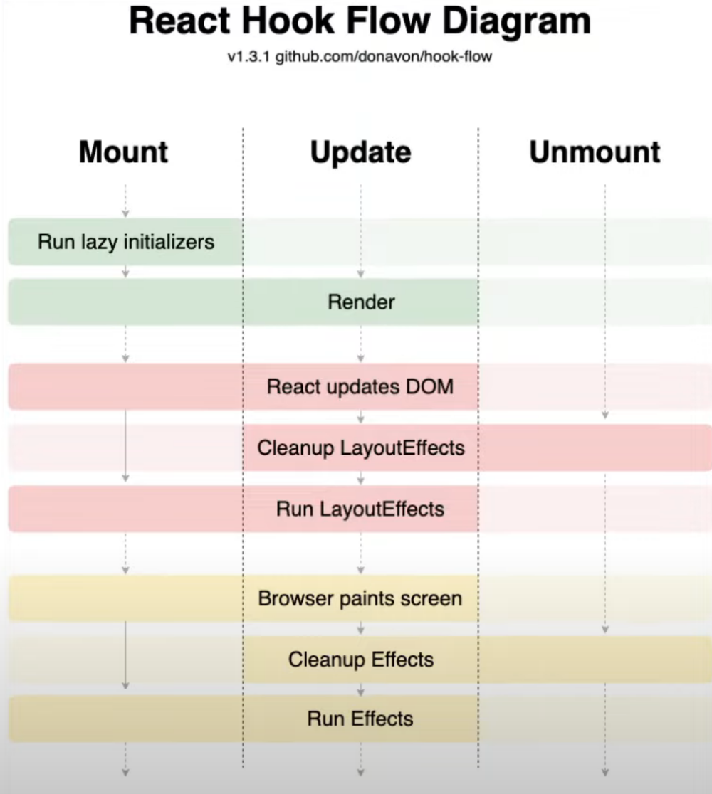
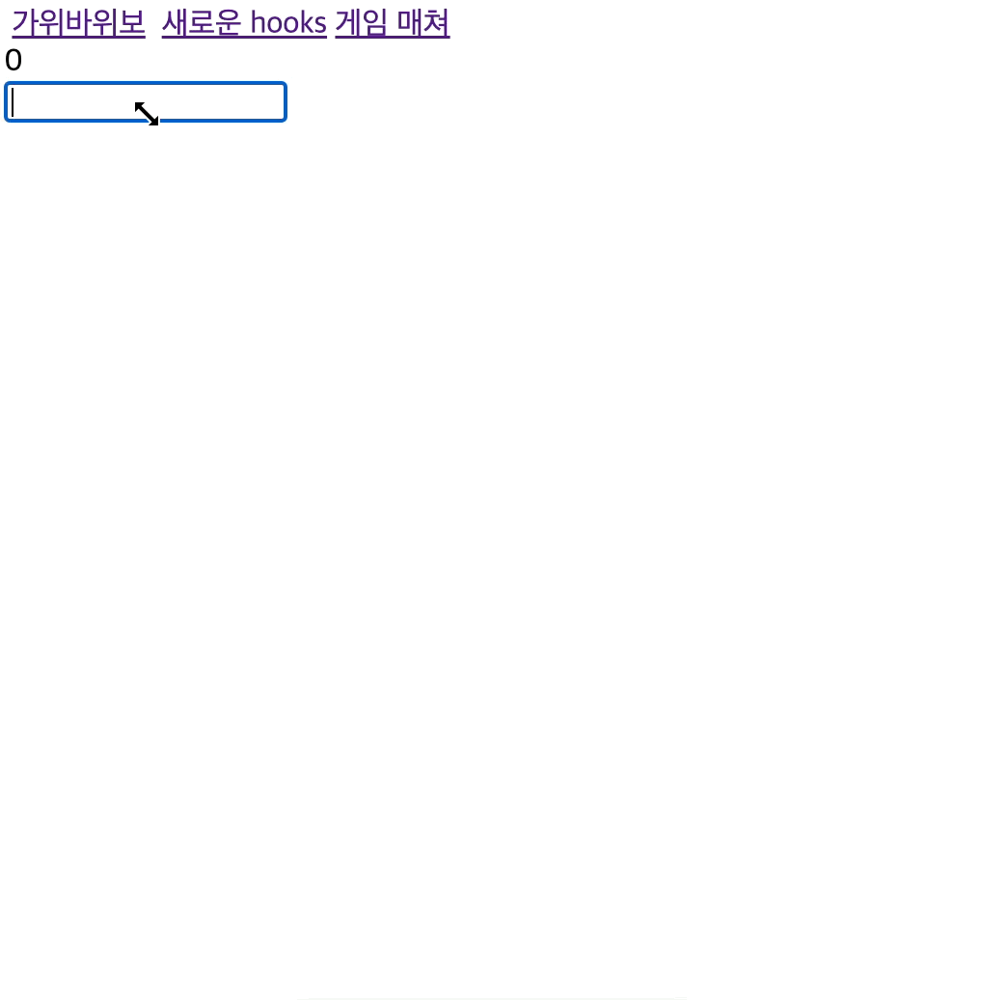

## useLayoutEffect, useTransition, useDeferredValue

React 18버전에 추가된 hook을 살펴본다. (useLayoutEffect 는 이전에 추가)



### useLayoutEffect

아래와 같이 name을 상태로 전달받아 뿌려주는 코드가 있다고 하자.

```jsx
import React, { memo, useEffect, useState } from "react";

const Hooks = memo(() => {
  const [name, setName] = useState("");

  useEffect(() => {
    setName("vicky");
  }, []);

  console.log("render", name);

  return (
    <div>
      <div>안녕하세요. {name} 입니다.</div>
      <div>안녕하세요. {name} 입니다.</div>
      <div>안녕하세요. {name} 입니다.</div>
      <div>안녕하세요. {name} 입니다.</div>
      <div>안녕하세요. {name} 입니다.</div>
      <div>안녕하세요. {name} 입니다.</div>
      <div>안녕하세요. {name} 입니다.</div>
    </div>
  );
});

export default Hooks;
```

이는 브라우저의 반응 속도와 데이터 fetch 후 렌더링 되는 과정으로 인해 name이 뿅 나타나게 된다.
(slow3G 일 때 더욱 확실히 보여짐) 이때 useLayoutEffect를 사용할 수 있다.

useLayoutEffect는 화면 렌더링 이전에 실행된다.

```jsx
const Hooks = memo(() => {
  const [name, setName] = useState("");

  useLayoutEffect(() => {
    setName("vicky");
  }, []);

  return (
    ...
  );
});

export default Hooks;
```

위와 같이 useEffect 말고 useLayoutEffect를 사용해주면 화면이 렌더링 되기 전에 값을 바꿔주므로 값이 바뀌는 현상을 개선할 수 있다.

### useTransition

검색창을 상상해보자. 만약 input에 특정 키워드를 넣어 1000 개의 데이터를 화면에 뿌려줘야한다면 해당 데이터를 모두 그리는데 렌더링 호출이 다량 발생할 것이다. (20개씩 데이터를 잘라 그려줄 수 없다고 가정)

```jsx
import React, { useCallback, useState, useEffect } from "react";

export default function App() {
  const [count, setCount] = useState(0);
  const [name, setName] = useState("");
  const [result, setResult] = useState("");

  const onChange = useCallback((e) => {
    setName(e.target.value); // 바로 업데이트
    setResult(e.target.value + "의 결과"); // 나중에 업데이트
  }, []);

  useEffect(() => {
    const id = setInterval(() => {
      setCount((prev) => prev + 1);
    }, 1000);

    return () => {
      clearIntervale(id);
    };
  }, []);

  console.log("render", name);

  return (
    <div className="App">
      <div>{count}</div>
      <input value={name} onChange={onChange} />

      {name
        ? Array(1000)
            .fill()
            .map((v, i) => <div key={i}>{result}</div>)
        : null}
    </div>
  );
}
```

이때 사용할 수 있는 것이 useTransition이다. useTransition은 바로 업데이트 되어야 할 것과 나중에 업데이트 되어야 할 것을 구분해준다. 위와 같은 경우 input창은 바로바로 입력 데이터를 보여줘야하므로 바로 업데이트 되어야 한다. 단, 결과 리스트는 데이터를 가져와야하므로 나중에 업데이트 되어야 할 것이다.

```jsx
import React, { useCallback, useState, useEffect, useTransition } from "react";

export default function App() {
  // ..
  const [loading, startTransition] = useTransition();

  const onChange = useCallback((e) => {
    setName(e.target.value); // 바로 업데이트
    startTransition(() => {
      setResult(e.target.value + "의 결과");
    });
  }, []);

  // ..

  return (
    <div className="App">
      {loading ? <div>로딩중....</div> : null}
      {/* ... */}
    </div>
  );
}
```

loading에 따른 ui 분기도 쉽게 구현할 수 있다. 또한 setResult를 startTransition 으로 감싸주면 데이터가 나중에 들어오는 것들은 뒤로 미뤄 렌더링 해준다. 단, 모든 걸 무분별하게 startTransition으로 감싸는 건 좋지않다.

```jsx
export default function App() {
  // ..
  const [loading, startTransition] = useTransition();

  const onChange = useCallback((e) => {
    startTransition(() => {
      setName(e.target.value); // input 내 입력되는 값도 useTransition 내부로 이동
      setResult(e.target.value + "의 결과");
    });
  }, []);

  // ..

  return <div className="App">{/* ... */}</div>;
}
```



input 렌더링도 늦게 시작되므로 데이터 업데이트가 `비키비키비키`가 아닌 `ㅂㅣㅋㅣㅂㅣㅋㅣㅂㅣㅋㅣ` 가 되어버림
따라서 즉각적으로 반영해야할 데이터와 나중에 업데이트 할 데이터를 잘 나눠서 성능 문제를 개선하는 것이 바람직하다.

### useDeferredValue

위 hook은 `useTransition`을 간단하게 쓸 수 있는 개념인 것 같다. hook 네이밍 그대로 지연되어 들어오는 값이라는 정의가 있기 때문에 해당 hook에 감싸준 값은 화면 렌더링 순서에서 뒤로 밀리게 된다.

`useTransition`과 비슷한 개념, loading 처리를 해야할 경우에는 `useTransition`을 사용하고 값 지연에 다른 렌더링 최적화만 하면 될 경우 `useDeferredValue`를 쓴다.

```
import React, { useCallback, useState, useEffect, useDeferredValue, useMemo } from "react";

export default function App() {
  const [count, setCount] = useState(0);
  const [name, setName] = useState("");
  const deferredName = useDeferredValue(name); // 값 반영을 뒤로 미룬다.
  const result = useMemo(() => deferredName + "의 결과", [deferredName]); // 보통 useMemo와 같이 쓴다.

  const onChange = useCallback((e) => {
    setName(e.target.value);
  }, []);

  // ..

  console.log("render", deferredName);

  return (
    <div className="App">
      <input value={name} onChange={onChange} />

      {deferredName
        ? Array(1000)
            .fill()
            .map((v, i) => <div key={i}>{result}</div>)
        : null}
    </div>
  );
}
```
