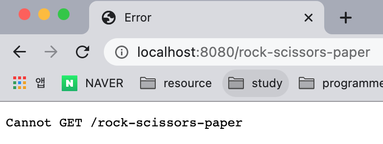

# React-router

앞서 배운 React webgame은 순수 React를 가지고 프로그래밍 방법을 배워보는데 집중했다. 오늘은 이러한 컴포넌트들이 웹에서 어떻게 동작하는지에 대해 간단히 배워본다.

## 9-1. React Router 도입하기

먼저 프로젝트에 react-router, react-router-dom 패키지 설치하자.
react-router는 웹 뿐만 아니라 앱 환경에서도 사용할 수 있다.
앱 환경에서는 react-router-dom → react-router-app을 설치해주면 된다.

```bash
$ npm i react-router react-router-dom
```

실제로 `react-router-dom`만 사용하며 그 뼈대인 `react-router`는 `react-router-dom`에서 사용한다.

react-router-dom이 설치되었다면, 실제 Router를 설정해보자.

```bash
import React from "react";
import { BrowserRouter } from "react-router-dom";
import Lotto from "./src/lotto/Lotto";
import RSP from "./src/rock-paper-scissors/RSP";
import NumberBaseball from "./src/number-baseball/NumberBaseball";

const Games = () => {
  return (
    <BrowserRouter>
      <div>
        <Route path="/number-baseball" component={NumberBaseball} />
        <Route path="/rock-scissors-paper" component={RSP} />
        <Route path="/lotto-generator" component={Lotto} />
      </div>
    </BrowserRouter>
  );
};

export default Games;
```

위와 같이 각 컴포넌트를 BrowserRouter tag로 감싸주어야 한다. 혹은 위와 같은 방법이 싫다면 `ReactDom.render` 메서드에 넣어줘도 된다.

```jsx
// client.jsx

ReactDom.render(
  <BrowserRouter>
    <App />
  </BrowserRouter>,
  document.querySelector("#root")
);
```

## 9-2. Link와 BrowserRouter

React는 실제 여러 페이지인 것처럼 보이는 하나의 페이지이다. 따라서 `react-router-dom` 에서 페이지 간의 이동은 a 태그를 사용하는 것이 아닌 `react-router-dom`에서 제공하는 Link 메서드를 사용한다.

```jsx
import React from "react";
import { BrowserRouter, HashRouter, Route, Link } from "react-router-dom";
import Lotto from "./src/lotto/Lotto";
import RSP from "./src/rock-paper-scissors/RSP";
import NumberBaseball from "./src/number-baseball/NumberBaseball";

const Games = () => {
  return (
    <BrowserRouter>
      <Link to="/number-baseball">숫자야구</Link>&nbsp;
      <Link to="/rock-scissors-paper">가위바위보</Link>&nbsp;
      <Link to="/lotto-generator">로또추첨기</Link>&nbsp;
      <div>
        <Route path="/number-baseball" component={NumberBaseball} />
        <Route path="/rock-scissors-paper" component={RSP} />
        <Route path="/lotto-generator" component={Lotto} />
      </div>
    </BrowserRouter>
  );
};

export default Games;
```



만약 위 설정을 dev로 실행한 뒤 실제 페이지 주소에 path를 넣어치면 위와 같은 에러 메시지가 나온다.
왜그럴까? 그 이유는 서버에서는 저 페이지에 대한 정보를 알 수 없기 때문이다.

각 페이지 라우팅에 대한 정보는 오직 client.jsx만이 각 페이지에 대한 정보를 알고 있으므로 위처럼 바로 주소로 유입시 에러가 발생한다. 이러한 설정을 서버에서 맞춰줘야하는데, 그렇게 하기 전 dev환경에서 해당 에러를 보고싶지 않다면 webpack.config 설정 내 devServer에서 historyApiFallback 옵션을 활성화 해주면 개선된다.

## 9-3. HashRouter, params, withRouter

BrowserRouter와 비슷한 기능으로 HashRouter가 있다. 이번에는 HashRouter로 라우팅 구현을 해보자

```jsx
const Games = () => {
  return <HashRouter>{/* Link, Router... */}</HashRouter>;
};

export default Games;
```

위처럼 설정 후 dev를 실행시키면 path에 #이 붙어있다. [`http://localhost:8080/#/number-baseball`](http://localhost:8080/#/number-baseball)
해시라우터를 붙이면 위에서 설명한 서버에서 페이지를 알 수 없다는 오류를 방지할 수 있다.  
서버가 해시(#) 뒷 부분에 대해 인식하지 못하기 때문이다. (서버는 모르지만 Client는 안다.)

이러한 특징은 검색엔진, SEO들의 정보수집 동작 시에 문제가 된다.  
보통 검색엔진이나 SEO는 데이터를 브라우저에 물어보지 않고, 서버에 물어보기 때문이다.  
만약 해시(#)가 있는 상태로 검색엔진 등이 정보를 Request하면 서버는 데이터를 모르기 때문에 정보를 주지못하고 이는 데이터 노출에 영향을 주게 된다.

위와 같은 이유로 실무에서 HashRouter를 잘 쓰지 않는 편이며. (물론 브라우저라우터를 사용해도 SEO를 위해 따로 셋팅이 필요하긴 하다) 보통 주소값이 중요하지않고, 데이터 수집의 필요성이 없는 페이지의 경우 HashRouter를 많이 쓴다.

- HashRouter가 디플로이할 때 편하다?

위와 같이 페이지 라우팅을 처리하다보면 페이지가 50-100개씩 늘어난다. 이러한 라우팅을 줄일 수 있는 방법으로 Dynamic page matching을 사용하는 방법이 있다. 확인을 위해 GameMatcher.jsx를 생성한다.

```jsx
// Games.jsx
const Games = () => {
  return (
    <BrowserRouter>
      {/* :name은 param이 들어가는 부분이고, 데이터가 동적 다이나믹 매칭된다. */}
      <Route path="/game/:name" component={GameMatcher} />
    </BrowserRouter>
  );
};
```

```jsx
// GameMatcher.jsx
import React, { Component } from "react";

class GameMatcher extends Component {
  render() {
    console.log(this.props); // { history: { ... }, location: { ... }, match: { ... } .. }
    return <div>{/* router .. */}</div>;
  }
}

export default GameMatcher;
```

위 Games 컴포넌트에서 Route 컴포넌트에 `:name` 이라는 메서드를 사용하면 해당 부분에는 param이 동적으로 삽입되어 해당 페이지에 맞는 데이터가 다이나믹 매칭되는 방식이다. 실제 해당 영역 컴포넌트를 이루는 GameMatcher 컴포넌트에서 this.props로 속성 정보를 콘솔에 찍어보면 history, location, match 정보가 노출되는데 이는 상위 Route 컴포넌트가 this.props에 해당 주소값을 내려주는 것이다.

- history: 페이지 이동에 대한 내역을 간직하는 영역으로 앞으로가기, 뒤로가기 등을 프로그래밍으로 호출할 수 있다. 실제 리액트는 페이지가 바뀌는 눈속임을 하는 것이기 때문에 페이지 이동에 대한 API가 필요하다.
- match: 주소에 대한 정보를 가진 영역으로 param의 정보 등이 포함되어 있다. params: { name: "RSP" } match 정보로 동적 주소 라우팅할 때 페이지 분기처리를 해준다.
- location: pathname, search, hash 등의 정보가 객체로 들어있다.

만약 별도의 라우팅이 설정되지 않은 페이지에서 history, location, match 정보가 필요한 경우에는 어떻게 하면 좋을까? 바로 react-router-dom에서 제공하는 withRouter를 HOC 함수로 감싸주면 된다.

```jsx
import React, { Component } from "react";
import { withRouter } from "react-router-dom";

class Test extends Component {
  render() {
    console.log(this.props); // { history: { ... }, location: { ... }, match: { ... } .. }
    return <div>{/* router .. */}</div>;
  }
}

export default withRouter(Test);
```

## 9-4. location, match, history

위와 같이 설정 후 GameMatcher 컴포넌트에서 브라우저 라우팅 설정을 해보자.

```jsx
import React, { Component } from "react";

import Lotto from "./src/lotto/Lotto";
import RSP from "./src/rock-paper-scissors/RSP";
import NumberBaseball from "./src/number-baseball/NumberBaseball";

class GameMatcher extends Component {
  render() {
    const { name } = this.props.match.params;
    if (name === "number-baseball") {
      return <NumberBaseball />;
    } else if (name === "rock-scissors-paper") {
      return <RSP />;
    } else if (name === "lotto-generator") {
      return <Lotto />;
    }

    return <div>일치하는 게임이 없습니다!</div>;
  }
}

export default GameMatcher;
```

위와 같이 페이지 분기처리를 해주면, param에 담긴 정보로 각 해당하는 컴포넌트로 이동하게 된다. 코드상에서 직접 페이지 이동을 일으켜야 할 경우 우리는 Router에서 제공하는 history.push(path); 함수를 사용하게 되는데 이는 브라우저에서 제공하는 history.pushState('', '', ''); 를 활용한 API이다. 리액트에서 제공하는 api가 브라우저 메서드와 연관되어 있는 것에 대해 상호 의존성을 알아두어야 개발 시 다양한 상황에서 대처가 가능하니 유의하자.

## 9-5. 쿼리스트링과 URLSearchParams

쿼리스트링에 대해 알아보자. 쿼리스트링은 URL뒤에 물음표(`?`) 뒤에 붙는 key=value 형식의 데이터이다. 주소에 데이터를 전달하는 가장 간단한 방법으로 서버도 알아듣는다. 각 데이터의 구분은 `&`로 한다.

해당 데이터가 주소에 포함되었다면 이 정보는 어떻게 사용할까? 바로 URLSearchParams 객체를 활용한다.

```jsx
// 만약 현재 주소가 아래와 같다면
// <Link to="/game/number-baseball?query=100&hello=vicky&bye=react">숫자야구</Link>

const urlSearchParams = new URLSearchParams(this.props.location.search.slice(1));
urlSearchParams.get("hello"); // vicky
urlSearchParams.get("query"); // 100
urlSearchParams.get("bye"); // react
```

위와 같이 `URLSearchParams` 메서드를 사용하여 프로퍼티를 get해와서 사용할 수 있다.

## 9-6. render props, switch, exact

그렇다면 Games 컴포넌트에서 GamesMatcher 컴포넌트로 props를 상속해줄 수 있을까? 가능하다.

- component 동작 시 props를 내려주는 방법

```jsx
<Route path="/game/:name" component={() => <GameMatcher props="1234" />} />
```

- render 메서드로 props를 내려주는 방법 ⭐️ (많이 쓴당)

```jsx
<Route path="/game/:name" render={(props) => <GameMatcher {...props} />} />
```

또한 라우팅 설정에 따라 컴포넌트가 두 개가 나오는 경우가 있다. 그때에는 Switch나 exact 메서드를 사용하면 좋다. 우선 Switch 메서드를 사용하면 첫 번째 매치되는 컴포넌트만 렌더링이 된다! 아래 코드를 보자

```jsx
import React from "react";
import { BrowserRouter, HashRouter, Route, Link, Switch } from "react-router-dom";
import GameMatcher from "./GameMatcher";

const Games = () => {
  return (
    <BrowserRouter>
      <div>
        <Switch>
          <Route path="/game/:name" component={GameMatcher} />
          <Route path="/game/number-baseball" render={(props) => <GameMatcher {...props} />} />
          <Route path="/game/number-baseball" render={(props) => <GameMatcher {...props} />} />
          <Route path="/game/number-baseball" render={(props) => <GameMatcher {...props} />} />
          <Route path="/game/number-baseball" render={(props) => <GameMatcher {...props} />} />
          <Route path="/game/number-baseball" render={(props) => <GameMatcher {...props} />} />
        </Switch>
      </div>
    </BrowserRouter>
  );
};

export default Games;
```

이렇게 되면 GameMatcher만 실행될 것이다. 그러나 switch 메서드를 사용할 경우 상위 - 하위 주소 간의 계층이 존재할 경우 유의해야한다. 아래 exact 메서드 사용 예시를 보면서 이해해보자.

다른 방법으로 exact 메서드를 사용한다. 만약 아래와 같이 라우팅 설정이 되어있다고 한다면 GameMatcher 컴포넌트는 각 주소에서 두번씩 렌더링 될 것이다. `path="/"` 의 Route 컴포넌트가 / 뒤에 path가 붙어도 일치하는 컴포넌트라고 인식하기 때문이다. 이는 switch 처리를 해주어도 개선이 되지 않는다. 실제 `/game/:name`에서도 `/`가 일치한다고 판단하기 때문이다.

```jsx
import React from "react";
import { BrowserRouter, Link, Route } from "react-router-dom";
import GameMatcher from "./GameMatcher";

const Games = () => {
  return (
    <BrowserRouter>
      <div>
        <Route path="/" render={(props) => <GameMatcher {...props} />} />
        <Route path="/game/:name" render={(props) => <GameMatcher {...props} />} />
      </div>
    </BrowserRouter>
  );
};

export default Games;
```

때문에 아래와 같이 exact 메서드를 사용해서 라우팅 처리를 하면 정확히 일치하는 경우에만 컴포넌트를 실행시킬 수 있다.

```jsx
import React from "react";
import { BrowserRouter, Link, Route } from "react-router-dom";
import GameMatcher from "./GameMatcher";

const Games = () => {
  return (
    <BrowserRouter>
      <div>
        {/* exact 프로퍼티를 사용하면 path="/" 정확히 일치하는 경우에만 실행시킨다! */}
        <Route exact path="/" render={(props) => <GameMatcher {...props} />} />
        <Route path="/game/:name" render={(props) => <GameMatcher {...props} />} />
      </div>
    </BrowserRouter>
  );
};

export default Games;
```
