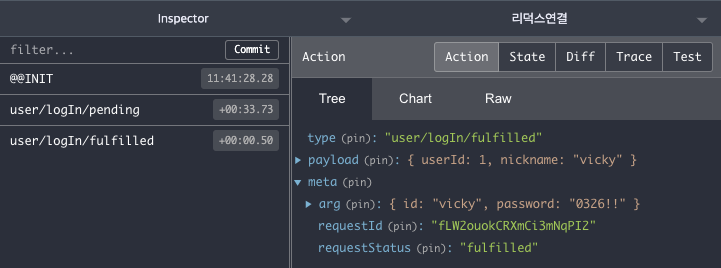
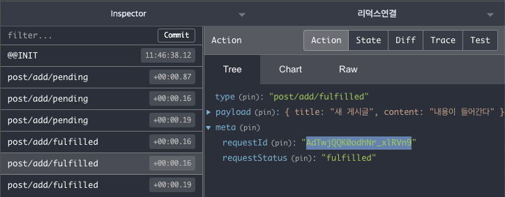
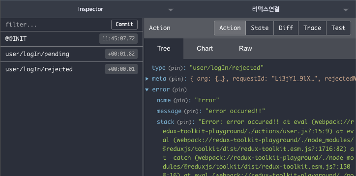

# redux-toolkit

redux-toolkit은 redux에서 자주쓰는 기능을 모아둔 라이브러리이다. 매우 유용해서 요즘 많이 쓰이고 있음
redux-**toolkit에는** thunk, immer, createAction도 모두 내장되어 있다. 따라서 코드량이 확 줄어든다! 🤩

## 툴킷을 선택한 이유

요즘에는 redux-saga → thunk + redux-toolkit을 조합하는 것으로 많이 전환하는 추세인 것 같다. saga에서 제공하는 다양한 이펙트들이 있으나, 주로 사용하는 기능은 takeLatest, takeEvery 정도이고, debounce나 throttle의 경우 lodash와 thunk와의 조합으로 충분히 구현해낼 수 있으므로 굳이 saga를 적용하지 않게되는 것이다. 또 제너레이터 문법에 익숙하지 않은 동료들과의 협업하는 관점에서도 고민되는 부분이 있는 것 같다.

위와 같은 이유로 지금까지 만들어왔던 react-redux 프로젝트를 Redux-toolkit으로 바꿔서 적용해보자.

먼저 툴킷을 이용하면 store 부터 굉장히 가벼워진다. 위에 적었다시피 toolkit이 이미 thunk나 immer들을 내장함수로 가지고 있기 때문이다. 따라서 기존 store의 코드에 redux-toolkit을 적용하면 아래와 같다.

```jsx
const { configureStore, getDefaultMiddleware } = require("@reduxjs/toolkit");

const reducer = require("./reducers");

const firstMiddleware = (store) => (dispatch) => (action) => {
  console.log("로깅:", action);
  dispatch(action);
};

const store = configureStore({
  reducer,
  middleware: [firstMiddleware, ...getDefaultMiddleware], // getDefaultMiddleware 기본 미들웨어 추가
  devTools: process.env.NODE_ENV !== "production",
  // enhancer
  // preloadedState, // SSR용 설정
});

module.exports = store;
```

## createAsyncThunk로 비동기 처리하기

기존의 action도 action과 actionCreator를 분리하여 생성하던 이전 과정과는 달리 `createAsyncThunk`를 사용해서 간단하게 구현할 수 있다. redux-toolkit에서는 **action에 대한 정의를 비동기 액션, 혹은 외부적 액션에 대한 것만** 적어주면된다. (동기액션, 곧 컴포넌트 내부의 액션은 리듀서에서 정의하면 자동 생성된다)

`actions/user.js`

```jsx
const { createAsyncThunk } = require("@reduxjs/toolkit");

const logIn = createAsyncThunk("user/logIn", async (data, thunkAPI) => {
  return await delay(500, { userId: 1, nickname: "vicky" });
});

module.exports = { logIn };
```

`actions/post.js`

```jsx
const { createAsyncThunk } = require("@reduxjs/toolkit");

const addPost = createAsyncThunk("post/add", async (data, thunkAPI) => {
  return await delay(500, { title: "새 게시글", content: "내용이 들어간다" });
});

module.exports = { addPost };
```

createAsyncThunk 메서드 안에 첫번째 인자로 `user/login`, `post/add`등의 경로를 적어주는데 위와 같이 적어주면, 리듀서에서 정의한 pending - fulfilled - rejected라는 메서드가 뒤에 붙어 redux-devtools에서 데이터 변경 트래킹이 가능해진다.

## 새롭게 등장한 slice

`reducers/index.js`

reducer도 굉장히 가벼워지는데, userReducer, postReducer 대신 userSlice, postSlice를 사용한다.

```jsx
const { combineReducers } = require("redux");
const userSlice = require("./user");
const postSlice = require("./post");

module.exports = combineReducers({
  user: userSlice.reducer,
  posts: postSlice.reducer,
});
```

먼저 user 리듀서를 구현해보면 아래와 같다.

`reducers/user.js`

```jsx
const { createSlice } = require("@reduxjs/toolkit");
const { logIn } = require("../actions/user");

const initialState = {
  isLoggingIn: false,
  data: null,
};

const userSlice = createSlice({
  name: "user",
  initialState,
  reducers: {
    // 동기적 액션, 내부적 액션, userSlice.actions.logOut()으로 액션이 자동 생성됨
    logOut(state, action) {
      state.data = null;
    },
  },
  extraReducers: {
    // 비동기 액션, 외부적 액션 (pending, fulfilled, rejected로 사용)
    // user/logIn/pending
    [logIn.pending](state, action) {
      state.isLoggingIn = true;
    },
    // user/logIn/fulfilled
    [logIn.fulfilled](state, action) {
      state.data = action.payload;
      state.isLoggingIn = false;
    },
    // user/login/rejected
    [logIn.rejected](state, action) {
      state.data = null;
      state.isLoggingIn = false;
    },
  },
});

module.exports = userSlice;
```

userSlice에 `createSlice`라는 툴킷 메서드로 리듀서를 작성해준다. 여기서 중요한 것은 `reducers`와 `extraReducers`라는 두 가지 인자를 넣을 수 있는데, 보통 컴포넌트 내에서 처리할 수 있는 내부적 동기액션의 경우 `reducers` 작성해주고, 나머지 컴포넌트 내에서 처리할 수 없는 외부적 비동기 액션의 경우 `extraReducers`에 작성해준다. state 자체가 이미 immer가 적용된 상태로 내려오므로 바로 값을 바꿔주면된다.

이렇게 하면 동기 액션의 경우 `userSlice.actions.logOut()`으로 액션이 자동으로 생성되어 컴포넌트에서 사용할 수 있고, 비동기의 경우 `pending`-`fulfilled`-`rejected`의 3단계로 분리되어 데이터 업데이트를 담당한다.

`reducers/post.js`

```jsx
const { createSlice } = require("@reduxjs/toolkit");
const { addPost } = require("../actions/post");

const initialState = {
  data: [],
};

const postSlice = createSlice({
  name: "post",
  initialState,
  reducers: {
    clearPost(state, action) {
      state.data = [];
    },
  },
  extraReducers: {
    [addPost.pending](state, action) {
      state = 12;
      return state; //1. 불변성 유지를 위한 state값 반환
    },
    [addPost.fulfilled](state, action) {
      state.data.push(action.payload);
    },
    [addPost.rejected](state, action) {},
  },
});
module.exports = postSlice;
```

리듀서 작성 시 state 자체가 이미 immer가 적용되어 값을 바로 바꿔줘도 된다고 했지만, state의 값을 전체 변경할 경우 불변성 유지를 위해 state를 반드시 return 해줘야하는 것도 잊지말자 ㅎ

extraReducer를 사용하는 방법 중에 builder 메서드를 쓰는 방법도 있다. 아래의 예시를 보자

```jsx
const { createSlice } = require("@reduxjs/toolkit");
const { addPost } = require("../actions/post");

const initialState = {
  data: [],
};

const postSlice = createSlice({
  name: "post",
  initialState,
  reducers: {},
  extraReducers: (builder) =>
    builder
      .addCase(addPost.pending, (state, action) => {})
      .addCase(addPost.fulfilled, (state, action) => {
        state.data.push(action.payload);
      })
      .addCase(addPost.rejected, (state, action) => {})
      .addMatcher(
        // 공통으로 처리할 때 addMatcher로 처리한다.
        (action) => {
          return action.type.includes("/pending");
        },
        (state, action) => {
          state.isLoading = true;
        }
      )
      .addDefaultCase((state, action) => {
        // default 정의
      }),
});
module.exports = postSlice;
```

기존 postSlice를 builder로 사용하는 방식으로 바꿔보면 위와 같다. addCase로 비동기 처리에 대한 액션을 정의하고, 그 내부에 state,action 인자를 받아와서 데이터를 업데이트 해준다.

builder 메서드 안에는 `addMatcher`와 `addDefaultCase`라는 메서드도 존재하는데, `addMatcher`는 action.type에 따라 공통으로 처리할 때 사용한다. 예를들어 pending 상태일 때 isLoading 값을 true로 주는 등의 코드가 이에 해당한다.

addDefaultCase는 switch문에서 default를 의미한다. 해당하는 케이스가 없을 경우 최종적으로 처리될 default를 이 안에서 정의하면 된다.

## 액션 구조 살펴보기

위와같이 변경한 action과 reducer로 App.js를 구동해보자.

`App.js`

```jsx
import React, { useCallback } from "react";
import { useDispatch, useSelector } from "react-redux";
const { logIn } = require("./actions/user");
const { addPost } = require("./actions/post");
const userSlice = require("./reducers/user");

const App = () => {
  const user = useSelector((state) => state.user);
  const dispatch = useDispatch();

  const onClick = useCallback(() => dispatch(logIn({ id: "vicky", password: "0326!!" })), []);
  const onLogout = useCallback(() => dispatch(userSlice.actions.logOut()), []);
  const onAddPost = useCallback(() => dispatch(addPost()), []);

  return (
    <div>
      {user.isLoggingIn ? <div>로그인 중입니다.</div> : user.data ? <div>{user.data.nickname}</div> : "로그인 해주세요"}
      {!user.data ? <button onClick={onClick}>로그인</button> : <button onClick={onLogout}>로그아웃</button>}
      <button onClick={onAddPost}>게시글 작성</button>
    </div>
  );
};

export default App;
```

1. 동기 액션으로 생성한 logOut의 경우 userSlice.actions.logOut()으로 구동되는 것을 확인할 수 있다.
2. 그 밖의 비동기 액션은 action에서 생성한 createAsyncThunk 함수를 동작시켜준다.



로그인 동작 시 user/logIn/pending, user/logIn/fulfilled로 type이 들어오는 것을 확인할 수 있다.

먼저 요청이 성공하면 action.payload에 값이 담겨 반환된다. 또 요청에 대한 정보는 `action.meta` 내에 arg 데이터로 들어오고, 해당 요청에 대한 `requestId`가 중복되지 않은 키로 생성되는데, 여기에서 `requestId`의 경우 액션의 고유값으로, 같은 액션에 pending-fulfilled-rejected에 동일한 고유값을 가지고 있다. 따라서 동일한 액션이 여러번 실행되어도 액션에 따른 결과값을 분리해서 확인할 수 있는것이다. 아래의 이미지를 보면 이해가 더 쉽다.



위와 같이 각 액션에 대한 처리를 requestId로 구별하면 중간의 어떤 액션을 추가하거나 하는 것들을 별도로 분리하여 개발할 수 있으므로 효과적이다.

또, 에러가 발생하면 error라는 인자로 넘어오고 그 안에 에러 정보가 담긴 데이터가 함께 넘어온다.



## Redux를 쓰지 말아야 할 때(input)

redux는 항상 써야하는 건 아니다. 리덕스 자체의 코드량이 있기 때문에 잘못 사용하면 불필요하게 복잡해짐

예를 들어 form에서 redux를 쓰는 경우가 그러하다. 만약 어떤 폼의 input value에 대한 onChange 이벤트를 redux에 저장시킨다고 가정하자.

`App.js`

```jsx
import React, { useCallback } from "react";
import { useDispatch, useSelector } from "react-redux";
const userSlice = require("./reducers/user");

const App = () => {
  const dispatch = useDispatch();
  const { email, password } = useSelector((state) => state.user);

  const onChangeEmail = useCallback((e) => {
    dispatch(userSlice.action.setEmail(e.target.value));
  }, []);
  const onChangePassword = useCallback((e) => {
    dispatch(userSlice.action.setPassword(e.target.value));
  }, []);

  return (
    <div>
      <form>
        <input type="email" value={email} onChange={onChangeEmail} />
        <input type="password" vlaue={password} onChange={onChangePassword} />
      </form>
    </div>
  );
};

export default App;
```

`reducers/user.js`

```jsx
const initialState = {
  isLoggingIn: false,
  data: null,
  email: "",
  password: "",
};

const userSlice = createSlice({
  name: "user",
  initialState,
  reducers: {
    // setEmail 정의
    setEmail(state, action) {
      state.email = action.payload;
    },
    // setPassword 정의
    setPassword(state, action) {
      state.password = action.payload;
    },
  },
  extraReducers: {
    // settings...
  },
});

module.exports = userSlice;
```

위와 같이 구현했을 경우 데이터가 변경될 때마다 리덕스에 로깅이 되버림. 디버깅을 할 때에도 불필요하게 피곤해질 수 있다. 뿐만 아니라 데이터가 변경될 때마다 state가 달라지므로 컴포넌트의 불필요한 리렌더링이 발생하는 점도 문제가 있다. (물론 useState를 사용해도 리렌더링이 발생하긴 한다.) 따라서 이런 경우에는 onChange 의 경우 useState 등으로 처리하고, form submit 이벤트(혹은 onBlur)에 한번에 실행되도록 해주는 것이 좋다. 아래와 같이!

`App.js`

```jsx
import React, { useCallback, useState } from "react";
import { useDispatch, useSelector } from "react-redux";
const userSlice = require("./reducers/user");

const App = () => {
  const dispatch = useDispatch();
  const [email, setEmail] = useState("");
  const [password, setPassword] = useState("");

  // 3. useSelector 명시적 호출
  const isLoggingIn = useSelector((state) => state.user.isLoggingIn);
  const data = useSelector((state) => state.user.data);

  // 1. useState를 통한 데이터 임시 저장
  const onChangeEmail = useCallback((e) => setEmail(e.target.value), []);
  const onChangePassword = useCallback((e) => setPassword(e.target.value), []);

  // 2. onSubmit으로 action dispatch
  const onSubmit = useCallback(
    (e) => {
      e.preventDefault();
      dispatch(
        userSlice.actions.setLoginForm({
          email,
          password,
        })
      );
    },
    [dispatch, email, password]
  );

  return (
    <div>
      <form onSubmit={onSubmit}>
        <input type="email" value={email} onChange={onChangeEmail} />
        <input type="password" value={password} onChange={onChangePassword} />
      </form>
    </div>
  );
};

export default App;
```

1. email, password input의 onChange 이벤트는 useState로 받아 저장해주었다
2. 데이터가 모두 완료되었을 때 최종적으로 onSubmit 이벤트로 dispatch 이벤트를 실행해주면, 입력할 때마다 리덕스가 실행되는 것을 막을 수 있다.
3. 또한 기존에 useSelector를 user에서 불러와 사용하던 것에서 변경하여 직접 필요한 데이터를 명시적으로 호출하도록 변경하였다. 이유는 state가 변경될 때마다 컴포넌트가 리렌더링되기 때문이다. 만약 user에 다른 정보들이 더 있을 경우 다른 데이터의 변경에 의해 App컴포넌트의 불필요한 리렌더링이 발생할 수 있으므로 필요한 데이터가 변경되었을 때만 컴포넌트를 다시 그리도록 변경해주는 것이다.

   개발을 하면서 자주 사용하는 전개연산자 방식이 그리 좋은 방식은 아니다. 얼만큼 코드를 적절한 길이로 배치할 것인지, 리렌더링의 수준을 어느정도까지 허용할 것인지를 개발하면서 판단하여 적절한 코드를 작성해나가는 것이 중요한 것 같다.

이와 별개로 최적화에 대한 노력은 개발을 완료한 뒤에 진행해도 늦지 않다. 최적화에 목매지 말자..!

## 리덕스를 쓰지 말아야 할 때(비동기)

특정 컴포넌트에만 사용되어지고, 다른 컴포넌트에 전혀 영향을 미치지 않는 비동기 액션의 경우에도 별도로 리덕스로 액션을 정의하지 않고 컴포넌트 자체에서 axios 등으로 처리해주는 것이 좋다. 다른 컴포넌트와의 관계가 발생할 때에만 리덕스를 사용하는 것이 좋음

`App.js`

```jsx
import React, { useCallback, useState } from "react";

const App = () => {
  const [isLoading, setLoading] = useState(false);
  const [error, setError] = useState(false);
  const [done, setDone] = useState(false);

  const onClick = useCallback(() => {
    setLoading(true);
    setDone(false);
    setError(false);
    try {
      const response = await axios.post('/login');
      setDone(true);
    } catch (err) {
      setError(error);
    } finally {
      setLoading(false);
    }
  }, []);

  return (
    <div>
      <form onSubmit={onSubmit}>
        <input type="email" value={email} onChange={onChangeEmail} />
        <input type="password" value={password} onChange={onChangePassword} />
      </form>
    </div>
  );
};

export default App;
```

그런데 문제는 위 useState 부분이 조금 난해하다. 동작시킬 state가 loginLoading, logoutLoading, submitLoading 등 종류가 많아질 경우 유형별로 useState를 가지게 되면 코드가 너무 길어져 버리기 때문이다

또, 만약 같은 이벤트를 여러번 누를 경우(로그인 버튼을 3-4번 연속으로 눌러버릴 경우) 이벤트 변경에 대한 트래킹 처리도 어려우므로 이런 부분은 문제점이 된다. 이럴 때는 하나의 useState에서 고유한 아이디 값을 넣어서 관리하는 방법이 있다.

```jsx
import React, { useCallback, useState } from "react";
import { useDispatch, useSelector } from "react-redux";

const App = () => {
  const [loadings, setLoadings] = useState({
    123123: { type: "LOGIN_LOADING" },
    2341234: { type: "LOGIN_LOADING" },
    1231313: { type: "LOGIN_LOADING" },
  });
  const [dones, setDones] = useState({});
  const [errors, setErrors] = useState({});
  const [loadingIds, setLoadingIds] = useState([]);

  const onClick = useCallback(() => {
    const id = new Date().valueOf();

    setLoadings((prev) => ({ ...prev, [id]: { type: "LOGIN_LOADING" } }));
    setDone(false);
    setError(false);

    try {
      const response = await axios.post('/login');
      setDone((prev) => ({
        ...prev,
        [id]: { type: "LOGIN_LOADING" },
      }));
    } catch (err) {
      setError((prev) => ({
				...prev,
				[id]: { type: "LOGIN_ERROR", payload: err }
			}));
    } finally {
      setLoadings((prev) => {
        const newObj = JSON.parse(JSON.stringify(prev));
        delete newObj[id];
        return newObj;
      });
    }
  }, []);

  return ( {/* code.. */} );
};

export default App;
```

위와 같이 하나의 loadings 라는 state 안에 객체 값으로 데이터를 관리하면 여러번 이벤트가 발생해도 그 고유한 값에 대한 이슈 트래킹이 가능함. 이 부분을 그대로 옮겨가서 tookit의 slice에 적용해보는 방법도 괜찮다.

```jsx
const { combineReducers } = require("redux");
const userSlice = require("./user");
const postSlice = require("./post");
const loadingSlice = require("./loading");
const errorSlice = require("./error");

module.exports = combineReducers({
  user: userSlice.reducer,
  posts: postSlice.reducer,
  loadings: loadingSlice.reducer,
  errors: errorSlice.reducer,
});
```

위와 같이 설정하면 loadings나 errors에 대한 전체적인 이벤트를 하나의 reducer 안에서 관리할 수 있다

## createSelector(reselect)

위에서 useSelector에서 데이터 가져올 때 원시 데이터를 지정하여 명시적으로 사용하는 것에 대해 논해봤는데, 그 방법 외로는 툴킷에서 제공하는 createSelector 가 있다. reselect 패키지는 단순히 redux에서 selector를 사용할 수 있게 해주는 라이브러리인데, 여기서 selector란 사용하고 있는 현재의 값을 캐싱하거나 저장하여 사용한다. Memoization과 관련있는 개념이라고 보면 된다. 쓰임새를 보면서 확인해보자.

보통 리액트에서 값을 memoization 할 때 useMemo를 사용한다.

`App.js`

```jsx
const App = () => {
  const [email, setEmail] = useState("");
  const [password, setPassword] = useState("");

  const prices = useSelector((state) => state.user.prices);
  const totalPrice = useMemo(() => prices.reduce((a, c) => a + c, 0), [prices]);

  const onChangeEmail = useCallback((e) => setEmail(e.target.value), []);
  const onChangePassword = useCallback((e) => setPassword(e.target.value), []);

  return (
    <div>
      <b>{totalPrice}원</b>
      <form onSubmit={onSubmit}>
        <input type="email" value={email} onChange={onChangeEmail} />
        <input type="password" value={password} onChange={onChangePassword} />
      </form>
    </div>
  );
};

export default App;
```

위와 같이 사용할 경우 totalPrice의 연산(reduce)은 prices 값이 바뀌지 않는 이상 캐싱된 값으로 사용되어지므로 비용을 줄일 수 있다. 하지만 문제는 prices가 변했는지 여부는 컴포넌트 자체에서 계속 모니터링 해야하는 단점이 있다. 모니터링 변화에 대한 감지가 성능 저하를 일으키게 되는 경우이다.

이때 사용하면 좋은 것이 createSelector로 memoization 기능을 한 단계 더 상위로 끌어올려주는 역할을 한다.

```jsx
import React, { useCallback, useState } from "react";
import { useDispatch, useSelector } from "react-redux";
import { createSelector } from "@reduxjs/toolkit";

const { logIn } = require("./actions/user");
const userSlice = require("./reducers/user");

// 순수함수는 바깥으로 분리해도 된다.
const userSelector = (state) => state.user;
const priceSelector = (state) => state.user.prices;
// createSelector를 재사용하고 싶을 때에는 함수로 한번 감싸서 selector를 새로 만들어서 넣어주는 방식으로 사용해야 한다.
const makeSumPriceSelector = () => createSelector(priceSelector, (prices) => prices.reduce((a, c) => a + c, 0));
const sumPriceSelector = makeSumPriceSelector();

const App = () => {
  const [email, setEmail] = useState("");
  const [password, setPassword] = useState("");
  const { isLoggingIn, data } = useSelector(userSelector);
  const totalPrices = useSelector(sumPriceSelector);

  return (
    <div>
      <b>{totalPrices}원</b>
      <form onSubmit={onSubmit}>
        <input type="email" value={email} onChange={onChangeEmail} />
        <input type="password" value={password} onChange={onChangePassword} />
      </form>
    </div>
  );
};

export default App;
```

reselect는 넘어오는 인자 중 하나라도 변경이 되어야만 재계산을 하게 된다. createSelector에 순서대로 정의된 selector들의 반환값을 마지막 인자인 함수 형태의 인자들로 순서대로 넘겨받게 되는데, 해당 인자들의 값이 하나라도 변해야만 실제 로직을 다시 계산하게 된다. 따라서 컴포넌트 자체에서 해당 값이 변경되고 있는지 추적하고 있지 않아도 되는 것이다.

또한 reselect의 큰 이점 중 하나로는 selector를 분리하는 것이다. 이로 인해 selector를 재사용할 수 있고, 서로 다른 셀렉터를 조합하여 사용할 수 있음을 의미한다. 다만 여러 컴포넌트에서 공용으로 사용하는 데에는 주의할 점이 있다. reselector에서 제공하는 selector의 캐시 사이즈는 1이라는 것이다.

재사용하는 컴포넌트 별로 selector를 가지고 있어야 하는데, selector의 캐시사이즈가 1이므로 각각의 경우에 대해 memoization할 수가 없는 것이다. 이러한 경우 매번 재계산을 하게되어 성능 저하가 발생한다. 이에 대한 해결 방법으로 위 makeSumPriceSelector 함수처럼 selector를 독립적으로(함수로) 만들어주면 된다.
