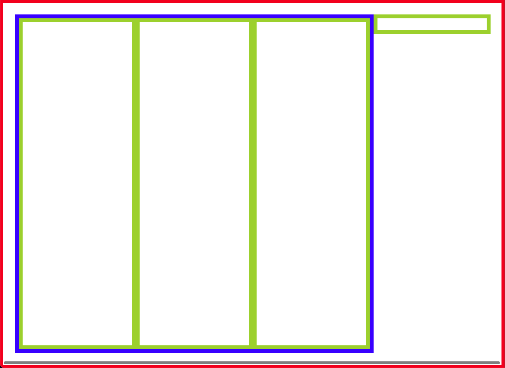

## 프로젝트 이해하기

### Rollup 구성(config)의 이해

프로젝트를 구성하는 Rollup 번들러에 대한 이해를 먼저 해보자.
Rollup은 Webpack과 같은 번들러로, Svelte를 만든 제작자가 만든 번들러이므로 함께 세트로 많이 이용함.
생태계가 Rollup에 비중이 있다고 보면됨(Webpack 도 가능함)

우리가 프로젝트를 시작하기에 앞서 가장 먼저 봐야할 것은 번들러의 구성이다.

번들러가 하는 역할은 무엇일까? 번들러는 svelte, scss 등의 파일을 브라우저에서 동작하도록 변환해주는 역할을 한다. 브라우저는 js, css, html 만 동작하기 때문. 이를 빌드해서 public 경로에 업로드한 뒤 해당 파일만 브라우저에서 동작할 수 있도록 해주면 된다.

rollup.config.js는 우리가 원하는 번들러의 역할을 작성한 내용이다.

`./rollup.config.js`

```jsx
// built-in
import path from "path"
// @rollup: 비교적 최신에 만들어진 모듈임(@)
import resolve from "@rollup/plugin-node-resolve"
import commonjs from "@rollup/plugin-commonjs"
import alias from "@rollup/plugin-alias"
import strip from "@rollup/plugin-strip"
// rollup: 비교적 구버전인 모듈
import svelte from "rollup-plugin-svelte"
import livereload from "rollup-plugin-livereload"
import { terser } from "rollup-plugin-terser"
import replace from "rollup-plugin-replace"
import globals from "rollup-plugin-node-globals"
import builtins from "rollup-plugin-node-builtins"
// external
import sveltePreprocess from "svelte-preprocess"

// Rollup Watch 기능(-w)이 동작하는 경우만 '개발 모드'라고 판단
const production = !process.env.ROLLUP_WATCH

function serve() {
  let server

  function toExit() {
    // 서버 있으면 바로 종료.
    if (server) server.kill(0)
  }

  return {
    writeBundle() {
      // 서버가 있으면 실행하지 않음.
      if (server) return

      // 서버 생성.
      server = require("child_process").spawn("npm", ["run", "start", "--", "--dev"], {
        stdio: ["ignore", "inherit", "inherit"],
        shell: true,
      })

      // 프로세스 종료 이벤트(SIGTERM, exit)에 서버 종료하도록 핸들링.
      process.on("SIGTERM", toExit)
      process.on("exit", toExit)
    },
  }
}

// Rollup의 기본 옵션
export default {
  // 진입점 : 여기서부터 분석을 시작한다.
  input: "src/main.js",
  // 번들 출력 : 결과를 아래와 같이 도출한다.
  output: {
    // 번들의 소스맵 파일을 생성. 소스맵은 난독화 파일을 해석해서 성능 향상에 도움을 준다. (브라우저가 소스맵과 난독화 파일을 비교해서 파악한다.)
    sourcemap: true,
    // 번들의 포멧을 지정. `iife`는 HTML SCRIPT 태그에서 사용하기에 적합한 번들을 생성한다.
    format: "iife",
    // 번들의 전역 변수 이름. `iife` 포멧을 사용하는 경우에 필요하다.
    name: "app",
    // 번들이 생성되는 경로
    file: "public/build/bundle.js",
  },
  plugins: [
    svelte({
      // 개발 모드에서 런타임 검사를 활성화
      dev: !production,
      // Svelte 컴포넌트의 CSS를 별도 번들로 생성
      css: (css) => {
        css.write("bundle.css")
      },
      // 전처리 옵션을 지정합니다.
      preprocess: sveltePreprocess({
        scss: {
          // 전역에서 사용할 SCSS 파일을 지정
          // 단, style 태그에 lang="scss"가 지정되어 있어야 적용된다.
          // SCSS에서는 url()을 사용하면 표준 CSS 문법으로 해석하고, url()을 사용하지 않으면 SCSS 문법으로 해석한다.
          // 즉, url() 유무에 따라 해석 방법이 달라진다는 의미이다.
          prependData: '@import "./src/scss/main.scss";',
        },
        // PostCSS는 Autoprefixer를 설치하면 같이 설치됨.(9버전), CSS 후처리를 담당한다.
        // 10버전 이상은 postcss를 별도 설치해야 함.(npm i -D postcss)
        // Autoprefixer는 CSS에 자동으로 공급 업체 접두사(Vendor prefix)를 적용한다. (-ms-, -webkit-를 알아서 붙여주는 옵션)
        postcss: {
          plugins: [require("autoprefixer")()],
        },
      }),
    }),

    // replace ~ builtins 까지는 아래와 같은 순서대로 작성해야 정상적으로 동작함(주의!)
    // 대부분의 플러그인은 Rollup 측에서 제공하는 것이 아니기 때문에,
    // 플러그인의 동작 순서를 파악하는 것은 사용자(개발자)의 몫이라고 설명하고 있음

    // Crypto-random-string에서 내부적으로 randomBytes가 사용됨
    // Node Globals와 Builtins가 내부적으로 제공하지 않기 때문에,
    // 다음과 같이 지정(대체)해야 정상적으로 동작한다.
    // https://github.com/sindresorhus/crypto-random-string/blob/master/index.js
    replace({
      values: {
        "crypto.randomBytes": 'require("randombytes")',
      },
    }),
    // NPM으로 설치하는 외부 모듈을 번들에 포함한다.
    resolve({
      // 브라우저 환경을 위한 번들로 포함하도록 지시(최적화)
      browser: true,
      // 중복 번들을 방지하기 위한 외부 모듈 이름을 지정: 외부 모듈에 svelte를 쓸 경우 중복 번들되지 않도록 체크함
      dedupe: ["svelte"],
    }),
    // 외부 모듈을 ES6 번들로 변환: require('') 방식으로 호출하는 모듈을 번들링함
    commonjs(),
    // 일부 Node 모듈이 필요로 하는 전역 API를 사용할 수 있음
    globals(),
    // Node 내장 API를 사용할 수 있음
    builtins(),

    // 경로 별칭 지정
    // 상대 경로에 대한 별칭이 없으면, 프로젝트를 리팩토링할 때 문제가 생길 확률이 매우 높아진다.
    alias({
      entries: [{ find: "~", replacement: path.resolve(__dirname, "src/") }],
    }),

    // For Development mode!
    // 개발 모드에서는 번들이 생성되면 `npm run start`를 호출한다.
    !production && serve(),
    // 개발 모드에서는 'public' 디렉토리에서 변경사항이 확인되면 브라우저를 새로고침한다.
    !production && livereload("public"),

    // For Production mode!
    // 제품 모드에서는 'console.log' 같은 Console 명령을 제거한다.
    production &&
      strip({
        include: "**/*.(svelte|js)",
      }),
    // 제품 모드에서는 번들을 최소화(최적화, minify)
    production && terser(),
  ],
  watch: {
    // 다시 빌드할 때, 터미널 화면을 초기화하지 않는다. 기본값은 `true`
    clearScreen: false,
  },
}
```

위 설명을 차례대로 읽어보면서 각 역할들을 확인해보자.
(resolve 의 dedupe 속성이 중복 번들을 제거하는 과정은 메모..!)

### App, Header, ListContainer 컴포넌트 이해하기

해당 앱의 핵심 컴포넌트에 대해서 이해하고 넘어간다.

`App.svelte`

```html
<script>
  import Header from "~/components/Header.svelte"
  import ListContainer from "~/components/ListContainer.svelte"

  Object.assign(document.body.style, {
    backgroundColor: "darkgray",
    backgroundImage: "url(/images/bg.jpg)",
    backgroundSize: "cover",
  })
</script>

<header />
<ListContainer />
```

`alias` 별칭 `~`로 시작하는 `Header`, `ListContainer` 컴포넌트를 import하여 사용한다.
`Object.assign`으로 `document.body`에 스타일을 부여한다. `backgroundImage`로 노출하는 `/images/bg.jpg`는 public 폴더에서 가져온다.

`Header.svelte`

```html
<header>
  
</header>

<style lang="scss">
  header {
    height: 40px;
    box-sizing: border-box;
    background-color: rgba(black, 0.4);
    display: flex;
    justify-content: center;
    align-items: center;
    img.logo {
      width: 80px;
      opacity: 0.5;
    }
  }
</style>
```

scss로 스타일을 추가하는데 중첩기능을 제공해주므로 작업 시 매우 효율적이다.

`ListContainer.svelte`

```html
<script>
  // ..
</script>

<div class="list-container">
  <div bind:this="{listsEl}" class="lists">
    {#each $lists as list (list.id)}
    <List {list} {sortableLists} />
    {/each}
  </div>
  <CreateList />
</div>

<style lang="scss">
  .list-container {
    width: 100vw;
    // calc 함수는 표준 CSS API입니다.
    // 40px은 Header 컴포넌트의 높잇값입니다.
    height: calc(100vh - 40px);
    padding: 30px;
    box-sizing: border-box;
    overflow-x: auto;
    overflow-y: hidden;
    // List를 수평 정렬시키기 위해서 사용합니다.
    white-space: nowrap;
    // inline-block의 띄어쓰기 공간을 초기화하기 위해 사용합니다.
    font-size: 0;
    .lists {
      display: inline-block;
      height: 100%;
      // List를 수평 정렬시키기 위해서 사용합니다.
      white-space: nowrap;
      // inline-block의 띄어쓰기 공간을 초기화하기 위해 사용합니다.
      font-size: 0;
    }
  }
</style>
```

`ListContainer`는 수평으로 쌓여져있고, 이미 만들어진 `List`는 노출하고, 맨 우측에서 `CreateList` 컴포넌트를 배치한다.

### 프로젝트 설치 및 핵심 레이아웃의 이해

프로젝트의 핵심 레이아웃을 이해하기 위해 기본 스벨트 템플릿 프로젝트를 만든다.

```bash
> npm degit sveltejs/template svelte-trello-app
> cd svelte-trello-app/
> npm i
> npm run dev
```

위처럼 dev 환경의 svelte 프로젝트를 클론하여 구성한다. 가볍게 구조를 타이핑하기 위함

`App.svelte`

```html
<div class="list-container">
  <div class="lists">
    <div class="list" />
    <div class="list" />
    <div class="list" />
  </div>
  <div class="create-list" />
</div>

<style>
  :global(body) {
    margin: 0;
    padding: 0;
  }
  .list-container {
    width: 100vw;
    height: 100vh;
    padding: 30px;
    border: 8px solid red;
    box-sizing: border-box;
    overflow-x: auto;
    overflow-y: hidden;
    font-size: 0;
    white-space: nowrap;
  }
  .list-container .lists {
    display: inline-block;
    height: 100%;
    border: 10px solid blue;
    box-sizing: border-box;
    font-size: 0;
    white-space: nowrap;
  }
  .list-container .lists .list {
    display: inline-block;
    width: 300px;
    height: 100%;
    border: 10px solid yellowgreen;
    box-sizing: border-box;
    font-size: 16px;
  }
  .list-container .create-list {
    width: 300px;
    height: 50px;
    border: 10px solid yellowgreen;
    box-sizing: border-box;
    display: inline-block;
    vertical-align: top;
    font-size: 16px;
  }
</style>
```

위와 같이 처리하면 기본적인 trello 레이아웃이 생성된다.

