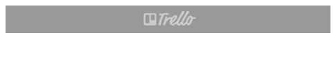

## Trello 클론 앱 만들기 - 실습

### 프로젝트 기본 모듈 업데이트

본격적으로 어플리케이션을 만들에 앞서 기본 모듈 버전을 업데이트 해준다.

```bash
$ npm i -D svelte@^3 @rollup/plugin-commonjs@^15 @rollup/plugin-node-resolve@^9
```

### Header 컴포넌트 작성

Header 컴포넌트부터 작성해준다.

`./src/components/Header.svelte`

```html
d
<header>
  
</header>

<style>
  header {
    height: 40px;
    box-sizing: border-box;
    background-color: rgba(0, 0, 0, 0.4);
    display: flex;
    justify-content: center;
    align-items: center;
  }
  header img.logo {
    width: 80px;
    height: auto;
    opacity: 0.5;
  }
</style>
```

`./public/images` 루트에 trello-logo 이미지를 추가해준 뒤 해당 파일을 Header에 적용시켜준다.
배치는 정 가운데 위치하도록 설정해주는 스타일 코드를 넣었다.



현재 위 레이아웃으로 오우라저에 노출되므로 화면에 존재하는 여백을 지워줘야하는데, 해당 부분을 reset 처리해주는 `Reset.css`를 따로 준비해준다.

### Reset.css와 Google Fonts

구글에 reset.css cdn이라고 검색하면 나오는 `reset-css` [링크](https://www.jsdelivr.com/package/npm/reset-css)를 열어 해당 cdn을 HTML 형태로 복사하여 `index.html`에 복붙해준다.

`./public/index.html`

```html
<!DOCTYPE html>
<html lang="en">
  <head>
    <!-- ... -->
    <link rel="stylesheet" href="https://cdn.jsdelivr.net/npm/reset-css@5.0.1/reset.min.css" />
  </head>
</html>
```

이번에는 폰트도 적용해본다! [googleFont](https://fonts.google.com/specimen/Roboto)에서 Roboto 폰트를 사용한다.
용량이 한정적이므로 Embed 폰트를 400, 700사이즈만 적용한다.

`./public/index.html`

```html
<!DOCTYPE html>
<html lang="en">
  <head>
    <!-- ... -->
    <link rel="preconnect" href="https://fonts.googleapis.com" />
    <link rel="preconnect" href="https://fonts.gstatic.com" crossorigin />
    <link href="https://fonts.googleapis.com/css2?family=Roboto:wght@400;700&display=swap" rel="stylesheet" />
    <style>
      font-family: "Roboto", sans-serif;
    </style>
  </head>
</html>
```

위처럼 하면 불필요한 여백이 아래와 같이 사라지는 것을 확인할 수 있으며 페이지 전역에 Roboto 폰트가 적용된 것을 확인할 수 있다.

### SCSS(svelte-preprecess, node-sass)

Header 태그에서 작성한 스타일 코드를 scss를 통해 개선해보고자 한다.

```bash
> npm i -D svelte-preprocess node-sass
```

`./rollup.config.js`

```jsx
import sveltePreprocess from "svelte-preprocess"

// ..
export default {
  input: "src/main.js",
  output: {
    sourcemap: true,
    format: "iife",
    name: "app",
    file: "public/build/bundle.js",
  },
  plugins: [
    svelte({
      preprocess: sveltePreprocess(), // preprocess 옵션 추가
      dev: !production,
    }),
    // ..
  ],
  // ..
}
```

위와 같이 설정 후 Header.svelte를 scss 포맷으로 수정해준다.

`./src/components/Header.svelte`

```html
<header>
  
</header>

<style lang="scss">
  header {
    height: 40px;
    box-sizing: border-box;
    background-color: rgba(0, 0, 0, 0.4);
    display: flex;
    justify-content: center;
    align-items: center;
    img.logo {
      width: 80px;
      height: auto;
      opacity: 0.5;
    }
  }
</style>
```

위와 같이 설정 후 개발서버를 다시 띄워주면 스타일이 정상적으로 적용되어 있는 것을 확인할 수 있다.


그런데 Header 파일 내 scss 로 속성으로 설정한 부분에서 아래와 같이 에러가 발생한다.


이는 바로 Svelte for VS Code 익스텐션이 node 위치를 찾지못해 발생한 오류로 이를 개선하기 위해서 익스텐션 설정 내 Language-server: Runtime 에 node 경로를 직접 입력해준다.

node 위치는 아래 명령어로 확인할 수 있다.

```bash
svelte-trello-app % which node
/usr/local/bin/node
```

### 공급업체 접두사 후처리(autoprefixer(PostCSS))

이번 시간에는 공급업체 접두사라는 개념에 대해 알아보려고 한다.

`./src/components/Header.svelte`

```html
<style lang="scss">
  header {
    /* ... */
    display: flex;
    display: -ms-flexbox;
    display: -webkit-flex;
    display: -moz-box;
  }
</style>
```

위와 같이 `-ms-flexbox`라고 작성하면 IE 등의 구형 브라우저에서도 flex 속성을 지원하도록 설정할 수 있는 것을 공급업체 접두사라고 한다. -ms-는 IE, -webkit-은 크롬, -moz- 은 모질라 브라우저의 구형 버전을 지원하는 접두사인데, 이를 하나하나 찾아서 작성하기에는 너무 불편하고 어렵다.

이를 수동으로 작성하지 않고 필요한 공급업체 접두사를 자동으로 입력해주는 라이브러리가 있다.

```bash
npm i -D autoprefixer@^10 postcss
```

이를 rollup.config.js에 아래와 같이 설정해준다.

```jsx
//..
export default {
  input: "src/main.js",
  output: {
    sourcemap: true,
    format: "iife",
    name: "app",
    file: "public/build/bundle.js",
  },
  plugins: [
    svelte({
      preprocess: sveltePreprocess({
        postcss: {
          plugins: [require("autoprefixer")()] /*  autoprefixer 설정 추가 */,
        },
      }),
      dev: !production,
    }),
    // ..
  ],
}
```

위처럼 작성하면 무조건 공급업체 접두사가 붙는가? 그렇지 않다.
어떤 버전을 기준으로 autoprefixer가 동작하는지 알 수 없기 때문이다.
따라서 package.json에 기준으로 동작하는 browserlist 옵션을 추가해준다.

`./package.json`

```json
{
  "name": "svelte-app",
  // ..
  "browserslist": ["> 1%", "last 2 versions"]
  // ..
}
```

`> 1%` 라는 의미는 전세계 브라우저 점유율이 1% 이상인 브라우저를 모두 포함한다는 의미이며, `last 2 versions`는 해당 브라우저의 최신 2개 버전을 지원하겠다는 의미이다.

위와 같이 브라우저 환경에 대해 명시해준 뒤 dev 환경을 열어보면 알아서 공급업체 접두사가 자동으로 들어간 상태라는 것을 확인할 수 있다.


이와 같이 라이브러리를 활용하여 수많은 공급업체 접두사를 빠르고 간편하게 추가할 수 있게 되었다.
이는 웬만한 프로젝트에 모두 적용하는 것이 바람직하겠다.

이외로 scss 포맷은 rgba라는 함수를 제공하는데 두 개의 인수만 넣어도 동작한다.

`./src/components/Header.svelte`

```html
<style lang="scss">
  header {
    background-color: rgba(black, 0.4);
  }
</style>
```

위 함수는 scss에서 제공하는 기능이므로, 간단하게 해당 컬러를 넣어 적용할 수 있어 매우 간편하다!


### 경로 별칭(@rollup/plugin-alias)

이제 App 컴포넌트에 배경화면을 추가해본다.
우리는 기본적인 방법으로 아래와 같이 배경화면을 추가해줄 수 있다.

`./src/App.svelte`

```html
<script>
  import Header from "./components/Header.svelte"

  document.body.style.backgroundImage = "url(/images/bg.jpg)"
  document.body.style.backgroundSize = "cover"
</script>
```

그런데 위와 같은 적용 코드가 더 많아진다면, 지저분하고, 가독성이 떨어지게 될 것이다.
따라서 위 코드는 아래와 같이 `Object.assign` 메서드를 사용해 깔끔하게 작성해줄 수 있다.

`./src/App.svelte`

```html
<script>
  import Header from "./components/Header.svelte"

  Object.assign(document.body.style, {
    backgroundColor: "darkgray",
    backgroundImage: "url(/images/bg.jpg",
    backgroundSize: "cover",
  })
</script>
```

이 외로도 import를 해오는 컴포넌트의 경로가 상대 경로로 작성되어 있는데, 파일 구조가 복잡해질수록 경로 별칭을 사용하는 것이 좋다. `@rollup/plugin-alias`를 먼저 설치한 뒤 rollup config에 설정을 추가해준다.

```bash
> npm i -D @rollup/plugin-alias
```

`./rollup.config.js`

```jsx
import path from "path"
import alias from "@rollup/plugin-alias"
//..

export default {
  // ..
  plugins: [
    // ..
    commonjs(),
    alias({ entries: [{ find: "~", replacement: path.resolve(__dirname, "src/") }] }),
    // ..
  ],
  // ..
}
```

위처럼 alias 설정을 추가한 뒤 Header 컴포넌트의 경로를 아래와 같이 수정해준다.

`./src/App.svelte`

```html
<script>
  import Header from "~/components/Header.svelte"
</script>
```

### ListContainer, List, CreateList 컴포넌트 작성

이제 Header를 제외한 나머지 부분인 ListContainer 컴포넌트를 작업해본다.

`./src/components/ListContainer.svelte`

```html
<script>
  import List from "~/components/List.svelte"
  import CreateList from "~/components/CreateList.svelte"
</script>

<div class="list-container">
  <div class="lists">
    <List />
    <List />
  </div>
  <CreateList />
</div>

<style lang="scss">
  .list-container {
    width: 100vw;
    height: calc(100vh - 40px);
    border: 10px solid red;
    padding: 30px;
    box-sizing: border-box;
    overflow-x: auto;
    overflow-y: hidden;
    white-space: nowrap;
    font-size: 0;
    .lists {
      display: inline-block;
      height: 100%;
      border: 10px solid blue;
      box-sizing: border-box;
      white-space: nowrap;
      font-size: 0;
    }
  }
</style>
```

`./src/components/List.svelte`

```html
<div class="list" />

<style lang="scss">
  .list {
    display: inline-block;
    font-size: 16px;
    white-space: normal;
    width: 290px;
    height: 100%;
    border: 10px solid yellowgreen;
    box-sizing: border-box;
    margin: 0 4px;
  }
</style>
```

`./src/components/CreateList.svelte`

```html
<div class="create-list">+ Add another list</div>

<style lang="scss">
  .create-list {
    font-size: 16px;
    white-space: normal;
    width: 290px;
    display: inline-block;
    padding: 10px 8px;
    vertical-align: top;
    background: rgba(#ebecf0, 0.6);
    border-radius: 4px;
    margin: 0 4px;
    line-height: 20px;
    cursor: pointer;
    transition: 0.2s;
    &:hover {
      background: #ebecf0;
    }
  }
</style>
```


위처럼 작업하면 아래와 같은 기본 레이아웃이 생성된다.

해당 레이아웃을 만들 때 기본적으로 flex를 이용해서 많이 만들어왔는데, 여기에서는 inline-block 과 white-space, vertical-align 속성 등으로 해당 레이아웃을 구현함. 구 스타일 API로만 구성하는 레이아웃이므로 오히려 호환성 면에서 낫다는 생각도 든다. 참조할 것

### Lists 커스텀 스토어와 Storage API

이제 createList 컴포넌트를 통해 실제 리스트를 생성할 수 있도록 만들어준다.
이를 위해 store를 도입해준다. 정보 저장은 로컬 스토리지에 저장해준다.

로컬스토리지는 최대 10MB까지 저장할 수 있으며 HTML5 권장은 5MB이다.
Key-Value 형태의 문자로 저장하기 때문에 충분한 용량이라고 볼 수 있다. 로컬 스토리지는 창을 닫아도 저장된 데이터가 해당 도메인에서 계속 유지되므로 한 번 저장된 데이터가 유실되지 않고 계속 남게 된다.

`./src/store/list.js`

```jsx
import { writable } from "svelte/store"

const repoLists = JSON.parse(window.localStorage.getItem("lists")) || []

const _lists = writable(repoLists) // 외부에서 사용하지 않고 내부에서만 사용하는 정보
_lists.subscribe(($lists) => window.localStorage.setItem("lists", JSON.stringify($lists)))

export const lists = {
  subscribe: _lists.subscribe, // 실행시키지 않고 참조관계로 연결
  add(payload) {
    // custom event
    const { title } = payload
    _lists.update(($lists) => {
      $lists.push({
        id: "", // crypto-random-string을 통한 고유 문자열 생성
        title,
        cards: [],
      })
      return $lists
    })
  },
}
```

위처럼 스토어 내부에 존재하는 writable 함수는 `_`기호를 사용해 `_lists` 변수로 저장하고, 이를 외부에서 사용하는 lists 함수와 참조 관계로 연결하여 구현해주면 스토리지를 활용한 간단한 subscribe, add 스토어 함수가 만들어진다.
