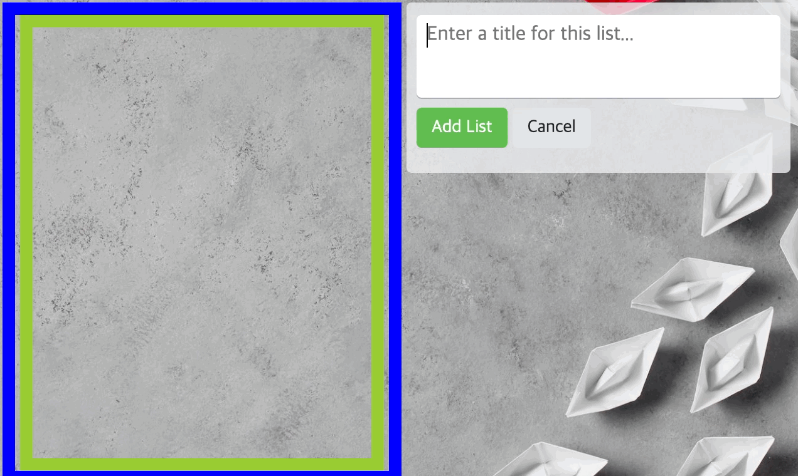
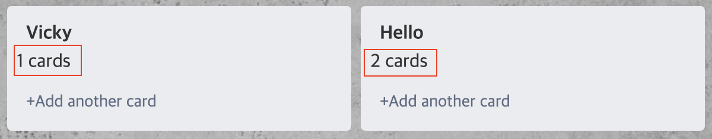

## Trello 클론 앱 만들기 - 실습

### 프로젝트 기본 모듈 업데이트

본격적으로 어플리케이션을 만들에 앞서 기본 모듈 버전을 업데이트 해준다.

```bash
$ npm i -D svelte@^3 @rollup/plugin-commonjs@^15 @rollup/plugin-node-resolve@^9
```

### Header 컴포넌트 작성

Header 컴포넌트부터 작성해준다.

`./src/components/Header.svelte`

```html
d
<header>
  
</header>

<style>
  header {
    height: 40px;
    box-sizing: border-box;
    background-color: rgba(0, 0, 0, 0.4);
    display: flex;
    justify-content: center;
    align-items: center;
  }
  header img.logo {
    width: 80px;
    height: auto;
    opacity: 0.5;
  }
</style>
```

`./public/images` 루트에 trello-logo 이미지를 추가해준 뒤 해당 파일을 Header에 적용시켜준다.
배치는 정 가운데 위치하도록 설정해주는 스타일 코드를 넣었다.


현재 위 레이아웃으로 오우라저에 노출되므로 화면에 존재하는 여백을 지워줘야하는데, 해당 부분을 reset 처리해주는 `Reset.css`를 따로 준비해준다.

### Reset.css와 Google Fonts

구글에 reset.css cdn이라고 검색하면 나오는 `reset-css` [링크](https://www.jsdelivr.com/package/npm/reset-css)를 열어 해당 cdn을 HTML 형태로 복사하여 `index.html`에 복붙해준다.

`./public/index.html`

```html
<!DOCTYPE html>
<html lang="en">
  <head>
    <!-- ... -->
    <link rel="stylesheet" href="https://cdn.jsdelivr.net/npm/reset-css@5.0.1/reset.min.css" />
  </head>
</html>
```

이번에는 폰트도 적용해본다! [googleFont](https://fonts.google.com/specimen/Roboto)에서 Roboto 폰트를 사용한다.
용량이 한정적이므로 Embed 폰트를 400, 700사이즈만 적용한다.

`./public/index.html`

```html
<!DOCTYPE html>
<html lang="en">
  <head>
    <!-- ... -->
    <link rel="preconnect" href="https://fonts.googleapis.com" />
    <link rel="preconnect" href="https://fonts.gstatic.com" crossorigin />
    <link href="https://fonts.googleapis.com/css2?family=Roboto:wght@400;700&display=swap" rel="stylesheet" />
    <style>
      font-family: "Roboto", sans-serif;
    </style>
  </head>
</html>
```

위처럼 하면 불필요한 여백이 아래와 같이 사라지는 것을 확인할 수 있으며 페이지 전역에 Roboto 폰트가 적용된 것을 확인할 수 있다.

### SCSS(svelte-preprecess, node-sass)

Header 태그에서 작성한 스타일 코드를 scss를 통해 개선해보고자 한다.

```bash
> npm i -D svelte-preprocess node-sass
```

`./rollup.config.js`

```jsx
import sveltePreprocess from "svelte-preprocess"

// ..
export default {
  input: "src/main.js",
  output: {
    sourcemap: true,
    format: "iife",
    name: "app",
    file: "public/build/bundle.js",
  },
  plugins: [
    svelte({
      preprocess: sveltePreprocess(), // preprocess 옵션 추가
      dev: !production,
    }),
    // ..
  ],
  // ..
}
```

위와 같이 설정 후 Header.svelte를 scss 포맷으로 수정해준다.

`./src/components/Header.svelte`

```html
<header>
  
</header>

<style lang="scss">
  header {
    height: 40px;
    box-sizing: border-box;
    background-color: rgba(0, 0, 0, 0.4);
    display: flex;
    justify-content: center;
    align-items: center;
    img.logo {
      width: 80px;
      height: auto;
      opacity: 0.5;
    }
  }
</style>
```

위와 같이 설정 후 개발서버를 다시 띄워주면 스타일이 정상적으로 적용되어 있는 것을 확인할 수 있다.


그런데 Header 파일 내 scss 로 속성으로 설정한 부분에서 아래와 같이 에러가 발생한다.


이는 바로 Svelte for VS Code 익스텐션이 node 위치를 찾지못해 발생한 오류로 이를 개선하기 위해서 익스텐션 설정 내 Language-server: Runtime 에 node 경로를 직접 입력해준다.

node 위치는 아래 명령어로 확인할 수 있다.

```bash
svelte-trello-app % which node
/usr/local/bin/node
```

### 공급업체 접두사 후처리(autoprefixer(PostCSS))

이번 시간에는 공급업체 접두사라는 개념에 대해 알아보려고 한다.

`./src/components/Header.svelte`

```html
<style lang="scss">
  header {
    /* ... */
    display: flex;
    display: -ms-flexbox;
    display: -webkit-flex;
    display: -moz-box;
  }
</style>
```

위와 같이 `-ms-flexbox`라고 작성하면 IE 등의 구형 브라우저에서도 flex 속성을 지원하도록 설정할 수 있는 것을 공급업체 접두사라고 한다. -ms-는 IE, -webkit-은 크롬, -moz- 은 모질라 브라우저의 구형 버전을 지원하는 접두사인데, 이를 하나하나 찾아서 작성하기에는 너무 불편하고 어렵다.

이를 수동으로 작성하지 않고 필요한 공급업체 접두사를 자동으로 입력해주는 라이브러리가 있다.

```bash
npm i -D autoprefixer@^10 postcss
```

이를 rollup.config.js에 아래와 같이 설정해준다.

```jsx
//..
export default {
  input: "src/main.js",
  output: {
    sourcemap: true,
    format: "iife",
    name: "app",
    file: "public/build/bundle.js",
  },
  plugins: [
    svelte({
      preprocess: sveltePreprocess({
        postcss: {
          plugins: [require("autoprefixer")()] /*  autoprefixer 설정 추가 */,
        },
      }),
      dev: !production,
    }),
    // ..
  ],
}
```

위처럼 작성하면 무조건 공급업체 접두사가 붙는가? 그렇지 않다.
어떤 버전을 기준으로 autoprefixer가 동작하는지 알 수 없기 때문이다.
따라서 package.json에 기준으로 동작하는 browserlist 옵션을 추가해준다.

`./package.json`

```json
{
  "name": "svelte-app",
  // ..
  "browserslist": ["> 1%", "last 2 versions"]
  // ..
}
```

`> 1%` 라는 의미는 전세계 브라우저 점유율이 1% 이상인 브라우저를 모두 포함한다는 의미이며, `last 2 versions`는 해당 브라우저의 최신 2개 버전을 지원하겠다는 의미이다.

위와 같이 브라우저 환경에 대해 명시해준 뒤 dev 환경을 열어보면 알아서 공급업체 접두사가 자동으로 들어간 상태라는 것을 확인할 수 있다.


이와 같이 라이브러리를 활용하여 수많은 공급업체 접두사를 빠르고 간편하게 추가할 수 있게 되었다.
이는 웬만한 프로젝트에 모두 적용하는 것이 바람직하겠다.

이외로 scss 포맷은 rgba라는 함수를 제공하는데 두 개의 인수만 넣어도 동작한다.

`./src/components/Header.svelte`

```html
<style lang="scss">
  header {
    background-color: rgba(black, 0.4);
  }
</style>
```

위 함수는 scss에서 제공하는 기능이므로, 간단하게 해당 컬러를 넣어 적용할 수 있어 매우 간편하다!


### 경로 별칭(@rollup/plugin-alias)

이제 App 컴포넌트에 배경화면을 추가해본다.
우리는 기본적인 방법으로 아래와 같이 배경화면을 추가해줄 수 있다.

`./src/App.svelte`

```html
<script>
  import Header from "./components/Header.svelte"

  document.body.style.backgroundImage = "url(/images/bg.jpg)"
  document.body.style.backgroundSize = "cover"
</script>
```

그런데 위와 같은 적용 코드가 더 많아진다면, 지저분하고, 가독성이 떨어지게 될 것이다.
따라서 위 코드는 아래와 같이 `Object.assign` 메서드를 사용해 깔끔하게 작성해줄 수 있다.

`./src/App.svelte`

```html
<script>
  import Header from "./components/Header.svelte"

  Object.assign(document.body.style, {
    backgroundColor: "darkgray",
    backgroundImage: "url(/images/bg.jpg",
    backgroundSize: "cover",
  })
</script>
```

이 외로도 import를 해오는 컴포넌트의 경로가 상대 경로로 작성되어 있는데, 파일 구조가 복잡해질수록 경로 별칭을 사용하는 것이 좋다. `@rollup/plugin-alias`를 먼저 설치한 뒤 rollup config에 설정을 추가해준다.

```bash
> npm i -D @rollup/plugin-alias
```

`./rollup.config.js`

```jsx
import path from "path"
import alias from "@rollup/plugin-alias"
//..

export default {
  // ..
  plugins: [
    // ..
    commonjs(),
    alias({ entries: [{ find: "~", replacement: path.resolve(__dirname, "src/") }] }),
    // ..
  ],
  // ..
}
```

위처럼 alias 설정을 추가한 뒤 Header 컴포넌트의 경로를 아래와 같이 수정해준다.

`./src/App.svelte`

```html
<script>
  import Header from "~/components/Header.svelte"
</script>
```

### ListContainer, List, CreateList 컴포넌트 작성

이제 Header를 제외한 나머지 부분인 ListContainer 컴포넌트를 작업해본다.

`./src/components/ListContainer.svelte`

```html
<script>
  import List from "~/components/List.svelte"
  import CreateList from "~/components/CreateList.svelte"
</script>

<div class="list-container">
  <div class="lists">
    <List />
    <List />
  </div>
  <CreateList />
</div>

<style lang="scss">
  .list-container {
    width: 100vw;
    height: calc(100vh - 40px);
    border: 10px solid red;
    padding: 30px;
    box-sizing: border-box;
    overflow-x: auto;
    overflow-y: hidden;
    white-space: nowrap;
    font-size: 0;
    .lists {
      display: inline-block;
      height: 100%;
      border: 10px solid blue;
      box-sizing: border-box;
      white-space: nowrap;
      font-size: 0;
    }
  }
</style>
```

`./src/components/List.svelte`

```html
<div class="list" />

<style lang="scss">
  .list {
    display: inline-block;
    font-size: 16px;
    white-space: normal;
    width: 290px;
    height: 100%;
    border: 10px solid yellowgreen;
    box-sizing: border-box;
    margin: 0 4px;
  }
</style>
```

`./src/components/CreateList.svelte`

```html
<div class="create-list">+ Add another list</div>

<style lang="scss">
  .create-list {
    font-size: 16px;
    white-space: normal;
    width: 290px;
    display: inline-block;
    padding: 10px 8px;
    vertical-align: top;
    background: rgba(#ebecf0, 0.6);
    border-radius: 4px;
    margin: 0 4px;
    line-height: 20px;
    cursor: pointer;
    transition: 0.2s;
    &:hover {
      background: #ebecf0;
    }
  }
</style>
```


위처럼 작업하면 아래와 같은 기본 레이아웃이 생성된다.

해당 레이아웃을 만들 때 기본적으로 flex를 이용해서 많이 만들어왔는데, 여기에서는 inline-block 과 white-space, vertical-align 속성 등으로 해당 레이아웃을 구현함. 구 스타일 API로만 구성하는 레이아웃이므로 오히려 호환성 면에서 낫다는 생각도 든다. 참조할 것

### Lists 커스텀 스토어와 Storage API

이제 createList 컴포넌트를 통해 실제 리스트를 생성할 수 있도록 만들어준다.
이를 위해 store를 도입해준다. 정보 저장은 로컬 스토리지에 저장해준다.

로컬스토리지는 최대 10MB까지 저장할 수 있으며 HTML5 권장은 5MB이다.
Key-Value 형태의 문자로 저장하기 때문에 충분한 용량이라고 볼 수 있다. 로컬 스토리지는 창을 닫아도 저장된 데이터가 해당 도메인에서 계속 유지되므로 한 번 저장된 데이터가 유실되지 않고 계속 남게 된다.

`./src/store/list.js`

```jsx
import { writable } from "svelte/store"

const repoLists = JSON.parse(window.localStorage.getItem("lists")) || []

const _lists = writable(repoLists) // 외부에서 사용하지 않고 내부에서만 사용하는 정보
_lists.subscribe(($lists) => window.localStorage.setItem("lists", JSON.stringify($lists)))

export const lists = {
  subscribe: _lists.subscribe, // 실행시키지 않고 참조관계로 연결
  add(payload) {
    // custom event
    const { title } = payload
    _lists.update(($lists) => {
      $lists.push({
        id: "", // crypto-random-string을 통한 고유 문자열 생성
        title,
        cards: [],
      })
      return $lists
    })
  },
}
```

위처럼 스토어 내부에 존재하는 writable 함수는 `_`기호를 사용해 `_lists` 변수로 저장하고, 이를 외부에서 사용하는 lists 함수와 참조 관계로 연결하여 구현해주면 스토리지를 활용한 간단한 subscribe, add 스토어 함수가 만들어진다.

### 랜덤 고유 문자열 생성(crypto-random-string)과 Rollup 구성

이제 list 스토어의 add 함수에 들어갈 랜덤 id 값을 `crypto-random-string`을 이용해 넣어보고자 한다. 간단한 패키지로 uuid가 있으나 rollup 설정을 하는 과정을 배워보고자 위 모듈을 선택했다.

```bash
> npm i -D crypto-random-string@3.2
```

설치한 모듈을 list 스토어에 반영해보자.

`./src/store/list.js`

```jsx
import { writable } from "svelte/store"
import cryptoRandomString from "crypto-random-string"

const generateId = () => cryptoRandomString({ length: 10 })

// ..
export const lists = {
  subscribe: _lists.subscribe,
  add(payload) {
    const { title } = payload
    _lists.update(($lists) => {
      $lists.push({
        id: generateId(),
        title,
        cards: [],
      })
      return $lists
    })
  },
}
```

`./src/components/CreateList.svelte`

```html
<script>
  import { lists } from "~/store/list"
  lists.add({
    title: "vicky",
  })
</script>

<div class="create-list">+ Add another list</div>
```

위와 같이 추가 후 lists.add를 실행시켜주면 에러가 발생하는데 에러메시지는 아래와 같다.

```
Uncaught TypeError: crypto__default.default.randomBytes is not a function
```

rollup 번들러를 사용하면 위와 같은 에러 메시지를 자주 만나게 되는데, rollup 번들러는 기본적으로 아주 가볍게 설계되어 있기 때문이다. 다르게 얘기하자면 날 것에 가까운 상태인데, node.js의 전역 API나 내장 API가 번들이 가능한 형태로 준비되어 있지 않기 때문에 위와 같이 node.js 구동에 필요한 메서드들이 추가되었을 때 에러메시지가 발생한다.

따라서 필요에 따라 살을 붙여나가야한다. crypto 모듈 또한 별도의 번들 설정을 해주어야 사용할 수 있다.
Node의 내장 API 사용을 위해서는 아래의 것들을 설치해주면 된다.

- rollup-plugin-node-builtins : Node 내장 API를 사용할 수 있음
- rollup-plugin-node-globals : 일부 Node 모듈이 필요로 하는 전역 API를 사용할 수 있다.
- rollup-plugin-replace : 번들 파일의 문자를 대체한다. 문제가 발생하는 코드를 다른 코드로 대체 실행하기 위해 사용한다. ‘기능’을 대체하는 것이 아닌 ‘코드’를 대체함. 예를 들어 ‘없는 내부 모듈’을 사용하는 코드를 찾아 ‘있는 외부 모듈’을 사용할 수 있는 코드로 바꿔준다.

`rollup-plugin-node-builtins`와 `rollup-plugin-node-globals` 모듈을 하나로 줄여 `globals/builtins`라고 부른다고 했을 때, `globals/builtins` 는 NodeJS에서 공식적으로 지원하는 모듈이 아니기 때문에, NodeJS가 최신 버전으로 업데이트 될 때마다 `globals/builtins`에 기능을 따로 개발해서 넣어줘야 한다. 이 부분 에서 시간, 기술 등의 여러가지 이유로 `globals/builtins`가 모든 NodeJS 기능을 제공하지 못하는 문제가 발생하는데, 이 때 `rollup-plugin-replace` 같은 추가 모듈을 통해 프로젝트에 `globals/builtins` 가 지원하지 못하는 기능을 따로 제공해줘야 한다. 이 중 대표적인 것이 `crypto-random-string` 모듈 내부의 `crypto.randomBytes` 메소드이다.

먼저 `globals/builtins`를 설치해준다.

```json
"rollup-plugin-node-builtins": "^2.1.2",
"rollup-plugin-node-globals": "^1.4.0",
"rollup-plugin-replace": "^2.2.0",
```

```bash
> npm i
```

devDependencies 에 위 3가지 모듈을 추가 후 패키지 설치를 진행해준다.

`./rollup.config.js`

```jsx
// ..
import globals from "rollup-plugin-node-globals"
import builtins from "rollup-plugin-node-builtins"
import replace from "rollup-plugin-replace"

// ..
export default {
  // ..
  plugins: [
    // ..

    replace({
      values: {
        "crypto.randomBytes": 'require("randombytes")',
      },
    }),

    resolve({
      browser: true,
      dedupe: ["svelte"],
    }),
    commonjs(),

    globals(),
    builtins(),

    // ..
  ],
}
```

위와 같이 설정 후 다시 개발서버를 실행시켜보면 기존에 발생하던 에러가 더이상 나오지 않는 것을 확인할 수 있다. 또한 add 함수가 실행되어 실제 로컬 스토리지에 데이터가 정상적으로 추가된 것을 확인할 수 있다.


테스트 lists를 모두 삭제 한 뒤 CreateList에 테스트용으로 넣어 둔 add 함수를 제거 후 페이지를 새로 고침하면 초기 lists 데이터가 존재하지 않으므로 `store/list.js` 에서 만든 repoLists의 기본값이 빈 배열이 들어가 있는 것을 확인할 수 있다.

`./store/list.js`

```jsx
const repoLists = JSON.parse(window.localStorage.getItem("lists")) || []
```


### List 생성을 위한 수정 모드(Edit mode)

이번는 구현한 store를 이용해 추가된 list 내용을 추가해주도록 만들어본다.

`./src/components/CreateList.svelte`

```html
<script>
  import { tick } from "svelte"
  import { lists } from "~/store/list"
  let isEditMode = false
  let title = ""
  let textareaEl

  function addList() {
    // 값 존재 시 동작
    if (title.trim()) {
      lists.add({
        title,
      })
    }
    offEditMode()
  }

  async function onEditMode() {
    isEditMode = true
    await tick() // 데이터 갱신을 기다려준다.
    textareaEl && textareaEl.focus()
  }

  function offEditMode() {
    isEditMode = false
    title = ""
  }
</script>

<div class="create-list">
  {#if isEditMode}
  <div class="edit-mode">
    <textarea bind:value={title} bind:this={textareaEl} placeholder="Enter a title for this list..." on:keydown={(e) =>
    { e.key === "Enter" && addList() e.key === "Escape" && offEditMode() e.key === "Esc" && offEditMode() // IE, edge
    지원 코드 }} />
    <div class="actions">
      <div class="btn" on:click="{addList}">Add List</div>
      <div class="btn" on:click="{offEditMode}">Cancel</div>
    </div>
  </div>
  {:else}
  <div class="add-another-list" on:click="{onEditMode}">+ Add another list</div>
  {/if}
</div>
```

위와 같이 editMode 변수에 따라 적절한 컴포넌트가 들어가도록 해준 뒤 각 버튼의 성격에 맞게 addList, onEditMode, offEditMode 함수들을 구현해주었다.

또한 ListContainer에 테스트를 위해 넣어두었던 렌더링 영역도 아래와 같이 수정해준다.

`./src/components/ListContainer.svelte`

```html
<script>
  import { lists } from "~/store/list"
  import List from "~/components/List.svelte"
  import CreateList from "~/components/CreateList.svelte"
</script>

<div class="list-container">
  <div class="lists">
    {#each $lists as list (list.id)}
    <List />
    {/each}
  </div>
  <CreateList />
</div>
```

lists의 subscribe 메서드를 통해 가져온 lists 데이터를 each 문으로 반복시켜 List 컨테이너를 맞물려주면 원하는 데이터가 정상적으로 노출되는 것을 확인할 수 있다!


### 전역 스타일(main.scss) 생성 및 구성

editMode 상태에 대한 스타일을 추가해본다.

`./src/scss/main.scss`

```scss
.actions {
  display: flex;
  padding-bottom: 10px;
  .btn {
    margin-right: 4px;
  }
}
.btn {
  // SCSS에서 반복적으로 사용되는 값을 다룰 때는,
  // 변수로 만들어서 사용하면 편리함
  $btn-color--default: #e2e6ea;
  $btn-color--success: #61bd4f;
  $btn-color--danger: #eb5a46;
  $text-color--default: #212529;
  $text-color--colorful: #fff;

  display: inline-block;
  padding: 6px 12px;
  background-color: $btn-color--default;
  color: $text-color--default;
  border-radius: 4px;
  line-height: 20px;
  cursor: pointer;
  font-size: 14px;
  font-weight: 400;
  &:hover {
    // SCSS에서 제공하는 darken 함수는,
    // 인수로 Color, Amount를 순서대로 작성해,
    // (10%) 더 어두운 색을 만들 수 있다.
    background-color: darken($btn-color--default, 10%);
  }
  &.success {
    background-color: $btn-color--success;
    color: $text-color--colorful;
    &:hover {
      background-color: darken($btn-color--success, 10%);
    }
  }
  &.danger {
    background-color: $btn-color--danger;
    color: $text-color--colorful;
    &:hover {
      background-color: darken($btn-color--danger, 10%);
    }
    // 모든 위험한(danger) 버튼의 글자 뒤에는 !(느낌표)를 붙인다.
    &::after {
      content: "!";
    }
  }
  &.small {
    font-size: 12px;
    padding: 0 6px;
  }
}
.edit-mode {
  textarea {
    resize: none;
    outline: none;
    border: none;
    background: #fff;
    margin-bottom: 8px;
    padding: 6px 8px;
    border-radius: 4px;
    box-shadow: 0 1px 0 rgba(9, 30, 66, 0.25);
    line-height: 20px;
    width: 100%;
    height: 66px;
    box-sizing: border-box;
    display: block;
  }
}
```

위처럼 scss를 사용하면 변수를 사용하는 것이 가능하고, scss에서 제공하는 API 들을 사용해 스타일을 더욱 손쉽게 구현할 수 있다. 위 스타일은 어디에서나 사용할 수 있는 범용 스타일이므로 아래와 같이 적용해줄 수 있다.

`./src/components/CreateList.svelte`

```html
<style lang="scss">
  @import "../scss/main.scss";
  /* ... */
</style>
```

위와 같이 import 해주면 각 페이지에서 처리될 scss 파일을 넣어줄 수 있다.
하지만 서비스의 규모가 커진다고 했을 때 위 방법은 매우 귀찮은 방법이 될 수 있으므로 아래와 같이 적용해줄 수 있다.

`./rollup.config.js`

```jsx
export default {
  // ...
  plugins: [
    svelte({
      preprocess: sveltePreprocess({
        scss: {
          // prepend로 main.scss를 앞에 붙여준다.
          // 동작하는 svelte 파일에 lang="scss"일 때만 동작함
          prependData: '@import "./src/scss/main.scss";',
        },
        postcss: {
          plugins: [require("autoprefixer")()],
        },
      }),
    }),
    // ..
  ],
  watch: {
    clearScreen: false,
  },
}
```

위와 같이 sveltePreprocess 메서드에 scss.prependData 옵션을 추가해주면 된다.
단, 동작하는 svelte 파일에 style 태그의 lang 옵션이 scss일 때만 해당 옵션이 적용된다는 것을 잊지말자!

dev 화면을 새로고침하면 스타일이 잘 적용된 것을 확인할 수 있다 🙂


### **자동으로 수정 모드 종료(autoFocusout.js, Actions)**

이번에는 자동으로 수정모드를 종료하는 기능을 구현해본다. 자동으로 종료한다는 것은 CreateList 컴포넌트 외부 영역을 클릭하면 해당 수정모드가 false로 바뀌면서 입력창이 닫히도록 구현하는 것을 의미함

위 기능은 CreateList에서 뿐만 아니라 ListContainer 영역에서도 수정할 때 컴포넌트 외부를 클릭하면 해당 컴포넌트의 입력모드가 종료되고 기본 레이아웃으로 돌아가게된다. 따라서 이러한 기능은 여러 컴포넌트에서 범용적으로 사용될 기능이므로 최대한 유틸성 함수로 만들어보면 좋겠다.

svelte.action을 통해서 해당 기능을 만들 수 있다.

`./src/actions/autoFocus.js`

```jsx
export function autoFocusout(el, focusoutListener) {
  // setTimeout을 0으로 설정하면 화면이 그려진 후 실행됨.
  // call stack에 해당 이벤트가 쌓여있다가 기본 로직(Task)이 실행된 후 동작
  setTimeout(() => {
    // el의 clickEvent가 window까지 전파되지 않도록 처리
    el.addEventListener("click", focusinListener)
    // close edit-mode
    window.addEventListener("click", focusoutListener)
  })
}
```

위와 같이 설정 후 해당 동작을 `CreateList`에 적용해본다.

`*.*/src/components/CreateList.svelte`

```html
<script>
  import { autoFocusout } from "~/actions/autoFocusout"
  // ..
</script>

<div class="create-list">
  {#if isEditMode}
  <!-- use 메서드에 autoFocusout 유틸함수를 연결, 두 번째 인자로 offEditMode 함수를 연결 -->
  <div use:autoFocusout="{offEditMode}" class="edit-mode">
    <!-- codes.. -->
  </div>
  {:else}
  <div class="add-another-list" on:click="{onEditMode}">+ Add another list</div>
  {/if}
</div>
```

위와 같이 처리하면 CreateList 외부에서 클릭 이벤트가 발생했을 때 해당 입력이 종료된다.
특히 autoFocusout 이벤트에 setTimeout을 적용해줬는데, 별도의 시간 설정없이 setTimeout에 콜백함수를 감싸주면 해당 콜백함수가 call stack에 담겼다가 기본 로직(task)가 종료된 후 실행되도록 처리할 수 있다. 🥸

그런데, 수정모드 종료 후 다시 재진입하려고 했을 때 해당 클릭이벤트가 실행되지 않는다.
그 이유는 `.edit-mode`에 적용된 클릭이벤트가 중복되면서 실행되지 않는 것이다. 따라서 `removeEventListener`로 기존 클릭 이벤트를 제거해준 뒤 다시 이벤트가 추가되도록 해주도록 개선해준다.

`./src/actions/autoFocusout.js`

```jsx
export function autoFocusout(el, focusoutListener) {
  const focusinListener = (event) => {
    event.stopPropagation()
  }
  // setTimeout을 0으로 설정하면 화면이 그려진 후 실행됨(call stack) - 기본 로직(Task)이 실행된 후 동작함
  setTimeout(() => {
    // el의 clickEvent가 window까지 전파되지 않도록 처리
    el.addEventListener("click", focusinListener)
    // close edit-mode
    window.addEventListener("click", focusoutListener)
  })

  return {
    // el 요소가 파괴되면 destroy 실행
    destroy() {
      el.removeEventListener("click", focusinListener)
      window.removeEventListener("click", focusoutListener)
    },
  }
}
```

위처럼 return.destroy 함수에 removeEventListener 함수로 연결해주면 이벤트 중복처리를 방지할 수 있으며, 아래아 같이 기능이 정상적으로 동작한다.



### List 컴포넌트 레이아웃의 이해

이번에는 List 컴포넌트 레이아웃을 분석하고 만들어본다.

`./src/components/List.svelte`

```html
<div class="list">
  <div class="list__inner">
    <div class="list__heading" />
    <div class="list__cards">
      <div class="card" />
      <div class="card" />
    </div>
    <div class="create-card" />
  </div>
</div>
```

List는 위와 같은 구조를 지닌다. 먼저 타이틀 영역을 뿌려줄 heading 영역과, 할일 목록을 노출할 cards 영역, 그리고 새로운 할 일 생성을 위해 create-card 영역도 필요하다.

그런데 위 클래스명들에 모두 **언더바를 사용한 것을 볼 수 있다. 이는 CSS BEM 방식이라고 하는데, 이는 크게 2가지 즉, 상태와 부분으로 구분된다. 하이픈(-)은 ‘상태’를 나타내며(E.g. `.car—-run`, `.car—-stop`) 언더바(\_*)*는 ‘부분’을 나타낸다. (E.g. `.car**door`, `.car\_\_wheel`)

즉 위에서 \_\_로 처리한 heading과 inner, cards는 list의 부분을 의미하므로 해당 BEM을 따른 것이라고 할 수 있다. 이러한 CSS 규칙은 암묵적인 룰이므로 필요에 맞게 적절히 활용하면 된다.

그럼 위 엘리먼트 구조에 간단한 골격을 스타일로 추가해본다.

`./src/components/List.svelte`

```scss
body {
  height: 100vh;
  padding: 0;
  padding: 30px;
  box-sizing: border-box;
}
.list {
  display: inline-block;
  font-size: 16px;
  white-space: normal;
  width: 290px;
  height: 100%;
  border: 10px solid yellowgreen;
  box-sizing: border-box;
  margin: 0 4px;
  & * {
    box-sizing: border-box;
  }
}
.list__inner {
  border: 10px solid blue;
  display: flex;
  flex-direction: column;
  max-height: 100%;
}
.list__heading {
  border: 10px solid green;
}
.list__cards {
  border: 10px solid orange;
  overflow-y: auto;
  overflow-x: hidden;
}
.list__cards .card {
  height: 150px;
  border: 10px solid;
}
.create-card {
  border: 10px solid red;
}
```

위와 같이 처리해주면 아래와 같은 레이아웃을 그려낼 수 있다.
`display:flex;`일 때 하위 div가 width 값을 아무리 크게 가져도 전체 100% 크기를 넘지 않는다는 점 참고하자


이제 골격은 완성되었으니 내부 구조를 만들어본다.

### List 컴포넌트 작성

먼저 List 컴포넌트에 데이터를 넣기 위해 ListContainer 내부에 있는 List 컴포넌트 반복문에 데이터 연결을 해준다.

`./src/components/ListContainer.svelte`

```html
<div class="list-container">
  <div class="lists">
    {#each $lists as list (list.id)}
    <!-- list 데이터 연결 -->
    <List {list} />
    {/each}
  </div>
  <CreateList />
</div>
```

그 다음 주입한 list 데이터를 바탕으로 List 컨데이터를 아래와 같이 작성해준다.

`./src/components/List.svelte`

```html
<script>
  import CreateCard from "~/components/CreateCard.svelte"
  import ListTitle from "~/components/ListTitle.svelte"
  import Card from "~/components/Card.svelte"

  export let list
</script>

<div class="list">
  <div class="list__inner">
    <div class="list__heading">
      <ListTitle />
      <p>{list.cards.length} cards</p>
    </div>
    <div class="list__cards">
      {#each list.cards as card (card.id)}
      <Card />
      {/each}
    </div>
    <CreateCard />
  </div>
</div>

<style lang="scss">
  body {
    height: 100vh;
    padding: 0;
    padding: 30px;
    box-sizing: border-box;
  }
  .list {
    display: inline-block;
    font-size: 16px;
    white-space: normal;
    width: 290px;
    height: 100%;
    box-sizing: border-box;
    margin: 0 4px;
    & * {
      box-sizing: border-box;
    }

    & .list__inner {
      display: flex;
      flex-direction: column;
      max-height: 100%;
      padding: 10px 8px;
      background: #ebecf0;
      border-radius: 4px;
      & .list__heading {
        margin-bottom: 10px p {
          color: #5e6c84;
          padding: 0 8px;
        }
      }
      & .list__cards {
        overflow-y: auto;
        overflow-x: hidden;
        margin-bottom: 10px;
        .card {
          height: 150px;
        }
      }
    }
  }
</style>
```

CreateCard, ListTitle, Card 컴포넌트는 파일만 생성하여 적용하고 List 영역의 기본 디자인을 추가해준다.


위와 같이 카드 섹션 스타일이 정상적으로 쌓이는 것을 확인할 수 있다.

### ListTitle 컴포넌트 작성

이번에는 List 컴포넌트 안에 들어갈 ListTitle 컴포넌트를 만들어본다.
먼저 List 컴포넌트에서 가지고 있는 list 정보를 ListTitle 컴포넌트에 상속하여 데이터가 뿌려질 수 있도록 해준다.

`./src/components/List.svelte`

```html
<!-- codes... -->
<div class="list">
  <div class="list__inner">
    <div class="list__heading">
      <!-- list props로 전달 -->
      <ListTitle {list} />
    </div>
    <!-- codes... -->
  </div>
</div>
```

`./src/components/ListTitle.svelte`

```html
<script>
  import { lists } from "~/store/list"

  export let list
  let isEditMode = false
  let title = list.title
  let textareaEl

  function saveTitle() {}
  function removeList() {}
  function onEditMode() {}
  function offEditMode() {}
</script>

{#if isEditMode}
<div class="edit-mode">
  <textarea bind:value={title} bind:this={textareaEl} placeholder="Enter a title for this list.." on:keydown={(e) => {
  e.key === "Enter" && saveTitle() e.key === "Escape" && offEditMode() e.key === "Esc" && offEditMode() }} />
  <div class="actions">
    <div class="btn success" on:click="{saveTitle}">Save</div>
    <div class="btn" on:click="{offEditMode}">Cancel</div>
    <div class="btn danger" on:click="{removeList}">Delete List</div>
  </div>
</div>
{:else}
<h2 class="title">
  {list.title}
  <div class="btn small edit-btn-for-list" on:click="{onEditMode}">Edit</div>
</h2>
{/if}

<!-- (참고) 해당 컴포넌트에 입력할 스타일이 없더라도
  기존 rollup.config에 설정한 globla 스타일을 적용하고 싶다면
  lang 속성이 'scss'로 설정된 빈 스타일 태그를 넣어줘야 반영된다. -->
<style lang="scss">
  h2.title {
    font-weight: 700;
    padding: 4px 8px;
    cursor: pointer;
    position: relative;
    .edit-btn-for-list {
      position: absolute;
      top: 0;
      right: 0;
      display: none;
    }
  }
  :global(.list__inner:hover .edit-btn-for-list) {
    display: block !important;
  }
</style>
```

상세한 액션을 구현하기 전에 기본 이벤트 함수만 생성 후 html 구조에 적용하고 스타일을 맞춰 넣어주었다.

위 코드에서 주의깊게 봐야할 점은 `<style lang="scss">` 부분인데, 만약 ListTitle 컴포넌트 하위에 스타일이 추가될 요소가 없다면 style 태그를 사용한 스타일 코드를 추가하지 않을텐데 이것이 문제가 된다.

어떤 문제? rollup.config에서 설정한 main.scss가 해당 컴포넌트에 적용되지 않음! 따라서 추가할 스타일 코드가 없더라도 `<style lang="scss"></style>`을 넣어줘야 전역 스타일이 해당 컴포넌트에 적용된다는 것을 참고하자.

`./src/components/ListTitle.svelte`

```html
<script>
  import { tick } from "svelte"
  import { autoFocusout } from "~/actions/autoFocusout"
  import { lists } from "~/store/list"

  export let list
  let isEditMode = false
  let title = list.title
  let textareaEl

  function saveTitle() {
    if (title.trim()) {
      lists.edit({
        listId: list.id,
        title,
      })
    }
    offEditMode()
  }

  function removeList() {
    lists.remove({
      listId: list.id,
    })
  }

  async function onEditMode() {
    isEditMode = true
    title = list.title
    await tick()
    textareaEl && textareaEl.focus()
  }

  function offEditMode() {
    isEditMode = false
  }
</script>

{#if isEditMode}
<div use:autoFocusout="{offEditMode}" class="edit-mode">
  <textarea bind:value={title} bind:this={textareaEl} placeholder="Enter a title for this list.." on:keydown={(e) => {
  e.key === "Enter" && saveTitle() e.key === "Escape" && offEditMode() e.key === "Esc" && offEditMode() }} />
  <div class="actions">
    <div class="btn success" on:click="{saveTitle}">Save</div>
    <div class="btn" on:click="{offEditMode}">Cancel</div>
    <div class="btn danger" on:click="{removeList}">Delete List</div>
  </div>
</div>
{:else}
<h2 class="title">
  {list.title}
  <div class="btn small edit-btn-for-list" on:click="{onEditMode}">Edit</div>
</h2>
{/if}
```

나머지 이벤트 함수를 모두 구현한 뒤, 유틸 함수로 만들어두었던 `autoFocusout` 함수도 `isEditMode`의 최상위 div에 적용해두었다. 특히 `onEditMode`를 클릭했을 때 textareaEl에 focus를 시켜주기 위해 tick 함수로 엘리먼트의 변경사항을 체크하는 로직을 추가해준 부분도 유의하여 보면 좋겠다.


### List 데이터의 수정(edit)과 삭제(remove)

이번에는 데이터의 수정과 삭제를 구현해본다.
먼저 수정을 구현해보는데, 이는 지난번 만들었던 list.js의 커스텀 스토어 이벤트를 추가해주는 방법으로 구현한다.

`./src/store/list.js`

```jsx
export const lists = {
  // ..
  edit(payload) {
    const { listId, title } = payload
    _lists.update(($lists) => {
      const foundList = $lists.find((l) => l.id === listId)
      foundList.title = title
      return $lists
    })
  },
}
```

위처럼 작성하면 payload 인자로 넘어오는 데이터에 있는 listId와 title로 \_lists의 데이터를 변경하도록 해줄 수 있다.
그런데, 위 foundList를 가져오는 로직을 lodash를 사용하면 좀 더 쉽게 구현할 수 있음. 우선 설치한다.

```bash
> npm i -D lodash
```

위와 같이 설치 후 list.js에서 사용하기 위해서 아래와 같이 import를 해준 뒤 edit과 remove 이벤트를 구현해준다.

`./src/store/list.js`

```jsx
// import _ from "lodash" - lodash는 다양한 기능을 가지고 있음. tree shaking해서 불필요한 코드를 줄이자
import _find from "lodash/find" // lodash.find만 가져옴
import _remove from "lodash/remove" // lodash.remove만 가져옴

export const lists = {
  // ..
  edit(payload) {
    const { listId, title } = payload
    _lists.update(($lists) => {
      // const foundList = $lists.find((l) => l.id === listId)
      const foundList = _find($lists, { id: listId })
      foundList.title = title
      return $lists
    })
  },
  remove(payload) {
    const { listId } = payload
    _lists.update(($lists) => {
      _remove($lists, { id: listId })
      return $lists
    })
  },
}
```

lodash 전체 가져오지 않고 쓸 것만(find, remove) tree shaking하여 가져온다는 점 참고하자!


### List 정렬을 위한 모듈(sortablejs)

이번에는 List 정렬을 위한 모듈을 추가해보려고 한다. 여기서 말하는 정렬 모듈은 드래그앤드롭으로 영역을 옮기는 것을 의미하고, 이러한 액션을 바탕으로 실제 데이터도 순서가 변경되는 것을 의미한다. 이러한 마우스 이벤트를 지원해주는 모듈이 있는데 이것이 바로 `sortablejs` 라는 모듈이다.

```bash
> npm i -D sortablejs
```

위 모듈을 적용할 곳은 ListContainer와 내부 Card 영역이다.
해당 영역의 마우스 움직임에 따라 별도로 처리되므로 Sortable 옵션의 group을 통해 동작 영역을 분리해서 처리해줘야함.
우선, ListContainer에 적용시켜준다.

`./src/components/ListContainer.svelte`

```html
<script>
  import Sortable from "sortablejs"
  import { onMount } from "svelte"
  import { lists } from "~/store/list"
  import List from "~/components/List.svelte"
  import CreateList from "~/components/CreateList.svelte"

  let listsEl

  onMount(() => {
    // For Lists
    sortableLists = new Sortable(listsEl, {
      group: "My Lists", // 한 목록에서 다른 목록으로 요소를 끌어오려면(DnD) 두 목록의 그룹 값이 같아야 함
      handle: ".list", // 드래그 핸들이 될 요소의 선택자를 입력
      delay: 50, // 클릭이 밀리는 것을 방지하기 위해 약간의 지연 시간 추가
      animation: 0, // 정렬할 때 애니메이션 속도(ms) 지정
      forceFallback: true, // 다양한 환경의 일관된 Drag&Drop(DnD)을 위해 HTML5 기본 DnD 동작을 무시하고 내장 기능 사용함
      // 요소의 DnD가 종료되면 실행할 핸들러(함수) 지정
      onEnd(event) {
        console.log(event) // event 객체의 정렬에 대한 다양한 정보가 들어있다.
      },
    })
  })
</script>

<div class="list-container">
  <div bind:this="{listsEl}" class="lists">
    {#each $lists as list (list.id)}
    <List {list} />
    {/each}
  </div>
  <CreateList />
</div>
```

`.lists` 영역에 listEl 변수를 `this`로 바인딩 시켜준 뒤 `onMount` 이벤트로 Sortable 기능을 적용해주었다.
Sortable 기능에 들어가는 다양한 옵션에 대한 주석 설명을 잘 확인해보자.

위 상태로 개발환경을 실행시켜보면, 아직 ghost영역에 대한 스타일 지정은 되어잇지 않지만, 순서 변경이 잘되며 onEnd 이벤트에 넣어둔 console.log에 event 객체에 대한 정보가 나타나는 것을 확인 할 수 있다.


이제 이를 바탕으로 실제 스토어 데이터를 변경해주는 reorder 이벤트를 구현해본다.

### List 데이터의 재정렬(reorder)

위 sortable 움직임에 따라 데이터가 재정렬되지 않으므로 list 커스텀 컴포넌트의 reorder 이벤트를 구현해보고자 한다.
해당 이벤트는 Sortable 객체의 onEnd 이벤트에서 동작하도록 처리된다.

`./src/store/list.js`

```jsx
// ..
import _cloneDeep from "lodash/cloneDeep"

// ..

export const lists = {
  subscribe: _lists.subscribe,
  reorder(payload) {
    const { oldIndex, newIndex } = payload
    _lists.update(($lists) => {
      const clone = _cloneDeep($lists[oldIndex]) // 원래 데이터를 복사
      $lists.splice(oldIndex, 1) // 원래 데이터를 제거
      $lists.splice(newIndex, 0, clone) // 새로운 위치에 데이터 저장
      return $lists
    })
  },
  // ..
}
```

위처럼 data reorder 이벤트를 구현해주었다. 이를 구현함에 있어 이동되는 데이터를 임시 데이터인 clone에 저장해준 뒤 삭제 후 추가될 index에 값을 넣어 저장하는 방법으로 구현하는데, 이때 저장된 데이터를 얕은 복사가 아닌 깊은 복사를 해서 가지고 있어야 하므로, 이를 lodash의 cloneDeep 메서드를 사용해 구현해주었다.

`./src/components/ListContainer.svelte`

```html
<script>
  // ..

  onMount(() => {
    sortableLists = new Sortable(listsEl, {
      // ..
      onEnd(event) {
        console.log(event) // event 객체의 정렬에 대한 다양한 정보가 들어있다.
        // lists.reorder event 실행
        lists.reorder({
          oldIndex: event.oldIndex,
          newIndex: event.newIndex,
        })
      },
    })
  })
</script>

<!-- ... -->
```

그 이후 ListContainer에서 onEnd 이벤트로 reorder 데이터를 구현해주면 실제 html 뿐만 아니라 데이터의 이동도 함꼐 이루어지는 것을 확인할 수 있다.


### 정렬 상태 클래스 - ghost, chosen, drag, fallback

이번에는 sortablejs로 정렬 동작 시 상태에 따른 스타일을 추가하기 위해 정렬 상태 클래스에 대해서 알아본다.
리스트들을 이동시키기 위해 완성된 내용을 잠시 살펴보면, 해당 List를 누르는 순간, `.sortable-chosen`이라는 클래스가 추가된다. 또, 이 상태에서 마우스를 손을 떼지 않은 상태로 해당 List 컴포넌트를 마우스로 끌어당기는 순간 `.sortable-ghost`라는 클래스가 추가된다. 뿐만 아니라 움직이는 순간 선택한 List 컴포넌트의 복사본이 해당 위치에 추가되는데, 이때 추가되는 복사본에는 `.sortable-fallback.sortable-drag`이라는 클래스가 붙어있다는 것도 확인할 수 있다. 아마 `.sortable-ghost` 클래스가 붙은 컴포넌트는 그림자의 역할을 하고, 실제 끌어당길 때 옮겨지는 UI가 `.sortable-drag` 역할을 하는 거라고 볼 수 있다.

이러한 내용은 sortablejs의 [options docs](https://github.com/SortableJS/Sortable#options)에 있는 내용들이며, Options의 ghostClass, chosenClass, fallbackClass, dragClass를 별도의 클래스명으로 커스텀할 수도 있다.

이제 스타일을 추가해보자. 해당 클래스들이 실제로 붙는 건 Sortable 객체 생성 시 `handle: ".list"`로 설정해주었기 때문에 .list에 해당 객체가 붙는다. 따라서 List 컴포넌트에 스타일을 추가해야 함

`./src/components/List.svelte`

```scss
/* ... */
/* sortable-ghost 그림자 스타일 추가 */
:global(.list.sortable-ghost) {
  position: relative;
  opacity: 0.2;
  &::after {
    content: "";
    position: absolute;
    top: 0;
    left: 0;
    width: 100%;
    height: 100%;
    background: #000;
    border-radius: 4px;
  }
}
/* sortable-chosen 시 이동되는 엘리먼트에 mouse-move 효과 추가 */
:global(.list.sortable-chosen) {
  cursor: move;
}
```

위와 같이 추가해주었다. 스타일 앞에 `:global` 수식을 붙인 이유는 해당 클래스가 실제 돔에 생성되어 있지 않고 동적으로 추가되므로 scss 빌드 시 생략되지 않도록 추가해준 것임.


위처럼 추가 후 기존 스타일을 잡기 위해 넣어두었던 border를 지워주면 위와 같이 드래그앤드롭에 대한 애니메이션이 깔끔하게
구현된 것을 확인할 수 있다.

### CreateCard 컴포넌트 작성

이번에는 상세 할 일을 추가하는 CreateCard 컴포넌트를 완성해본다.
대부분 구현했던 내용을 확장시키는 개념이므로 어렵지 않게 구현할 수 있다.

`./src/components/CreateCard.svelte`

```html
<script>
  import { tick } from "svelte"
  import { autoFocusout } from "~/actions/autoFocusout"
  let isEditMode = false
  let title = ""
  let textareaEl

  function addCard() {}

  async function onEditMode() {
    isEditMode = true
    title = ""
    await tick()
    textareaEl && textareaEl.focus()
  }

  function offEditMode() {
    isEditMode = false
  }
</script>

{#if isEditMode}
<div use:autoFocusout="{offEditMode}" class="edit-mode">
  <textarea bind:value={title} bind:this={textareaEl} placeholder="Enter a title for this card..." on:keydown={(event)
  => { event.key === "Enter" && addCard() event.key === "Escape" && offEditMode() event.key === "Esc" && offEditMode()
  }} />
  <div class="actions">
    <div class="btn success" on:click="{addCard}">Add card</div>
    <div class="btn" on:click="{offEditMode}">Cancel</div>
  </div>
</div>
{:else}
<div class="add-another-card" on:click="{onEditMode}">+Add another card</div>
{/if}

<style lang="scss">
  .add-another-card {
    padding: 4px 8px;
    font-size: 14px;
    color: #5e6c84;
    cursor: pointer;
    border-radius: 4px;
    &:hover {
      background: rgba(9, 30, 66, 0.08);
      color: #172b4d;
    }
  }
</style>
```

위와 같이 addCard 이벤트를 제외한 기본 html 구조 및 이벤트를 구현했다.
autoFocusout 등의 이벤트도 잘 처리되는 것을 확인할 수 있다. 나머지 addCard는 lists 커스텀 스토어에서 기능을 추가해줘야한다.

### Card 생성(add)

`./src/components/List.svelte`

```html
<div class="list">
  <div class="list__inner">
    <!-- ... -->
    <!-- CreateCard에 listId 정보 상속 -->
    <CreateCard listId="{list.id}" />
  </div>
</div>
```

`./src/components/CreateCard.svelte`

```html
<script>
  // ..
  import { cards } from "~/store/list"
  export let listId

  function addCard() {
    if (title.trim()) {
      cards.add({
        listId,
        title: "",
      })
    }
    offEditMode()
  }

  // ..
</script>

<!-- ... -->
```

위와 같이 CreateCard 컴포넌트에 addCard 이벤트를 완성해준다. 값을 넣어준 뒤 완료되면 editMode를 off로 전환해주는 로직이다. 아직 cards라는 스토어 객체가 존재하지 않으므로 위와 같이 작성 후 스토어 객체를 추가해준다,

`./src/store/list.js`

```jsx
export const cards = {
  // subscribe 메서드가 없으므로 cards는 그냥 객체일 뿐이다.
  add(payload) {
    const { listId, title } = payload
    _lists.update(($lists) => {
      const foundList = _find($lists, { id: listId })
      foundList.cards.push({
        id: generateId(),
        title,
      })
      return $lists
    })
  },
}
```

해당 cards는 별도로 다른 컴포넌트에서 구독을 하고 있을 이유가 없다. 그저 list 내부에 존재하는 종속 데이터이므로 이를 커스텀 스토어 객체로 구현하지 않고, 단순 객체로 구현해준다. (즉, subscribe 메서드가 추가되지 않는다.)
lodash의 \_find 메서드로 간단히 적절한 id 값을 찾아 내용을 추가해주는 메서드를 구현하였다.

위와 같이 저장 후 코드를 실행해보면 카드리스트 컴포넌트가 완성되지 않아 하단에 카드가 생성되지는 않으나 해당 list에 존재하는 cards 갯수를 아래와 같이 확인할 수 있다.



### Card 컴포넌트 작성

이번에는 addCard 이벤트로 생성한 카드 내용을 노출할 Card 컴포넌트를 생성해본다.
먼저 Card 컴포넌트를 작성할 때 필요한 Card 데이터를 List 컴포넌트에서 상속 받아와야 한다.

`./src/components/List.svelte`

```html
<div class="list">
  <div class="list__inner">
    <!-- ... -->
    <div class="list__cards">
      <!-- Card 컴포넌트에 card 속성 내려준다. -->
      {#each list.cards as card (card.id)}
      <Card {card} />
      {/each}
    </div>
  </div>
</div>
```

`./src/components/Card.svelte`

```html
<script>
  import { tick } from "svelte"
  import { autoFocusout } from "~/actions/autoFocusout"

  export let card
  let isEditMode = false
  let title
  let textareaEl

  function saveCard() {}
  function removeCard() {}
  async function onEditMode() {
    isEditMode = true
    title = card.title
    await tick()
    textareaEl && textareaEl.focus()
  }
  function offEditMode() {
    isEditMode = false
  }
</script>

<div class="card">
  {#if isEditMode}
  <div use:autoFocusout="{offEditMode}" class="edit-mode">
    <textarea bind:value={title} bind:this={textareaEl} placeholder="Enter a title for this card..." on:keydown={(event)
    => { event.key === "Enter" && saveCard() event.key === "Escape" && offEditMode() event.key === "Esc" &&
    offEditMode() }} />
    <div class="actions">
      <div class="btn success" on:click="{saveCard}">Save</div>
      <div class="btn" on:click="{offEditMode}">Cancel</div>
      <div class="btn success" on:click="{removeCard}">Delete Card</div>
    </div>
  </div>
  {:else}
  <div class="title">
    {card.title}
    <div class="btn small" on:click="{onEditMode}">Edit</div>
  </div>
  {/if}
</div>

<style lang="scss">
  .card {
    margin-bottom: 8px;
    &:last-child {
      margin-bottom: 1px;
    }
    .title {
      background: #fff;
      padding: 6px 8px;
      border-radius: 4px;
      box-shadow: 0 1px 0 rgba(9, 30, 66, 0.25);
      line-height: 20px;
      position: relative;
      &:hover {
        background-color: #f5f5f5;
      }
      .btn {
        position: absolute;
        top: 6px;
        right: 8px;
        display: none;
      }
      &:hover .btn {
        display: block;
      }
    }
  }
</style>
```

위와 같이 기본적인 saveCard, removeCard, offEditMode, onEditMode 이벤트와 autoFocusout 기능을 적용한 기본 Card 컴포넌트를 완성했다.
나머지 editCard, removeCard 이벤트를 완성해보자

### Card 데이터의 수정(edit)과 삭제(remove)

Card 데이터의 수정과 삭제를 아래와 같이 구현한다

`./src/components/List.svelte`

```html
<div class="list">
  <div class="list__inner">
    <!-- ... -->
    <div class="list__cards">
      <!-- Card 컴포넌트에 listId 추가로 상속 -->
      {#each list.cards as card (card.id)}
      <Card listId="{list.id}" {card} />
      {/each}
    </div>
  </div>
</div>
```

`./src/components/Card.svelte`

```html
<script>
  // ..
  import { cards } from "~/store/list"

  export let listId // List.svelte에서 상속받은 listId 선언
  export let card
  let isEditMode = false
  let title
  let textareaEl

  function saveCard() {
    if (title.trim()) {
      cards.edit({
        listId,
        cardId: card.id,
        title,
      })
    }
    offEditMode()
  }

  function removeCard() {
    cards.remove({
      listId,
      cardId: card.id,
    })
  }
</script>
```

위 이벤트는 list.js에서 작업한 커스텀 이벤트 객체에 추가해주면 된다.

`./src/store/list.js`

```jsx
// ..
export const cards = {
  // subscribe 메서드가 없으므로 cards는 그냥 객체일 뿐이다.
  add(payload) {
    // ..
  },
  edit(payload) {
    const { listId, cardId, title } = payload
    _lists.update(($lists) => {
      const foundList = _find($lists, { id: listId })
      const foundCard = _find(foundList.cards, { id: cardId })
      foundCard.title = title
      return $lists
    })
  },
  remove(payload) {
    const { listId, cardId } = payload
    _lists.update(($lists) => {
      const foundList = _find($lists, { id: listId })
      _remove(foundList.cards, { id: cardId })
      return $lists
    })
  },
}
```

cards 이벤트 객체도 lodash의 \_find, \_remove 메서드를 사용해 간단하게 구현한다.


