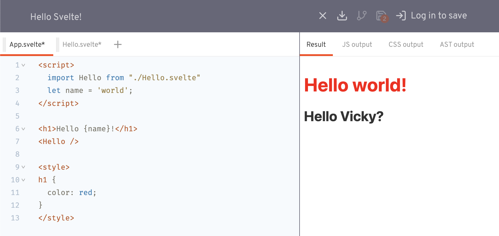
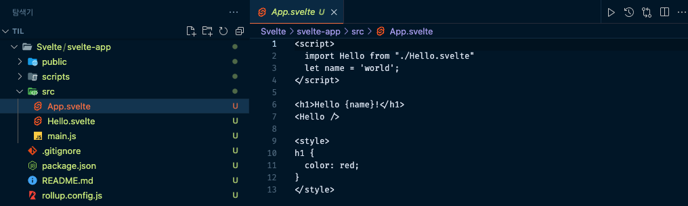
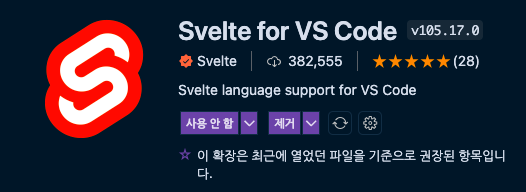

## Svelte 개요

### Svelte는..

Rich Harris가 제작한 새로운 접근 방식의 Front-End Framework
[svelte.dev](https://svelte.dev/) 에서 svelte 관련 도큐먼트를 볼 수 있음.

1. Write less code
   1. 높은 가독성 유지
   2. 개발 시간 단축
   3. 쉬운 리팩토링
   4. 쉬운 디버깅
   5. 더 작은 번들(SPA 최적화)
      1. 최초 번들 로드 시 지연을 최소화시켜준다.
   6. 낮은 러닝 커브
2. No virtual DOM!
   1. No Diffing
   2. No Overhead
   3. 빠른 성능(퍼포먼스)
3. Truly reactive(반응성)
   1. Framework-less VanillaJS
   2. Only use `devDependencies`
      1. Svelte는 작업물(애플리케이션)을 VanillaJS로 변환(컴파일)하고 그 결과만 동작하기 때문에, Svelte는 브라우저(런타임)에서 동작하지 않는 컴파일이라고 할 수 있다.
   3. 명시적 설계(창의적 작업)

단점

1. 낮은 성숙도(작은 생태계)
2. CDN 미제공 : 런타임에서 동작하지 않으므로
3. IE 미지원

### REPL

REPL(read-eval-print loop)란, 사용자에게 데이터를 입력받고 이를 평가(실행)하고 결과를 반환하는 단순한 상호작용 컴퓨터 프로그래밍 환경을 일컫는다. svelte 공홈의 RERL 탭에서 직접 단순한 코드를 테스트해볼 수 있음



위와 같은 코드를 REPL에 입력 후 상단 다운로드 버튼을 눌러 소스코드를 받으면 아래와 같은 소스들이 다운받아진다. 작은 기능들을 테스트해볼 때 위 REPL 활용. 기억하고 싶은 코드들은 깃헙 로그인으로 보관한다.



### vscode에서 Svelte 프로젝트 시작하기

스벨트를 사용하기 위해서는 먼저 node와 npm이 설치되어 있어야 한다.

```bash
> vicky@MacBook-Pro Svelte % node -v
v14.17.3
> vicky@MacBook-Pro Svelte % npm -v
8.1.4
```

모두 설치되었다면 svelte template github을 크롬에 검색해본다. 그러면 svelte/template과 svelte/template-webpack이라는 파일로 나뉘게 되는데, 첫번째 것은 롤업 번들러로 만들어진 것, 두 번째는 웹팩 번들러로 만들어진 템플릿을 의미. 이번 강의에서는 롤업 번들러를 사용한다.

```bash
> uneedcomms@MacBook-Pro lecture % npx degit sveltejs/template svelte-test
Need to install the following packages:
  degit
Ok to proceed? (y) y
> cloned sveltejs/template#HEAD to svelte-test
> uneedcomms@MacBook-Pro lecture % cd svelte-test
> uneedcomms@MacBook-Pro svelte-test % ls
README.md               public                  scripts
package.json            rollup.config.js        src
> uneedcomms@MacBook-Pro svelte-test % npm i
```

위와 같이 원하는 작업 공간에 `sveltejs/template`을 설치 후 npm install을 해주면 아래와 같은 devDepenencies가 프로젝트에 설치된 것을 확인할 수 있다.

```json
"devDependencies": {
  "@rollup/plugin-commonjs": "^17.0.0",
  "@rollup/plugin-node-resolve": "^11.0.0",
  "rollup": "^2.3.4",
  "rollup-plugin-css-only": "^3.1.0",
  "rollup-plugin-livereload": "^2.0.0",
  "rollup-plugin-svelte": "^7.0.0",
  "rollup-plugin-terser": "^7.0.0",
  "svelte": "^3.0.0"
},
"dependencies": {
  "sirv-cli": "^2.0.0"
}
```

그리고 svelte 코드를 하이라이팅을 위해 아래 익스텐션을 설치해주면 작업 강의 준비는 완료된다.


