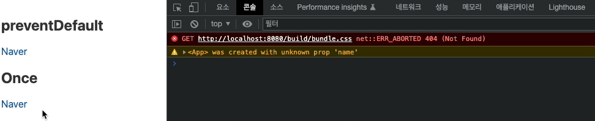

## 사용자 입력 핸들링

### 인라인 이벤트 핸들러

Svelte에서 사용자 입력 핸들링을 만들 때 인라인 핸들러 사용을 추천하는 이유에 대해 한번 더 알아보고자 한다. 스벨트는 자기 자신이 컴파일러이므로 입력핸들링을 내부 인라인으로 작성하더라도 해당 코드를 충분히 최적화할 수 있기 때문이다. 따라서 해당 사용을 권장한다. 반면에 React나 Vue를 사용하면 가상돔을 사용하므로 인라인 핸들러를 가급적 줄이도록 권고하고 있다.

특히나 반복문을 사용할 경우 인라인 핸들러를 사용할 경우 반복되는 아이템의 갯수만큼 런타임 환경에서 메모리를 차지하게 되고, 그만큼 성능이 저하되기 때문이다. 따라서 메소드를 만들어 핸들러를 연결하여 사용하도록 권고하고 있는 것이다.

`App.svelte`

```html
<script>
  let fruits = [
    { id: 1, name: "Apple" },
    { id: 2, name: "Banana" },
    { id: 3, name: "Cherry" },
  ];
  function assign(fruit) {
    fruit.name += "!";
    fruits = fruits;
    // $$invalidate(0, fruits);
  }
</script>

<section>
  {#each fruits as fruit (fruit.id)}
    <div on:click={() => assign(fruit)}>
      {fruit.name}
    </div>
  {/each}
</section>
```

위와 같이 과일들의 목록이 담긴 `fruits` 배열과 클릭 시 이름 뒤에 느낌표를 추가해주는 `assign` 함수가 있다고 하자. 아래 each 문에서는 fruit.id를 키 값으로 하는 리스트가 생성되도록 구현되어 있으며, 해당 div에 클릭 시 fruit 데이터가 인수로 들어가 이름 뒤에 느낌표를 추가하도록 동작하는 소스이다.

이때 위 each 문이 아래와 같다면 어떻게 될까?

```html
<section>
  {#each fruits as fruit (fruit.id)}
    <div on:click={() => (fruit.name += "!")}>
      {fruit.name}
    </div>
  {/each}
	<!-- $$invalidate(0, each_value_1[fruit_index].name += "!", fruits) -->
</section>
```

`assign` 함수를 별도로 넣지 않고, 해당 div 클릭 시 `fruit.name`에 직접 느낌표가 추가되도록 변경해도 해당 컴포넌트는 문제없이 동작하며, 해당 데이터를 공유하는 다른 공간에서도 동일하게 변경사항이 반영된다.

위 코드를 번들 결과로 확인해보면 해당 each 문이 돌아갈 때 위 $$invalidate 함수가 동작하면서 내부 반응성을 가지도록 되어있다. 이 때문에 반복문 내부에 인라인 코드를 넣을 때 아래와 같이 `fruits = fruits;` 코드를 넣어주지 않아도 되는 것이다.

```html
<!-- 아래처럼 하지 않아도 된다. -->
<div on:click={() => {
  fruit.name += "!"
  fruits = fruits;
}}>
	{fruit.name}
</div>
```

`assign` 함수에서 돌아가는 fruits는 인라인 코드 외부에서 돌아가므로 fruits가 어떤 데이터인지 확실하지 않으므로 명시해줘야하는 부분이지만, 위처럼 내부 인라인으로 반복문이 돌아가는 경우 fruits라는 데이터 안에서 실행되는 코드이므로 명시적인 대입을 하지 않아줘도 되는 것임

```html
<section>
  {#each fruits as { id, name } (id)}
    <div on:click={() => (name += "!")}>
      {name}
    </div>
  {/each}
  <!-- $$invalidate(0, each_value[each_index].name += "!", fruits) -->
</section>
```

위 코드는 전개 연산자를 통해 좀 더 개선시킨 버전이다.
빌드 파일로 보면 $$invalidate라는 코드로 실제 데이터가 갱신(반응성)이 되도록 구조가 만들어지는 것을 확인할 수 있다.

### 다중 이벤트 핸들러

스벨트의 다중 이벤트 핸들러에 대해 알아보고자 한다. 아래 코드를 보자.

`App.svelte`

```html
<script>
  let count = 0;
  function increase() {
    count += 1;
  }
</script>

<button on:click="{increase}">Click me!</button>

<h1>{count}</h1>
```

버튼을 클릭했을 때 count의 값이 1씩 증가하는 함수를 button에 클릭 이벤트로 추가해주었다.
만약 클릭 이벤트 동작 시 다른 이벤트를 함께 동작시키려면 어떻게 할 수 있을까?

가장 간단한 방법은 중복해서 작성하는 방법이다.

```html
<script>
  let count = 0;
  function increase() {
    count += 1;
  }
  function current(e) {
    console.log(e.currentTarget);
  }
</script>

<button on:click="{increase}" on:click="{current}">Click me!</button>
```

`on:click`함수가 두 번 작성된 것을 확인할 수 있음. 모두 다 잘 실행된다.

```html
<button
	on:click={increase}
	on:click={current}
	on:click={() => console.log("click!")}
>
	Click me!
</button>

<!-- count + 1 증가 -->
<!-- <button>Click me!</button> -->
<!-- click! -->
```

물론 익명함수로 감싸서 여러개를 추가하는 방법도 가능하다.

### 이벤트 수식어

이번에는 스벨트의 사용자 입력 핸들링에서 사용할 수 있는 다양한 이벤트 수식어들에 대해서 살펴본다

`App.svelte`

```jsx
function clickHandler(event) {
  // console.log(event.target);
  console.log(event.currentTarget);
}
function wheelHandler(event) {
  console.log(event);
}
```

위와 같이 현재 이벤트 객체가 담긴 currentTarget을 확인할 수 있는 clickHandler 함수와 event 객체값을 확인할 수 있는 wheelHandler 함수가 정의되어있다고 했을 때 클릭 이벤트에 대한 기본 동작 방지는 스벨트에서 아래와 같이 작성할 수 있다.

```html
<section>
  <!-- 기본 동작 방지 -->
  <!-- el.addEventListener('click', e => e.preventDefault()) -->
  <h2>preventDefault</h2>
  <a href="https://naver.com" target="_blank" on:click|preventDefault="{clickHandler}">Naver</a>
</section>
```

위 코드는 네이버 페이지를 새로운 페이지로 오픈하는 a 태그에 대한 코드이다. 해당 엘리머트에 click 이벤트에 처음 보는 내용이 있다. `on:click|preventDefault={clickHandler}` 해당 함수는 clickHandler 함수를 실행하기에 앞서 `preventDefault` 함수를 실행하는 스벨트의 지원 수식어(modifier)라고 할 수 있다.

해당 수식어가 적용이 되어있지 않을 경우에는 클릭 시 네이버로 페이지가 새로 오픈되지만 `preventDefault` 수식어가 붙어있는 상태로 클릭하면 a 태그의 기본 클릭 이벤트 동작으로 prevent 하므로 새 페이지가 열리지 않은채 `event.currentTarget`만 로그에 찍히는 것을 확인할 수 있다.

이는 최초 preventDefault 이벤트 실행 후 핸들러를 삭제하도록 구성할 수도 있다.
vertical bar를 두 번 사용하고 `once`라는 예약어를 추가해주면 된다!

```html
<section>
  <!-- 최초 실행 후 핸들러 삭제 -->
  <h2>Once</h2>
  <a href="https://naver.com" target="_blank" on:click|preventDefault|once="{clickHandler}">Naver</a>
</section>
```



중첩 엘리먼트에서 이벤트 버블링 발생을 막아주는 것도 예약어로 해결할 수 있다.

```html
<section>
  <!-- 이벤트 버블링 방지 -->
  <!-- el.addEventListener('click', e => e.stopPropagation()) -->
  <h2>stopPropagation</h2>
  <div class="parent" on:click="{clickHandler}">
    <div class="child" on:click|stopPropagation="{clickHandler}" />
  </div>
</section>
```

`.parent` 엘리먼트와 `.child` **엘리먼트에** 모두 `clickHandler` 함수가 바인딩 되어있는 것을 확인할 수 있다.
만약 `.child` 엘리먼트에 `stopPropagation` 예약어가 설정되어 있지 않을 경우 클릭 시 `.parent`와 `.child` 모두 `clickHandler` 함수가 실행된다.
하지만 예약어로 `stopPropagation`을 넣게되면 .child 엘리먼트에서만 clickHandler 함수가 실행되어 이벤트 버블링 현상을 없앨 수 있다.

위와 반대로 캡쳐링에서 핸들러를 실행하는 것도 `capture` 예약어를 사용하면 손쉽게 가능하다!

```html
<section>
  <!-- 캡쳐링에서 핸들러 실행 -->
  <!-- el.addEventListener('click', e => {}, true) -->
  <!-- el.addEventListener('click', e => {}, {capture: true}) -->
  <h2>capture</h2>
  <div class="parent" on:click|capture="{clickHandler}">
    <div class="child" on:click="{clickHandler}" />
  </div>
</section>
```

캡쳐링은 이벤트 버블링과는 반대 기능을 실행한다.
위와 같이 실행하면 `.parent` 엘리먼트에 바인딩된 `clickHandler` 함수만 실행되고 이는 `.child` 엘리먼트까지 전파되지 않는다.

```html
<section>
  <!-- event의 target 과 currentTarget이 일치하는 경우 핸들러 실행 -->
  <h2>self</h2>
  <div class="parent" on:click|self="{clickHandler}">
    <div class="child" />
  </div>
</section>
```

`self`는 정확히 자기자신을 클릭헀을 때만 실행되도록 처리해준다.
만약 `.child` 엘리먼트가 `.parent` 엘리먼트의 한 영역에 중첩되어 존재할 때 해당 영역을 클릭하면 실행되지 않음.
하지만 중첩되지 않은 순수한 `.parent` 엘리먼트 영역을 클릭하면 `clickHandler` 함수가 정상적으로 실행된다.

이를 더 정확히 확인해보려면 `clickHandler` 함수에 `event.target`을 로그에 찍어보면 된다.
중첩된 영역을 클릭 시 `event.target`에는`.child` 엘리먼트가 `event.currentTarget`에는 `.parent` 엘리먼트가 로깅된다!

```html
<section>
  <!-- 이벤트 처리를 완료하지 않고도 기본 속도로 화면을 스크롤 -->
  <!-- el.addEventListener('wheel', e => {}, {passive: true}) -->
  <h2>passive</h2>
  <div class="parent wheel" on:wheel|passive="{wheelHandler}">
    <div class="child" />
  </div>
</section>
```

뿐만 아니라 passive 이벤트도 추가할 수 있다.

```html
<section>
  <!-- 이벤트 처리를 완료하지 않고도 기본 속도로 화면을 스크롤 -->
  <!-- el.addEventListener('wheel', e => {}, {passive: true}) -->
  <h2>passive</h2>
  <div class="parent wheel" on:wheel|passive="{wheelHandler}">
    <div class="child" />
  </div>
</section>
```

wheel 이벤트 시 passive 예약어를 넣으면 연산이 많은 스크롤 이벤트 동작 시 기본적인 이벤트 처리를 완료하지 않아도
기본 속도로 스크롤 이벤트를 처리하도록 설정하는 것이 passive 이벤트 속성이다. 이는 모바일에서 스크롤 이벤트가 부자연스럽게 동작하는 것을 방지해준다.
