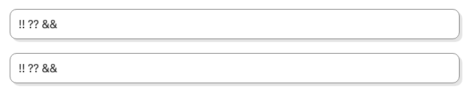
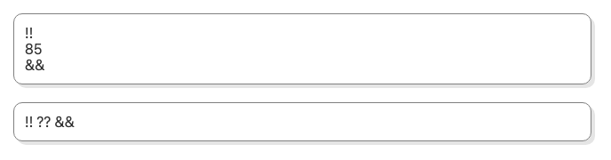
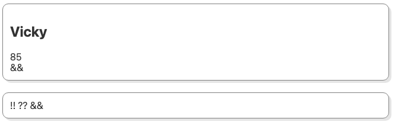
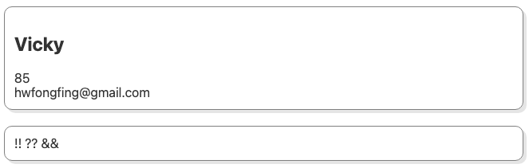
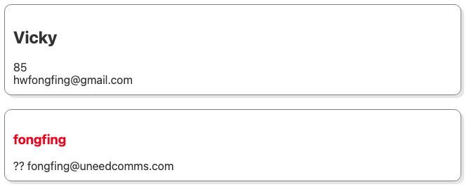
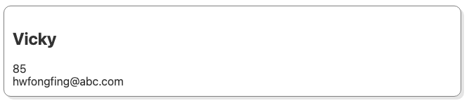
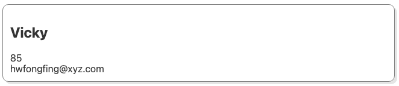
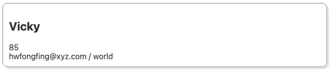

## 슬롯

### 단일 슬롯과 Fallback content

이번에는 스벨트의 슬롯이란 개념에 대해 알아보고자 한다.

`Btn.svelte`

```html
<button>Default Button!</button>

<style>
  button {
    background: lightgray;
    padding: 10px 20px;
    border: none;
    border-radius: 10px;
    cursor: pointer;
    transition: 0.2s;
  }
  button:hover {
    text-decoration: underline;
  }
  button:active {
    transform: scale(1.05);
  }
  button.block {
    width: 100%;
    display: block;
  }
</style>
```

`App.svelte`

```html
<script>
  import Btn from "./Btn.svelte";
</script>

<Btn />
```

위와 같은 컴포넌트 구조가 있다고 하자. button에 대한 기본적인 hover, active, .block 스타일에 대해 정의되어 있고 `App` 컴포넌트에서는 `Btn` 컴포넌트를 호출하여 사용한다.

만약 버튼의 내부 텍스트(버튼명)을 동적으로 주입하기 위해선 어떻게 해야할까?
버튼 컴포넌트을 좀 더 유용하게 사용하기 위해 우린 슬롯이란 개념을 사용할 수 있다.

`App.svelte`

```html
<Btn /> <Btn>Submit!</Btn>
```

위와 같이 첫번째 버튼은 `Default Button!`이라는 텍스트가 노출되고, 두번째 버튼은 `Submit!`이라는 텍스트가 노출되도록 구현하고 싶다면, 이는 아래와 같이 slot 태그를 적으면 간단히 구현할 수 있다.

`Btn.svelte`

```html
<button><slot>Default Button!</slot></button>
```

위와 같이 `slot` 태그를 적용해주면 Btn 컴포넌트 내부에 child 텍스트가 없을 경우 `Default Button!`가 노출되고, 텍스트가 존재할 경우 해당 텍스트로 버튼을 생성할 수 있게된다. (react의 children같은 개념인 듯)

그럼 다른 종류의 버튼들도 만들어보자

`App.svelte`

```html
<Btn block>Submit!</Btn>
<Btn color="royalblue">Submit!</Btn>
<Btn block color="red">Danger!</Btn>
```

위와 같이 `block` 변수와 `color` 데이터를 Btn 컴포넌트의 `props`로 부여한다고 했을 때 Btn 컴포넌트는 이를 아래와 같이 적용할 수 있다.

`Btn.svelte`

```html
<script>
  export let block;
  export let color;
</script>

<!--
<button class={block ? "block" : ""}>
			<slot>Default Button!</slot>
</button>
-->
<button class:block style="background-color: {color}; color: {color ? 'white' : ''};">
  <slot>Default Button!</slot>
</button>
```

위 `class={block ? "block" : ""}` 란 코드는 `class:block` 로 줄여서 작성할 수 있고, 나머지 color 변수는 조건문을 넣어 처리하면 된다.

### 이름을 가지는 슬롯

이번 시간에는 이름을 가지는 슬롯에 대해 배워본다.

`Card.svelte`

```html
<div class="card">
  <slot name="name">!!</slot>
  <slot name="age">??</slot>
  <slot name="email">&&</slot>
</div>

<style>
  .card {
    margin: 20px;
    padding: 12px;
    border: 1px solid gray;
    border-radius: 10px;
    box-shadow: 4px 4px 0 rgba(0, 0, 0, 0.1);
  }
</style>
```

`App.svelte`

```html
<script>
  import Card from "./Card.svelte";
</script>

<Card />
<Card />
```

위와 같은 컴포넌트 구조가 있다고 하자. Card 컴포넌트는 3개의 slot을 가지며, 해당 슬롯은 각각의 name 속성이 정의되어 있다. 위 컴포넌트는 아래의 ui로 도출된다.



이제 App 컴포넌트에 slot 데이터를 부여해본다.

`App.svelte`

```html
<Card>
  <div slot="age">85</div>
</Card>
<Card />
```

위와 같이 slot에 age값을 부여하면 결과는 아래와 같이 도출된다.



이렇듯 이름을 가지는 슬롯은 컴포넌트의 컨텐트로 어떠한 내용을 작성했을 때 해당 컴포넌트에 여러개로 선언된 slot 중 어떤 것을 실행시킬 것인가를 설정해줄 수 있게된다.

`App.svelte`

```html
<Card>
  <div slot="age">85</div>
  <h2 slot="name">Vicky</h2>
</Card>
<Card />
```

위와 같이 h2 데이터를 추가해주면 아래와 같이 결과가 반환된다.



App 컴포넌트에서는 div 다음에 h2 태그를 넣었지만 실제 Card 컴포넌트에서는 slot의 순서가 name → age → email이기 때문에 노출은 name부터 된다. slot의 작성 순서대로 노출되는 것이다.



만약 아래와 같이 작성되어 있을 떄, 두번째 name 슬롯인 fongfing에 h3 태그에 빨간색 color를 주고 싶다면 어떻게 해야할까?

일반적으로 Card 컴포넌트의 style에 `h3 { color: red; }` 로 처리하면 될 것이라고 생각하지만 실제 Card 컴포넌트에 h3 태그가 직접 들어오지 않게 되므로 해당 스타일을 반영하지 못한다. 따라서 해당 스타일은 App.svelte에서 추가해줘야 적절히 반영된다.

`App.svelte`

```html
<Card>
  <div slot="age">85</div>
  <h2 slot="name">Vicky</h2>
  <div slot="email">hwfongfing@gmail.com</div>
</Card>
<Card>
  <span slot="email">fongfing@uneedcomms.com</span>
  <h3 slot="name">fongfing</h3>
</Card>

<style>
  h3 {
    color: red;
  }
</style>
```



### 범위를 가지는 슬롯(Props)

이번에는 범위를 가지는 슬롯에 대해서 알아본다. 범위를 가지는 슬롯은 어떤 의미일까?

`Card.svelte`

```html
<div class="card">
  <slot name="name" />
  <slot name="age">??</slot>
  <slot name="email" domain="@abc.com" />
</div>
```

위와 같이 Card 컴포넌트가 변경되었다고 하자. email 슬롯에 domain 속성이 추가되었다.
이를 App.svelte에서 아래와 같이 적을 수 있다.

`App.svelte`

```html
<Card>
  <div slot="age">85</div>
  <h2 slot="name">Vicky</h2>
  <div slot="email" let:domain>hwfongfing{domain}</div>
</Card>
```

위처럼 `let:domain`으로 domain 변수 값을 사용할 수 있게 된다. 단, domain이 정의된 범위에서만 해당 데이터를 사용할 수 있음을 참고하자.



그렇다면 slot의 name 속성도 변수처럼 사용할 수 있을까? no!
name은 슬롯의 예약어이므로 변수로 사용할 수 없다.

`Card.svelte`

```html
<script>
  let domain = "@xyz.com";
</script>

<div class="card">
  <slot name="name" />
  <slot name="age">??</slot>
  <slot name="email" {domain} />
</div>
```

위처럼 별도의 domain 변수를 선언 후 slot에 domain 속성으로 적용하는 것도 가능하다.



이처럼 범위를 가지는 슬롯을 활용해볼 수 있다. 또한, 이러한 범위를 가지는 슬롯은 여러 개 사용할 수 있다.

`Card.svelte`

```html
<div class="card">
  <slot name="name" />
  <slot name="age">??</slot>
  <slot name="email" {domain} hello="world" />
</div>
```

`App.svelte`

```html
<Card>
  <div slot="age">85</div>
  <h2 slot="name">Vicky</h2>
  <div slot="email" let:domain let:hello>hwfongfing{domain} / {hello}</div>
</Card>
```



위처럼 여러개의 범위를 가진 슬롯을 사용할 수 있게된다.

그런데 이러한 슬롯은 실무에서 어떻게 활용할 수 있을까? 아래 예제를 보자

`App.svelte`

```html
<script>
  import Wrap from "./Wrap.svelte";

  let fruits = {
    apple: {
      value: "",
      options: {
        readonly: false,
        disabled: false,
        placeholder: "placeholder A",
      },
    },
    banana: {
      value: "BANANA",
      options: {
        disabled: false,
        placeholder: "placeholder",
      },
    },
  };

  function add(name) {
    console.log(name);
  }
  function update(name) {
    console.log(name);
  }
  function remove(name) {
    console.log(name);
  }
</script>

<label name="apple" class="fruits__apple">
  <input bind:value={fruits.apple.value} readonly={fruits.apple.options.readonly}
  disabled={fruits.apple.options.disabled} placeholder={fruits.apple.options.placeholder} on:change={() => add("apple")}
  />
</label>
```

위와 같이 fruits 데이터를 노출하는 input 이 있다고 했을 때 apple이 들어간 데이터는 위 엘리먼트처럼 적을 수 있다. 만약 여기에서 banana 타입의 데이터를 동일하게 생성할 경우 어떻게 하면 될까?

```html
<!-- 각 과일마다 컴포넌트를 다 따로 작성? 만약 100개가 넘어간다면? -->
<!-- <label name="banana" class="fruits__banana">
  <input
    bind:value={fruits.banana.value}
    readonly={fruits.banana.options.readonly}
    disabled={fruits.banana.options.disabled}
    placeholder={fruits.banana.options.placeholder}
    on:change={() => add("banana")}
  />
</label>-->
```

위와 같이 단순 데이터를 작성하는 방법으로는 지나치게 불필요한 시간이 낭비 될 수 있다. 이를 slot을 통해 더욱 간단히 구현할 수 있는데 아래 코드를 보자

`Wrap.svelte`

```html
<script>
  export let scopeName;
</script>

<div>
  <slot _name="{scopeName}" />
</div>
```

위와 같은 slot을 가진 Wrap 컴포넌트가 있다고 했을 때 name은 slot의 정의된 예약어이므로 변수로 사용하기 위해 \_name 속성을 위처럼 적용해준다. 그리고 아래와 같이 App.svelte에 적용해본다.

`App.svelte`

```html
<Wrap scopeName="apple" let:_name>
  <label name="{_name}" class="fruits__{_name}">
    <input bind:value={fruits[_name].value} readonly={fruits[_name].options.readonly}
    disabled={fruits[_name].options.disabled} placeholder={fruits[_name].options.placeholder} on:change={() =>
    add(_name)} />
  </label>
</Wrap>

<!-- scopeName만 banana로 변경 -->
<Wrap scopeName="banana" let:_name>
  <label name="{_name}" class="fruits__{_name}">
    <input bind:value={fruits[_name].value} readonly={fruits[_name].options.readonly}
    disabled={fruits[_name].options.disabled} placeholder={fruits[_name].options.placeholder} on:change={() =>
    add(_name)} />
  </label>
</Wrap>
```

위처럼 `_name` 변수로 `scopeName`을 부여하면 변수를 보간법으로 사용할 수 있게되어 불필요한 코드 작성을 방지할 수 있게 되며, 작성 중 발생할 수 있는 오류를 미연에 방지할 수 있는 효과를 가진다. 이처럼 불필요한 코드를 줄일 수 있는 하나의 방법으로 slot을 선택하면 훨씬 효율적인 프로그래밍이 가능해진다.

### 슬롯 포워딩(Forwarding)

이번 시간에는 슬롯 포워딩에 대한 개념에 대해 알아보고자 한다.

`App.svelte`

```html
<script>
  import Parent from "./Parent.svelte";
</script>

<Parent>
  <h2>Default slot..</h2>
</Parent>
```

`Parent.svelte`

```html
<script>
  import Child from "./Child.svelte";
</script>

<Child />
<slot />
```

위와 같은 구조가 있다고 했을 때 App 컴포넌트에서 작성한 `<h2>Default slot..</h2>`를 Parent 컴포넌트에서 노출하려면 위와 같이 작성한다. 이 slot 데이터를 Child 컴포넌트에서 노출하기 위해선 슬롯 포워딩에 대한 개념을 알아야 한다.

`Parent.svelte`

```html
<Child><slot /></Child>
```

`Child.svelte`

```html
<slot></slot>
```

위와 같이 구조를 변경해주면 Child 컴포넌트에서 해당 슬롯 데이터가 적절히 노출되는 것을 확인할 수 있다. 그렇다면 이름을 가진 슬롯은 어떻게 포워딩할 수 있을까?

`App.svelte`

```html
<Parent>
  <h2>Default slot..</h2>
  <h3 slot="named">Named slot...</h3>
</Parent>
```

`Parent.svelte`

```html
<Child>
  <slot />
  <slot name="named" slot="named-child" />
</Child>
```

`Child.svelte`

```html
<slot name="named-child" /> <slot />
```

위와 같이 작성해줄 수 있다.

App 컴포넌트: slot=named → Parent 컴포넌트: slot name=named
Parent 컴포넌트: slot=named-child → Child 컴포넌트: slot name=named-child

위와 같이 연결해주면 됨. 그럼 범위를 가진 슬롯은 어떻게 포워딩할까?

`Child.svelte`

```html
<script>
  let scoped = "Scoped!";
</script>

<slot name="scoped-child" {scoped} />
```

`Parent.svelte`

```html
<Child let:scoped>
  <slot name="scoped" slot="scoped-child" {scoped} />
</Child>
```

`App.svelte`

```html
<Parent let:scoped>
  <h1 slot="scoped">Scoped slot... {scoped}</h1>
</Parent>
```

위와 같이 scoped 범위 슬롯을 Child → Parent → App 컴포넌트 순으로 대입해주면 App 컴포넌트에서 scoped란 데이터를 사용할 수 있게 된다.
