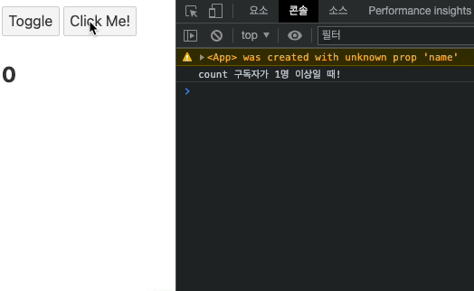

## 스토어

### 쓰기 기능 스토어(writable) & 수동 구독과 자동 구독

이번에는 쓰기 가능한 스토어에 대해서 알아보고자 한다. 아래 구조를 보자

`App.svelte`

```html
<script>
  import WritableMethods from "./WritableMethods.svelte";
  let toggle = true;
</script>

<button on:click={() => (toggle = !toggle)}>Toggle</button>

{#if toggle}
  <WritableMethods />
{/if}
```

`store.js`

```jsx
import { writable } from "svelte/store";

export let count = writable(0);
```

`WritableMothods.svelte`

```html
<script>
  import { count } from "./store.js";
  console.log(count); // { set: f, update: f, subscribe: f }
  let number;

  // 스토어 객체인 count를 구독(subscribe)를 하며, 값이 변경되면 익명함수가 실행되며 number에 대입한다.
  count.subscribe((c) => {
    number = c;
  });
</script>

<h2>{number}</h2>
```

위와 같은 컴포넌트 구조가 있다고 하자. WritableMethods 컴포넌트에서 스토어 객체인 count를 바라보고, 해당 값의 변화에 따라 number 변수가 변경되는 로직이다.

이번에는 count가 실제로 변경되도록 구성해보자

`WritableMothods.svelte`

```html
<script>
  import { count } from "./store.js";
  console.log(count);
  let number;

  // 스토어 객체인 count를 구독(subscribe)를 하며, 값이 변경되면 익명함수가 실행되며 number에 대입한다.
  count.subscribe((c) => {
    number = c;
  });

  function increase() {
    // count 값을 1 증가시키면, number는 count를 구독하므로 값이 함께 증가한다.
    count.update((c) => c + 1);
  }
</script>

<button on:click="{increase}">Click Me!</button>
<h2>{number}</h2>
```

위처럼 button에 increase 함수를 연결시켜준다. increase 함수는 `count` 값을 1 증가시키며 `number`는 `count` 값을 구독하므로 값이 함꼐 증가한다.

또 다른 스토어 기능에 대해 알아보자.

`store.js`

```jsx
import { writable } from "svelte/store";

// export let count = writable(0);
export let count = writable(0, () => {
  console.log("count 구독자가 1명 이상일 때!");
});
```

writable 객체에 첫번째 인수로 해당 스토어 값의 초기값을 지정할 수 있었다. 이외로도 두 번째 인수에 위와 같이 익명함수를 넣어줄 수도 있다. 이는 해당 객체에 구독(subscribe)이 생기게 되면, 위 두번째 인수가 실행된다. (생겨날 때마다 실행되는 것이 아닌, 구독자가 1명 이상이면 최초로 실행된다.)

위 두 번째 인수가 반환값을 가지도록 아래와 같이 작성할 수도 있다.

`store.js`

```jsx
export let count = writable(0, () => {
  console.log("count 구독자가 1명 이상일 때!");
  return () => {
    console.log("count 구독쟈가 0명일 때..");
  };
});
```

위 return 코드는 스토어 객체가 구독이 취소되어 반활될 떄 실행되는 것이다. (구독이 취소될 때마다 실행되는 것이 아닌, 구독이 0이 되면 최초로 실행된다.)

`WritableMethods.svelte`

```jsx
import { onDestroy } from "svelte";
import { count } from "./store.js";

let number;

// unsubscribeCount라는 변수에 subscribe 객체를 담는다.
const unsubscribeCount = count.subscribe((c) => {
  number = c;
});

// onDestory를 실행할 때 구독이 반환되도록 한다.
onDestroy(() => {
  unsubscribeCount();
});

// ...
```

위처럼 코드를 작성한 후 컴포넌트가 `onDestroy` 되는 Toggle 버튼 클릭 시점을 눌러보면 아래와 같이 동작하는 것을 확인할 수 있다.



구독자를 좀 더 늘려보자.

`WritableMethods.svelte`

```jsx
const unsubscribeCount = count.subscribe((c) => (number = c));
count.subscribe((c) => {});

onDestroy(() => {
  unsubscribeCount(); // 2개의 구독 중 하나만 취소함
});
```

위와 같이 구독이 2개가 되었을 떄 `onDestroy` 시에는 첫번째 구독만 취소해주는 로직이므로 `Toggle` 버튼을 클릭해도 `count`의 return 함수는 실행되지 않는다.


즉, writable 객체의 두 번째 인수는 구독이 발생하는 최초 1번만 실행되고, 내부 return 코드도 구독이 취소될 때마다 실행되는 것이 아닌, 구독이 0이 되면 최초로 실행된다는 것을 알 수 있다.

`WritableMethods.svelte`

```jsx
const unsubscribeCount = count.subscribe((c) => (number = c));
const unsubscribeCount2 = count.subscribe((c) => {});

onDestroy(() => {
  unsubscribeCount();
  unsubscribeCount2();
});
```

위와 같이 두 구독 객체를 모두 onDestroy 시에 취소하면 writable의 두번째 인수에 들어있던 반환문이 실행되는 것을 확인할 수 있다. 다른 스토어 객체도 하나 만들어보자

`store.js`

```jsx
export let name = writable("Vicky");
```

`WritableMethods.svelte`

```html
<script>
  import { count, name } from "./store.js";

  let userName;

  name.subscribe((n) => (userName = n)); // userName에 name 할당

  function changeName() {
    // name.update(() => "Wonny");
    name.set("Wonny");
  }
</script>

<button on:click="{changeName}">Click Me!</button>

<h2>{userName}</h2>
```

위와 같이 클릭 시 `userName`을 변경해주는 코드를 넣었다. 이 때 값 변경 메서드를 `update`가 아닌 `set`을 사용해서 직접 값 변경이 되도록 처리하면 더욱 간단하게 구현할 수 있겠다.

전체적인 코드를 보면 store에서 데이터를 가져와 반응성을 가지는 형태로 적용해주고, 구독 취소가 되도록 하는 로직을 만들어주는 과정이 번거롭게 느껴지기도 한다. 지금까지 작성한 코드는 스토어의 수동 구독 형태인데, 이를 자동 구독 형태로 간단히 만들어줄 수 있다.

`store.js`

```jsx
import { writable } from "svelte/store";

export let count = writable(0, () => {
  console.log("count 구독자가 1명 이상일 때!");
  return () => {
    console.log("count 구독쟈가 0명일 때..");
  };
});

export let name = writable("Vicky", () => {
  console.log("name 구독자가 1명 이상일 때!");
  return () => {
    console.log("name 구독쟈가 0명일 때..");
  };
});
```

먼저 구독 취소가 모두 잘되고 있는지 store 객체의 두 번째 인수를 모두 채워준다.

`WritableMethods.svelte`

```html
<script>
  import { count, name } from "./store.js";

  function increase() {
    $count += 1;
  }

  function changeName() {
    $name = "Wonny";
  }
</script>

<button on:click="{increase}" on:click="{changeName}">Click Me!</button>

<h2>{$count}</h2>
<h2>{$name}</h2>
```

이처럼 store 객체를 직접 값을 수정되도록 대부분의 코드를 변경해주면 기존 로직과 동일하게 동작하는 것을 확인할 수 있다.


Svelte 컴포넌트에서는 스토어 자동 구독 방식을 사용하는 것이 더 권장된다. 하지만, svelte 컴포넌트가 아닌 곳에서는 자동 구독 방식을 사용할 수 없으므로 이때는 앞서 배운 수동 구독 방식으로 구현해야 한다.
