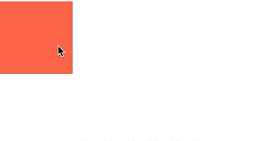
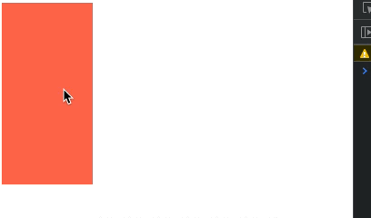

## 액션

### 사용 패턴 정리

Svelte에는 액션이라는 개념이 있다.

`App.svelte`

```html
<script>
  const hello = (node) => {
    console.log(node); // <div></div>
    node.style.width = "100px";
    node.style.height = "100px";
    node.style.backgroundColor = "tomato";
  };
</script>
****
<div use:hello />
```

위처럼 `use`라는 directive에 매개변수를 로깅해보면 해당 노드가 나온다. 이 매개변수에 직접적으로 스타일을 부여할 수 있다. 액션의 가장 기본적인 형태이다.

```html
<script>
  const hello = (node, options = {}) => {
    const { width = "100px", height = "100px", color = "tomato" } = options;
    console.log(node); // <div></div>
    node.style.width = width;
    node.style.height = height;
    node.style.backgroundColor = color;
  };
</script>

<div use:hello />
<div use:hello={{ width: "200px", height: "70px", color: "royalblue", }} />
```

hello라는 함수 뒤에 데이터를 연결할 수 있으며, 이는 문자, 객체리터럴 등 다양한 데이터 전달이 가능하다.


해당 액션 함수는 몇가지 객체를 리턴할 수도 있다.

```html
<script>
  let toggle = true;
  let width = 200;

  const hello = (node, options = {}) => {
    console.log("init function !");
		// ...

    return {
      update: () => console.log("update"),
      destroy: () => console.log("destroy"),
    };
  };
</script>

<button on:click={() => (toggle = !toggle)}>Toggle!</button>
<button on:click={() => (width += 20)}>Size up!</button>

<div use:hello />
{#if toggle}
  <div
    use:hello={{
      width: `${width}px`,
      height: "70px",
      color: "royalblue",
    }}
  />
{/if}
```

위와 같다고 했을 때, 초기 함수의 init 시점과 update, destroy 시점을 모두 체크할 수 있다.


즉 options 값이 변경되면 update가 실행되고, 컴포넌트가 사라지면 destroy가 사용된다.
이 밖에 update 함수에는 매개변수로 변경된 데이터를 받아볼 수 있다.

`App.svelte`

```jsx
let toggle = true;
let width = 200;

const hello = (node, options = {}) => {
  const { width = "100px", height = "100px", color = "tomato" } = options;
  node.style.width = width;
  node.style.height = height;
  node.style.backgroundColor = color;

  return {
    update: (opts) => {
      console.log("update", opts);
      node.style.width = opts.width;
    },
    destroy: () => console.log("destroy"),
  };
};
```

위처럼 update 함수 내에 opts 를 콘솔로그로 찍어보면 변경된 options 데이터가 들어오고 이를 실제 width 가 변경되도록 로직을 반영해주면 버튼 클릭 시 width 값이 변경되도록 처리할 수 있다.


### 요소 Zoom In-Out 예제

지난 시간에 배운 svelte 액션으로 간단한 예제를 구현해보자

`App.svelte`

```html
<script>
  function zoom(node) {
    node.style.transition = "1s";
    function zoomIn() {
      node.style.transform = "scale(1.5)";
    }
    function zoomOut() {
      node.style.transform = "scale(1)";
    }
    node.addEventListener("mouseenter", zoomIn);
    node.addEventListener("mouseleave", zoomOut);

    return {
      destroy() {
        node.removeEventListener("mouseenter", zoomIn);
        node.removeEventListener("mouseleave", zoomOut);
      },
    };
  }
</script>

<div use:zoom />

<style>
  div {
    width: 100px;
    height: 100px;
    background-color: tomato;
  }
</style>
```

위처럼 작성된 코드가 있다고 했을 때, 위 zoom 함수는 기존 액션함수로 만들어져있다.
mouseEnter 시와 mouseLeave 시에 대한 동작 코드가 적혀있고, 해당 엘리먼트가 사라질 때, 해당 이벤트도 사라지도록 처리했다.



이번에는 다른 이벤트도 연결해본다.

`App.svelte`

```html
<script>
  function zoom(node, scale = "1.5") {
    node.style.transition = "1s";
    function zoomIn() {
      node.style.transform = `scale(${scale})`;
    }
    function zoomOut() {
      node.style.transform = "scale(1)";
    }
    node.addEventListener("mouseenter", zoomIn);
    node.addEventListener("mouseleave", zoomOut);

    return {
      destroy() {
        node.removeEventListener("mouseenter", zoomIn);
        node.removeEventListener("mouseleave", zoomOut);
      },
    };
  }
</script>

<div use:zoom />
<div use:zoom="{0.7}" />
```

위와 같이 zoom 함수에 scale 이라는 두번째 인자값을 주고, 해당 값으로 scale이 적용되도록 처리하였다. 기본값으로 1.5를 주지않으면 scale의 값이 undefined가 되니 이 점 참고하자.


