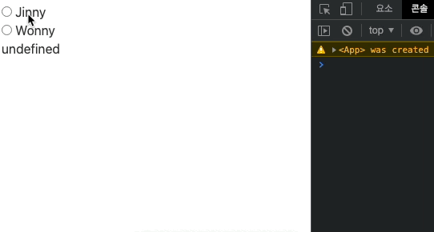
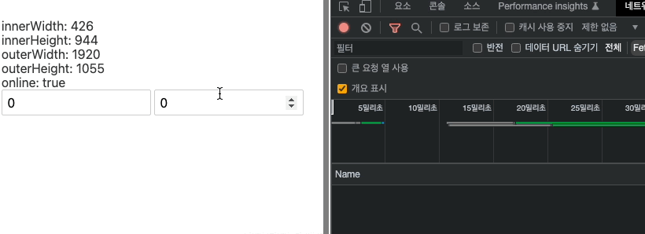
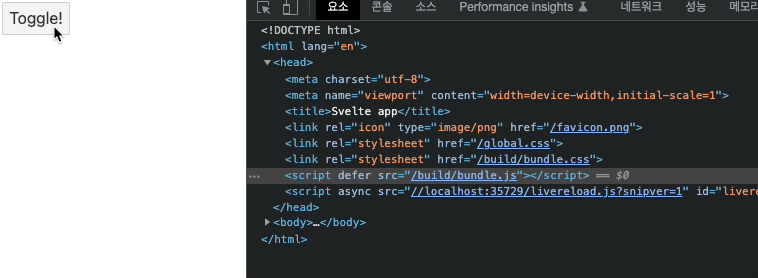
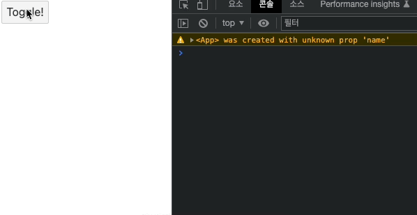
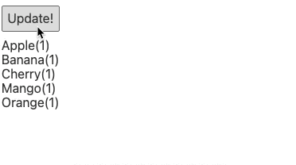
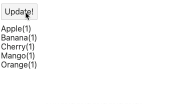
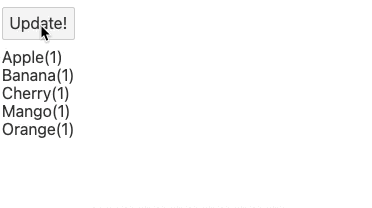

## 특별한 요소

### 컴포넌트 재귀 호출(self)

이번 시간에는 svelte의 특별한 요소인 self에 대해 알아본다.
아래 예제를 보자

`App.svelte`

```html
<script>
  import Address from "./Address.svelte";

  let address = {
    label: "대한민국",
    children: [
      { label: "경기도", children: [{ label: "수원" }, { label: "성남" }] },
      { label: "강원도", children: [{ label: "속초" }, { label: "강릉" }] },
    ],
  };
</script>

<address {address} />
```

`Address.svelte`

```html
<script>
  export let address;
</script>

<ul>
  <li>
    {address.label} {#if address.children} {#each address.children as address}
    <svelte:self {address} />
    {/each} {/if}
  </li>
</ul>
```

App 컴포넌트에서 address 변수의 주소 객체가 담겨있고 이를 Address 컴포넌트로 데이터를 내려주고 있다.
Address 컴포넌트는 전달받은 address 데이터로 데이터를 렌더링 하는데, 이를 svelte의 `self` 요소를 사용하는 컴포넌트에 렌더링 한다.


이 self 요소는 재귀(resursion) 호출을 의미하는데, 재귀는 자기 내부에서 자기 자신을 호출하는 것을 의미함. 즉 `svelte:self`란 Address 컴포넌트를 재귀적으로 자기 자신을 호출한다는 의미이다. 재귀 호출은 반드시 종료 조건이 있어야 하며, `address.children`이 있을 때에만 재귀 호출이 일어나도록 처리한다는 로직이 제한 조건임을 알 수 있다.

### 동적 컴포넌트 렌더링(component)

`App.svelte`

```html
<script>
  import Jinny from "./Jinny.svelte";
  import Wonny from "./Wonny.svelte";

  let components = [{ name: "Jinny" }, { name: "Wonny" }];
  let selected;
</script>

{#each components as { name } (name)}
<label>
  <input type="radio" value="{name}" bind:group="{selected}" />
  {name}
</label>
{/each} {#if selected === "Jinny"}
<Jinny />
{:else if selected === "Wonny"}
<Wonny />
{/if}
```

`Jinny.svelte`

```html
<h2>Jinny!</h2>
```

`Wonny.svelte`

```html
<h2>Wonny?</h2>
```

App 컴포넌트는 `components` 라는 데이터를 바탕으로 각 radio 인풋 데이터를 노출하도록 구성되어있다.
선택된 결과에 따라 Jinny 혹은 Wonny 컴포넌트를 렌더링하도록 되어있는 구조인데, 만약 해당 데이터가 늘어난다면 위와 같이 같은 반복적인 컴포넌트를 모두 만들고, 이를 if 분기문에서 모두 체크하도록 구현하는 방법이 최선일까?

아님. 스벨트의 요소(태그)를 만들면 쉽게 동적 렌더링 구현이 가능하다.

`App.svelte`

```html
<script>
  import Jinny from "./Jinny.svelte";
  import Wonny from "./Wonny.svelte";

  let components = [
    { name: "Jinny", comp: Jinny },
    { name: "Wonny", comp: Wonny },
  ];
  let selected;
</script>

{#each components as { name, comp } (name)}
<label>
  <input type="radio" value="{comp}" bind:group="{selected}" />
  {name}
</label>
{/each}

<svelte:component this="{selected}" />
<div>{selected}</div>

<!-- {#if selected === "Jinny"}
  <Jinny />
{:else if selected === "Wonny"}
  <Wonny /> 
{/if} -->
```

위처럼 `components` 객체 데이터에 해당하는 컴포넌트를 값으로 넣고, `each` 문에서 input value를 해당하는 컴포넌트로 처리하면, 하단 `svelte:component` 에서 적용된 컴포넌트가 동적으로 렌더링되며, 하단 selected 값에는 컴포넌트 객체 값이 그대로 노출된다. 이때 해당 요소에는 렌더링 될 this 객체가 전달되어야 하는데, 이 객체를 전달할 때에는 기존에 사용하던 `bind:this` 가 아닌 `this` 값 자체에 객체를 넘겨줘야한다



위처럼 화면에 출력하고자 하는 여러 컴포넌트를 가져온 다음에 상황에 맞게 혹은 사용자의 선택에 맞게 해당하는 컴포넌트를 동적으로 출력할 때 해당 기능을 활용할 수 있다. 또한, 해당 `svelte:component`는 `props` 데이터를 그대로 사용할 수 있어야 한다. 테스트를 위해 index라는 props 데이터를 만들어 적용해줘보자

`App.svelte`

```html
<script>
  // ..
  let index = 1;
</script>

<!-- codes.. -->
<svelte:component this="{selected}" {index} />
```

`Jinny.svelte`

```html
<script>
  export let index;
</script>

<h2>{index}. Jinny!</h2>
```

`Wonny.svelte`

```html
<script>
  export let index;
</script>

<h2>{index}. Wonny!</h2>
```

위처럼 추가한 뒤 다시 radio input을 클릭해보면 해당 Props가 잘 전달되어 노출되는 것을 확인할 수 있다.


그럼 조금 더 발전시켜서 이 index가 components의 등록된 순서대로 노출되도록 하고 싶다면
아래와 같이 할 수 있다.

`App.svelte`

```html
<script>
  // ..
  let selected = components[0].comp; // selected 값에 초기값으로 components의 첫번째 컴포넌트 대입
</script>

// each 문 내에 index 변수로 i를 사용 {#each components as { name, comp }, i (name)}
<label> <input type="radio" value={comp} bind:group={selected} on:change={() => (index = i + 1)} /> {name} </label>
{/each}

<svelte:component this="{selected}" {index} />
```

selected 값에 components의 첫번째 요소를 초기값으로 할당하고, each 문에서 on:change 이벤트로 index 값을 더해주는 방법이다. 위와 같이 하면 components에 값이 담긴 순서대로 index가 하나씩 증가하여 노출되도록 해줄 수 있다.


### window

스벨트에는 svelte window 요소가 존재한다. 아래 예시를 보자

`App.svelte`

```html
<script>
  let key = "";

  window.addEventListener("keydown", (event) => {
    key = event.key;
  });
</script>

<h1>{key}</h1>
```

위 코드는 keydown 이벤트 발생 시 누른 글자를 그대로 화면에 보여준다.


위 코드는 svelte의 window 요소를 사용해 아래와 같이 작성할 수 있다.

`App.svelte`

```html
<script>
  let key = "";
</script>

<svelte:window on:keydown={(e) => (key = e.key)} />
<h1>{key}</h1>
```

위와 동일한 기능을 수행한다. 스벨트에서 제공하는 window 요소를 통해 window 객체를 직접사용하지 않아도 이벤트를 연결할 수 있도록 하는 것이다. 이 밖에도 다른 기능이 많다.

`App.svelte`

```html
<script>
  let key = "";
  // readable property
  let innerWidth; // viewport 크기
  let innerHeight;
  let outerWidth; // browser 크기
  let outerHeight;
  let online; // 현재 상태가 online 상태인지 여부
  // writable property
  let scrollX;
  let scrollY;

  // window.addEventListener("keydown", (event) => {
  //   key = event.key;
  // });
</script>

<svelte:window on:keydown={(e) => (key = e.key)} bind:innerWidth bind:innerHeight bind:outerWidth bind:outerHeight
bind:online bind:scrollX bind:scrollY />
<h1>{key}</h1>
<div>innerWidth: {innerWidth}</div>
<div>innerHeight: {innerHeight}</div>
<div>outerWidth: {outerWidth}</div>
<div>outerHeight: {outerHeight}</div>
<div>online: {online}</div>
<input type="number" bind:value="{scrollX}" />
<input type="number" bind:value="{scrollY}" />
<div class="for-scroll" />

<style>
  .for-scroll {
    height: 2000px;
  }
</style>
```



### head, body

스벨트에서 제공하는 head, body에 대해서도 알아본다

`App.svelte`

```html
<script>
  import Jenny from "./Jenny.svelte";
  let toggle = false;
</script>

<button on:click={() => (toggle = !toggle)}>Toggle!</button>

{#if toggle}
  <Jenny />
{/if}
```

`Jenny.svelte`

```html
<h1>Jenny!</h1>
```

toggle 값에 따라 Jenny 컴포넌트를 렌더링하는 간단한 동적 컴포넌트 렌더링 코드가 있다.
위 Jenny 컴포넌트에서 head, body 내에 들어갈 요소를 직접 추가해줄 수 있는데 아래 예시를 보자.

`Jenny.svelte`

```html
<svelte:head>
  <link rel="stylesheet" href="./main.css" />
</svelte:head>

<h1>Jenny!</h1>
```

위 코드처럼 `svelte:head` 스벨트 컴포넌트 내에 head, body에 소스를 직접 넣어줄 수 있다.

단, 위처럼 `main.css` 경로를 작성 후 저장하면 실제 `main.css`를 빌드한 파일이 /public 경로에 존재하지 않으므로, `index.html`와 같은 경로 선상에 `main.css`를 추가해준 뒤 새로고침하면 해당 코드가 적절히 실행되는 것을 확인할 수 있다.

`./public/main.css`

```css
body {
  background: royalblue;
}
```



위처럼 특정한 컴포넌트에서 head의 요소를 추가 및 삭제하는 용도로 사용할 수 있겠다.
`svelte.body`도 비슷하게 사용할 수 있다.

`Jenny.svelte`

```html
<!-- document.head -->
<svelte:head>
  <link rel="stylesheet" href="./main.css" />
</svelte:head>

<!-- document.body -->
<svelte:body on:mousemove={(e) => console.log(e.clientX, e.clientY)} />
<h1>Jenny!</h1>
```

위처럼 작성 후 Jenny 컴포넌트가 렌더링되도록 toggle 값을 변경해주면 마우스 커서의 움직임에 따른 값들을 콘솔에서 확인할 수 있다.



### options - 불변성 선언(immutable)

이번 시간에는 svelte.options의 Immutable 속성에 대해 알아보자.

`App.svelte`

```html
<script>
  import Fruit from "./Fruit.svelte";

  let fruits = [
    { id: 1, name: "Apple" },
    { id: 2, name: "Banana" },
    { id: 3, name: "Cherry" },
    { id: 4, name: "Mango" },
    { id: 5, name: "Orange" },
  ];
</script>

<button
  on:click={() => {
    fruits[0] = { id: 1, name: "Apple" }; // 같은 데이터지만 객체 데이터는 가변성 데이터이므로 할당되는 메모리 위치는 달라진다.
    fruits = fruits;
  }}
>
	Update!
</button>

{#each fruits as fruit (fruit.id)}
  <Fruit {fruit} />
{/each}
```

`Fruit.svelte`

```html
<script>
  export let fruit;
</script>

<div>{fruit.name}</div>
```

위와 같은 데이터가 있다. 버튼을 클릭 했을 때 fruits의 첫번째 값이 바뀌는 코드이다. 바뀌는 값은 기존의 데이터와 동일하지만 객체 데이터는 가변성 데이터(객체, 배열, 함수 등)이므로 할당되는 메모리 위치는 바뀌며 이는 값 업데이트로 이어진다.

해당 값이 변경되었을 때, 전체 모든 데이터가 갱신되는 것인지, 해당 값만 갱신되는 것인지, 아니면 같은 값인 경우 갱신이 되지 않는 것인지 아래와 같이 확인할 수 있음

`Fruit.svelte`

```html
<script>
  import { afterUpdate } from "svelte";
  export let fruit;

  let updateCount = 0;
  afterUpdate(() => (updateCount += 1));
</script>

<div>{fruit.name}({updateCount})</div>
```

위처럼 갱신 데이터를 afterUpdate 메서드를 통해 체크해보면 아래와 같이 노출된다.



모든 fruit 데이터가 전체 다 갱신되는 것이다. 이는 props에 전달되는 데이터가 가변성 객체이므로 발생하는 현상이다. 가변 데이터로 전제되는 것이다. 어떤 컴포넌트에 props로 가변성 데이터를 넘겨줄 경우 항상 새로운 데이터가 갱신된다고 여겨지므로 이때 가변성 데이터가 아니라고 명시할 수 있는 svelte:options 메서드를 활용할 수 있다.

`Fruit.svelte`

```html
<svelte:options immutable />

<script>
  import { afterUpdate } from "svelte";
  export let fruit;
  // 기존 fruit === 새로운 fruit

  let updateCount = 0;
  afterUpdate(() => (updateCount += 1));
</script>

<div>{fruit.name}({updateCount})</div>
```

위처럼 fruit 데이터가 같은 데이터일 경우 갱신처리를 하지 않도록 immutable 옵션을 활성화 시켜주면 실제 변경되는 Apple 데이터만 갱신 count가 증가한다.



이렇게 각 child 컴포넌트에서 불변객체 처리를 해주는 것 외에도 반복문 자체에 구조 분해를 사용해서 아래와 같이 처리할 수도 있다.

`App.svelte`

```html
<script>
  import Fruit from "./Fruit.svelte";

  let fruits = [
    { id: 1, name: "Apple" },
    { id: 2, name: "Banana" },
    { id: 3, name: "Cherry" },
    { id: 4, name: "Mango" },
    { id: 5, name: "Orange" },
  ];
</script>

<!-- code... -->
{#each fruits as { id, name } (id)}
<Fruit {name} />
{/each}
```

위처럼 id, name 속성을 구조 분해해서 사용하면 두 속성 모두 불변성의 문자 데이터만 전달되므로 Fruit 컴포넌트의 Props로 불변성 데이터만 취급하도록 만들 수 있다.



위처럼 처리될 경우 첫 번째 데이터인 Apple도 count 변경이 되지 않는데, 해당 데이터도 기존 name 값과 변경되는 name 값이 같다고 여기기 때문이다.

### options - 접근 허용(accessors)

이번에는 svelte의 accessors 라는 속성에 대해 살펴본다. 아래 예시를 보자

`App.svelte`

```html
<script>
  import Joy from "./Joy.svelte";

  let joy;
  function handler() {
    console.log(joy);
    console.log(joy.name); // undefined
    console.log(joy.getAge()); // App.svelte:8 Uncaught TypeError: joy.getAge is not a function
  }
</script>

<button on:click="{handler}">Toggle!</button>
<Joy bind:this="{joy}" />
```

`Joy.svelte`

```html
<script>
  let age = 33;
  let name = "Joy";
  function getAge() {
    console.log(age); // Joy {$$: {…}, $capture_state: ƒ, $inject_state: ƒ}
  }
</script>

<h1 on:click="{getAge}">{name}!</h1>
```

위 `Toggle` 버튼을 클릭하면 `Joy` 컴포넌트의 `this`로 대입해 준 `joy` 변수를 콘솔창에서 확인할 수 있다. Joy 컴포넌트는 이름을 노출시키며, h1 태그를 클릭하면 등록된 age 정보를 콘솔창에서 확인할 수 있는 로직이다.

this를 joy변수로 연결한 상태에서 위 handler에 joy.name, joy.getAge() 함수를 찾는다면 값은 나올까? 나오지않음. 즉 joy 변수에 해당 컴포넌트 데이터에 접근할 수 없다는 것을 의미함. 하지만 접근할 수 있는 방법이 있다.

svelte의 accessors 옵션을 추가하는 것이다.

`Joy.svelte`

```html
<svelte:options accessors />

<script>
  let age = 33;
  export let name = "Joy";
  export function getAge() {
    console.log(age);
  }
</script>
```

위처럼 Joy 컴포넌트에 accessors 옵션을 추가해주고, 내보낼 데이터를 export 처리를 해주면 된다.
이후 App 컴포넌트를 콘솔창에 출력해보면 데이터가 정상적으로 노출된다!

`App.svelte`

```html
<script>
  import Joy from "./Joy.svelte";

  let joy;

  function handler() {
    console.log(joy);
    console.log(joy.name); // Joy
    console.log(joy.getAge()); // 33
  }
</script>

<!-- .. -->
```
