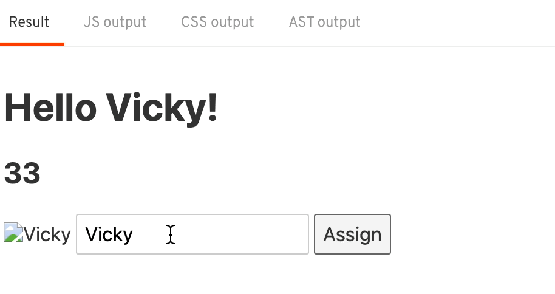
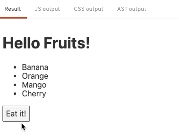

## Basic

# 2. Basic

가장 중요하면서도 기본적인 스벨트 내용을 알아보자.

### 선언적 렌더링

- 변수선언
  `App.svelte`
  Svelte에서는 변수선언을 아래와 같이 한다.
  ```html
  <script>
    let name = "world";
    let age = 33;
  </script>
  ```
  위 변수의 사용은 아래와 같이 할 수 있음
  `App.svelte`
  ```html
  <h1>Hello {name}!</h1>
  <h2>{age}</h2>
  ```
- 반응성(reactivity)
  반응성은 데이터가 갱신되면 데이터만 바뀌는 것이 아니라 데이터가 연결된 화면이 같이 변경됨을 의미함
  svelte는 데이터가 바뀔 때 반응성을 가진다.

  ```html
  <script>
    let name = "world";
    let age = 38;
    setTimeout(() => {
      name = "Vicky";
      age = 33;
    }, 3000);
  </script>
  ```

  위와 같이 3초 뒤 데이터를 변경하면 반응성으로 인해 값 변경, 버튼 클릭으로도 반응성 부여가 가능하다.

  ```html
  <script>
    let name = "world";
    let age = 38;
    function assign() {
      name = "Vicky";
      age = 33;
    }
  </script>

  <h1>Hello {name}!</h1>
  <h2>{age}</h2>
  <button on:click="{assign}">Assign</button>
  ```

  Svelte에서는 함수가 실행되지 않으면 반응성 부여도 이루어지지 않으므로, Assign 버튼 클릭 시 해당 값이 반응성을 지니도록 처리가 가능하다.

- 선언적 렌더링
  Svelte는 선언적 렌더링을 할 때 중괄호`{}`를 이용한다.

  ```html
  <script>
    let name = "world";
    let age = 38;
    function assign() {
      name = "Vicky";
      age = 33;
    }
  </script>

  
  <!-- 대체 텍스트에 world 노출 -->
  ```

- 데이터 바인딩
  아래와 같은 `input`태그가 있다고 했을 때 `value` 값이 같은 `name` 변수를 바라보고 있다할지라도 input 태그의 값을 변경해도 name 변수를 바라보는 다른 태그는 수정되지 않는다. 단방향 바인딩을 가지기 떄문

  ```html
  <script>
    let name = "world";
    let age = 38;
  </script>

  <input type="text" value="{name}" />
  ```

  그럼 양방향 데이터 바인딩은 어떻게할까?
  바로 단방향 데이터 바인딩을 가진 요소에 `bind:`라는 메서드를 붙여주면 된다.

  ```html
  <script>
    let name = "world";
    let age = 38;
    function assign() {
      name = "Vicky";
      age = 33;
    }
  </script>

  <h1>Hello {name}!</h1>
  <h2>{age}</h2>
  
  <input type="text" bind:value="{name}" />
  <button on:click="{assign}">Assign</button>
  ```

  

- 추가할 수 있는 태그들
  App.svelte 내 스타일 태그도 넣을 수 있다.

  ```html
  <script>
  	let age = 38
  </script>

  <h2 class={age < 85 ? 'active' : ''}>{age}</h2>

  <style>
  	h1 {
  		color: #f90;
  	}
  	.active {
  		color: #f00;
  	}
  </style>
  ```

  Svelte는 위와같이 중괄호를 이용해 다양한 선언적 데이터 렌더링을 할 수 있다.

### 조건문과 반복문

- 조건문
  아래와 같은 조건문이 있다고 하자.

  ```jsx
  if (toggle) {
  } else {
  }
  ```

  위 코드를 스벨트의 html 구조로 변경하면 아래와 같다.
  `App.svelte`

  ```jsx
  <script>
  	let toggle = false;
  </script>

  <button on:click={()=> toggle=!toggle}>
  	Toggle
  </button>

  {#if toggle}
  	<h1>Hello {name}!</h1>
  {:else}
  	<div>No name!</div>
  {/if}
  ```

  위처럼 Svelte에서는 `#`이 문장의 시작을 의미하며, `:`이 중간 조건 삽입 시 사용된다.
  또 `/` 는 문장의 종료를 나타낸다.

- 반복문
  배열을 순환하는 반복문들은 어떻게 작성할 수 있을까?

  ```jsx
  <script>
  	let fruits = ['Apple', 'Banana', 'Orange', 'Mango', 'Cherry']
  </script>

  <ul>
  	{#each fruits as fruit}
  		<li>{fruit}</li>
  	{/each}
  </ul>
  ```

  위와 같이 #로 시작하고 /로 마무리되는 each문에 반복문 코드를 넣어준다.
  해당 값을 갱신하기 위해선 아래와 같이 처리해줄 수 있다.

  ```jsx
  <script>
  	let fruits = ['Apple', 'Banana', 'Orange', 'Mango', 'Cherry']
  	function	deleteFruit(){
  		fruits = fruits.slice(1)
  	}
  </script>

  <ul>
  	{#each fruits as fruit}
  		<li>{fruit}</li>
  	{/each}
  </ul>
  <button on:click={deleteFruit}>
  	Eat it!
  </button>
  ```

  위처럼하면 과일이 첫번째 순서부터 하나씩 제거되는 것을 처리할 수 있다.
  
