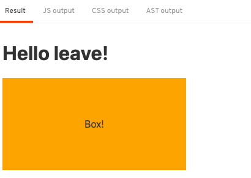
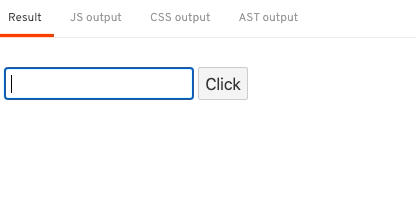
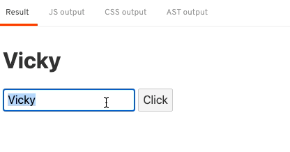
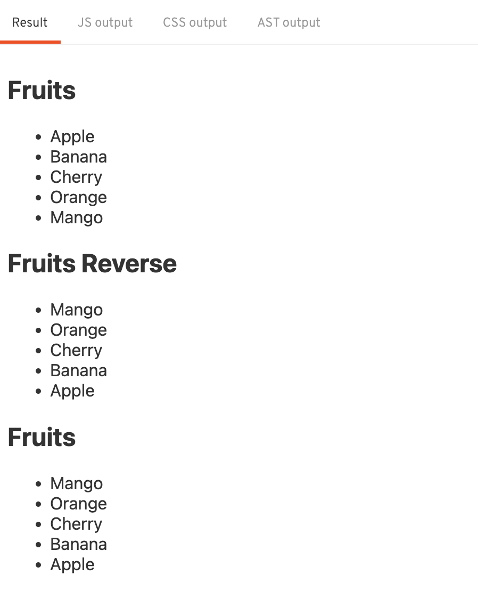
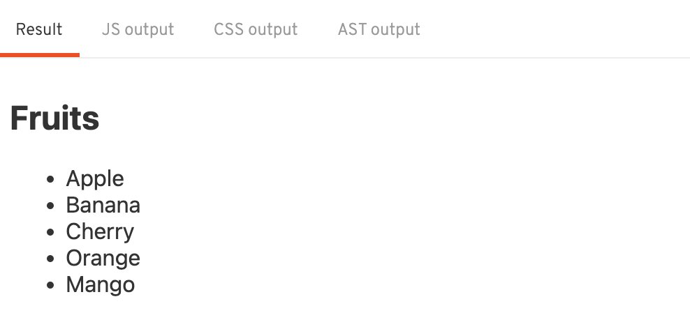
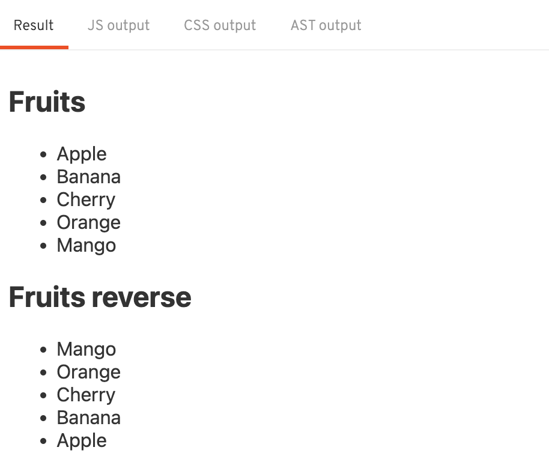
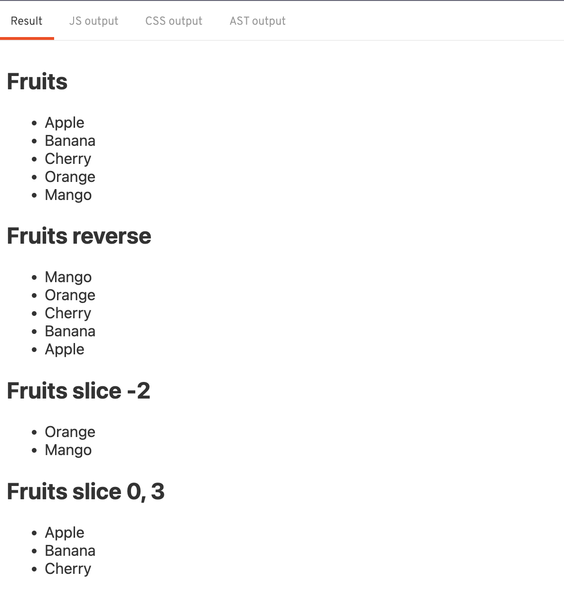

## Basic

# 2. Basic

가장 중요하면서도 기본적인 스벨트 내용을 알아보자.

### 선언적 렌더링

- 변수선언
  `App.svelte`
  Svelte에서는 변수선언을 아래와 같이 한다.
  ```html
  <script>
    let name = "world";
    let age = 33;
  </script>
  ```
  위 변수의 사용은 아래와 같이 할 수 있음
  `App.svelte`
  ```html
  <h1>Hello {name}!</h1>
  <h2>{age}</h2>
  ```
- 반응성(reactivity)
  반응성은 데이터가 갱신되면 데이터만 바뀌는 것이 아니라 데이터가 연결된 화면이 같이 변경됨을 의미함
  svelte는 데이터가 바뀔 때 반응성을 가진다.

  ```html
  <script>
    let name = "world";
    let age = 38;
    setTimeout(() => {
      name = "Vicky";
      age = 33;
    }, 3000);
  </script>
  ```

  위와 같이 3초 뒤 데이터를 변경하면 반응성으로 인해 값 변경, 버튼 클릭으로도 반응성 부여가 가능하다.

  ```html
  <script>
    let name = "world";
    let age = 38;
    function assign() {
      name = "Vicky";
      age = 33;
    }
  </script>

  <h1>Hello {name}!</h1>
  <h2>{age}</h2>
  <button on:click="{assign}">Assign</button>
  ```

  Svelte에서는 함수가 실행되지 않으면 반응성 부여도 이루어지지 않으므로, Assign 버튼 클릭 시 해당 값이 반응성을 지니도록 처리가 가능하다.

- 선언적 렌더링
  Svelte는 선언적 렌더링을 할 때 중괄호`{}`를 이용한다.

  ```html
  <script>
    let name = "world";
    let age = 38;
    function assign() {
      name = "Vicky";
      age = 33;
    }
  </script>

  
  <!-- 대체 텍스트에 world 노출 -->
  ```

- 데이터 바인딩
  아래와 같은 `input`태그가 있다고 했을 때 `value` 값이 같은 `name` 변수를 바라보고 있다할지라도 input 태그의 값을 변경해도 name 변수를 바라보는 다른 태그는 수정되지 않는다. 단방향 바인딩을 가지기 떄문

  ```html
  <script>
    let name = "world";
    let age = 38;
  </script>

  <input type="text" value="{name}" />
  ```

  그럼 양방향 데이터 바인딩은 어떻게할까?
  바로 단방향 데이터 바인딩을 가진 요소에 `bind:`라는 메서드를 붙여주면 된다.

  ```html
  <script>
    let name = "world";
    let age = 38;
    function assign() {
      name = "Vicky";
      age = 33;
    }
  </script>

  <h1>Hello {name}!</h1>
  <h2>{age}</h2>
  
  <input type="text" bind:value="{name}" />
  <button on:click="{assign}">Assign</button>
  ```

  

- 추가할 수 있는 태그들
  App.svelte 내 스타일 태그도 넣을 수 있다.

  ```html
  <script>
  	let age = 38
  </script>

  <h2 class={age < 85 ? 'active' : ''}>{age}</h2>

  <style>
  	h1 {
  		color: #f90;
  	}
  	.active {
  		color: #f00;
  	}
  </style>
  ```

  Svelte는 위와같이 중괄호를 이용해 다양한 선언적 데이터 렌더링을 할 수 있다.

### 조건문과 반복문

- 조건문
  아래와 같은 조건문이 있다고 하자.

  ```jsx
  if (toggle) {
  } else {
  }
  ```

  위 코드를 스벨트의 html 구조로 변경하면 아래와 같다.
  `App.svelte`

  ```html
  <script>
  	let toggle = false;
  </script>

  <button on:click={()=> toggle=!toggle}>
  	Toggle
  </button>

  {#if toggle}
  	<h1>Hello {name}!</h1>
  {:else}
  	<div>No name!</div>
  {/if}
  ```

  위처럼 Svelte에서는 `#`이 문장의 시작을 의미하며, `:`이 중간 조건 삽입 시 사용된다.
  또 `/` 는 문장의 종료를 나타낸다.

- 반복문
  배열을 순환하는 반복문들은 어떻게 작성할 수 있을까?
  `App.svelte`

  ```html
  <script>
    let fruits = ["Apple", "Banana", "Orange", "Mango", "Cherry"];
  </script>

  <ul>
    {#each fruits as fruit}
    <li>{fruit}</li>
    {/each}
  </ul>
  ```

  위와 같이 #로 시작하고 /로 마무리되는 each문에 반복문 코드를 넣어준다.
  해당 값을 갱신하기 위해선 아래와 같이 처리해줄 수 있다.
  `App.svelte`

  ```html
  <script>
    let fruits = ["Apple", "Banana", "Orange", "Mango", "Cherry"];
    function deleteFruit() {
      fruits = fruits.slice(1);
    }
  </script>

  <ul>
    {#each fruits as fruit}
    <li>{fruit}</li>
    {/each}
  </ul>
  <button on:click="{deleteFruit}">Eat it!</button>
  ```

  위처럼하면 과일이 첫번째 순서부터 하나씩 제거되는 것을 처리할 수 있다.
  

### 이벤트 핸들링

이번에는 이벤트 핸들링에 대해 알아본다.
먼저 스벨트에서 이벤트 핸들링 콜백을 실행하려면 omMount를 svelte에서 Import 해줘야 한다.

`App.svelte`

```html
<script>
  import { onMount } from "svelte";
  let isRed = false;
  // 현재 컴포넌트가 준비되면 해당 콜백함수를 실행하겠다.
  onMount(() => {
    const box = document.querySelector(".box");
    box.addEventListener("click", () => {
      isRed = !isRed;
    });
  });
</script>

<div class="box" style="background-color: {isRed ? 'red' : 'orange'}">Box!</div>

<style>
  .box {
    width: 300px;
    height: 150px;
    background-color: orange;
    display: flex;
    justify-content: center;
    align-items: center;
  }
</style>
```

위 코드는 onMount라는 svelte API로 콜백함수가 실행시켜 box 엘리먼트를 정상적으로 찾아 동작을 실행시키는 기능을 수행한다. 해당 코드는 svelte API통해 더욱 간결하게 만들 수 있다.

`App.svelte`

```html
<script>
	import { onMount } from "svelte";

	let name = 'Vicky'
	let isRed = false;

	function enter() { name = 'enter' }
	function leave() { name = 'leave' }
</script>

<h1>Hello {name}!</h1>
<div
	class="box"
	style="background-color: {isRed ? 'red' : 'orange'}"
	on:click={() => isRed = !isRed }
	on:mouseenter={enter}
	on:mouseleave={leave}
>
	Box!
</div>

<style>
	.box {
		width: 300px;
		height: 150px;
		cursor: pointer;
		background-color: orange;
		display:flex;
		justify-content: center;
		align-items: center;
	}
</style>
```

위처럼 익명함수로 전체 이벤트를 `on:`이벤트에 직접 바인딩해줘도 되고,
별도의 함수로 생성하여 실행시키지 않도록 추가해주도록 바인딩 처리도 가능하다.



다른 예시로, 아래와 같은 input 이벤트가 있다고 하자

```html
<script>
	let text = ''
</script>

<h1>
	{text}
</h1>

<input
			 type="text"
			 on:input={(e) => { text = e.target.value }} />

<button
				on:click={() => { text = 'Vicky' }}>
	Click
</button>
```

해당 코드를 동작시키면 input에 추가되는 값에 따라 상단 h1 값이 변경된다. 또 Click 버튼을 클릭하면 상단 h1 값이 Vicky로 변화하는 것을 확인할 수 있다. 단, input 내부 데이터는 바뀌지 않는다.



왜일까? input의 text value가 양방향이 아닌 단방향으로만 처리되어 있기 때문이다.
이를 양방향으로 처리해주기 위해서는 input에 value값을 text로 지정해주거나 `bind:` API를 추가해주면 된다.

```html
<input type="text" value={text} on:input={(e) => { text = e.target.value }} />

<!-- 혹은 -->
<input type="text" bind:value="{text}" />
```



### 컴포넌트

Svelte의 컴포넌트 기능에 대해 알아보자.

`App.svelte`

```html
<script>
  let fruits = ["Apple", "Banana", "Cherry", "Orange", "Mango"];
</script>

<h2>Fruits</h2>
<ul>
  {#each fruits as fruit}
  <li>{fruit}</li>
  {/each}
</ul>

<h2>Fruits Reverse</h2>
<ul>
  {#each fruits.reverse() as fruit}
  <li>{fruit}</li>
  {/each}
</ul>

<h2>Fruits</h2>
<ul>
  {#each fruits as fruit}
  <li>{fruit}</li>
  {/each}
</ul>
```

위 코드는 아래와 같은 결과를 도출한다.



세번째 fruits가 두번째 fruits.reverse()에 영향을 함께 받고 있는 것을 확인할 수 있다.
reverse()함수는 fruits 원본 함수를 뒤집어버리기 때문이다. 따라서 복사본을 사용해야 한다.
두번째 Fruits Reverse를 얕은 복사하는 방식으로 개선한다.

`App.svelte`

```html
<!-- codes... -->

<h2>Fruits Reverse</h2>
<ul>
  <!-- 얕은 복사 -->
  {#each [...fruits].reverse() as fruit}
  <li>{fruit}</li>
  {/each}
</ul>

<!-- codes... -->
```

그러면 아래와 같이 세번째 fruits가 영향을 받지 않는 것을 확인할 수 있다.


세번째 fruits 영역을 마지막 두가지 과일만 보여주고 싶다면 아래와 같이 실행하면 된다!

`App.svelte`

```html
<h2>Fruits slice -2</h2>
<ul>
  {#each fruits.slice(-2) as fruit}
  <li>{fruit}</li>
  {/each}
</ul>
```

위처럼 전반적 구조를 봤을 때 `fruits` 라는 데이터를 반복해서 li 태그로 출력하는 반복 코드를 가지고 있다.
반복된 이 코드를 별도의 Fruits 컴포넌트가 관리하도록 변경할 수 있는데 아래와 같다.

`Fruits.svelte` 생성

```html
<script>
  // Props
  export let fruits;
</script>

<h2>Fruits</h2>
<ul>
  {#each fruits as fruit}
  <li>{fruit}</li>
  {/each}
</ul>
```

- `fruits`라는 변수로 `App.svelte`에 존재하는 `fruits` 변수를 상속받는다.

`App.svelte`

```html
<script>
  import Fruits from "./Fruits.svelte";
  let fruits = ["Apple", "Banana", "Cherry", "Orange", "Mango"];
</script>

<Fruits {fruits} />
```

- `App.svelte`에서 Fruits 컴포넌트 import
- Fruits 컴포넌트로 `fruits` 데이터를 상속해준다.

위처럼 설정하면 Fruits 리스트들이 정상적으로 생성되는 것을 확인할 수 있다.



그렇다면 reverse된 배열과 끝에서 두가지의 과일을 꺼내는 것도 컴포넌트에서 동작하도록 구현해보자.

`App.svelte`

```html
<Fruits {fruits} reverse />
```

reverse 옵션을 가진 Fruits 컴포넌트를 실행시켜준다.

`Fruits.svelte`

```html
<script>
  // Props
  export let fruits;
  export let reverse;

  let name = "";
  let computedFruits = [];
  if (reverse) {
    computedFruits = [...fruits].reverse();
    name = "reverse";
  } else {
    computedFruits = fruits;
  }
</script>

<h2>Fruits {name}</h2>
<ul>
  {#each computedFruits as fruit}
  <li>{fruit}</li>
  {/each}
</ul>
```

위처럼 reverse 옵션에 따라 값이 변경되도록 분기처리해주면 아래와 같이 reverse된 리스트가 노출된다.



slice 도 구현해보자.

`App.svelte`

```html
<Fruits {fruits} slice="-2" /> <Fruits {fruits} slice="0, 3" />
```

위처럼 slice props 전달해준 뒤 Fruits 컴포넌트를 수정해준다.

```html
<script>
  // Props
  export let fruits;
  export let reverse;
  export let slice;

  let name = "";
  let computedFruits = [];

  if (reverse) {
    computedFruits = [...fruits].reverse();
    name = "reverse";
  } else if (slice) {
    // slice = '-2' or '0,3';
    // slice.split = ['-2'] or ['0', '3']
    // ...slice.split = '-2' or '0', '3'
    computedFruits = fruits.slice(...slice.split(","));
    //	name = 'slice ' + slice
    name = `slice ${slice}`;
  } else {
    computedFruits = fruits;
  }
</script>

<h2>Fruits {name}</h2>
<ul>
  {#each computedFruits as fruit}
  <li>{fruit}</li>
  {/each}
</ul>
```

slice props를 전개연산자로 처리하는 부분에 집중하자.



적절히 reverse와 slice 가 처리된 것을 확인할 수 있당!

### 스토어

스벨트는 데이터 공유를 위해 스토어라는 개념을 제공한다.
해당 개념을 배우기 앞서 데이터를 자식 컴포넌트에 내려주려면 아래와 같이 했을 것이다.

`App.svelte`

```html
<script>
  import Parent from "./Parent.svelte";
  let name = "world";
</script>

<h1>Hello {name}!</h1>
<Parent name="{name}" />
```

`Parent.svelte`

```html
<script>
  import Child from "./Child.svelte";
  export let name;
</script>
<div>Parent</div>
<Child name="{name}" />
```

`Child.svelte`

```html
<script>
  export let name;
</script>
<div>Child {name}</div>
```

위처럼 하면 `Child` 컴포넌트에 `name` 변수에 “world”가 정상적으로 출력된다.
위 구조라면 `Parent` 컴포넌트는 데이터를 전달만 하는 입장이므로 불필요한 코드가 추가된 구조가 복잡하게 느껴진다.
만약 자손 컴포넌트의 깊이가 깊어질수록 이러한 개념은 더욱 어렵게 다가올 것이다.

이를 스벨트의 스토어 개념을 접목하면 아래와 같이 개선할 수 있다.

`store.js`

```jsx
import { writable } from "svelte/store"; // readable, derived, get 메서드 제공

// 스토어 데이터 생성
export let storeName = writable("vicky"); // 초기값을 writable 함수 안에 부여
```

`App.svelte`

```html
<script>
  import Parent from "./Parent.svelte";

  import { storeName } from "./store.js";
  // console.log(storeName); // 스토어 객체 데이터(set, update, subscribe 메서드 제공)
  // console.log($storeName); // storeName 초기값 출력(Auto-subscription, 자동 구독)

  let name = "world";
  $storeName = name; // 변수에 값을 대입하려면 $(예약어)를 붙여야 한다.
</script>

<h1>Hello {name}!</h1>
<Parent />
```

`Parent.svelte`

```html
<script>
  // 기존 export 변수 코드 제거
  import Child from "./Child.svelte";
</script>
<div>Parent</div>
<Child />
```

`Child.svelte`

```html
<script>
  import { storeName } from "./store.js"; // 스토어에서 데이터를 직접 가져온다.
</script>
<div>Child {$storeName}</div>
```

스벨트는 별도의 라이브러리로 스토어를 관리하도록 제공하는 것이 아닌 내부 기능으로 제공하므로 중요한 부분이다.
메서드 별로 다양하게 학습해야 한다.

### TODO 예제 만들기

REPL로 간단한 TODO 예제를 만들어보는 것으로 기본 코드 구현을 마무리해보자

`App.svelte`

```html
<script>
  import { writable } from "svelte/store";
  import Todo from "./Todo.svelte";

  let title = "";
  let todos = writable([]);
  let id = 0;
  function createTodo() {
    // 빈 데이터는 입력되지 않도록 제한
    if (!title.trim()) {
      title = "";
      return;
    }
    $todos.push({
      id, // crypto-random-string, uuid 등으로 generate id 많이 사용
      title,
    });
    $todos = $todos; // Svelte는 값 할당을 통해 반응성을 유지함(자기 자신에게 할당도 포함)
    title = "";
    id += 1;
  }
</script>

<input bind:value={title} type="text" on:keydown={(e) => { e.key === 'Enter' && createTodo() }} />
<button on:click="{createTodo}">Create Todo</button>

{#each $todos as todo}
<!-- todos를 양방향 데이터 바인딩 하는 방법으로 Todo 컴포넌트에서도 todos가 반응서을 가지도록 처리 가능 -->
<!-- <Todo bind:todos={todos} {todo} /> -->

<!-- todos를 $todos로 전달하지 않는 이유는 스토어 객체 자체로 전달하기 위함. $todos는 배열값 그 자체이므로 양방향 바인딩이 안된다. -->
<Todo {todos} {todo} />
{/each}
```

- 위 코드에서 가장 포인트는 `todos` 객체를 store 객체로 생성해준 부분이다. 해당 객체를 `store` 객체가 아닌 App 컴포넌트의 종속 변수로 처리하려고 하면, Todo 컴포넌트에 내려주는 todos 변수에 `bind:` 처리를 해줘야 양방향 바인딩이되어, 데이터 삭제 로직이 정상적으로 동작한다.
- Todo 컴포넌트에 스토어 객체엔 todos를 $todos로 내려주지 않는 이유는 스토어 객체 자체로 전달하여 값 변경이 가능하도록 하기 위해서임. 만약 $todos로 내려주면 그 자체 배열 값을 내려주므로 양방향 데이터 바인딩이 처리되지 않음

`Todo.svelte`

```html
<script>
  export let todos;
  export let todo;

  let isEdit = false;
  let title = "";

  function onEdit() {
    isEdit = true;
    title = todo.title;
  }
  function offEdit() {
    isEdit = false;
  }
  function updateTodo() {
    todo.title = title;
    offEdit();
  }
  function deleteTodo() {
    // todos 값 할당 시 업데이트가 안되는 이슈가 있음 => bind 메서드를 추가하거나, store를 사용해서 개선할 수 있다.
    $todos = $todos.filter((t) => t.id !== todo.id);
    console.log($todos);
  }
</script>

{#if isEdit}
<div>
  <input type="text" bind:value={title} on:keydown={(e) => {e.key === 'Enter' && updateTodo() }} />
  <button on:click="{updateTodo}">OK</button>
  <button on:click="{offEdit}">Cancel</button>
</div>
{:else}
<div>
  {todo.title}
  <button on:click="{onEdit}">Edit</button>
  <button on:click="{deleteTodo}">Delete</button>
</div>
{/if}
```

- onEdit, offEdit, updateTodo, deleteTodo 등의 이벤트 구현 부분을 확인해보자.
- 위 코드에서 포인트는 deleteTodo 함수에서 $todos 값이 재할당되는 부분이다.
  Svelte에서는 자기 자신 데이터에 값 재할당을 하는 과정으로 변수에 대한 반응성을 유지한다.
