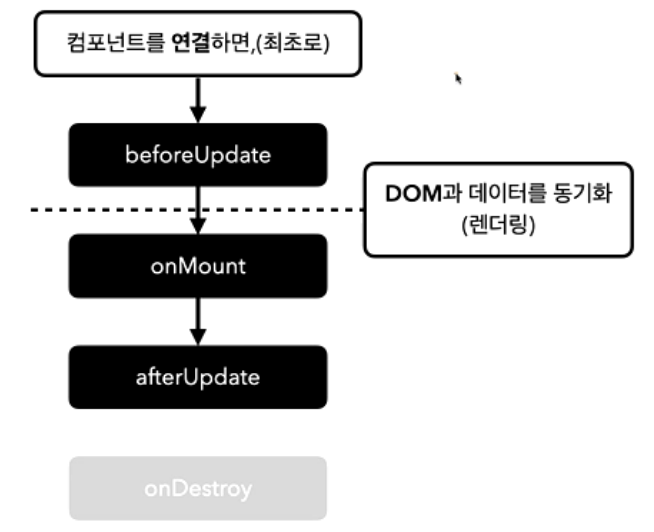
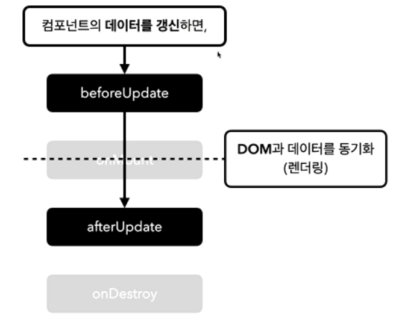
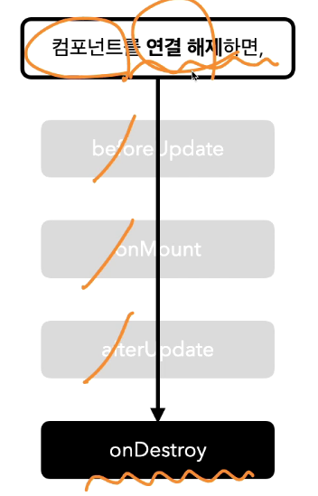

## 라이프사이클

### Svelte Lifecycle

컴포넌트가 연결되고 해제되는 등의 컴포넌트 생명주기를 말한다. 아래와 같이 5가지로 분류되어 있음
각 Lifecycle을 Lifecycle Hook이라고 부른다. onMount Hook, beforeUpdate Hook

- onMount : 연결되었다.
- onDestroy : 연결이 해제되었다.
  
  - 완벽하게 떨어지기 전에, 분리되기 전에, 연결이 실제 해제되기 직전에 실행
- beforeUpdate : 화면이 바뀌기 전
- afterUpdate : 화면이 바뀐 후
- Tick (별도)
