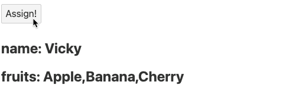

## 반응성

### 데이터의 불변성과 가변성

이번 시간에는 자바스크립트의 불변성과 가변성에 대해 논해보고자 한다. 시작하기 파트에서 특정한 객체 데이터나 배열데이터를 전개 연산자를 통해 복사했었다. 왜 그렇게 해야할까?에 대한 이야기이다.

아래와 같은 코드가 있다고 하자.
자바스크립트에서 원시데이터(Primitives)는 number, string, boolean, null, undefined, symbol 등이 속한다. 이러한 원시데이터들은 불변성(immutable)을 가진다는 특징이 있다.

```jsx
let a = 1;
let b = a;
a; // 1
b; // 1
a = 2;
a; // 2
b; // 1
b = 3;
b; // 3
```

위처럼 b의 값에 a 값을 넣었을 때, a 값을 변경해주어도 b 값은 1을 바라본다. b = 3이라는 값을 직접 변경해주면 그때 값이 변경되는데 이때 기존 b가 바라보던 1이란 데이터는 가비지 콜렉션(GC, Garbage Collection, 쓰레기 수집)이라는 것을 통해 메모리(Memory)에 할당된 불필요한 데이터를 자동으로 해제한다. (자동 메모리 관리 방법 사용) 위와 같은 성질을 불변성이라고 한다.

그럼 가변성은 어떠한가?

```jsx
let a = { k: 1 };
let b = a;
a; // { k : 1 }
b; // { k : 1 }
a.k = 2;
a; // { k : 2 }
b; // { k : 2}
```

위처럼 자바스크립트 객체(Object) 즉, Object, Array, Fucntion,. Map, Set, WeakMap 들은 가변성을 가지는 데이터(Mutable data)이다. a.k = 2를 했을 때 자바스크립트 객체는 가변성을 가지므로 a.k의 값을 바꾸면 같은 데이터 주소를 바라보고 있는 b.k의 값도 동일하게 변경되는 성질을 의미한다.

```jsx
let a = { k: 1 };
let b = { ...a }; // a의 얕은 복사
a; // { k : 1 }
b; // { k : 1 }

a.k = 2;
a; // { k : 2 }
b; // { k : 1 }
```

위와 같이 b의 값을 전개 연산자를 사용해 얕은 복사를 하게 될 경우 b의 { k : 1 }의 값은 a의 { k : 1 } 과 다른 데이터를 바라보게 된다. 즉, 데이터의 참조 위치가 각자 다르다. 따라서 a의 데이터를 수정해도 b.k의 값은 변경되지 않는 것이다.

이러한 복사에는 얕은 복사(Shallow Copy), 깊은 복사(Deep Copy) 가 있다.

```jsx
let a = {
  k: 1,
  o: { p: 2 },
};

let b = { ...a };
a; // { k: 1, o : { p : 2 } }
b; // { k: 1, o : { p : 2 } }

a.k = 9;
a; // { k: 9, o : { p : 2 } }
b; // { k: 1, o : { p : 2 } }

a.o.p = 7;
a; // { k: 9, o : { p : 7 } }
b; // { k: 1, o : { p : 7 } }, b.o.p 값은 변경됨
```

얕은 복사는 1depth 데이터만 복사한다. 따라서 객체 내부의 객체는 값 복사가 아닌 같은 주소를 바라보므로 b.o.p가 a.o.p와 같은 값을 가지게 된다. 이러한 데이터 구조를 미리 참고하여 필요에 따라 작업 시 깊은 복사를 하여 작업할 줄 알아야 한다.

### 할당(Assignment)

이번에는 데이터 할당에 대한 스벨트의 특징을 알아보고자 한다. 아래의 코드를 보자

`App.svelte`

```html
<script>
  let name = "Vicky";
  let fruits = ["Apple", "Banana", "Cherry"];

  function assign() {
    name = "Wonny";
    fruits.push("Orange");
  }
</script>

<button on:click="{assign}">Assign!</button>
<h2>name: {name}</h2>
<h2>fruits: {fruits}</h2>
```

위와 같이 name, fruits 변수와 해당 값을 변경시켜주는 assign 함수가 있고, Assign! 버튼을 클릭했을 떄 값이 변경되도록 처리해주었다. 하지만 버튼을 눌렀을 때 바뀌는 값은 name 뿐이다. 왜일까?



바로 스벨트는 할당 연산자(=)를 통해서만 반응성을 가지기 때문이다. 따라서 할당 연산자로 값을 바꿔준 name 데이터만 반응성을 가지므로 해당 값만 변경되는 것임. 따라서 fruits도 할당연산자를 이용해 값을 대입해준다.

```jsx
function assign() {
  name = "Wonny";
  // fruits.push("Orange");
  // fruits = fruits;
  fruits = [...fruits, "Orange"];
}
```

위와 같이 fruits 변수에 변경된 fruits 값을 반영해주는 것은 스벨트에서 반응성 부여를 위해 자주 볼 수 있는 형태의 문법임을 참고하자. 이는 객체 값의 변경에도 동일하게 반응한다.

```html
<script>
  let user = {
    name: "Vicky",
    depth: {
      a: "b",
    },
  };
  function assign() {
    user.name = "Wonny";
    user.depth.a = "c";
  }
</script>

<button on:click="{assign}">Assign!</button>

<h2>user name: {user.name}</h2>
<h2>user depth a: {user.depth.a}</h2>
```

위와 같은 user 객체 값의 변경이 되어도 똑같이 값 할당에 따른 화면 새로고침이 발생한다.
그럼 아래와 같은 경우가 있다고 해보자.

```html
<script>
  let user = {
    name: "Vicky",
    depth: {
      a: "b",
    },
    numbers: [1, 2],
  };
  function assign() {
    user.name = "Wonny";
    user.depth.a = "c";
    user.numbers.push(3);
  }
</script>

<button on:click="{assign}">Assign!</button>
<h2>user name: {user.name}</h2>
<h2>user depth a: {user.depth.a}</h2>
<h2>user numbers: {user.numbers}</h2>
```

위와 같이 하면 `user.numbers.push(3)` 메서드는 값을 할당해주는 연산자를 쓰지 않으므로 Assign! 버튼 클릭 시 아무 반응이 없는 것이 맞다. 하지만 버튼을 눌렀을 때 `user.numbers` 영역 화면은 갱신된다.


왜 이런 현상이 발생할까? 바로 할당 표현에 `user`가 명시되어 있어서 반응성을 가질 수 있기 때문이다. 즉 바뀌는 값이 `user.numbers` 배열값이더라도 `user` 값이 변경되므로 값 재할당이 된다.

실제 위 코드는 REPL에서 실행해보면 아래와 같은 함수가 실행되는 것을 확인할 수 있다.

```jsx
$$invalidate(2, (user.name = "Wonny"), user);
$$invalidate(2, (user.depth.a = "c"), user);
```

즉 변경된 값이 `user` 객체에 담기므로 해당 변경 작업에 따라 user.number 값도 함께 변경되는 것이라고 볼 수 있다. (await tick()이 동작하는 것처럼 모두 실행)

만약 assign() 함수가 아래와 같이 배열에 추가해주는 코드만 존재한다면,

```jsx
function assign() {
  user.numbers.push(3);
}
```

실제 $$invalidate 함수가 실행되지 않으므로 아래의 돔은 변경되지 않는다.

```html
<h2>user numbers: {user.numbers}</h2>
```

```html
let numbers = user.numbers;
```

만약 아래와 같이 user.numbers의 값을 가지는 numbers 변수를 생성한다고 했을 때 해당 데이터는 Assign! 버튼 클릭 시 값이 변경되지 않는다. 반응성을 가질 수 없기 때문이다. numbers에 값 할당을 해주면 당연히 반응한다.

```jsx
function assign() {
  user.name = "Wonny";
  user.depth.a = "c";
  user.numbers.push(3);
  numbers = numbers; // 할당 연산자로 값 갱신처리
}
```

만약 assign 함수에 값 재할당 연산을 없애면 어떻게 될까?

```jsx
function assign() {
  // user.name = "Wonny";
  // user.depth.a = "c";
  user.numbers.push(3);
  numbers = numbers;
}
```

위 코드로 실행시키면 `numbers` 데이터만 갱신되고 `user.numbers` 데이터는 갱신되지 않는다. 위처럼 같은 데이터임에도 갱신 여부는 데이터의 환경에 따라 각각 다르다는 것을 확인할 수 있다. 이 때문에 스벨트의 반응성에 대해 완벽한 이해가 필요하며, 수동으로 반응성을 가지게 해주는 코드가 자동으로 값 변경을 인지하는 vue.js나 react.js 보다 좀 더 귀찮게 느껴질 수도 있다. 하지만 가상돔으로 변경사항을 체크하는 연산과정 또한 비용이므로 기능적인 trade off 특성이라고 생각하면 된다.

```html
<script>
  function assign() {
    let hello = "world";
  }
</script>

<h2>{hello}</h2>
<!--  hello is not defined -->
```

위와 같이 hello를 보간법으로 출력하면 에러가 발생한다. 당연한 에러이긴 하나 체크. 특정한 블록 내부에서 정의된 변수는 반응성을 가지는 데이터로는 활용할 수 없다. 즉 html에서 보간법을 정의 할 때에는 해당 데이터를 스크립트 최상위 레벨에서 정의해야 한다는 점 잊지말자

### 자바스크립트 Label 구문의 이해

자바스크립트 label 구문을 이해해보자

```jsx
for (let i = 1; i < 4; i += 1) {
  for (let k = 1; k < 4; k += 1) {
    console.log(i, k);
  }
  console.log("----------");
}

// 1 1
// 1 2
// 1 3
// ----------
// 2 1
// 2 2
// 2 3
// ----------
// 3 1
// 3 2
// 3 3
// ----------

// loop1
for (let i = 1; i < 4; i += 1) {
  // loop2
  for (let k = 1; k < 4; k += 1) {
    if (i === 2) {
      break;
    }
    console.log(i, k);
  }
  console.log("----------");
}

// 1 1
// 1 2
// 1 3
// ----------
// 3 1
// 3 2
// 3 3
// ----------
```

위 코드는 i, k 변수의 값을 순회하는 2중 중첩 for문이며 각 특성에 맞게 해당 값을 순회한다.
매우 기초적인 자바스크립트 구문, 여기에 label을 사용해본다.

```jsx
loop1: for (let i = 1; i < 4; i += 1) {
  loop2: for (let k = 1; k < 4; k += 1) {
    if (i === 2) {
      break loop1;
    }
    console.log(i, k);
  }
  console.log("----------");
}
```

위 코드에서 `loop1:` 를 자바스크립트 label이라고 한다. 위 코드의 의미는 i가 2일 때, loop1이 멈추도록 설정한 코드를 의미한다.

```jsx
vicky: {
  console.log("vicky");
  break vicky;
  console.log("wonny"); // wonny는 출력하지 않는다.
}
```

이러한 자바스크립트의 label 문법이 그닥 유용해보이진 않지만 스벨트의 반응성 기능 사용에 있어서 유용하게 사용할 수 있다.

```jsx
// Svelte 반응성 구문!
let count = 0;
$: {
  console.log(count);
}
```

우선 위 코드에서 $ 모양이 한 코드 블록의 별칭이며 자바스크립트 기본 label 기능임을 사전에 인지하자.
