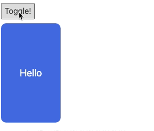
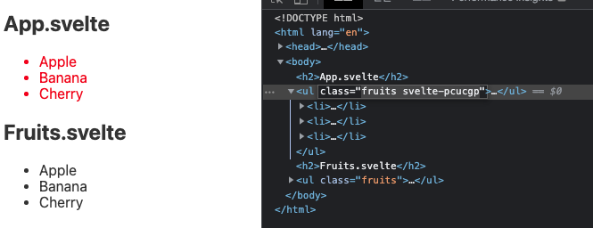
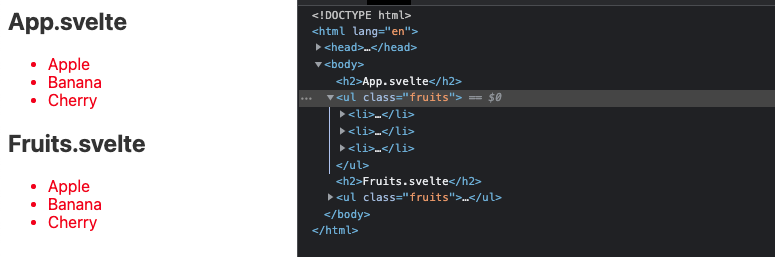
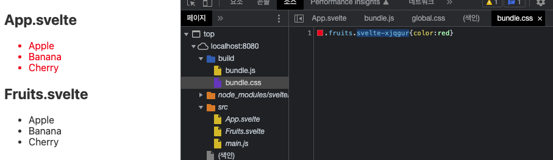
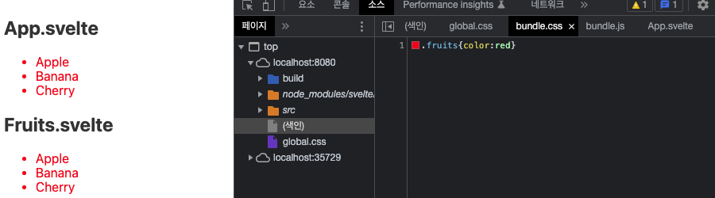
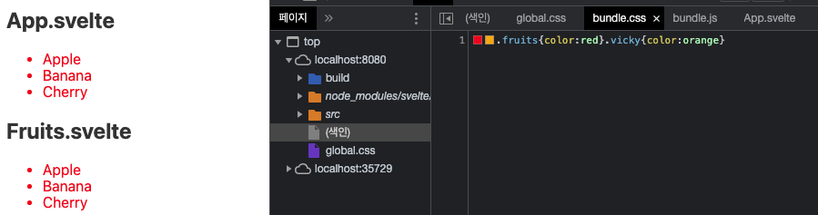

## 클래스와 스타일

### 클래스와 스타일 속성 바인딩

Svelte의 기본적인 클래스 속성 바인딩에 대해 알아보자!

```html
<script>
  let active = false;
</script>

<button on:click={() => (active = !active)}>Toggle!</button>
<div class={active ? "active" : ""}>Hello</div>

<style>
  div {
    width: 120px;
    height: 200px;
    background-color: royalblue;
    border-radius: 10px;
    display: flex;
    justify-content: center;
    align-items: center;
    color: white;
    font-size: 20px;
    transition: 0.4s;
  }
  .active {
    width: 250px;
    background-color: tomato;
  }
</style>
```

위와 같이 active 변수값에 따라 클래스 속성을 간단히 바인딩 해줄 수 있다.



위 속성은 아래와 같이 적을 수 있다.

```html
<div class:active="{active}">Hello</div>
<div class:hello="{active}">Hello</div>
```

위 데이터는 active라는 데이터에 의해 active 혹은 hello 클래스를 붙인다는 의미이다.

보간법을 사용해 아래와 같이 스타일 속성을 줄 수 도 있다.

```html
<script>
  let color = "tomato";
  let white = "white";
</script>

<h2 style="background-color: {color}; color: {white};">Vicky!</h2>
```

위와 같이 하면 배경색은 tomato, 글자색은 white인 레이아웃이 노출된다. 위 코드는 아래와 같이 쓸 수도 있다.

```html
<script>
    let color = {
      t: "tomato",
      w: "#fff",
    };
  `let letterSpacing = "letter-spacing: 5px;";
</script>

<h2 style="background-color: {color.t}; color: {color.w}; {letterSpacing}">Vicky!</h2>
```

객체 데이터를 바인딩 해줄 수도 있고, 속성 값 전체를 보간법으로 직접 넣을 수도 있음 :)

### 클래스 바인딩 패턴 정리(class 지시어)

클래스 바인딩을 하는 여러가지 패턴에 대해 알아본다. class 지시어와 연결 데이터를 어떻게 사용하느냐에 따라 다양한 방법이 사용된다.

`App.svelte`

```html
<script>
  let active = true
  let test = true
  let valid = false
  let camelCase = true

  function multi() {
    return 'active multiple-class'
  }
</script>

<div class={active ? 'active' : ''}>3항 연산자 보간</div>

<div class:active={test}>Class 지시어(Directive) 바인딩</div>

<!-- <div class:active={active}>Class 지시어 바인딩 단축 형태</div> -->
<div class:active>Class 지시어 바인딩 단축 형태</div>

<!-- camelCase dashCase, snackCase 등은 아래처럼 각각 처리할 수 있다.-->
<!-- valid는 false이므로 추가되지 않음 -->
<div class:active class:valid class:camelCase class:camel-case={camelCase}>다중(Mutiple) Class 지시어 바인딩</div>

<!-- <div class="active multiple-class">함수 실행</div> 로 도출된다. -->
<div class={multi()}>함수 실행</div>
```

- Class 지시어 바인딩 시 바인딩하는 값과 지시어가 같을 경우 생략할 수 있다.
  `<div class:active={active}>` → `<div class:active>`
- camelCase, dashCase, snackCase등 다양한 클래스 형태를 다중 class 지시어로 바인딩할 수 있다.
- 함수를 넣어 클래스 값을 넣는 것도 가능.

### 스타일 유효범위(Hash)와 전역화(Global)

Svelte의 유효범위(Scope, Hash)와 전역화(:global)에 대해 알아본다.

`Fruits.svelte`

```html
<h2>Fruits.svelte</h2>
<ul class="fruits">
  <li>Apple</li>
  <li>Banana</li>
  <li>Cherry</li>
</ul>
```

`App.svelte`

```html
<script>
  import Fruits from "./Fruits.svelte";
</script>

<h2>App.svelte</h2>
<ul class="fruits">
  <li>Apple</li>
  <li>Banana</li>
  <li>Cherry</li>
</ul>

<Fruits />

<style>
  .fruits {
    color: red;
  }
</style>
```

위와 같은 코드가 있다고 하자.
하위에 .fruits 클래스의 텍스트를 red로 변경해주고 화면을 확인하면 아래와 같다.



`Fruits.svelte` 내부의 ul 노드에는 해당 스타일이 적용되지 않은 것을 확인할 수 있음
해당 컴포넌트 내부에만 스타일 코드가 유효하다! 이는 스타일 해쉬를 통해 스타일 유효범위를 설정하는데 ul 태그의 `svelte-pcucgp` 클래스를 스타일 해쉬라고 부른다. 이러한 해쉬 기호를 통해 유효범위를 만들고, 작성한 스타일이 외부 컴포넌트에 적용되는 것을 막을 수 있다.

반대로 작성한 스타일이 외부의 컴포넌트에 적용되도록 하려면 어떻게 해야할까?
바로 global 수식어로 스타일 코드를 감싸주면 된다.

```html
<style>
  :global(.fruits) {
    color: red;
  }
</style>
```



위처럼 전역 스타일로 처리됨에 따라 두 영역에 모두 red 컬러가 적용된 것을 확인할 수 있고, 특정 컴포넌트에만 적용되던 스타일 해쉬는 사라진 것을 확인할 수 있다. 이처럼 기본적으로 스타일은 해당 컴포넌트에만 적용되도록 유효범위가 설정되어 있으며, 글로벌 처리를 통해 전역에서 사용할 수 있도록 설정할 수 있음을 참고하자!

그렇다면 실제 global 적용이 안된 스타일 코드는 어떻게 번들링될까?



별도의 global로 처리되지 않은 스타일 코드는 css 일치 선택자를 통해 스타일 해쉬가 추가되어 `bundle.css` 로 저장되는 것을 확인할 수 있다. 이 밖에도 스타일 코드에는 작성되어 있으나 ,컴포넌트 내에 선택자와 매칭되는 요소가 없을 때에는 Svelte 컴파일러가 해당 선택자는 불 다요하 고하판단여하 S번 번들서 제외시키는 특징을 가진다.

```html
<h2>App.svelte</h2>
<ul class="fruits">
  <li>Apple</li>
  <li>Banana</li>
  <li>Cherry</li>
</ul>

<style>
  :global(.fruits) {
    color: red;
  }
  .vicky {
    color: orange; /* .vicky 요소가 html에 미존재 */
  }
</style>
```



이와 같은 것이 편리해보이지만, 동적으로 클래스 부여가 되는 경우 해당 내용이 없어 난감할 수 있다.
따라서 html 구조에 포함되지 않으나 동적으로 처리해야하는 스타일 코드의 경우 전역화를 통해 넣어주어야 한다.

```html
<h2>App.svelte</h2>
<ul class="fruits">
  <li>Apple</li>
  <li>Banana</li>
  <li>Cherry</li>
</ul>

<style>
  :global(.fruits) {
    color: red;
  }
  :global(.vicky) {
    color: orange;
  }
</style>
```

위처럼 .vicky 스타일에 전역화를 해주면, 실제 엘리먼트가 없어도 bundle.css에 추가되는 것을 확인할 수 있다.


