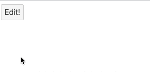
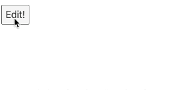
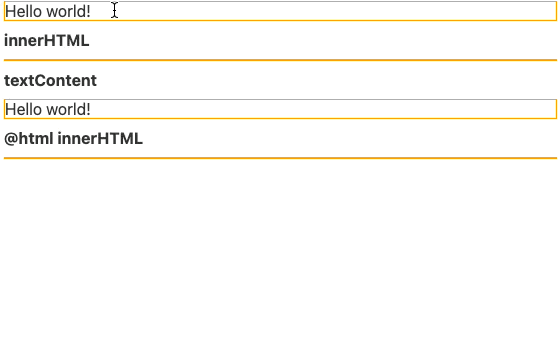

## 요소 바인딩

### 일반 요소 바인딩(this)

이번에는 Svelte의 일반 this 요소 바인딩에 대해 이해해보자
아래의 코드는 Edit 버튼을 클릭했을 때, input 요소에 자동으로 focus 처리 동작을 하도록 만들어진 코드이다.

`App.svelte`

```html
<script>
  let isShow = false;

  function toggle() {
    isShow = !isShow;
    const inputEl = document.querySelector("input");
    inputEl && inputEl.focus();
  }
</script>

<button on:click="{toggle}">Edit!</button>
{#if isShow}
<input />
{/if}
```

하지만 해당 코드는 자동으로 focus 처리가 되지 않는다. (아래 이미지 보면 마우스로 클릭해서 focus 처리함)



왜 focus가 되지 않을까? 이것은 데이터가 갱신되었을 때 바로 화면이 바뀌지 않기 때문이다.
데이터가 갱신되고 다음 로직이 처리되기 전에 화면이 갱신되도록 기다려야지만 화면이 바뀐다.

```jsx
import { tick } from "svelte";
let isShow = false;

async function toggle() {
  isShow = !isShow;
  await tick();
  const inputEl = document.querySelector("input");
  inputEl && inputEl.focus();
}
```

따라서 tick을 적용하면 아래와 같이 자동으로 focus 처리가 수행되는 것을 확인할 수 있다.



이는 이미 배워서 아는 사실이다. 이 밖에 스벨트에서는 `const inputEl = document.querySelector("input");` 와 같이 직접 돔을 검색하는 방법 이외에도 일반요소에 바인딩 할 수 있도록 하는 this를 제공한다.

```html
<script>
  import { tick } from "svelte";
  let isShow = false;
  let inputEl;

  async function toggle() {
    isShow = !isShow;
    await tick();
    inputEl && inputEl.focus();
  }
</script>

<button on:click="{toggle}">Edit!</button>
{#if isShow}
<input bind:this="{inputEl}" />
{/if}
```

위와 같이 `input`에 `bind` 요소로 `this`를 주입해주면 별도의 요소를 검색하지 않고 `input` 요소를 참조하도록 만들어줄 수 있다. 이는 전체 돔을 검색하는 성능을 줄일 수 있도록 해주므로 직접 요소를 바인딩 하는 방법으로 성능을 최적화해주는 것이 바람직하다.

### 입력 요소 바인딩(Properties, group) 패턴 정리

Svelte의 여러가지 입력 요소 바인딩 패턴에 대해 알아보자

```jsx
let text = "";
let number = 3;
let checked = false;
let fruits = ["Apple", "Banana", "Cherry"];
let selectedFruits = [];
let group = "Banana";
let textarea = "";
let select = "";
let multipleSelect = ["Banana", "Cherry"];
```

위와 같은 변수가 있다고 했을 때 기본적인 input은 아래와 같은 이벤트 바인딩을 가질 수 있다.

```html
<!-- let text = ''; -->
<section>
  <h2>Text</h2>
  <input type="text" bind:value="{text}" />
</section>
```

input 요소는 양방향 데이터 바인딩을 한다. range input의 경우에도 동일하게 연결할 수 있다.

```html
<!-- let number = 3 -->
<section>
  <h2>Number/Range</h2>
  <div>
    <input type="number" bind:value="{number}" min="0" max="10" />
  </div>
  <div>
    <input type="range" bind:value="{number}" min="0" max="10" />
  </div>
</section>
```

checkbox도 동일하며, label 태그를 감싸주면 텍스트 클릭 시에도 선택 on/off 처리된다.

```html
<!-- let checked = false; -->
<section>
  <h2>Checkbox</h2>
  <input type="checkbox" bind:checked /> Agree?
  <!-- label wrapping을 하면 label 클릭 시 checkbox 토글 됨 -->
  <label><input type="checkbox" bind:checked /> Agree?(label wrapping)</label>
</section>
```

체크박스 다중 선택 시에는 아래와 같이 구현할 수 있다.

```html
<!-- let fruits = ["Apple", "Banana", "Cherry"]; -->
<!-- let selectedFruits = []; -->
<section>
  <h2>Checkbox 다중 선택</h2>
  <strong>Selected: {selectedFruits}</strong>
  {#each fruits as fruit}
  <!-- bind:group으로 선택한 내용이 배열에 저장된다. -->
  <label><input type="checkbox" value="{fruit}" bind:group="{selectedFruits}" /> {fruit}</label>
  {/each}
</section>
```

checkbox 다중 선택 시에는 목록 데이터와 값을 담는 배열 데이터가 필요하다.
특히 each 문 안에서 데이터 바인딩 한 부분을 보면 `bind:value`가 아니므로 단방향 데이터 바인딩, 즉 단순하게 값을 받아 출력하는 용도로만 사용한다는 의미이다. 해당 input은 `bind:group`으로 묶어줌

radio input 에 대해서도 알아본다.

```html
<!-- let group = "Banana"; -->
<section>
  <h2>Radio</h2>
  <strong>Selected: {group}</strong>
  <label> <input type="radio" value="Apple" bind:group /> Apple </label>
  <label> <input type="radio" value="Banana" bind:group /> Banana </label>
  <label> <input type="radio" value="Cherry" bind:group /> Cherry </label>
</section>
```

다중 선택일 경우에는 checkbox, 단일 선택일 경우에는 radio input을 사용하며 group에 문자 데이터를 넣어줘야 한다.

이 밖에 textarea도 동일한 데이터 바인딩 방식을 사용한다.

```html
<!-- let textarea = ""; -->
<section>
  <h2>Textarea</h2>
  <pre>{textarea}</pre>
  <textarea bind:value="{textarea}" />
</section>
```

마지막으로 select input은 아래와 같다.

```html
<!-- let select = "Banana"; -->
<section>
  <h2>Select 단일 선택</h2>
  <strong>Selected: {select}</strong>
  <div>
    <select bind:value="{select}">
      <option disabled value="">Please select one!</option>
      <option>Apple</option>
      <option>Banana</option>
      <option>Cherry</option>
    </select>
  </div>
</section>

<!-- let multipleSelect = ["Banana", "Cherry"]; -->
<section>
  <h2>Select 다중 선택(Multiple)</h2>
  <strong>Selected: {multipleSelect}</strong>
  <div>
    <select multiple bind:value="{multipleSelect}">
      <option disabled value="">Please select one!</option>
      <option>Apple</option>
      <option>Banana</option>
      <option>Cherry</option>
    </select>
  </div>
</section>
```

단일 선택 시에는 문자열 데이터를 바인딩하며, 다중 선택시에는 배열 데이터를 연결해주어야 한다.

### 편집 가능 요소 바인딩(content editable)

이번시간에는 html의 `contenteditable` 요소를 사용해서 데이터를 바인딩 해보도록 한다.
`contenteditable` 요소는 일반 text로 보이지만 클릭시 해당 내용을 수정할 수 있는 속성으로 HTML에서 기본적으로 제공되는 기능이다.

```html
<div contenteditable>Hello world!</div>
```


스벨트에서는 `contenteditable` html 요소에 바인딩할 수 있는 개념을 두가지를 제공한다.
innerHTML과 textContent를 사용하는 방식인데 innerHTML은 내부 html 요소를 모두 보여주며, textContent는 HTML 구조를 제외한 텍스트만을 반환한다.

```html

<script>
  let innerHTML = "";
  let textContent = "Hello vicky!!";
</script>

<div contenteditable bind:innerHTML bind:textContent />

<span>innerHTML</span>
<div>{innerHTML}</div>

<span>textContent</span>
<div>{textContent}</div>

<span>@html innerHTML</span>
<div>{@html innerHTML}</div>

<style>
  div {
    border: 1px solid orange;
    margin-bottom: 10px;
  }
  span {
    display: inline-block;
    margin-bottom: 10px;
    font-weight: bold;
  }
</style>
```

위 div에 innerHTML과 textContent를 bind하여 데이터를 노출하면 아래와 같이 도출된다. 



때에 따라 맞춰서 사용하면 좋겠다 🙂