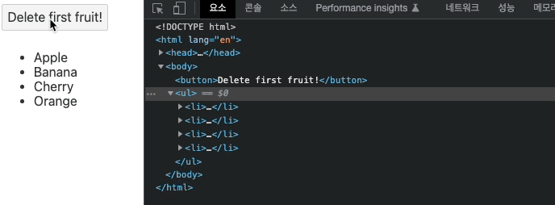
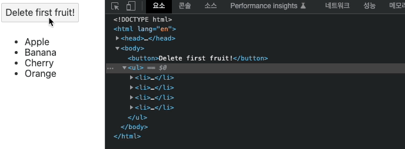
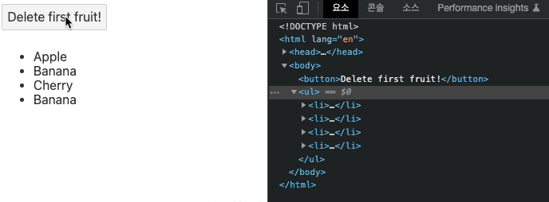

## 조건과 반복과 키

### 조건 블록 패턴 정리

조건블럭의 여러 패턴에 대해 이해해보자

`App.svelte`

아래는 coun일부 달

```html
<script>
  let count = 0;
</script>

<button on:click={() => (count += 1)}>증가!</button>
<button on:click={() => (count -= 1)}>감소!</button>

<h2>{count}</h2>
```

위 count의 변화는 아래와 같이 여러가지로 확인할 수 있다.

```html
<section>
  <h2>if</h2>
  {#if count > 3}
  <div>count &gt; 3</div>
  {/if}
</section>

<section>
  <h2>if else</h2>
  {#if count > 3}
  <div>count &gt; 3</div>
  {:else}
  <div>count &lt;= 3</div>
  {/if}
</section>
```

기문은 위와 같이 처리할 수 있다.

if, else if, else 구문은 아래와 같이 적는다.

```html
<section>
  <h2>if else if</h2>
  {#if count > 3}
  <div>count &gt; 3</div>
  {:else if count === 3}
  <div>count === 3</div>
  {:else}
  <div>count &lt;= 3</div>
  {/if}
</section>
```

다중 블럭은 어떻게 만들 수 있을까?

```html
<section>
  <h2>다중 블록</h2>
  {#if count > 3} {#if count === 5} count === 5 {:else} count &gt; 3 {/if} {/if}
</section>
```

위와 같은 문법으로 조건블럭 내부에 조건블럭을 추가할 수 있다.

일부 프레임워크에서는 위와 같은 다중블록 사용해 화면을 렌더링하는 것을 추천하고 있지 않다. 왜냐하면 가상돔을 이용하는데 최적화에 방해가 되기 때문이다. 하지만 스벨트의 경우 가상돔을 사용하지 않고 컴파일해서 결과를 도출하기 때문에 최적화에 방해되는 요소가 아니므로 편리하게 사용하면 된다.

### 반복 블록의 key 사용

이번 시간에는 반복 블럭에서 key라는 개념을 사용해 반복되는 아이템에 고유키를 부여하는 것을 구현해본다.

`App.svelte`

```html
<script>
  let fruits = ["Apple", "Banana", "Cherry", "Orange"];

  function deleteFirst() {
    fruits = fruits.slice(1); // ["Banana", "Cherry", "Orange"]
  }
</script>

<button on:click="{deleteFirst}">Delete first fruit!</button>

<ul>
  {#each fruits as fruit}
  <li>{fruit}</li>
  {/each}
</ul>
```

위처럼 delete firtst fruit 버튼을 클릭하면 첫번째 아이템을 삭제하는 로직을 가진 코드가 있다고 하자.
위 코드에서 삭제버튼을 클릭하면 ul 내부의 li의 태그 전체가 새로 그려지는 것을 확인할 수 있다.



fruits의 갱신에 따른 새로운 배열이 할당되므로 새로운 배열을 화면에 재렌더링하기 때문이다. 하지만 이는 비효율적이다. 이러한 개념을 효율적으로 개선하기 위해 key 개념을 li 태그에 도입한다.

```html
<!-- codes... -->
<ul>
  {#each fruits as fruit (fruit)}
  <li>{fruit}</li>
  {/each}
</ul>
```

위처럼 li태그에 fruit 라는 키를 부여하면 고유성이 부여되므로 li 태그를 감싸는 ul 태그만 리렌더링이 발생하고, 그 내부의 변하지 않는 li 태그에는 리렌더링이 발생하지 않는다. 이는 어떤 프레임워크에도 제공되는 기능으로, 습관적으로 반복 블록을 만들 때 중복되지 않는 키 값을 넣어주는 습관을 들이는 것이 좋다.



```jsx
let fruits = ["Apple", "Banana", "Cherry", "Orange", "Banana"];
```

그렇다면, 위처럼 fruits 배열값에 중복이 있다면 li 의 key 에 고유한 값이 들어가지지 않는다. (fruit라는 string을 그대로 키 값으로 넣어줬기 때문) 이럴 땐 어떻게 해줘야할까? 고유값을 가진 id 값들을 넣어줘야 한다.

```html
<script>
  // let fruits = ["Apple", "Banana", "Cherry", "Orange"];
  let fruits = [
    { id: 1, name: "Apple" },
    { id: 2, name: "Banana" },
    { id: 3, name: "Cherry" },
    { id: 4, name: "Banana" },
  ];
</script>

<ul>
  {#each fruits as fruit (fruit.id)}
  <li>{fruit.name}</li>
  {/each}
</ul>
```

위처럼 fruits의 배열이 각자 고유의 값을 가진 id 값을 별도로 가지도록 구성하여 그려주면, 같은 값이 name으로 들어가도 중복되지 않는 Li 태그를 구성할 수 있게되며, 필요한 Ul 태그만 리렌더링되는 것을 확인할 수 있다.


