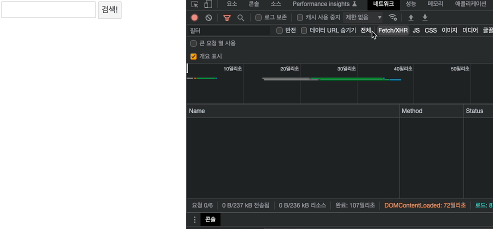

## 비동기

### 자바스크립트 비동기 처리의 이해와 사용 패턴 정리

Svelte의 비동기 블록을 알아보기 전에 자바스크립트에서의 비동기 처리에 대한 여러 패턴을 확인해보자.

```jsx
function a() {
  console.log("a");
}
function b() {
  console.log("b");
}

a();
b();
```

위 코드에서 a함수와 b함수는 모두 동기 함수 즉, 순서대로 실행되는 함수이다.
따라서 해당 함수를 실행시키면 a, b가 순차적으로 로그에 찍히는 것을 확인할 수 있다.

여기에 비동기적인 코드를 추가해보자

```jsx
function a() {
  setTimeout(() => {
    console.log("a");
  }, 1000);
}
function b() {
  console.log("b");
}

a();
b();
```

위와 같이 setTimeout 메서드로 시간 지연을 주면 a, b 함수를 순서대로 실행시켜도 b 이후 a가 로그에 기록되는 것을 확인할 수 있다. 만약 이러한 상황에서 a가 먼저 나오고 이후에 b가 나오도록 하려면 어떻게 해야하는가?

간단히 콜백함수로 처리하면 가능하다!

```jsx
function a(callback) {
  setTimeout(() => {
    console.log("a");
    callback();
  }, 1000);
}
function b() {
  console.log("b");
}

a(() => b());
```

위처럼 익명 callback 함수로 b를 실행하는 함수를 인자로 전달받도록 하면 a 로그 확인 후 b가 로그에 찍히는 것을 확인할 수 있다.

위 패턴은 콜백지옥을 만들 수 있는 패턴이다. 바로 아래처럼 말이다.

```jsx
function a(cb) {
  setTimeout(() => {
    console.log("a");
    cb();
  }, 1000);
}
function b(cb) {
  setTimeout(() => {
    console.log("b");
    cb();
  }, 1000);
}
function c(cb) {
  setTimeout(() => {
    console.log("c");
    cb();
  }, 1000);
}
function d(cb) {
  setTimeout(() => {
    console.log("d");
    cb();
  }, 1000);
}
a(() => {
  b(() => {
    c(() => {
      d(() => {
        console.log("done!");
      });
    });
  });
});
```

순차적인 함수 처리를 보장하기 위해 위처럼 콜백지옥의 구조를 생성해내므로 문제가 있다. 이는 복잡도가 너무 높다. 이를 개선하기 위해서 Promise 구문을 활용할 수 있다. Promise 내부의 resolve를 통해서 언제 다음 함수를 실행시켜줄지 결정할 수 있다.

```jsx
function a() {
  return new Promise((resolve) => {
    setTimeout(() => {
      console.log("a");
      resolve();
    }, 1000);
  });
}
function b() {
  console.log("b");
}
a().then(() => b());
```

위처럼 구현하면 기본적인 a→b 로직 실행을 보장할 수 있게 된다.
이를 활용해 위 콜백지옥 함수를 아래와 같이 구현할 수 있음

```jsx
function a() {
  return new Promise((resolve) => {
    setTimeout(() => {
      console.log("a");
      resolve();
    }, 1000);
  });
}
function b() {
  return new Promise((resolve) => {
    setTimeout(() => {
      console.log("b");
      resolve();
    }, 1000);
  });
}
function c() {
  return new Promise((resolve) => {
    setTimeout(() => {
      console.log("c");
      resolve();
    }, 1000);
  });
}
function d() {
  return new Promise((resolve) => {
    setTimeout(() => {
      console.log("d");
      resolve();
    }, 1000);
  });
}

a()
  .then(() => b())
  .then(() => c())
  .then(() => d());
```

위처럼 chain 형식으로 약속(promise)의 객체가 반환되고 then 메서드를 활용해 다음 함수를 리턴할 수 있게 된다.
이를 async ~ await 구문으로 더 간단히 구현할 수도 있다.

```jsx
async function asyncFn() {
  await a();
  await b();
  await c();
  await d();
}
asyncFn();
```

Promise 생성자는 reject 메서드도 사용할 수 있다.

```jsx
let isError = true;
function a() {
  return new Promise((resolve, reject) => {
    if (isError) {
      reject("Sorry..");
    }
    setTimeout(() => {
      console.log("a");
      resolve();
    }, 1000);
  });
}

a()
  .then(() => {
    console.log("b");
  })
  .catch((e) => {
    console.log(e);
  })
  .finally(() => {
    console.log("Done");
  });

// Sorry..
// Done
// a
```

위처럼 조건인 isError가 true인 경우 reject 문이 실행되면서 catch 구문이 실행되고 reject 내부의 인자값이 그대로 로그에 찍히게 된다. 만약 reject 다음에 return을 추가해주면 a라는 콘솔로그가 안 찍히게 구현가능, finally 문은 동작 정상, 비정상 여부에 상관없이 무조건 실행되는 구문이다.

이를 async ~ await 문으로는 아래와 같이 작성할 수 있음

```jsx
let isError = true;
async function asyncFn() {
  try {
    await a();
    console.log("b");
  } catch (e) {¸
    console.log(e);
  } finally {
    console.log('Done')
  }
}
asyncFn();
// Sorry..
// Done
// a
```

reject 내부 메서드에는 일반 문자 뿐만 아니라 에러 객체(new Error())를 사용할 수도 있다.

```jsx
let isError = true;
function a() {
  return new Promise((resolve, reject) => {
    if (isError) {
      reject(new Error('Sorry..'));
    }
  });
}

async function asyncFn() {
  try {
    await a();
    console.log("b");
  } catch (e) {¸
    console.log(e.message);
  } finally {
    console.log('Done')
  }
}
asyncFn();

// Sorry..
// Done
```

resolve도 마찬가지로 원하는 데이터를 아래와 같이 res 변수에 담아 전달해줄 수 있다.

```jsx
let isError = false;
function a() {
  // pending
  return new Promise((resolve, reject) => {
    if (isError) {
      // reject
      reject(new Error("Sorry.."));
    }
    setTimeout(() => {
      // fulfilled
      resolve("Vicky!");
    }, 1000);
  });
}

async function asyncFn() {
  try {
    const res = await a();
    console.log(res);
  } catch (e) {
    console.log(e.message);
  } finally {
    console.log("Done");
  }
}
asyncFn();

// Vicky!
// Done
```

위 코드를 then 구문에서는 이렇게 사용할 수 있다.

```jsx
a()
  // fulfilled
  .then((res) => {
    console.log(res);
  })
  // rejected
  .catch((e) => {
    console.log(e);
  })
  .finally(() => {
    console.log("Done");
  });
// Vicky!
// Done
```

- 대기(pending): 이행하거나 거부되지 않은 초기 상태
- 이행(fulfilled): 연산이 성공적으로 완료됨
- 거부(rejected): 연산이 실패함

### 영화 검색 API 예제 만들기

영화 목록을 검색할 수 있는 기본적인 애플리케이션을 만들어본다. 해당 정보를 가져올 수 있는 [API 사이트](https://omdbapi.com/)로 이동한다. Usage 영역을 보면 사용법이 나오는데 해당 내용을 참고하여 API를 fetch하면 된다.

해당 API 키를 문서 설명에 따라 발급받은 후 api fetch를 위해 의존성 라이브러리인 axios도 설치해준다.

```bash
> npm i -D axios
```

위 라이브러리를 devDependencies로 추가한 뒤 서버를 띄운다.

```jsx
<script>
  import { apikey } from "./auth.ts";
  import axios from "axios";
  let title = "";
  let movies = null;
  let error = null;
  let loading = false;

  async function searchMovies() {
    if (loading) return; // 중복 클릭 방지 용도로 조건 추가
    movies = null;
    error = null;
    loading = true;
    try {
      const res = await axios.get(`http://www.omdbapi.com/?apikey=${apikey}&s=${title}`);
      movies = res.data.Search;
    } catch (err) {
      error = err;
    } finally {
      loading = false;
    }
  }
</script>

<input type="text" bind:value={title} />
<button on:click={searchMovies}>검색!</button>

{#if loading}
  <p style="color: royalblue;">Loading</p>
{:else if error}
  <p style="color: red;">{error.message}</p>
{:else if movies}
  <ul>
    {#each movies as movie}
      <li>{movie.Title}</li>
    {/each}
  </ul>
{/if}
```

apiKey는 혹시 모르니 공유되지 않는 폴더에 별도의 값으로 저장한 뒤 호출하여 사용하고, 이외의 기능은 searchMovies 함수 내부에 구현한다. 아래 if 블록문 처럼 loading, error, movies 상태값에 따른 화면 분기를 다양하게 처리할 수 있으며, async ~ await 문법을 사용해 간단히 비동기 기능 처리를 구현할 수 있다.



---
