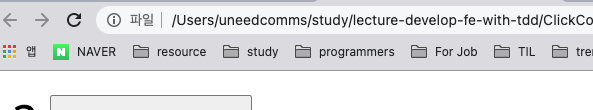

# 프론트엔드 개발과 TDD

## 3. 화면에 붙여보자

우리는 지금까지 ClickCounter, ClickCounterView 모듈을 만들었다. 각각 화면에 보이는 것과 보이지 않는 것을 구현하였고 이제 해당 모듈을 이용해서 화면을 직접 붙여본다.

`git checkout index.html-1`

해당 브랜치에서는 이미 만들어놓은 두 모듈을 호출해놓은 index.html에서 작업한다.

```html
<html>
  <body>
    <span id="counter-display"></span>
    <!-- counter값 출력(updateEl) -->
    <button id="btn-increase">Increase</button
    ><!-- 증가 버튼(triggerEl) -->

    <script src="ClickCounter.js"></script>
    <script src="ClickCountView.js"></script>

    <script>
      (() => {
        const clickCounter = App.ClickCounter();
        const updateEl = document.querySelector("#counter-display");
        const triggerEl = document.querySelector("#btn-increase");
        const view = App.ClickCountView(clickCounter, { updateEl, triggerEl });
        view.updateView();
      })();
    </script>
  </body>
</html>
```

//

### 개선된 점은 무엇일까?

AS-IS. 기존에 테스트가 불가능한 상태의 코드

```html
<button onclick="counter++; countDisplay()">증가</button>
<span id="counter-display">0</span>

<script>
  var counter = 0;
  function countDisplay() {
    var el = document.getElementById("counter-display");
    el.innerHTML = counter;
  }
</script>
```

TO-BE. TDD가 적용되어 테스트가 가능한 상태의 코드

- 단일책임의 원칙을 준수하여, 각각 역할별로 하나의 코드가 하나의 기능을 수행하도록 구성되었다.
- 화면과 동작 코드가 완전하게 분리되어 구성되었다.
  마크업이 변경되더라도 ClickCountView를 수정할 필요가 없으므로 유연한 기능에 충족된다.

```html
<html>
  <body>
    <span id="counter-display"></span>
    <button id="btn-increase">Increase</button>

    <script src="ClickCounter.js"></script>
    <script src="ClickCountView.js"></script>

    <script>
      (() => {
        const clickCounter = App.ClickCounter();
        const updateEl = document.querySelector("#counter-display");
        const triggerEl = document.querySelector("#btn-increase");
        const view = App.ClickCountView(clickCounter, { updateEl, triggerEl });
        view.updateView();
      })();
    </script>
  </body>
</html>
```
