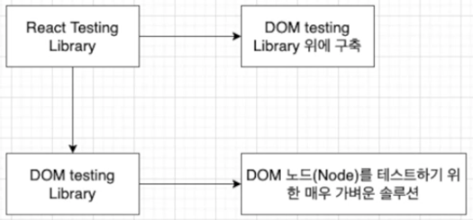
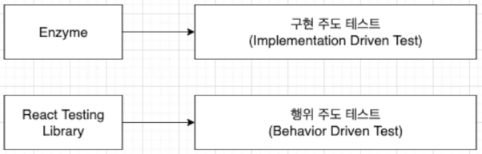
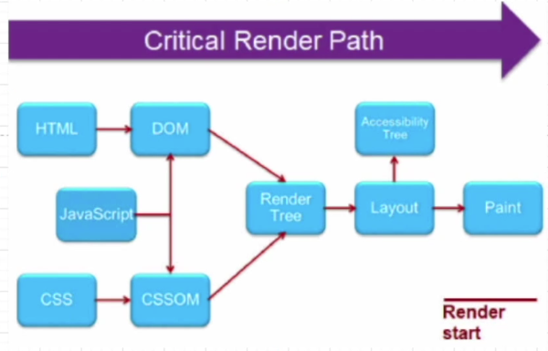

## React 테스트에 대해서

### 이번에 공부할 것은

TDD, Testing LIbrary, Jest, Functional Testing, Unit Testing

### Testing을 위한 설정 및 준비

Prettier, Jest Dom, Testing Library, Eslint

### 테스팅의 이유

더 안정적인 어플리케이션을 위해서는 여러 방법으로 테스트를 해줘야 더 안정적인 어플리케이션이 될 수 있다.

### 테스팅으로 얻는 이점

1. 디버깅 시간을 단축할 수 있다.

   만약 데이터가 잘못 나왔다면 그것이 UI의 문제인지 DB의 문제인지 등 모든 것을 테스트해서 찾아야 하는데, 테스팅 환경이 구축되어 있을 경우 자동화된 유닛 테스팅으로 특정 버그를 쉽게 찾아낼 수 있다.

2. 더욱 안정적인 어플리케이션을 만들 수 있다.

   많은 테스트 코드들은 훨씬 안정적인 어플리케이션을 만들어준다.

3. 재설계 시간의 단축과 기능 고도화에 대한 안정성

   시스템을 재설계하고 기능을 추가할 때 변경으로 인해 예측하지 못한 에러를 잡아주어 안정적이다

### React Testing Library(RTL)



React Testing Library는 리액트 구성 요소 작업을 위한 API를 추가하여 DOM Testing Library 위에 구축됨

- DOM Testing Library란 Dom 노드를 테스트하기 위한 매우 가벼운 솔루션으로 CRA로 생성된 프로젝트는 즉시 RTL을 지원하며, 그렇지 않은 경우 npm 을 통해 추가할 수 있음
  ```bash
  > npm i -D @testing-library/react
  ```

RTL은 에어비엔비에서 만든 Enzyme을 대처하는 솔루션으로 Enzyme이 리액트 개발자에게 리액트 구성 요소의 내부를 테스트할 수 있는 유틸리티를 제공하는 동안 RTL은 한 걸음 물러서 리액트 구성 요소를 테스트하여 리액트 구성 요소를 완전히 신뢰하는 방법에 대해 질문하고 답한다. 구성 요소의 구현 세부 정보는 테스트하는 대신 RTL 개발자를 리액트 애플리케이션의 사용자 입장에 둔다.



### DOM(Document Object Model) 이란

말 그대로, 문서 객체 모델.
XML, HTML 문서의 각 항목을 계층으로 표현하여 생성, 변형, 삭제할 수 있도록 돕는 인터페이스이다.

### 웹 페이지 빌드 과정(Critical Rendering Path CRP)

브라우저가 서버에 페이지에 대한 HTML 응답을 받고 화면에 표시하기 전 여러 단계가 있다. 웹 브라우저가 HTML 문서를 읽고, 스타일을 입히고 viewport에 표시하는 과정 등이 이에 속한다.



1. 문서를 읽어들여 그것들을 파싱하고 어떤 내용을 페이지에 렌더링할 지 결정 ((HTML, CSS) + JavaScript)
2. 브라우저가 DOM과 CSSOM을 결합하는 곳이며, 이 프로세스는 화면에 보이는 모든 콘텐츠의 콘텐츠와 스타일 정보를 모두 포함하는 최종 렌더링 트리를 출력함. 즉 화면에 표시되는 모든 노드의 콘텐츠 및 스타일 정보를 포함
3. 브라우저가 페이지에 표시되는 각 요소의 크기와 위치를 계산하는 단계
4. 페인트 단계에 도달 시 브라우저는 레이아웃 결과를 선택하고 픽셀을 화면에 페인트해야 함


DOM은 HTML 요소들의 구조화된 표현. DOM은 HTML이 브라우저의 렌더링 엔진에 의해 분석되고 분석이 모두 끝나고 난 HTML 파일이 DOM이다. HTML은 화면에 보이고자 하는 모양과 구조를 문서로 만들어서 단순 텍스트로 구성되어 있으며 DOM은 HTML 문서의 내용과 구조가 객체 모델로 변화되어 다양한 프로그램에서 사용될 수 있다. HTML 문서가 유효하지 않게 작성됐을 때는 브라우저가 올바르게 교정해주며, DOM은 자바스크립트에 의해 수정될 수 있다. 하지만 HTML은 수정하지 않는다.\*\*\*\*
