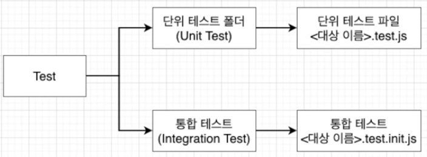
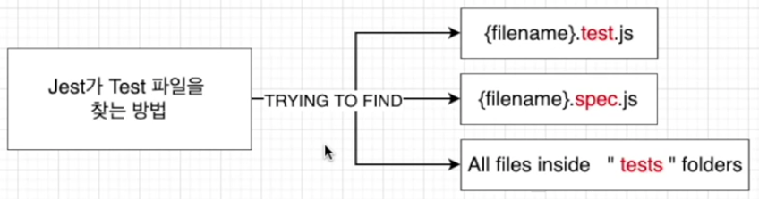
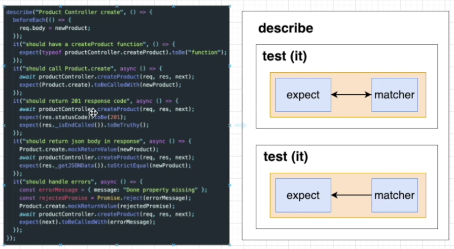
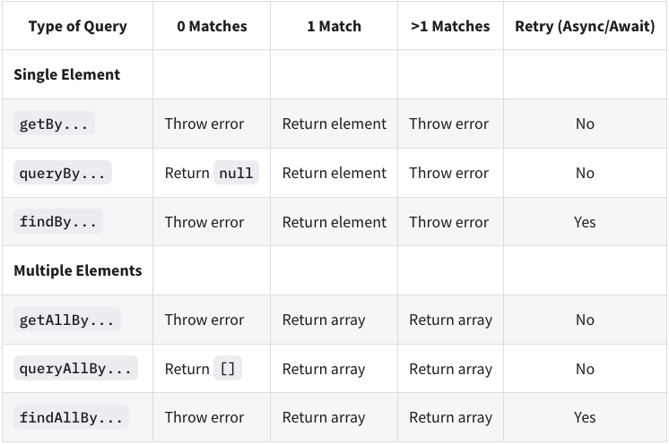

## 테스트 환경구성 및 RTL 주요 API

먼저 CRA로 리액트 및 테스트 환경을 구성해본다.

```bash
> cd react-test
> npx create-react-app react-test-app
```

### Jest

Facebook에 의해 만들어진 테스팅 프레임워크, 최소한의 설정으로 동작하며 Test case를 만들어서 어플리케이션의 코드가 잘 돌아가는지 확인해준다. 단위(unit) 테스트를 위해 이용한다.

```bash
> npm i -D jest // jest 설치
```

`package.json`

```bash
{
	// ..
  "scripts": {
    "test": "react-scripts test", // "test": "jest" or "jest --watchAll"
		// ...
  },
	// ..
}
```

- 테스트 작성할 폴더 및 파일 기본 구조 생성
  

- Jest가 Test 파일을 찾는 방법은 아래와 같이 파일명에 test, spec 등이 들어가거나 tests 폴더에 있는 경우 알아서 테스트 파일로 인식하여 처리된다.
  

### Jest 파일 구조 및 사용법

describe 하위에 test 코드가 들어간다.


- describe, argument(name, fn)
  - 여러 관련 테스트를 그룹화하는 블록을 생성
- it same as test, argument(name, fn, timeout)
  - 개별 테스트를 수행하는 곳. 각 테스트를 작은 문장처럼 설명



- expect
  - expect 함수는 값을 테스트할 때마다 사용됨 그리고 expect 함수 혼자서는 거의 사용되지 않고 matcher와 함께 사용된다.
    ```jsx
    test('two plus two is four', () => {
      expect(2 + 2).toBe(4); // matcher
    });
    test('two plus two is not five', () => {
      expect(2 + 2).not.toBe(5); // matcher
    });
    ```
- matcher
  - 다른 방법으로 값을 테스트하도록 할 때 사용한다.

### React Testing Library 주요 API

먼저 react-test-app 프로젝트에 테스트를 시작해본다.

```bash
> npm test

PASS  src/App.test.js
  ✓ renders learn react link (36 ms)

Test Suites: 1 passed, 1 total
Tests:       1 passed, 1 total
Snapshots:   0 total
Time:        2.308 s, estimated 4 s
Ran all test suites.

Watch Usage: Press w to show more.
```

위와 같이 App.test.js가 제대로 테스트가 완료된 것을 볼 수 있음.

`root/src/App.test.js`

```jsx
import { render, screen } from '@testing-library/react';
import App from './App';

test('renders learn react link', () => {
  render(<App />);
  const linkElement = screen.getByText(/learn react/i);
  // 아래와 같이 쓸 수도 있음
  // const { getByText } = render(<App />);
  // const linkElement = getByText(/learn react/i);
  expect(linkElement).toBeInTheDocument(); // Document 안에 linkElement가 있다.
});
```

`render 함수`

- DOM에 컴포넌트를 렌더링하는 함수, 인자로 렌더링할 React 컴포넌트가 들어간다.
- Return은 RTL에서 제공하는 쿼리 함수(`getByText`)와 기타 유틸리티 함수를 담고 있는 객체를 리턴
  - Destructuring 문법으로 원하는 쿼리 함수만 얻어올 수 있다.
  - 소스가 복잡해지면 비추천, 사용할 쿼리가 많아질수록 코드가 복잡해지므로, `screen` 객체 사용

이외에도 다양한 API가 제공된다. 여기 [참조](https://jestjs.io/docs/expect) 하자

### [쿼리함수](https://testing-library.com/docs/queries/about/)에 대해서

쿼리는 페이지에서 요소를 찾기 위해 테스트 라이브러리가 제공하는 방법이다. 여러 유형의 쿼리(get, find, query)가 있다. 이들 간의 차이점은 요소가 발견되지 않으면 쿼리에서 오류가 발생하는지 또는 Promise를 반환하고 다시 시도하는지 여부이다. 선택하는 페이지의 콘텐츠에 따라 다른 쿼리가 다소 적절할 수 있다.



- `getBy`
  - 쿼리에 대해 일치하는 노드를 반환하고 일치하는 요소가 없거나 둘 이상의 일치가 발견되면 설명 오류를 발생시킨다. (둘 이상의 요소가 예상되는 경우 대신 `getAllBy` 사용)
- `queryBy`
  - 쿼리에 대해 일치하는 노드를 반환하고 일치하는 요소가 없으면 null을 반환한다. 이것은 존재하지 않는 요소를 assertion하는데 유용하다. 둘 이상의 일치 항목이 발견되면 오류가 발생한다.(확인된 경우 대신 `queryAllBy` 사용)
- `findBy`
  - 주어진 쿼리와 일치하는 요소가 발견되면 해결되는 Promise를 반환한다. 요소가 발견되지 않거나 기본 제한 시간인 1000ms 후에 둘 이상의 요소가 바견되면 약속이 거부된다. (둘 이상의 요소를 찾아야 하는 경우 `findAllBy`를 사용)
  - getBy + waitFor = findBy
- `waitFor`
  - 일정 기간동안 기다려야 할 때 waitFor를 사용하여 기대가 통과할 때까지 기다릴 수 있다.
