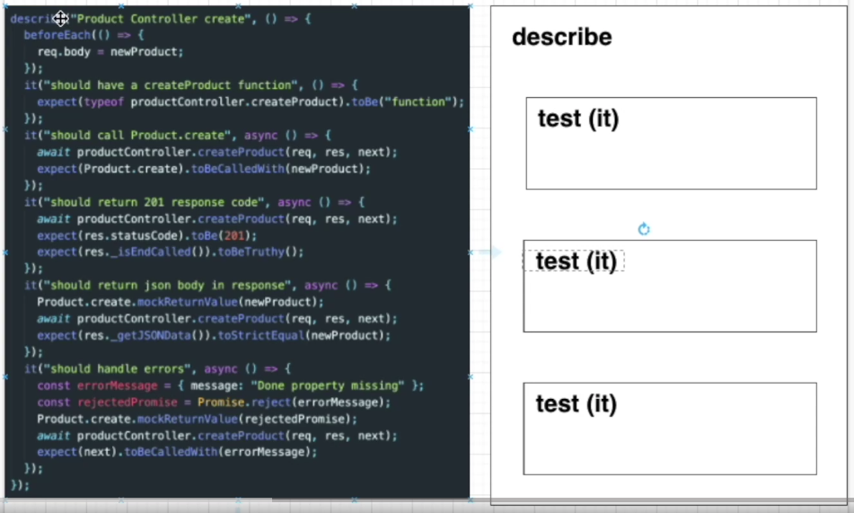

## 테스트 환경 구성

먼저 CRA로 리액트 및 테스트 환경을 구성해본다.

```bash
> cd react-test
> npx create-react-app react-test-app
```

### Jest

Facebook에 의해 만들어진 테스팅 프레임워크, 최소한의 설정으로 동작하며 Test case를 만들어서 어플리케이션의 코드가 잘 돌아가는지 확인해준다. 단위(unit) 테스트를 위해 이용한다.

```bash
> npm i -D jest // jest 설치
```

`package.json`

```bash
{
	// ..
  "scripts": {
    "test": "react-scripts test", // "test": "jest" or "jest --watchAll"
		// ...
  },
	// ..
}
```

- 테스트 작성할 폴더 및 파일 기본 구조 생성
  
- Jest가 Test 파일을 찾는 방법은 아래와 같이 파일명에 test, spec 등이 들어가거나 tests 폴더에 있는 경우 알아서 테스트 파일로 인식하여 처리된다.
  

### Jest 파일 구조 및 사용법

describe 하위에 test 코드가 들어간다.



- describe, argument(name, fn)
  - 여러 관련 테스트를 그룹화하는 블록을 생성
- it same as test, argument(name, fn, timeout)
  - 개별 테스트를 수행하는 곳. 각 테스트를 작은 문장처럼 설명


- expect
  - expect 함수는 값을 테스트할 때마다 사용됨 그리고 expect 함수 혼자서는 거의 사용되지 않고 matcher와 함께 사용된다.
    ```jsx
    test("two plus two is four", () => {
      expect(2 + 2).toBe(4); // matcher
    });
    test("two plus two is not five", () => {
      expect(2 + 2).not.toBe(5); // matcher
    });
    ```
- matcher
  - 다른 방법으로 값을 테스트하도록 할 때 사용한다.
