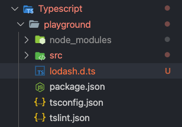
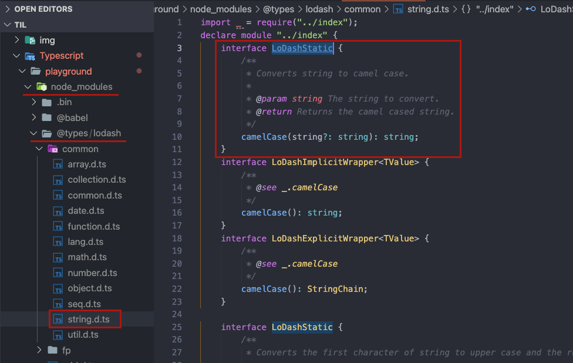

## 모듈(Module)

타입스크립트의 모듈을 이해하기 위해선 자바스크립트 모듈에 대한 이해가 선행되어야 한다.
타입스크립트 공식 문서의 많은 부분이 이 자바스크립트 모듈에 대한 설명을 포함하고 있는데, 여기서는 타입스크립트가 가지는 모듈 개념의 차이점에 대해서만 살펴본다.

### 1) 내보내기(export)

자바스크립트 모듈 [내보내기]는 MDN 문서([여기 클릭](https://developer.mozilla.org/ko/docs/Web/JavaScript/Reference/Statements/export)) 참고하자

타입스크립트는 일반적인 변수나 함수, 클래스 뿐만 아니라 다음과 같이 인터페이스나 타입 별칭도 모듈로 내보낼 수 있다.

```tsx
// myTypes.ts
// 인터페이스 내보내기
export interface IUser {
  name: string;
  age: number;
}
// 타입 별칭 내보내기
export type MyType = string | number;
```

### 2) 가져오기(import)

자바스크립트 모듈 [가져오기]는 MDN 문서([여기 클릭](https://developer.mozilla.org/ko/docs/Web/JavaScript/Reference/Statements/import)) 참고하자

```tsx
import { IUser, MyType } from "./myTypes";
const user: IUser = {
  name: "Vicky",
  age: 31,
};
const something: MyType = true; // Error - TS2322: Type 'true' is not assignable to type 'MyType'.
```

### 3) 다양한 형식으로 내보내기, 가져오기

타입스크립트는 CommonJS / AMD / UMD 모듈을 위해 `export = ABC;` , `import ABC = require('abc');`와 같은 내보내기와 가져오기 문법을 제공한다. 또한, ES6 모듈의 `export default` 같이 하나의 모듈에서 하나의 객체만 내보내는 Default Export 기능을 제공한다.

결국 타입스크립트에서 CommonJS / AMD / UMD 모듈은 다음과 같이 가져올 수 있다. 추가로, 컴파일 옵션에서 `"esModuleInterop": true` 를 제공하면, ES6 모듈의 Default import 방식도 같이 사용할 수 있다.

```tsx
// CommonJS/AMD/UMD
import ABC = require("abc");
// or
import * as ABC from "abc";
// or `"esModuleInterop": true`
import ABC from "abc";
```

### 3) 모듈의 타입 선언(Ambient module declaration)

타입스크립트의 외부 자바스크립트 모듈 사용에 대해서 알아본다.
간단한 프로젝트를 생성 후 외부 모듈로 [Lodash](https://lodash.com/)를 설치해 사용한다.

> '모듈' 파트의 타입스크립트 프로젝트 생성은 [타입스크립트 사용 환경 설정하기]를 참고한다.

```bash
$ npm instalkl lodash
```

`main.ts`에서 Lodash 모듈의 `camelCase` API를 사용해 콘솔 출력하는 아주 단순한 코드를 작성한다.
하지만 다음과 같이 '가져오기(import)'단계에서 에러가 발생한다. 이는 타입스크립트 컴파일러가 확인할 수 있는 모듈의 **타입 선언(Ambient module declaration)이 없기 때문**이다.

```bash
// main.ts

import * as _ from "lodash"; // Error - TS2307: Cannot find module 'lodash'.
console.log(_.camelCase("import lodash module"));
```

**모듈 구현(implement)과 타입 선언(declaration)이 동시에 이뤄지는 타입스크립트**와 달리, 구현만 존재하는 자바스크립트 모듈(E.g.Lodash)을 사용하는 경우, 컴파일러가 이해할 수 있는 모듈의 타입 선언이 필요하며, 이를 대부분 .d.ts 파일로 만들어 제공하게 된다.

그럼 이제 Lodash에 대한 타입 선언을 해보자. 아래와 같이 루트 경로에 lodash.d.ts 파일을 생성한다.



기본 구조는 단순한다. 모듈 가져오기(`import`)가 가능하도록 module 키워드를 사용해 모듈 이름을 명시한다. 그리고 그 범위 안에서, 타입(`interface`)을 가진 변수(`_`)를 선언하고 내보내기(`export`)만 하면 된다.

> 타입스크립트 컴파일러가 이해할 수 있도록 `declare` 키워드를 통해 선언해야 한다.

```tsx
// lodash.d.ts

// 모듈의 타입 선언(Ambient module declaration)
declare module "lodash" {
  // 1. 타입(인터페이스) 선언
  interface ILodash {
    camelCase(str?: string): string;
  }

  // 2. 타입(인터페이스)을 가지는 변수 선언
  const _: ILodash;

  // 3. 내보내기(CommonJS)
  export = _;
}
```

그리고 이 타입 선언이 컴파일 과정에 포함될 수 있도록 아래와 같이 `///`(삼중 슬래시 지시자, Triple-slash directive)를 사용하는 **참조 태그**(`<reference />`)와 `path` 속성을 사용한다.
넘어가기 전, 참조 태그의 특징에 대해서 몇 가지 살펴보면,

- 참조 태그로 가져오는 것은 모듈 구현이 아니라 타입 선언이기 때문에 import 키워드로 가져오지 않아야 한다.
- 삼중 슬래시 지시자는 자바스크립트로 컴파일되면 단순 주석이다.
- `path` 속성은 가져올 타입 선언의 상대 경로를 지정하며, 확장자를 꼭 입력해야 한다.
- `type` 속성은 `/// <reference types="lodash" />`와 같이 모듈 이름을 지정하며, 이는 컴파일 옵션에서 `typeRoots`와 Definitely Typed(`@types`)를 기준으로 한다.

> 컴파일 옵션 `typeRoots`와 Definitely Typed(`@types`)는 이후에 살펴본다.

```tsx
// main.ts
// 참조 태그(Triple-slash directive)
/// <reference path="../lodash.d.ts" />

import * as _ from "lodash";
console.log(_.camelCase("import lodash module"));
```

정상적으로 콘솔 출력되는지 확인한다.

```bash
$ npx ts-node main.ts
#importLodashModule
```

### 1) Definitely Typed(@types)

이전 파트에서 Lodash의 `camelCase` 메소드를 사용했고, 이번엔 추가로 `snakeCase`도 사용하려고 한다.
하지만 우리는 `lodash.d.ts`에 `snakeCase`에 대한 타입선언을 하지 않았기 때문에 다음과 같이 에러가 발생한다.

```tsx
// main.ts

/// <reference path="../lodash.d.ts" />
import * as _ from "lodash";
console.log(_.camelCase("import lodash module"));
console.log(_.snakeCase("import lodash module));// Error - TS2339: Property 'snakeCase' does not exist on type 'ILodash'.
```

이는 `lodash.d.ts` 에 `snakeCase`에 대한 타임 선언을 하면 간단히 해결할 수 있다.

```tsx
// lodash.d.ts

declare module "lodash" {
  interface ILodash {
    camelCase(str?: string): string;
    snakeCase(str?: string): string; // 타입선언 추가
  }

  const _: ILodash;
  export = _;
}
```

하지만, 프로젝트에서 사용하는 모든 모듈에 대해 매번 직접 타입 선언을 작성하는 것은 매우 비효율적이다 !
그래서 우리는 여러 사용자들의 기여로 만들어진 [Definitely Typed](https://github.com/DefinitelyTyped/DefinitelyTyped)를 사용할 수 있다. 수 많은 모듈의 타입이 정의되어 있으며, 지속적으로 추가되고 있다.

`npm install -D @types/모듈이름` 으로 설치해 사용한다.
`npm info @types/모듈이름`으로 검색하면 원하는 모듈의 타입 선언이 존재하는지 확인할 수 있다.

다음과 같이 Lodash 타입 선언을 설치한다.

```bash
$ npm i -D @types/lodash
```

자! 이제 더 이상 필요치 않은 `lodash.d.ts` 는 삭제한다! main.ts의 참조 태그(Triple-slash directive)도 같이 삭제한다. 별도 설정이 없어도, 다양한 Lodash API를 사용할 수 있다.

```tsx
// main.ts

import * as _ from "lodash";

console.log(_.camelCase("import lodash module"));
console.log(_.snakeCase("import lodash module"));
console.log(_.kebabCase("import lodash module"));
```

```bash
$ npx ts-node main.ts
# importLodashModule
# import_lodash_module
# import-lodash-module
```

동작 원리는 간단하다. 타입 선언 모듈(`@types/lodash`)은 `node_modules/@types` 경로에 설치되며, 이 겨로의 모든 타입 선언은 **모듈 가져오기(Import)를 통해 컴파일에 자동으로 포함**된다.


