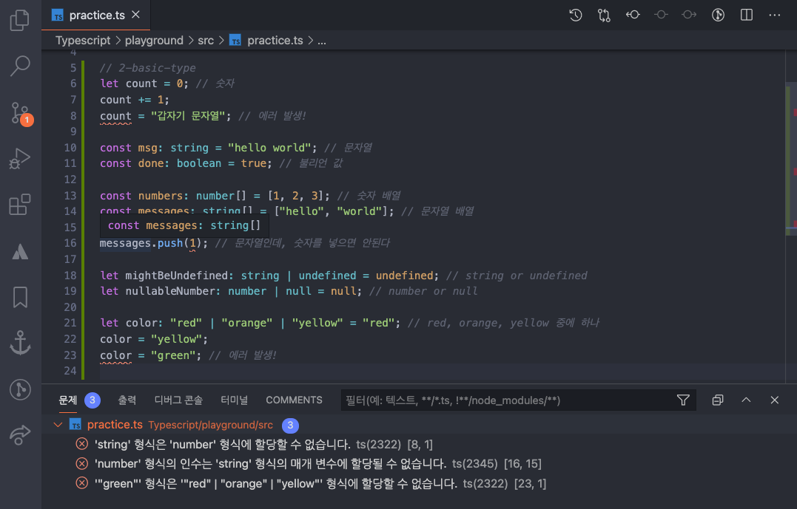

## 2. 기본 타입

알아두면 유용한 타입스크립트 기초 핵심 - velopert님 글 참조 ([링크](https://velog.io/@velopert/typescript-basics))
한눈에 보는 타입스크립트 - HEROPY Tech 글 참조 ([링크](https://heropy.blog/2020/01/27/typescript/))

### 1) 타입 지정

타입스크립트는 일반 변수, 매개 변수(Parameter), 객체 속성(Property) 등에 아래와 같이 `:TYPE` 과 같은 형태로 타입 지정이 가능하다.

```tsx
function someFunc(a: TYPE_A, b: TYPE_B): TYPE_RETURN {
  return a + b;
}
let some: TYPE_SOME = someFunc(1, 2);
```

위의 형태를 바탕으로 아래의 예시를 보면 add함수의 매개변수 a와 b는 number 타입이어야 하고, 실행된 함수의 반환값은 숫자로 추론(Inference)되기 때문에 변수 sum도 number 타입으로 지정했다.

```tsx
function add(a: number, b: number) {
  return a + b;
}
const sum: number = add(1, 2);
console.log(sum); // 3
```

위 코드를 자바스크립트로 컴파일하면 아래와 같다.

```jsx
function add(a, b) {
  return a + b;
}
var sum = add(1, 2);
console.log(sum);
```

### 2) 타입 에러

**src/practice.ts**

```tsx
let count = 0; // 숫자
count += 1;
count = "갑자기 문자열"; // 에러 발생!

const msg: string = "hello world"; // 문자열
const done: boolean = true; // 불리언 값

const numbers: number[] = [1, 2, 3]; // 숫자 배열
const messages: string[] = ["hello", "world"]; // 문자열 배열

messages.push(1); // 문자열인데, 숫자를 넣으면 안된다

let mightBeUndefined: string | undefined = undefined; // string or undefined
let nullableNumber: number | null = null; // number or null

let color: "red" | "orange" | "yellow" = "red"; // red, orange, yellow 중에 하나
color = "yellow";
color = "green"; // 에러 발생!
```



타입스크립트를 사용하면 특정 변수 또는 상수의 타입을 지정할 수 있고, 사전에 지정한 타입이 아닌 값이 설정될 경우 위와 같이 바로 에러를 발생시킨다.

이렇게 에러가 났을 땐 `tsc` 명령어를 입력해 컴파일하면 아래와 같이 에러 뿜뿜하면서 컴파일이 되지 않는다.

