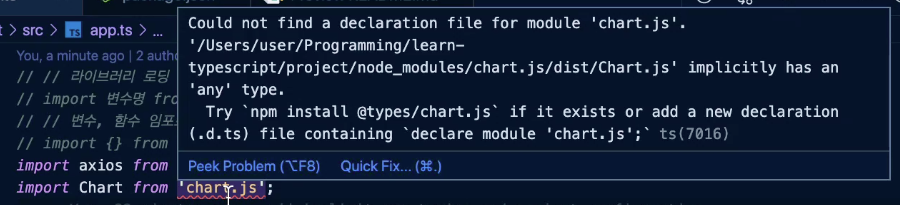
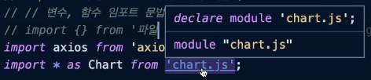

# 외부 라이브러리 모듈화

### 프로젝트 내 라이브러리 로딩 방식 확인 및 모듈화 방법 안내

프로젝트 내에서 사용하고 있는 라이브러리는 아래와 같이 cdn으로 index.html에서 로딩되고 있다.

`index.html`

```html
<!DOCTYPE html>
<html lang="en">
  <body>
    <script src="https://unpkg.com/axios/dist/axios.min.js"></script>
    <script src="https://cdn.jsdelivr.net/npm/chart.js@2.8.0"></script>
    <script src="./app.js"></script>
  </body>
</html>
```

원활한 타입스크립트 적용을 위해서는 외부 라이브러리를 cdn으로 적용하는 방식이 아닌 프로젝트 코드 내에서 import로 가져올 수 있도록 변경해주어야 한다. 그러려면 외부 라이브러리를 `npm`을 이용해 설치해주어야 한다.

```jsx
// 라이브러리 로딩
import 변수명 from '라이브러리 이름';
// 변수, 함수 임포트 문법
import {} from '파일 상대 경로';
```

### axios 라이브러리 설치 및 타입 에러 확인

따라서 아래와 같이 `axios`를 설치한 후 `app.ts` 에서 `axios`를 `import`를 하면 에러가 발생하지 않는다.

```bash
npm i axios
```

`src/app.ts`

```jsx
import axios from 'axios';
```
### 프로젝트 내 라이브러리 로딩 방식 확인 및 모듈화 방법 안내

프로젝트 내에서 사용하고 있는 라이브러리는 아래와 같이 cdn으로 index.html에서 로딩되고 있다.

`index.html`

```html
<!DOCTYPE html>
<html lang="en">
  <body>
    <script src="https://unpkg.com/axios/dist/axios.min.js"></script>
    <script src="https://cdn.jsdelivr.net/npm/chart.js@2.8.0"></script>
    <script src="./app.js"></script>
  </body>
</html>
```

원활한 타입스크립트 적용을 위해서는 외부 라이브러리를 cdn으로 적용하는 방식이 아닌 프로젝트 코드 내에서 import로 가져올 수 있도록 변경해주어야 한다. 그러려면 외부 라이브러리를 `npm`을 이용해 설치해주어야 한다.

```jsx
// 라이브러리 로딩
import 변수명 from '라이브러리 이름';
// 변수, 함수 임포트 문법
import {} from '파일 상대 경로';
```

### axios 라이브러리 설치 및 타입 에러 확인

따라서 아래와 같이 `axios`를 설치한 후 `app.ts` 에서 `axios`를 `import`를 하면 에러가 발생하지 않는다.

```bash
npm i axios
```

`src/app.ts`

```jsx
import axios from 'axios';
```

`axios`의 경우 관리가 잘 되어있는 라이브러리이므로 타입에러가 사라지지만 오픈 소스 라이브러리 중 타입 정의가 제대로 되어 있지 않은 라이브러리가 많기 때문에 해당 방법으로 `import`를 해준 뒤에도 타입 에러가 발생할 가능성이 크다. 

### Chart.js 라이브러리 설치 및 타입 에러 확인

바로 `Chart.js`가 바로 그 예이다. 우선 프로젝트에 `Chart.js` 라이브러리를 설치해보자.

```bash
npm install chart.js
```

`src/app.ts`

app.ts에서 Chart.js를 import 하면 에러가 발생한다. (*현재는 `index.esm.d.ts` 파일이 생겨 에러 발생 X*)



위와 같은 에러는 `Chart.js`에서 제공되는 `index.d.ts`가 없기 때문에 에러가 발생한다. 이러한 경우 별도로 만들어진 `@types/chart.js`를 추가로 설치하여 적용하거나 직접 `index.d.ts`를 만들어 사용해야 한다.

구글링을 통해 @types/chart.js가 존재하는 것이 확인되므로 우선 설치해준다.

```bash
$ npm i @types/chart.js
```

해당 파일을 설치하면 `node_modules/@types/chart.js`가 설치되어있는 것을 확인할 수 있다.
타입스크립트는 모듈을 해석하는 방식 중 하나로 `node_modules/@types` 내의 타입 선언 파일을 읽어들여 타입을 적용해주는 방법도 가지고 있으므로 해당 방법으로 외부 라이브러리의 타입 에러를 개선할 수 있다.

### Definitely Typed

`@types`로 정의되는 모든 것들을 통틀어 Type Definition 라이브러리라고 한다.  

이밖에도 타입선언이 되어있는 npm 패키지를 찾아주고, 그렇지 않으면 Definitely Typed 라이브러리를 함께 알려주는 서비스를 Typescript에서 이미 제공하고 있다. [여기](https://www.typescriptlang.org/dt/search?search=)를 참고하여 타입 선언이 되어있거나, 타입선언 파일이 별도로 제공되는 라이브러리를 설치해주는 것이 바람직하다.

### 타입 선언 라이브러리가 제공되지 않는 외부 라이브러리에 대한 대처 방법

만약 사용하는 외부 라이브러리에 타입 선언 라이브러리가 제공되지 않으면 어떻게 해야할까? 내가 직접 설정한 타입 설정이 타입스크립트에 적용되도록 해주면 된다.

`tsconfig.json`

```json
{
  "compilerOptions": {
		// ...
    "typeRoots": ["./node_modules/@types", "./types"] // 타입체크 Root에 types 추가
  },
	// ...
}
```

`project/types/chart.js/index.d.ts`

타입 선언(d.ts)을 저장할 `types`라는 폴더를 project 하위에 추가하고 그 하위에 세부 라이브러리 명으로 폴더를 생성해 `index.d.ts` 파일을 추가해준다.

```tsx
 declare module 'chart.js';
```



위와 같이 설정 후 다시 `app.ts`에 돌아와 chart.js에 마우스를 올려보면 방금 선언해준 `types/chart.js/index.d.ts`를 참조하고 있는 것을 알 수 있다. 이와 같이 임의로 타입선언 파일을 선언하는방법으로 이슈를 대처할 수 있다.