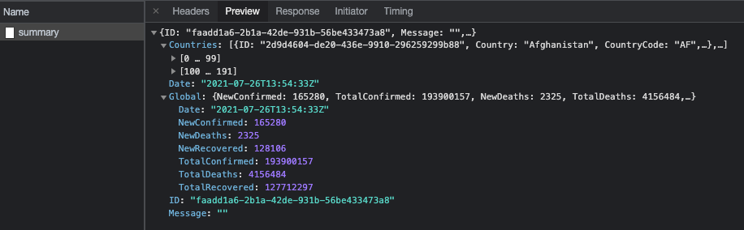
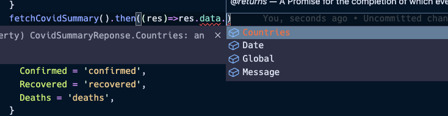
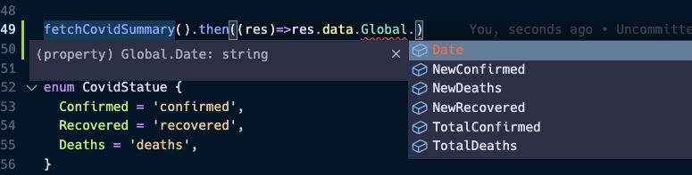

# API 함수 타입 정의

이제 본격적으로 app.ts에 대한 타이핑을 해보자. 
가장 먼저 API 함수인 fetchCovidSummary 함수에 대한 타입 정의가 필요하다.

```tsx
// fetchCovidSummary 함수를
function fetchCovidSummary() {
  const url = 'https://api.covid19api.com/summary';
  return axios.get(url);
}

// ..
// 해당 영역에서 distructuring 문법으로 data 사용
// API 함수에 대한 타입 정의가 없으면 data의 타입이 any가 되므로 이후 전개될 코드에 이점을 위해 추가해준다.
async function setupData() {
  const { data } = await fetchCovidSummary();
  setTotalConfirmedNumber(data); 
  setTotalDeathsByWorld(data);
  setTotalRecoveredByWorld(data);
  setCountryRanksByConfirmedCases(data);
  setLastUpdatedTimestamp(data);
}
```

### 전세계 코로나 요약 정보 API 함수 반환 타입 정의

먼저 fetchCovidSummary함수의 리턴값은 axios 에 대한 반환 데이터이므로 반환 데이터 타입은 `Promise<AxiosResponse<>>`이다. 뒤에 제네릭이 붙는데, 해당 영역 안에 들어갈 타입을 정의하기 위해서는 `/summary API`에 대한 응답정보를 봐야할 필요가 있다. `index.html`에서 돌아가는 어플리케이션을 서버 구동 시키고 새로고침하면 summary API에 대한 응답 데이터를 확인할 수 있다.



해당 Response를 그대로 복사하여 Interface로 간략 정의하면 아래와 같다.

```tsx
interface CovidSummaryReponse {
  Countries: any[];
  Date: string;
  Global: any;
  Message: string;
}

function fetchCovidSummary(): Promise<AxiosResponse<CovidSummaryReponse>> {
  const url = 'https://api.covid19api.com/summary';
  return axios.get(url);
}
```



위와 같이 설정 후 `fetchCovidSummary` 함수를 실행 시켜 then으로 들어오는 response를 확인해보면 `Promise`의 고정 반환값인 `status`, `data`, `headers`, `config`가 자동완성으로 뜨고, data 내부에서는 위 `CovidSummaryResponse`로 정의한 타입들이 자동완성 키 값으로 뜨는 것을 확인할 수 있다.

그렇다면 좀 더 구체적으로 CovidSummaryReponse 인터페이스에 대한 타이핑을 별도의 파일에 진행해보자. 

`project/src/covid/index.ts`

```tsx
interface Country {
  Country: string;
  CountryCode: string;
  Date: string;
  ID: string;
  NewConfirmed: number;
  NewDeaths: number;
  NewRecovered: number;
  Premium: any;
  Slug: string;
  TotalConfirmed: number;
  TotalDeaths: number;
  TotalRecovered: number;
}

interface Global {
  Date: string;
  NewConfirmed: number;
  NewDeaths: number;
  NewRecovered: number;
  TotalConfirmed: number;
  TotalDeaths: number;
}

export interface CovidSummaryReponse {
  Countries: Country[];
  Date: string;
  Global: Global;
  Message: string;
}
```

```tsx
// 타입 모듈
import { CovidSummaryReponse } from './covid/index';

function fetchCovidSummary(): Promise<AxiosResponse<CovidSummaryReponse>> {
  const url = 'https://api.covid19api.com/summary';
  return axios.get(url);
}
```

위와 같이 각 세부 interface를 조합하여 `CovidSummaryResponse`를 정의한 뒤 app.ts에서 모듈을 import 하는 방식으로 변경하면 정상적으로 동작하는 것을 확인할 수 있다. 또한 fetchCovidSummary 함수 동작 시 지정해놓은 세부 타입이 자동완성으로 노출되는 것도 확인할 수 있다.



### 국가별 코로나 정보 API 함수 타입 정의

국가별 코로나 정도 API 함수로 되어있다. 위 함수 타입정의를 참고하여 `deaths`, `confirmed`, `recovered`에 따른 아래 fetchCountryInfo 함수에 대한 타이핑도 해보자.

```tsx
function fetchCountryInfo(countryCode: string, status: CovidStatue) {
  const url = `https://api.covid19api.com/country/${countryCode}/status/${status}`;
  return axios.get(url);
}

// 위 fetchCountryInfo 함수는 아래 클릭 이벤트에서 사용된다.
async function handleListClick(event: any) {
	// ..
  const { data: deathResponse } = await fetchCountryInfo(selectedId, CovidStatue.Deaths);
  const { data: recoveredResponse } = await fetchCountryInfo(selectedId, CovidStatue.Recovered);
  const { data: confirmedResponse } = await fetchCountryInfo(selectedId, CovidStatue.Confirmed);
	// ..
}
```

`src/covid/index.ts`

fetchCountryInfo를 통해 확인되는 Response는 위 `CovidSummaryReponse`와는 달리 바로 배열객체로 받아진다. 따라서 `interface`가 아닌 `type` 형태로 받아 배열 타입으로 정의해야 한다.

```tsx
export enum CovidStatue {
  Confirmed = 'confirmed',
  Recovered = 'recovered',
  Deaths = 'deaths',
}

interface CountrySummaryInfo {
  Cases: number;
  City: string;
  CityCode: string;
  Country: string;
  CountryCode: string;
  Date: string;
  Lat: string;
  Lon: string;
  Province: string;
  Status: CovidStatue;
}

export type CountrySummaryResponse = CountrySummaryInfo[];
```

`src/app.ts`

```tsx
function fetchCountryInfo(countryCode: string, status: CovidStatue): Promise<AxiosResponse<CountrySummaryResponse>> {
  // ...
}
```

상단 함수 우측에 CountrySummaryResponse 타이핑을 하면 별도로 타입을 import 할 필요없이 auto import 가 되니 참고하자!

### 전세계 코로나 요약 정보 API 함수 관련 나머지 함수 타입 정의

```tsx
async function setupData() {
  const { data } = await fetchCovidSummary();
  setTotalConfirmedNumber(data);
  setTotalDeathsByWorld(data);
  setTotalRecoveredByWorld(data);
  setCountryRanksByConfirmedCases(data);
  setLastUpdatedTimestamp(data);
}
```

앞서 정의한 `fetchCovidSummary` 함수의 반환값으로 동작하는 함수(`setTotalConfirmedNumber`, `setTotalDeathsByWorld` 등)에도 타이핑을 추가해보자!

```tsx
function setTotalConfirmedNumber(data: CovidSummaryReponse) {
  confirmedTotal.innerText = data.Countries.reduce(
    (total: number, current: Country) => (total += current.TotalConfirmed),
    0
  ).toString();
}
```

`reduce` 함수를 그대로 반환값으로 넣게되면 반환 데이터 type은 `total` 타입인 `number`가 된다. 그러나 `innerText`에는 `string` 타입만 들어갈 수 있으므로 타입 에러가 발생! (물론 JS에서는 `number` → string`으로` 자동 변환 되어 들어감. 단, 타입스크립트에서는 에러가 발생) 따라서 `reduce` 함수에 toString() 함수를 붙여 명시적으로 반환값을 string으로 바꿔주면 된다 :)

나머지 타입 정의도 비슷하게 처리해주면 된다.

```tsx
function setTotalDeathsByWorld(data: CovidSummaryReponse) {
  deathsTotal.innerText = data.Countries.reduce(
    (total: number, current: Country) => (total += current.TotalDeaths),
    0
  ).toString();
}

function setTotalRecoveredByWorld(data: CovidSummaryReponse) {
  recoveredTotal.innerText = data.Countries.reduce(
    (total: number, current: Country) => (total += current.TotalRecovered),
    0
  ).toString();
}

function setCountryRanksByConfirmedCases(data: CovidSummaryReponse) {
  const sorted = data.Countries.sort(
    (a: Country, b: Country) => b.TotalConfirmed - a.TotalConfirmed
  );
  sorted.forEach((value: Country) => {
    // ..
    span.textContent = value.TotalConfirmed.toString();
    // ..
  });
}

function setLastUpdatedTimestamp(data: CovidSummaryReponse) {
  lastUpdatedTime.innerText = new Date(data.Date).toLocaleString();
}
```

### 특정 국가 코로나 정보 API 함수 관련 나머지 함수 타입 정의

```tsx
async function handleListClick(event: MouseEvent) {
  // ..
  const { data: deathResponse } = await fetchCountryInfo(selectedId, CovidStatue.Deaths);
  const { data: recoveredResponse } = await fetchCountryInfo(selectedId, CovidStatue.Recovered);
  const { data: confirmedResponse } = await fetchCountryInfo(selectedId, CovidStatue.Confirmed);
  endLoadingAnimation();
	// data 정보를 props로 내려주는 나머지 함수들 타입 정의
  setDeathsList(deathResponse);
  setTotalDeathsByCountry(deathResponse);
  setRecoveredList(recoveredResponse);
  setTotalRecoveredByCountry(recoveredResponse);
  setChartData(confirmedResponse);
  isDeathLoading = false;
}
```

마지막으로 앞서 정의한 `fetchCountryInfo` 함수의 반환값으로 동작하는 함수(`setDeathsList`, `setTotalDeathsByCountry` 등)에도 앞선 방법과 동일하게 타입 정의를 진행한다.

```tsx
function setDeathsList(data: CountrySummaryResponse) {
  const sorted = data.sort(
    (a: CountrySummaryInfo, b: CountrySummaryInfo) =>
      getUnixTimestamp(b.Date) - getUnixTimestamp(a.Date)
  );
  sorted.forEach((value: CountrySummaryInfo) => {
		// ..
    span.textContent = value.Cases.toString();
		// ..
  });
}

function setTotalDeathsByCountry(data: CountrySummaryResponse) {
  deathsTotal.innerText = data[0].Cases.toString();
}

function setRecoveredList(data: CountrySummaryResponse) {
  const sorted = data.sort(
    (a: CountrySummaryInfo, b: CountrySummaryInfo) =>
      getUnixTimestamp(b.Date) - getUnixTimestamp(a.Date)
  );
  sorted.forEach((value: CountrySummaryInfo) => {
		// ..
    span.textContent = value.Cases.toString();
		// ..
  });
}

function setTotalRecoveredByCountry(data: CountrySummaryResponse) {
  recoveredTotal.innerText = data[0].Cases.toString();
}

function setChartData(data: CountrySummaryResponse) {
  const chartData = data
    .slice(-14)
    .map((value: CountrySummaryInfo) => value.Cases);
  const chartLabel = data
    .slice(-14)
    .map((value: CountrySummaryInfo) =>
      new Date(value.Date).toLocaleDateString().slice(5, -1)
    );
  renderChart(chartData, chartLabel);
}
```