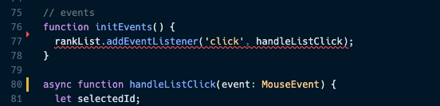
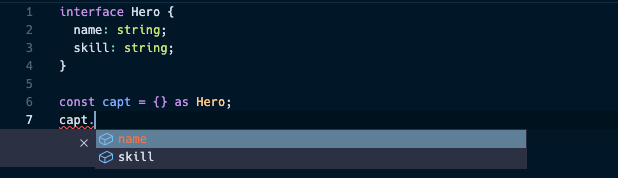
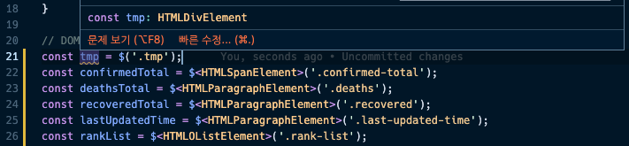

# 엄격한 타입 적용

### strict 모드 설정하기

타입스크립트 설정 파일에 아래 설정을 추가한다.

```tsx
{
  "compilerOptions": {
    "strict": true,
    "strictNullChecks": true,
    "strictFunctionTypes": true,
    "strictBindCallApply": true,
    "strictPropertyInitialization": true,
    "noImplicitThis": true,
    "alwaysStrict": true
  },
}
```

strict 옵션을 활성화 하면 관련된 옵션(`alwaysStrict`, `strictNullChecks`, `strictBindCallApply`, `strictFunctionTypes`, `strictPropertyInitialization`, `noImplicityAny` 등)

- `any`로 되어 있는 타입을 최대한 더 적절한 타입으로 변환한다.
- `as`와 같은 키워드를 최대한 사용하지 않도록 고민해서 변경한다.

### null 타입 오류 및 addEventListener 타입 오류 해결

위와 같이 tsconfig 설정을 엄격모드로 변경하면 app.ts에서 기존에는 나지 않던 오류들이 나기 시작한다.  



먼저 위 코드의 rankList에 마우스를 올려보면 rankList가 null 타입으로 추론되어 발생하는 오류와 addEventListener의 형식에 콜백 함수인 handleListClick의 타입이 적절하지 않다는 두 가지 에러가 발생.

```tsx
// events
function initEvents() {
	// 1. rankList가 null일 경우를 사전에 대비
  if (!rankList) {
    return;
  }
  rankList.addEventListener('click', handleListClick);
}

// 2. handlkeListLClick event 타입을 Event로 정의
async function handleListClick(event: Event) {
	// ..
}
```

1. 먼저 rankList가 없을 경우(null)를 사전에 대비하여 return 처리를 해준다.
2. addEventListener가 요구하는 콜백 함수의 event 타입은 Event이므로 MouseEvent → Event 변경한다.

### 타입스크립트 내장 타입의 위계 구조 및 타입 오류 해결

타입스크립트 내부적으로 정의되어 있는 타입들 간의 위계관계(상위 하위 타입의 관계)를 잘 알고 있으면 타이핑할 때 큰 도움이 된다. 아래의 변수에 정의된 타입들을 따라가보면, 그 위계관계를 알 수 있다.

```tsx
const a: Element
// interface Element extends Node
const b: HTMLElement
// interface HTMLElement extends Element, .. {
const c: HTMLDivElement
// interface HTMLDivElement extends HTMLElement {
```

위 타입 확장 구조를 보면 Element에서 확장된 타입으로 HTMLElement가, HTMLElement에서 확장된 타입으로 HTMLDivElement가 선언되어 있는 것을 볼 수 있다. 

마찬가지로 이벤트 관련 타입도 위계 관계가 있다.

```tsx
const evt1: Event
const evt2: UIEvent
// interface UIEvent extends Event {
const evt3: MouseEvent
// interface MouseEvent extends UIEvent {
```

위 타입 선언 확장 관계를 보면 Event < UIEvent < MouseEvent 로 되어있는 것을 알 수 있다.

이외에도 dom 관련 변수 사용 시 Null 타입 오류을 해결해본다면 아래와 같다.

```tsx
async function handleListClick(event: Event) {
  if (
    event.target instanceof HTMLParagraphElement ||
    event.target instanceof HTMLSpanElement
  ) {
		// 해당 element가 있을 경우와 없을 경우에 대한 분기 처리로 에러 개선
	 selectedId = event.target.parentElement
      ? event.target.parentElement.id
      : undefined;
	}
	// ...
	const { data: deathResponse } = await fetchCountryInfo(
    selectedId, // fetchCountryInfo의 매개변수에 타입 추가하여 에러 개선
    CovidStatus.Deaths
  );
}

function fetchCountryInfo(
  countryName: string | undefined, // countryName에 undefined 타입 추가
  status: CovidStatus
): Promise<AxiosResponse<CountrySummaryResponse>> {
	// ..
}
```

### 타입 단언을 이용한 타입 에러 해결

이외에도 타입 단언 `!`을 이용해 돔 관련 에러를 해결하는 방법도 있다.

```tsx
function setDeathsList(data: CountrySummaryResponse) {
	// ..
  sorted.forEach((value: CountrySummaryInfo) => {
		// code..
    deathsList!.appendChild(li);
  });
}
```

위와 같이 설정하면 deathsList는 반드시 null이 아니라고 타입 단언을 해서 에러를 개선할 수 있다.
생각보다 편리한 문법이지만 타입 단언 문법을 사용시 주의해야 할 점이 있다.

아래의 예시를 보자



아래와 같이 Hero라는 인터페이스 타입을 `capt` 변수에 타입 단언 처리하면 해당 객체 내에 값이 별도로 정의되지 않았더라도(빈 객체로 정의되어 있더라도) 이후 capt 변수에 자동완성 속성으로 name, skill이 뜨게 된다.

만약 해당 코드가 다른 코드들과 함께 있어 이전 내용을 정확히 확인할 수 없을 경우 해당 프로퍼티가 정의되어 있지 않다는 것을 모른채 코드를 작성하므로 실제 서비스에 에러를 발생시킬 수 있다.

즉, 문분별한 타입 단언은 예측할 수 없는 에러를 발생시킬 수 있다는 것이다. 따라서 코드를 작성 시 명확히 해당 엘리먼트가 있다는 확신이 있는 경우에만 타입 단언을 사용해서 처리하는 것이 좋다. 

그러나 뭐니뭐니 해도 돔 변수에 타입 단언으로 처리하는 것이 가장 바람직하다.

```tsx
const rankList = $('.rank-list') as HTMLOListElement;
const deathsList = $('.deaths-list') as HTMLOListElement;
const recoveredList = $('.recovered-list') as HTMLOListElement;
```

### Optional Chaning 연산자 소개

타입 단언 외에도 옵셔널 체이닝 연사자 `?.`를 사용해서 Null 타입 에러를 개선할 수 있다.

```tsx
function setRecoveredList(data: CountrySummaryResponse) {
	// ..
  sorted.forEach((value: CountrySummaryInfo) => {
		// ..
    recoveredList?.appendChild(li);
  });
}
```

그러나 옵셔널 체이닝과 타입 단언 모두 초기에 엘리먼트에 타입을 선언하면 사용하지 않아도 좋다. 선택적으로 적용하면 되므로 초기에 타입 선언 > 옵셔널 체이닝 > 타입 단언 순으로 기억하고 처리하도록 하자 

### DOM 유틸 함수 활용성을 높이는 타입 정의

이전까지 Dom 관련 null 타입 에러를 방지하기 위해 Dom 엘리먼트 선언 시 타입 단언으로 각 엘리먼트별 타입을 지정해주었다. 매번 엘리먼트에 타입을 지정하는 것은 매우 번거로우므로 Dom 유틸 함수의 활용성을 높일 수 있는 타입 정의 방법을 배워보자.

기존에는 이렇게 했었다.

```tsx
function $(selector: string) {
  return document.querySelector(selector);
}

const confirmedTotal = $('.confirmed-total') as HTMLSpanElement;
const deathsTotal = $('.deaths') as HTMLParagraphElement;
const recoveredTotal = $('.recovered') as HTMLParagraphElement;
const lastUpdatedTime = $('.last-updated-time') as HTMLParagraphElement;
const rankList = $('.rank-list') as HTMLOListElement;
const deathsList = $('.deaths-list') as HTMLOListElement;
const recoveredList = $('.recovered-list') as HTMLOListElement;
```

`$` 유틸함수에 제네릭 타입을 이용해 타입이 자동적으로 처리되도록 아래와 같이 변경해본다.

```tsx
function $<T extends HTMLElement = HTMLDivElement>(selector: string) {
  const element = document.querySelector(selector);
  return element as T;
}
```

위 타이핑의 의미는 `T`로 들어오는 타입의 경우 `HTMLElement`의 확장 타입으로 제한되며, 별도의 타입 선언이 없을 경우 `HTMLDivElement`로 선언된다는 것을 의미한다. 위와 같이 선언할 경우 기존의 변수 선언 시 타입 단언으로 처리했던 부분을 아래와 같이 바꿀 수 있다.

```tsx
const confirmedTotal = $<HTMLSpanElement>('.confirmed-total');
const deathsTotal = $<HTMLParagraphElement>('.deaths');
const recoveredTotal = $<HTMLParagraphElement>('.recovered');
const lastUpdatedTime = $<HTMLParagraphElement>('.last-updated-time');
const rankList = $<HTMLOListElement>('.rank-list');
const deathsList = $<HTMLOListElement>('.deaths-list');
const recoveredList = $<HTMLOListElement>('.recovered-list');
const deathSpinner = createSpinnerElement('deaths-spinner');
const recoveredSpinner = createSpinnerElement('recovered-spinner');
```



만약 별도의 타입을 제네릭으로 지정하지 않을경우 `HTMLDivElement`로 자동 추론되는 것을 확인할 수 있다.