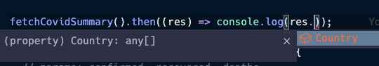

# 점진적인 타입 시스템 적용 방법 - JSDoc

기존 app.js에 JSDoc을 이용해 점진적으로 타입시스템을 적용해볼 수 있다.
app.js 내부의 fetch API 함수인 fetchCovidSummary()로 JSDoc 타이핑을 해보면 아래와 같다.

`app.js`

```tsx
// @ts-check  // 1

// codes..

/**
 *
 * @typedef {object} CovidSummary // 3
 * @property {Array<object>} Country // 4
 */

// api
/**
 *
 * @returns {Promise<CovidSummary>} // 2
 */
function fetchCovidSummary() {
  const url = "https://api.covid19api.com/summary";
  return axios.get(url);
}

fetchCovidSummary().then((res) => console.log(res.Country));

// codes..
```

1. `@ts-check`를 붙이면 자동으로 JSDoc 실행, 타입 체크가 되며 오류가 있을 때 밑줄 생김
2. fetchCovidSummary() 함수에 JSDoc 포맷을 붙여 `Promise<>`으로 타이핑 해준다.
3. 제네릭으로 넣어준 CovidSummary를 typedef로 정의하여 object로 선언
4. 내부 속성(property)에 Country를 넣어 Array<object>라고 타이핑을 해주면 CovidSummary 내부에 Country 라는 프로퍼티가 추가된다.
5. 위 타이핑을 마친 뒤 fetchCovidSummary() 함수를 실행시켜 응답 객체인 res에 자동완성을 보면 Country가 코드 가이드에 자동으로 생겨나있는 것을 볼 수 있음

   
