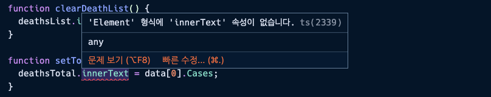
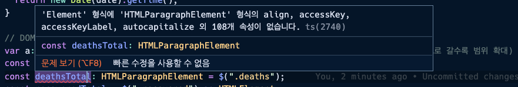

# 타입 구체화

### DOM 관련 타입 구체화

기존에 `any` 타입으로 정의한 것 중 Dom 관련 함수의 타입을 구체화해본다.

```tsx
// utils
function $(selector: string) {
  return document.querySelector(selector);
}
function getUnixTimestamp(date: Date) {
  return new Date(date).getTime();
}
```

- 자바스크립트의 내장 객체를 사용할 경우 이미 타입 추론이 이루어지므로 잘 모르겠을 땐 타입 추론으로 나오는 타입 정의를 보고 타이핑을 하면 좋다.

  예를 들어 위 `new Date`는 자바스크립트 내장 객체이므로 마우스를 올려 타입 추론되는 내용을 보면 `value: string | number | Date`로 추론된다. 이에 따라 3가지 모두를 타이핑해주거나 사용할 것만 타이핑을 추가해서 완성할 수 있다!

### API 함수 타입 구체화

기존에 `any` 타입으로 정의한 것 중 API 함수의 타입을 구체화해본다.

```tsx
// enum 타입 정의
enum CovidStatue {
  Confirmed = "confirmed",
  Recovered = "recovered",
  Deaths = "deaths",
}

function fetchCountryInfo(countryCode: string, status: CovidStatue) {
  // status params: confirmed, recovered, deaths
  const url = `https://api.covid19api.com/country/${countryCode}/status/${status}`;
  return axios.get(url);
}
```

### API 함수 타입 정의에 따른 타입 오류 해결

위와 같이 `fetchCountryInfo` 함수에 status를 enum으로 정의하면서 하단에서 fetchCountryInfo 함수를 사용하는 부분에 타입 오류가 발생하게 된다. 이러한 오류를 enum 데이터를 적용해주어 개선해줄 수 있다.

```tsx
async function handleListClick(event: any) {
  // ...
  // const { data: deathResponse } = await fetchCountryInfo(selectedId, "deaths");
  const { data: deathResponse } = await fetchCountryInfo(
    selectedId,
    CovidStatue.Deaths
  );
  // const { data: deathResponse } = await fetchCountryInfo(selectedId, "recovered");
  const { data: recoveredResponse } = await fetchCountryInfo(
    selectedId,
    CovidStatue.Recovered
  );
  // const { data: deathResponse } = await fetchCountryInfo(selectedId, "confirmed");
  const { data: confirmedResponse } = await fetchCountryInfo(
    selectedId,
    CovidStatue.Confirmed
  );
  // ..
}
```

이와 같이 enum 타입을 도입하므로 인해 더욱 편리해진 점은, 코드 자동완성이 되므로 매우 편리하고, 코드 상으로 enum 값으로 표현되어 넘길 수 있는 파라미터가 제약이 되어있다는 것을 유추해낼 수 있는 점이 있다.

### DOM 함수 관련 타입 오류 분석

타이핑을 해나가면서 기존에는 발생하지 않던 오류들이 하나씩 발생한다.



선언한 `deathsTotal`이 Elements 형식으로 추론되고, 해당 형식에 `innerText` 타입이 지원되지 않아 생기는 오류이다. 여기서 잠깐 DOM Element 관련 타입을 보면 아래와 같다.

```tsx
// Element와 관련된 타입 구조체(우측으로 갈수록 상세 범위로 확대)
var a: Element | HTMLElement | HTMLParagraphElement, HTMLSpanElement;
```

위의 타입을 참고하여 타입 에러가 발생한 `deathsTotal` 선언 영역으로 가서 타입을 `HTMLParagraphElement`로 정의해주면 아래와 같은 에러 발생



위와 같이 에러가 나는 이유는 `$` 함수의 리턴값이 `Element` 이므로 `HTMLParagraphElement` 타입이 호환되지 않기 때문이다. 따라서 `HTMLParagraphElement`를 적용하기 위해서는 타입 단언을 통해 $ 함수의 리턴값을 명시해줘야 한다.

```tsx
const confirmedTotal = $(".confirmed-total") as HTMLSpanElement;
const deathsTotal = $(".deaths") as HTMLParagraphElement;
const recoveredTotal = $(".recovered") as HTMLParagraphElement;
const lastUpdatedTime = $(".last-updated-time") as HTMLParagraphElement;
```

즉 위와 같이 적절한 `HTMLElement`로 타입 단언을 해주면 그에 맞게 `innerText` 타입이 추가되며 발생하던 타입 에러가 사라지는 것을 확인할 수 있다.
