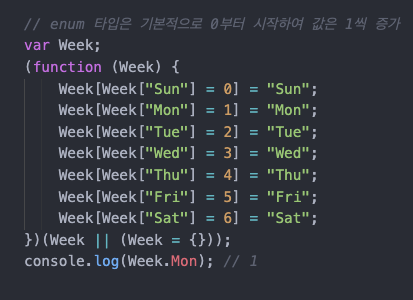
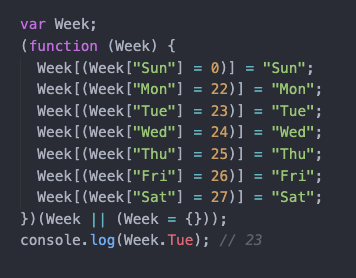
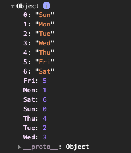

## 3. 타입 선언

알아두면 유용한 타입스크립트 기초 핵심 - velopert님 글 참조 ([링크](https://velog.io/@velopert/typescript-basics))
한눈에 보는 타입스크립트 - HEROPY Tech 글 참조 ([링크](https://heropy.blog/2020/01/27/typescript/))

### 1) 불린: Boolean

단순한 참(true), 거짓(false) 값을 나타낸다.

```tsx
let isBoolean: boolean;
let isDone: boolean = false;
```

### 2) 숫자: Number

모든 부동 소수점 값을 사용할 수 있다. ES6에 도입된 2진수 및 8진수 리터럴도 지원

```tsx
let num: number;
let integer: number = 6;
let float: number = 3.14;
let hex: number = 0xf00d; // 61453
let binary: number = 0b1010; // 10
let octal: number = 0o744; // 484
let infinity: number = Infinity;
let nan: number = NaN;
```

### 3) 문자열: String

문자열 값을 나타낸다. 작은 따옴표('), 큰 따옴표(") 뿐만 아니라 ES6 템플릿 문자열도 지원

```tsx
let str: string;
let red: string = "Red";
let green: string = "Green";
let myColor: string = `My color is ${red}`;
let yourColor: string = "Your color is" + green;
```

### 4) 배열: Array

순차적으로 값을 가지는 일반 배열을 나타낸다. 배열은 아래와 같이 두 가지 방법으로 타입을 선언할 수 있다.

- 문자열만 가지는 배열
- 숫자만 가지는 배열

```tsx
// 문자열만 가지는 배열
let fruits_type1: string[] = ["apple", "banana", "mango"];
let fruits_type2: Array<string> = ["apple", "banana", "mango"];

// 숫자만 가지는 배열
let oneToSeven_type1: number[] = [1, 2, 3, 4, 5, 6, 7];
let oneToSeven_type2: Array<number> = [1, 2, 3, 4, 5, 6, 7];
```

유니언 타입(다중 타입)의 '문자열과 숫자를 동시에 가지는 배열'도 선언할 수 있다.

```tsx
// 유니언 타입(다중 타입)의 '문자열과 숫자를 동시에 가지는 배열'도 선언 가능
let unionArray_type1: (string | number)[] = ["apple", 1, 2, "banana", 3];
let unionArray_type2: Array<string | number> = ["apple", 1, 2, "banana", 3];
```

배열이 가지는 항목의 값을 단언할 수 없다면 `any` 를 사용한다.

```tsx
let someArr: any[] = [0, 1, {}, [], "str", false];
```

인터페이스(Interface)나 커스텀 타입(Type)을 사용할 수도 있다.

```tsx
interface IUser {
  name: string;
  age: number;
  isValid: boolean;
}
let userArr: IUser[] = [
  {
    name: "Vicky",
    age: 31,
    isValid: true,
  },
  {
    name: "Woniee",
    age: 30,
    isValid: false,
  },
  {
    name: "Hannah",
    age: 26,
    isValid: true,
  },
];
```

유효하지 않지만, 다음과 같이 특정한 값으로 타입을 대신해 작성할 수도 있다.
(~~실제 vscode에서 에러를 뿜는다. 뭐지? )~~

```tsx
let array = 10[];
array = [10];
array.push(10);
array.push(11); // Error - TS2345
```

읽기 전용 배열을 생성할 수 있다. `readonly` 키워드나 `ReadonlyArray` 타입을 사용하면 된다.

```tsx
let arrA: readonly number[] = [1, 2, 3, 4];
let arrB: ReadonlyArray<number> = [0, 9, 8, 7];

arrA[0] = 123; // 'readonly number[]' 형식의 인덱스 시그니처는 읽기만 허용된다.
arrA.push(123); // 'readonly number[]' 형식에 'push' 속성이 없다.
arrB[0] = 123; // 'readonly number[]' 형식의 인덱스 시그니처는 읽기만 허용된다.
arrB.push(123); // 'readonly number[]' 형식에 'push' 속성이 없다.
```

### 5) 튜플: Tuple

Tuple 타입은 배열과 매우 유사하나 정해진 타입의 고정된 길이(length)배열을 표현한다.

```tsx
// Tuple 타입은 배열과 매우 유사하나 정해진 타입의 고정된 길이(length)배열을 표현한다.
let tuple: [string, number];
tuple = ["a", 1];
tuple = ["a", 1, 2]; // Error - TS2322
tuple = [1, "a"]; // Error - TS2322
```

데이터를 개별 변수로 지정하지 않고, 단일 tuple 타입으로 지정해 사용할 수 있다.

```tsx
// variable
let userId: number = 1234;
let userName: string = "vicky";
let isValid: boolean = true;

// tuple
let user: [number, string, boolean] = [1234, "vicky", true];
console.log(user[0]); // 1234
console.log(user[1]); // vicky
console.log(user[2]); // true
```

위 방식을 활용해 다음과 같은 Tuple 타입의 배열(2차원 배열)을 사용할 수 있다.

```tsx
let users: [number, string, boolean][];
// or
// let users: Array<[number, string, boolean]>;
users = [
  [1, "choi", true],
  [2, "sun", true],
  [3, "jin", false],
];
```

또한 값으로 타입을 대신할 수도 있다.

```tsx
let tuple_2: [1, number];
tuple_2 = [1, 2];
tuple_2 = [1, 3];
tuple_2 = [2, 3]; // Error - TS2322: '2' 형식은 '1' 형식에 할당할 수 없다.
```

Tuple은 **정해진 타입의 고정된 길이 배열**을 표현하지만, 이는 할당(Assign)에 국한된다.

곧 `push()` 나 `splice()`등을 통해 값을 넣는 행위는 막을 수 없다.

```tsx
let tuple_3: [string, number];
tuple_3 = ["a", 1];
tuple_3 = ["b", 2];
tuple_3.push(3);
console.log(tuple_3); // ['b', 2, 3];
tuple_3.push(true); // Error - TS2345: boolean 형식의 인수는 string, number 형식의 매개 변수에 할당될 수 없다.
```

배열에서 사용한 것과 같이 `readonly` 키워드로 읽기 전용 튜플을 생성할 수도 있다.

```tsx
let a: readonly [string, number] = ["hello", 123];
a[0] = "world"; // Error - TS2540: 읽기 전용 속성이므로 '0'에 할당할 수 없다.
```

### 6) 열거형: Enum

Enum 타입은 숫자 혹은 문자열 값 집합에 이름(Member)을 부여(혹은 열거)할 수 있는 타입으로, 값의 종류가 일정한 범위로 정해져 있는 경우 유용하다. 기본적으로 `0`부터 시작하며 값은 `1`씩 증가한다.

```tsx
enum Week {
  Sun,
  Mon,
  Tue,
  Wed,
  Thu,
  Fri,
  Sat,
}
console.log(Week.Mon); // 1
```



수동으로 값을 변경하는 것도 가능하며, 값을 변경한 부분부터 다시 1씩 증가한다.

```tsx
enum Week {
  Sun,
  Mon = 22,
  Tue,
  Wed,
  Thu,
  Fri,
  Sat,
}
console.log(Week.Tue); // 23
```



Enum 타입은 역방향 매핑(Reverse Mapping)을 지원한다. 이것은 열거된 멤버(가령 `Sun`, `Mon`과 같은)로 값으로 멤버에 접근할 수 있다는 것을 의미한다.

```tsx
enum Week {
  Sun,
  Mon,
  Tue,
  Wed,
  Thu,
  Fri,
  Sat,
}
console.log(Week);
console.log(Week.Sun); // 0
console.log(Week["Sun"]); // 0
console.log(Week[0]); // 'Sun'
```



추가로, Enum 타입은 숫자 값 열거 뿐만 아니라 문자열 값으로 초기화도 가능하다. 이 방법은 역방향 매핑(Reverse Mapping)을 지원하지 않으며 개별적으로 초기화해야하는 단점이 있다.

```tsx
enum Color {
  Red = "red",
  Green = "green",
  Blue = "blue",
}
console.log(Color.Red); // red
console.log(Color["Green"]); // green
```

### 7) 모든 타입: Any

Any는 모든 타입을 의미한다. 따라서 일반적인 자바스크립트 변수와 동일하게 어떠한 타입의 값도 할당이 가능함. 외부 자원을 활용해 개발할 때 불가피하게 타입을 단언할 수 없는 경우 유용할 수 있다.

```tsx
let any: any = 123;
any = "hello world";
any = true;
any = {};
any = null;
```

다양한 값을 포함하는 배열을 나타낼 때 사용할 수도 있다.

```tsx
const list: any[] = [1, true, "anything", {}, []];
```

강한 타입 시스템의 장점을 유지하기 위해 Any 사용을 엄격하게 금지하려면, 컴파일 옵션 `"noImplicitAny": true` 라는 옵션을 통해 Any 사용 시 에러를 발생시킬 수 있다.

### 8) 알 수 없는 타입: Unknown

Any와 같이 최상위 타입인 Unknown은 알 수 없는 타입을 의미한다. Any와 같이 Unknown에는 어떤 타입의 값도 할당할 수 있으나, Unknown을 다른 타입에는 할당할 수 없다.

> 일반적으로 Unknown은 타입 단언(Assertions)이나 타입 가드(Guards)를 필요로 한다.

```tsx
let a: any = 123;
let u: unknown = 123;
let v1: boolean = a;
let v2: any = u; // 알 수 없는 타입(unknown)은 모든 타입(any)에 할당할 수 있다.
let v3: number = u; // 알 수 없는 타입(unknown)은 모든 타입(any)을 제외한 다른 타입에 할당할 수 없다.
let v4: number = u as number; // 타입을 단언(Assertions)하면 할당할 수 있다.
```

Unknown 타입의 경우 다양한 타입을 반환할 수 있는 API에서 유용할 수 있다. 그러나 Unknown 보단 좀 더 명확한 타입을 사용하는 것이 좋다.

```tsx
interface IUser {
  name: string;
  age: number;
  isValid: boolean;
}

type Result =
  | {
      success: true;
      value: unknown;
    }
  | {
      success: false;
      error: Error;
    };

export default function getItems(user: IUser): Result {
  // Some logic...
  if (user.isValid) {
    return {
      success: true,
      value: ["Apple", "Banana"],
    };
  } else {
    return {
      success: false,
      error: new Error("Invalid user."),
    };
  }
}
```

### 9) 객체: Object

기본적으로 `typeof` 연산자가 `"object"`로 반환하는 모든 타입을 일컫는다.

> 컴파일러 옵션에서 엄격한 타입 검사(strict)를 true로 설정할 경우 `null`은 포함되지 않는다.

```tsx
let obj: object = {};
let arr: object = [];
let func: object = function () {};
let nullValue: object = null; // strict: true 일 경우 에러 발생!
let date: object = new Date();
```

여러 타입(obj, arr, func 등)들의 상위 타입이므로 그다지 유용하지 않다. 보다 정확하게 타입을 지정하기 위해서는 아래와 같이 객체 속성(Properties)들에 대한 타입을 개별적으로 지정할 수 있다.

```tsx
let userA: { name: string; age: number } = {
  name: "Vicky",
  age: 31,
};
let userB: { name: string; age: number } = {
  name: "vicky",
  age: false, // error
  email: "hwfongfing@gmail.com", // error
};
```

반복적으로 사용하기 위해서는 `interface`나 `type`을 이용해 타입을 선언하여 사용하는 것이 좋다.

```tsx
interface IUser {
  name: string;
  age: number;
}
let userA: IUser = {
  name: "VICKY",
  age: 31,
};
let userB: IUser = {
  name: "VICKY",
  age: false, // error
  email: "hwfongfing@gmail.com", // error
};
```

### 10) Null과 Undefined

기본적으로 Null과 Undefined는 모든 타입의 하위 타입으로, 각 타입에 할당할 수 있다. 심지어 서로의 타입에도 할당 가능하다. (단 strict: false일 때만 가능하다.)

```tsx
let num: number = undefined;
let str: string = null;
let obj: { a: 1; b: false } = undefined;
let arr: any[] = null;
let und: undefined = null;
let nul: null = undefined;
let voi: void = null;
```

위 할당은 컴파일 옵션 `strict: true` 를 설정하면 더 이상 할당할 수 없게 된다. 다만 Void에는 Undefined를 할당할 수 있다.

```tsx
let voi: void = undefined; // ok!
```

### 11) Void

Void는 일반적으로 값을 반환하지 않는 함수에서 사용한다. `:void` 위치는 함수가 반환 타입을 명시하는 곳이다.

```tsx
function Hello(msg: string): void {
  console.log(`Hello ${msg}`);
}
```

값을 반환하지 않는 함수는 실제 undefined를 반환한다.

```tsx
function Hello(msg: string): void {
  console.log(`Hello ${msg}`);
}
const hi: void = Hello("word");
console.log(hi); // undefined
```

```tsx
// Error - TS2355: A function whose declared type is neither 'void' nor 'any' must return a value.
function Hello(msg: string): undefined {
  console.log(`Hello ${msg}`);
}
```

### 12) Never

Never는 **절대 발생하지 않을 값**을 나타내며, 어떤 타입도 적용할 수 없다.

```tsx
function error(message: string): never {
  throw new Error(message);
}
```

보통 아래와 같이 빈 배열을 타입으로 잘못 선언한 경우, Never를 볼 수 있다.

```tsx
const never: [] = [];
never.push(3); // Error - TS2345: Argument of type '3' is not assignable to parameter of type 'never'.
```

### 13) 유니언: Union

2개 이상의 타입을 허용하는 경우, 이를 유니언(Union)이라고 한다.

`|(vertical bar)`를 통해 타입을 구분하며, `()`는 선택사항이다.

```tsx
let union: string | number;
union = "hello typescript!";
union = 123;
union = false; // Error - TS2322: Type 'false' is not assignable to type 'string | number'.
```

### 14) 인터섹션: Intersection

`&(ampersand)`를 사용해 2개 이상의 타입을 조합하는 경우, 이를 인터섹션이라고 한다. 인터섹션은 새로운 타입을 생성하지 않고, 기존의 타입들을 조합할 수 있기 때문에 유용하지만 자주 사용되는 방법은 아니다.

> 위에서 살펴본 유니언을 마치 '또는(or)'과 같이 이해할 수 있다면, 인터섹션은 '그리고(and)'와 같이 이해할 수 있다.

```tsx
// 기존 타입들이 조합 가능하다면 인터섹션을 활용할 수 있다.
interface IUser {
  name: string,
  age: number
}
interface IValidation {
  isValid: boolean
}
const vicky: IUser = {
  name: 'vicky',
  age: 36,
  isValid: true; // Error TS2322: Type '{ name: string; age: number; isValid: boolean; }' is not assignable to type 'IUser'.
}
const neo: IUser & IValidation = {
  name: 'wonny',
  age: 31,
  isValid: true;
}

// 혹은 기존 타입(IUser, IValidation)과 비슷하지만,
// 정확히 일하는 타입이 없다면 새로운 타입을 생성해야 한다.
interface IUserNew {
  name: string,
  age: number,
  isValid: boolean
}
const evan: IUserNew = {
  name: 'Evan',
  age: 36,
  isValid: false
};
```
