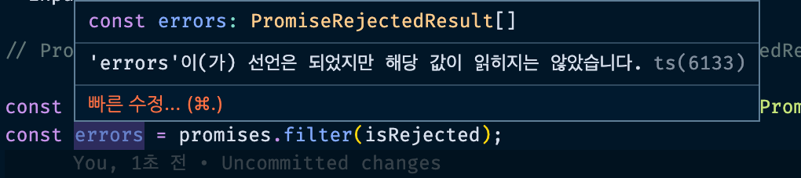

## 기본 문법 정리

### 타입스크립트는 변수, 매개변수, 리턴값에 타입을 붙이는 것

타입스크립트는 기본적으로 아래의 타입을 제공한다.

```tsx
const a: string = "5";
const b: number = 5;
const c: boolean = true;
const d: undefined = undefined;
const e: null = null;
const f: symbol = Symbol.for("abc");
const g: bigint = 1000000n;
const h: any = "any";
const i: any = true;
```

타입스크립트의 최종적 목적은 any 타입을 사용하지 않는 것이다.
함수도 타이핑할 수 있다. 기본적인 포맷 참고

```tsx
function add(a: number, b: number): number {
  return a + b;
}

// 함수형은 타입을 아래 형식으로 적는다.
const add: (x: number, y: number) => number = (a, b) => a + b;
```

`(x: number, y: number) => number` 화살표 함수를 타이핑할 때 type alias를 사용할 수 있다.

```tsx
// 1. type alias 정의
type Add = (x: number, y: number) => number;

// 2. interface type 정의
interface Add {
  (x: number, y: number): number;
}

// 아래처럼 적용한다.
const add: Add = (a, b) => a + b;
```

객체도 아래와 같이 타입을 정의할 수 있다.

```tsx
const obj: { x: number; y: number } = { x: 1, y: 2 };
```

배열도 가능

```tsx
// 표현 방법 1
const arr: string[] = ["a", "b", "c"];

// 표현 방법 2
const arr2: Array<number> = [123, 456, 789];

// 표현 방법 3 - 길이가 고정되었을 때 튜플로 정의
const arr3: [number, number, string] = [1, 2, "3"];
const arr4: [number, number, string] = [1, 2, "3", 4]; // error, 소스에 4개 요소가 있지만, 대상에서 3개만 허용합니다.
```

바뀌지 않는 값은 정확하게 적어줄 수도 있다.

```tsx
const f: 5 = 5;
const g: 5 = 6; // error
```

### 타입 추론을 적극 활용하자

타입스크립트는 타입 추론을 제공한다.
따라서 무조건 타입을 선언하기 보다는 필요한 경우에만 타입을 넣어주는 것이 좋다.

```tsx
const a: number = 5;
```

위 변수 a는 `number` 타입으로 선언되었다. 하지만 a 변수는 const를 쓰므로 해당 값은 바뀌지 않는 불변의 데이터이다. 따라서 `number` 타입이라는 넓은 범위의 선언보다는 차라리 어떠한 타입도 정의하지 않는 것이 더 낫다.

```tsx
const a = 5;
```

위과 같이 정의 후 변수 a에 마우스를 올리면 타입스크립트가 알아서 a를 5라는 숫자로 추론한 것을 볼 수 있다.


즉 위와 같은 타입 추론 방법이 number로 선언한 것보다 오히려 더 정확한 타입 선언이므로 때로는 타입 선언이 불필요할 수도 있다. 타입 추론에 맡겨도 되는 부분은 맡겨버리자

### js 변환 시 사라지는 부분을 파악할 것

typscript 코드는 Javascript 변환 시 모두 사라진다. 따라서 타이핑 영역을 정확히 파악해야한다.
먼저 기본적으로 `type`, `interface`, `generic`은 변환 시 모두 사라지는 코드이다.

또한 `body 없는 function 구조`의 함수 타입 정의도 사라진다. 아래 예시를 보자

```tsx
function add4(x: number, y: number): number; // type 정의

function add4(x, y) {
  // 실제 코드 작성
  return x + y;
}
```

위와 같이 할 경우 타입 정의를 한 type 정의 영역이 1번 라인은 js 변환 시 사라진다.
(단 tsconfig.json 설정이 !noImplicitAny && strictNullChecks여야 정상 동작함!!)
뿐만 아니라 `as` 키워드도 사라진다.

```tsx
let test = 123;
test = "hello" as unknown as number; // as는 타입을 강제로 변환
```

위 코드는 아래와 같이 변환됨

```jsx
let test = 123;
test = "hello";
```

위와 같은 제한은 JavaScript의 자유도를 매우 제한시키지만,
타입을 명확히 함으로써 예상하지 못한 버그를 초기에 잡을 수 있고, 예측 가능한 코딩을 할 수 있게되므로 실보다 득이 많다.

### never 타입과 느낌표(non-null assertion)

빈 배열을 타입 선언 없이 사용하게 되면 never라는 타입이 뜬다.
never에 대한 [좋은 설명은 이 글을 확인](https://ui.toast.com/posts/ko_20220323)하자.


위와 같이 설정 후 값을 추가하면 타입이 정의되지 않은 never 타입의 배열이므로 에러가 발생한다.
즉, array 타입은 반드시 타입 정의를 아래와 같이 해야 함

```tsx
const array: string[] = [];
array.push("hello");
```

아래와 같이 특정 Element를 head 변수에 담았다고 하면 이 타입은 Element | null로 존재하지 않는 시점에 대한 타입까지 추론한다.


위 상태에서 엘리먼트 내부에 hello라는 데이터를 주입하면 아래와 같이 에러가 발생한다.


이 떄 해당 데이터가 반드시 있을거라는 의미로 느낌표를 사용한다.
그러면 엘리먼트가 `null`인 경우가 사라지므로 타입 에러가 발생하지 않는다.


무조건 존재함을 보증하는 방식 = 느낌표. 그러나 이 방식은 비추임
세상에는 반드시, 무조건 적인 것은 존재하지 않으므로 웬만하면 사용하지 않는다. 대신 최대한 ! 대신 if를 사용하자

```tsx
const head = document.querySelector("#head");
if (head) {
  head.innerHTML = "hello";
  console.log(head);
}
```

위와 같이 head 엘리먼트가 존재하면 코드가 진행되도록 조건을 명확히 만들어주면 에러가 발생하지 않는다.
코드를 읽는 입장에서도 문제가 없으며 이후 예상하지 못했던 경우에 대해서도 모두 방어가 가능하므로 훨씬 바람직한 방법임

### 원시 래퍼 타입, 템플릿 리터럴 타입, rest, 튜플

string과 String 은 서로 다른 타입이다. String은 래퍼 개체. 아래 예시를 보자

```tsx
const aa: string = "hello";
const bb: String = "hell";

function cc(a1: string, b1: string) {}
cc(aa, bb); // bb에 Error 발생
```

위와 같이 bb 변수에 String 래퍼 타입을 넣을 경우 아래와 같은 에러 메시지가 반환된다.


위에서 사용한 래퍼개체 String은 `new String()` 메서드 사용할 때 쓰는 String 타입이다.
거의 사용하지 않으므로 안쓴다고 생각하자.

또 타입 정의를 아래와 같이할 수도 있다.

```tsx
type World = "world";
const txt: World = "world";
```


위 사용은 템플릿 리터럴 타입에서도 동일하게 적용할 수 있다.

```tsx
const txtB = `hello ${txt}`;
type Greeting = `hello ${World}`;
```


위 예시는 실제 아래와 같은 방법으로 활용된다.

```tsx
type World = "world" | "hell";
type Greeting = `hello ${World}`;

const GreetingResult: Greeting = "";
```


위와 같이 `GreetingResult` 변수에 `Greeting` 타입을 대입하면 타이핑에 의해 `hello hell` 과 `hello world`라는 값 두가지가 자동완성으로 제공된다.

위 Greeting 타입이 World type이 아닌 일반 string 이었다면 해당 자동완성은 제공되지 않았을 것임
더욱 명확한 타입을 제시할 수 있으므로 위와 같은 방법으로 템플릿 리터럴이 활용된다.

이 밖에 rest 문법은 아래와 같이 타이핑 할 수 있다.

```tsx
function rest(a, ...args: string[]) {
  console.log(a, args); // a = 1,  args = ["2", "3"]
}

rest(1, "2", "3");
```

또한 튜플 타이핑에 대해 알아보자

```tsx
const tuple: [string, number] = ["1", 1];

tuple[2] = "hello"; // Error
tuple.push("hello"); // Ok, 세번째 요소를 추가하므로 에러가 나야하지만 발생하지 않음
```

### enum, keyof, typeof

`enum` 타입에 대해 알아보자.

```tsx
// enum은 JavaScript 변환 시 사라진다.
const enum EDirection {
  Up = 3,
  Down,
  Left = "hello",
  Right = "vicky",
}

const e_up = EDirection.Up; // 3
const e_down = EDirection.Down; // 4
const e_left = EDirection.Left; // hello
const e_right = EDirection.Right; // vicky
```

위와 같이 데이터를 정의해서 쓸 수 있다. `enum`은 `javaScript` 변환 시 사라진다는 특징이 있다.
이를 보통 객체로 구현할 수 있는데, 아래와 같다.

```tsx
// object는 JavaScript 변환 시 유지된다.
const ODirection = {
  Up: 3,
  Down: 1,
  Left: "hello",
  Right: "vicky",
} as const;

const o_up = ODirection.Up; // 3
const o_down = ODirection.Down; // 4
const o_left = ODirection.Left; // hello
const o_right = ODirection.Right; // vicky
```

위 `enum`과 동일한 기능을 하지만 `object`로 정의한 변수 객체 값은 사라지지않고 보관된다는 특징이 있음
따라서 필요에 따라 남겨야할 경우와 값이 없어도 될 경우를 잘 나누어 사용하면 되겠다.


이 밖에도 `enum`은 타입으로 사용할 수도 있다.

```tsx
function walk(dir: EDirection) {}
//  dir = 1 | 3 | "hello" | "vicky"

walk(EDirection.Up); // walk(3)
```

만약 `enum` 타입 사용이 어렵게 느껴진다면 객체 `ODirection` 으로도 타이핑을 할 수 있다.

```tsx
// It requires an extra line to pull out the keys
type Direction = typeof ODirection[keyof typeof ODirection];

// type Direction = 1 | 3 | "hello" | "vicky"
function run(dir: Direction) {}

run(ODirection.Up);
```

위 방법이 복잡하니 그냥 enum을 쓰게 된다 😄 이 참에 `keyof`에 대해 알아보자.

```tsx
const testObj = { a: "123", b: 123, c: true };
type Key = keyof typeof testObj; // type Key = "a" | "b" | "c"
```

만약 값을 type으로 모으고 싶다면 아래와 같이 한다.

```tsx
const testObj = { a: "123", b: 123, c: true } as const;
type Key = typeof testObj[keyof typeof testObj]; // type Key = true | 123 | "123"
```

`keyof typeof Object`는 key만 모아올 수 있고 `typeof Object[keyof typeof Object]`로 하면 value만 모을 수 있다.

### union(|)과 intersection(&)

type과 interface 모두 타입정의를 할 때 쓰인다.

```tsx
// type 정의
type A = { a: string };

// interface 정의
interface B {
  a: string;
}

const aaa: A = { a: "123" };
const bbb: B = { a: "123" };
```

interface는 객체지향 프로그래밍 즉, 복잡한 타이핑이 지원되어야할 때 사용한다. type은 간단한 타이핑 시 사용

이번에는 `union`을 알아본다. ‘또는’을 의미함

```tsx
type TypeUnion = string | number;
const txtUnion: TypeUnion = 123;

type TypeUnionObj = { hello: "world" } | { vicky: "choi" };
const unionObj1: TypeUnionObj = { hello: "world" };
const unionObj2: TypeUnionObj = { vicky: "choi" };
const unionObj3: TypeUnionObj = { hello: "world", vicky: "choi" };
```

string, number 중 하나의 타입으로 지정하거나 객체 값도 `TypeUnionObj` 처럼 설정할 수 있다. 여러 개 중 하나만 만족

```tsx
type TypeIntersectionObj = { hello: "world" } & { vicky: "choi" };
const intersectionObj1: TypeIntersectionObj = { hello: "world", vicky: "choi" };
const intersectionObj2: TypeIntersectionObj = { hello: "world" }; // Error
```

`Intersection(&)`은 ‘그리고’를 의미하므로 모든 속성이 모두 만족되어야 한다. 위 예시 참고하자

### type alias와 interface extends

타입은 아래와 같은 방법으로 상속된다.

```tsx
type Animal = { breath: true };
type Mamal = Animal & { breed: true };
type Human = Mamal & { think: true };

const vicky: Human = { breath: true, breed: true, think: true };
```

& 으로 상속을 구현함. interface 도 extends로 상속 구현이 가능하다.

```tsx
interface AnimalInterface {
  breath: true;
}

interface MamalInterface extends AnimalInterface {
  breed: true;
}

const baduc: MamalInterface = { breath: true, breed: true };
```

보통 타입은 간단한 타이핑 시 사용하고, interface는 좀 더 넓은 확장면에 있어서 유리하므로 필요에 따라 나눠 사용한다.
이 밖에도 interface의 extends 객체로 타입으로 선언한 코드를 넣을 수도 있다. 또한 type에 interface를 조합할 수 있다.

```tsx
interface MamalInterface extends Mamal {
  breed: true;
}

const baduc: MamalInterface = { breath: true, breed: true };
```

interface는 아래와 같은 오버라이딩 특징을 가진다.

```tsx
interface SameInterface {
  talk: () => void;
}
interface SameInterface {
  eat: () => void;
}
interface SameInterface {
  shit: () => void;
}

const same: SameInterface = {
  talk: () => {},
  eat: () => {},
  shit: () => {},
};
```

위 처럼 같은 명의 interface는 종국에는 하나의 SameInterface라는 타입으로 합쳐진다.
이러한 장점이 있어서 라이브러리를 사용할 때 Interface로 타입을 추가 확장하여 사용할 수 있다.

타입스크립트의 네이밍 룰에 대해 잠깐 알아본다.

```tsx
// 예전에는 I, T, E 등 대문자를 앞으로 붙였음
interface Iinterface {}
type Type = string | number;
enum EHello {
  Left,
  Right,
}

// 요즘은 no
interface Props {}
type Type = string | number;
enum Hello {
  Left,
  Right,
}

const a: Props = {};
```

기존에는 타입 정의를 할 때 interface, type, enum을 구분하기 위해 앞에 I, T, E 등의 키워드를 붙였다.
하지만 요즘은 잘 안씀. IDE 툴이 알아서 타입을 알려주므로 굳이 표시할 이유가 없음


### 타입을 집합으로 생각하자(좁은 타입과 넓은 타입)

```
type A = string | number; // 넓은 타입
type B = string; // 좁은 타입
```

타입은 좁은 타입과 넓은 타입으로 나눌 수 있다. 좁은 타입은 넓은 타입에 적용이 가능하지만, 넓은 타입이 좁은 타입으로 할당하는 것은 불가능함. 비슷한 원리로 any는 전체집합, never는 공집합으로 볼 수 있다.

```tsx
type A = string | number; // 상대적으로 넓은 타입
type B = string; // 상대적으로 좁은 타입
type AB = A | B; // A와 B를 '또는' 으로 연결하므로 넓은 타입

type objA = { name: string }; // 속성이 좁을수록 넓은 타입
type objB = { age: number }; // 속성이 좁을수록 넓은 타입

type objC = { name: string; age: number }; // 속성이 구체적일수록 좁은 타입
```

위와 같은 타입의 성질을 활용하면 아래의 타이핑이 구현할 수 있다.

```tsx
type objA = { name: string };
type objB = { age: number };

type objAB = objA | objB;
type objC = objA & objB;

const ab: objAB = { name: "vicky" };
const c: objC = { name: "vicky", age: 33 };
```

`또는`과 `그리고` 로 만들어진 타입을 적용한 것이다. 위 타입은 아래와 같이 대입할 수 있다.

```tsx
const c: objC = { name: "vicky", age: 33 };
const ab: objAB = { name: "vicky" };

const ab: objAB = c;
```

`objC` 타입 (좁은 타입) → `objAB`(넓은 타입)이므로 타입 적용이 가능함
하지만 아래의 경우에는 문제가 있다.

```tsx
const ab: objAB = { name: "vicky" };
const c: objC = { name: "vicky", age: 33 };

const c: objC = ab;
```


objC타입이 좁은 타입이므로 여기에 넓은 타입을 적용할 수 없다.
그렇다면 아래와 같이 좁은 타입 속성을 할당한 c에 `married`라는 데이터를 추가한다고 해보자

```tsx
const c: objC = { name: "vicky", age: 33, married: false }; // 잉여 속성 검사에 따라 Error
```

위 코드는 `잉여 속성 검사`에 따라 Type Error가 발생한다.


실제 대입한 값이 { name: "vicky", age: 33, married: false } 로 objC가 더 넓은 타입에 속하기 때문에 문제가 없어야 하지만 추가적인 속성 검사에 따른 에러가 발생하는 것임. 이는 아래와 같이 값을 따로 빼주면 에러가 발생하지 않는다.

```tsx
const obj = { name: "vicky", age: 33, married: false };
const c: objC = obj; // Ok
```

위와 같이 객체 리터럴에 바로 값을 대입하는 것은 에러를 발생시킬 수 있다는 점 알아두자.

### void의 두 가지 사용법

void는 두 가지 사용법이 있다.
먼저 함수에 직접 타이핑으로 void가 사용되면 함수의 반환 값이 `undefined`이거나 `return` 메서드가 사용되지 않을 때 쓴다.

```tsx
// 함수에 직접 void를 적용 : 리턴값이 없다는 의미를 담음
function a(): void {
  return; // Ok
  return undefined; // Ok

  // return null // Error
  // return 3; // Error
}

const b = a();
```

`return null;` 혹은 `return 3;` 등의 값이 반환되면 error가 발생한다.

그런데 `별도의 interface 타입 메서드로 정의`되면 return 값에 다른 값이 적용되어 반환되어도 에러가 발생하지 않음(읭)

```tsx
// interfae 내부에서 타임 메서드로 정의 : 리턴값을 사용하지 않는다는 의미
interface Human {
  talk: () => void;
}

const human: Human = {
  talk() {
    return 3; // Ok
  },
};

// 만약 해당 값을 사용할 때 number로 추론되도록 하고 싶다면 아래와 같이 설정할 수 있다.
const human2 = human.talk() as unknown as number; // 방법 1
const human3 = <number>(<unknown>human.talk()); // 방법 2
```

또 `매개변수로 선언한 void`의 경우도 살펴보자

```tsx
function test(callback: () => void): void {}
test(() => {
  return "3";
}); // Ok
```

위와 같이 매개변수에 선언된 callback의 타입이 void가 적용되어 있더라도 실제 매개변수에 return 값이 들어가도 에러를 반환하지 않는다. 왜 이럴까? 이는 Interface와 매개변수 내부에서 사용된 void는 반환되는 값이 있더라도 사용하지 않겠다 라는 의미이므로 에러가 발생하지 않는다.

다른 예시를 보자

```tsx
// declare는 javascript 변환 시 사라진다. 그럼 forEach 사용이 문제가 있는 거 아닐까?
// declare는 해당 함수가 외부에서 반드시 선언되어 있을 경우에 대해 보증할 때 사용함 - 외부에서 만들어진 것을 타입 선언함
declare function forEach(arr: number[], callback: (el: number) => undefined): void;

let target: number[] = [];
forEach([1, 2, 3], (el) => target.push(el)); // Error
```

위와 같은 코드가 있다고 했을 때 `target`은 number 배열로 정의되어 있으므로 callback 매개변수의 `undefined`에 부합되지 않는다.


```tsx
declare function forEach(arr: number[], callback: (el: number) => number): void; // Ok
declare function forEach(arr: number[], callback: (el: number) => void): void; // Ok
```

이를 number를 반환하도록 처리하여 타입 에러를 개선할 수 있지만, void를 적용하여 `반환값을 신경쓰지 않겠다`고 정의할 수 있겠다.

### unknown과 any(그리고 타입 대입 가능표)

`unknown`과 `any`의 다른 점은 무엇인가? 먼저 any를 대입하면 이후 타입검사를 하지 않겠다는 의미이다.
따라서 any를 쓸 바에는 unknown을 쓴다.

```tsx
interface Human {
  talk: () => void;
}

const human: Human = {
  talk() {
    return "vicky";
  },
};

const b: any = human.talk();

b.method(); // Ok
b.아무거나(); // Ok
```

만들어지지 않은 메서드도 문제없이 실행되는 것을 확인할 수 있음. 이에 반해 `unknown`은 타입을 직접 정의해줘야 한다.

```tsx
const b: unknown = human;
(b as Human).talk();
```

`any`는 타입 정의를 포기할 때 쓰고, `unknown`은 현재 타입을 정확하게 알기 어려울 때 나중에 타입 정의를 해서 사용하기 위해 사용함

```tsx
try {
  // something that might throw an error
} catch (Error) {
  (Error as Error).message;
}
```

아래의 코드를 보면 매개변수로 전달받는 Error는 unknown 타입이다. 이를 직접 사용하기 위해서는 Error에 대한 타입을 정의해줘야한다.


```tsx
interface Human {
  talk: () => void;
}

const human: Human = {
  talk() {
    return 123;
  },
};

const b = human.talk() as unknown as number;
b.toString();
```

위 코드에서도 talk를 void로 선언 후 number를 반환하였을 때. b에 toString 메서드를 넣기 위해서는 `as unknown as number` 라는 타이핑을 별도로 지정해줘야한다. void로 넘어오기 때문임. 만약 저 타이핑 코드를 넣지 않으면 `'void' 형식에 'toString' 속성이 없습니다.` 라는 에러가 발생하게 됨

이 밖의 타입간 대입 가능표는 아래 내용을 참고자하자. 위 이미지는 참고만 할 것. 어차피 타입 코드 에러 시 ts checker가 알려준다.


### 타입 좁히기(타입 가드)

아래와 같은 함수가 있다고 하자

```tsx
function numOrStr(a: number | string) {
  if (typeof a === "string") {
    return a.split(",");
  }
  return a.toFixed(1);
}

numOrStr("123");
numOrStr(123);
```

위 함수는 타입에 따라 올바르게 처리되는 문제 없는 함수이다. 만약 위 코드가 아래처럼 되어있다고 한다면 어떨까

```tsx
function numOrStr(a: number | string) {
  return a.toFixed(1); // Error
}
```

매개변수로 들어오는 인자값들이 number 혹은 string 이기 때문에 위 함수는 에러가 난다. toFixed는 number 타입에만 지원되는 메서드이기 때문이다. 타입 에러를 아래와 같이 해결할 수도 있을 것이다.

```tsx
function numOrStr(a: number | string) {
  return (a as number).toFixed(1); // Ok
}
```

`as`는 강제로 타입을 변환해주므로 타입 에러가 발생하는 것은 없앨 수 있으나 실제 string 타입이 들어왔을 때 위 함수는 에러를 발생시킨다. 따라서 `unknown`이거나 미리 만들어진 타입이 잘못되었을 때만 `as`를 쓰는 것이 좋다.

이때 타입 가드(`typeof`)를 이용해서 타입을 좁힐 수 있다.

```tsx
function numOrStr(a: number | string) {
  if (typeof a === "string") {
    return a.charAt(3);
  }
  if (typeof a === "number") {
    a.toFixed(1);
  }
  if (typeof a === "boolean") {
    a.toString(); // Error! boolean은 number | string에 포함되지 않는다. never 타입
  }
}
```

위처럼 매개변수에 들어오는 인자값을 `typeof`로 정해서 처리해주면 타입에러를 발생하지 않는다.

```tsx
function numOrNumArray(a: number | number[]) {
  // number[]
  if (Array.isArray(a)) {
    return a.push(3);
  }
  // number
  return a.toFixed(1);
}
numOrNumArray([1, 2]);
numOrNumArray(123);
```

원시값은 `typeof`를 쓰고 배열일 경우 `Array.isArray` 메서드 사용. class 함수의 경우에는 아래와 같이 쓴다.

```tsx
class A {
  aaa() {}
}
class B {
  bbb() {}
}

function aOrb(params: A | B) {
  if (params instanceof A) {
    params.aaa();
  }
  if (params instanceof B) {
    params.bbb();
  }
}

aOrb(A()); // Error
aOrb(new A()); // Ok
```

클래스 간 확인은 `instanceof`로 구별한다.

```tsx
type A = { type: "a"; aaa: string };
type B = { type: "b"; bbb: string };
type C = { type: "c"; ccc: string };

function typeCheck(a: A | B | C) {
  if (a.type === "a") {
    return a.aaa;
  }
  if (a.type === "b") {
    return a.bbb || a.ccc;
  }
  return a.ccc;
}
```

위처럼 타입 체크는 내부 속성만으로도 타입 체크가 가능하다. 만약 B, C의 타입이 같은 문자라면 어떻게 될까?


당연히 에러가 발생한다. `a.bbb`도 가능하지만 `a.ccc`도 가능하므로..
`typeof` 방식 말고 `in` 메서드를 사용해도 가능하다.

```tsx
type A = { type: "a"; aaa: string };
type B = { type: "c"; bbb: string };
type C = { type: "c"; ccc: string };

function typeCheck(a: A | B | C) {
  // a 객체 안에 bbb 속성이 있을 경우
  if ("bbb" in a) {
    return a.bbb;
  }
  if ("ccc" in a) {
    return a.ccc;
  }
}
```

따라서 객체를 생성할 때에는 타이핑을 위해 type이라는 속성을 추가해놓으면 작업할 때 수월한 면이 있다.

```tsx
type Human = { type: "human"; talk: () => {} };
type Dog = { type: "dog"; bow: () => {} };
type Cat = { type: "cat"; meow: () => {} };

function reply(a: Human | Dog | Cat) {
  if ("talk" in a) {
    a.talk();
  }
  // or
  if (a.type === "human") {
    a.talk();
  }
}
```

### 커스텀 타입가드 (is, 형식 조건자)

위와 같은 이미 존재하는 방법으로 타이핑을 하는 방법도 있고, `is` 메서드를 사용해서 커스텀 타입가드를 만들어줄 수도 있다
`is`는 return 값에 타입을 정의할 수 있다.

```tsx
// is: 타입을 구분해주는 커스텀 함수를 직접 만든다.
function catOrDog(a: Cat | Dog): a is Dog {
  // 타입 판별을 직접 한다.
  if ((a as Cat).meow) {
    return false;
  }
  return true;
}
```

위와 같이 is를 사용한 커스텀 타입 가드를 사용했을 경우에는 아래와 같이 if문에서 타입스크립트로 정확한 타입을 알려주도록 할 수 있다.

```tsx
const cat: Cat | Dog = { meow: 3 };

function pet(a: Cat | Dog) {
  // a의 값이 Dog라는 것을 정확히 검증
  if (catOrDog(a)) {
    console.log(a.bow); // Ok
    console.log(a.meow); // Error
  }
}

pet(cat);
```

간단한 경우 `typeof`, `instanceof`, `in`, `Array.isArray` 등의 메서드를 쓰면 되지만 복잡도가 높아졌을 때 활용해볼 수 있다. `is`가 안되면 타입추론이 안되는 경우가 발생할 수도 있음

위 메서드를 실무에 적용한다면 `promise` 함수에서 써볼 수 있다. 확인해보자

```tsx
const isRejected = (input: PromiseSettledResult<unknown>): input is PromiseRejectedResult =>
  input.status === "rejected";
const isFullfilled = <T,>(input: PromiseSettledResult<T>): input is PromiseFulfilledResult<T> =>
  input.status === "fulfilled";

// PromiseSettledResult - PromiseRejectedResult or PromiseFulfilledResult

const promises = await Promise.allSettled([Promise.resolve("a"), Promise.resolve("b")]);
const errors = promises.filter(isRejected);
```

만약 위와 같은 `isRejected`, `isFullfilled`라는 타입에 대해 만들어져있지 않다면 어떨까?
errors가 별도의 타이핑이 되지 않고 실패한 경우만 골라내도록 만들어졌다면 코드는 아래와 같을 것이다.

```tsx
const errors = promises.filter((promise) => promise.status === "rejected");
```

위 코드도 문제는 없음. 하지만 errors의 타입 추론이 Rejected를 타나내지 못한다.


errors를 `PromiseSettledResult<string>[]`으로 추론하고 있음. 이를 위 isRejected라는 타입핑된 코드로 넣은 `const errors = promises.filter(isRejected);`로 처리한다면 결과는 다음과 같다.



명확하게 `PromiseRejectedResult[]`로 반환함. 사실 위 errors의 경우와 아래 errors 함수에 들어간 isRejected 타이핑 코드는 동일한 코드이다. 다른게 있다면 `is` 메서드를 사용해 반환값을 원하는 바로 커스텀했다는 것이다.

타입스크립트가 타입추론을 잘못할 때 정확한 타입을 쳐다보도록 커스텀해줄 수 있다.

### {} 와 Object

타입스크립트는 꾸준히 공부해서 감을 익혀야 한다. 4.3 버전에서는 object에 대한 개념이 추가되었다.
우선 아래 코드를 보자

```tsx
// {}, Object는 모든 타입을 의미한다고 외우자(null과 undefined는 제외) - unknown과 비슷
// 실제 객체 타이핑은 object를 써야 한다.
// 하지만 객체 타이핑 시 object는 최대한 지양, interface, type, class를 사용한다.

const x: {} = "hello"; // Ok
const y: Object = "hi"; // Ok
const xx: object = "hii"; // Error
const yyy: object = { hello: "world" }; // Ok
```

`{}`, `Object` 타입 모두 문자열 타입을 넣어도 에러가 나지 않는다.

`object` 타입만 문자열 대입 시 에러를 반환함

즉 실제 객체 타이핑을 할 경우 `object` 타입만 써야한다는 것을 알 수 있다.

하지만 객체 타이핑 시 `object`는 최대한 지양하고 `interface`, `type`, `class`를 활용해서 구현하는 것이 바람직하다.

그렇다면 `{}`와 `Object` 타입은 뭘까? 이 두 타입은 *“모든 타입”*을 의미한다.

지난 시간 `unknown`을 지금 당장 타입을 정할 수 없어서 모든 타입을 열어놓은 경우라고 했는데, 같은 것을 의미할까?

정답은 “일부”만 맞음. `unknown` 타입은 원시자료형을 포함해 객체, 배열, undefined, null을 모두 포함.

하지만 `{}`, `Object`는 undefined, null을 제외한 원시자료형 전부를 의미한다.

즉 `unknown =  {} | null | undefined` 라고 할 수 있당

```tsx
const z: unknown = "hi"; // unknown = {} | null | undeinfed 를 의미함

if (z) {
  // null, undefined는 if문에서 걸러지므로 이렇게 코드 작성 가능
  z;
}
```

### readonly, indexed Signiture, Mapped Types

자주 쓰이는 3가지 타입스크립트 사용법에 대해 알아본다.
먼저, readonly 속성은 한번 설정해놓으면 값을 수정하지 못하게 하므로 유용하다.

```tsx
interface A {
  readonly a: string;
  b: string;
}

const aaa: A = { a: "hello", b: "world" };
aaa.a = 123; // Error
```

두번째로 인덱스 시그니처에 대해 알아본다. (`[props: string]` 형태로 쓴다. )
많은 속성들을 한번에 처리할 때 유용함(이미 많이 쓰고 있음)

```tsx
type IndexedType = { [props: string]: string };
const aaa: IndexedType = { a: "hello", b: "world" };
```

아래와 같이 mapped Type으로도 쓸 수도 있다.

```tsx
type B = "Human" | "Mammal" | "Animal"; // interface에는 또는(|), 그리고(&) 메서드를 사용하지 못함
type IndexedType = { [key in B]: number };
const aaa: IndexedType = { Human: 123, Mammal: 456, Animal: 789 };

// 값에도 지정 가능함
type IndexedType = { [key in B]: B };
const aaa: IndexedType = { Human: "Human", Mammal: "Mammal", Animal: "Animal" };
```

위와 같이 in 키워드로 타이핑을 하면 실제 타입을 더욱 명확하게 좁힐 수 있으므로 좋다.

### 클래스의 새로운 기능들

클래스 타이핑에 대한 새로운 기능들을 알아보자

```tsx
class A {
  a: string;
  b: number;

  constructor() {
    this.a = "123";
    this.b = 123;
  }

  method() {}
}
```

클래스의 contructor에서 사용되는 변수들은 위와 같은 구조로 타이핑된다.
위 코드는 아래와 같이 빠르게 줄여서 사용할 수 있음. 하지만 위 구조에 대해 기본적으로 이해하고 있어야 함

```tsx
class A {
  a: string = "123";
  b: number = 123;

  method() {}
}
```

constructor 내부 매개변수로 전달되는 인자에 초기 값을 넣어줄 수도 있다.

```tsx
class A {
  a: string;
  b: number;

  // 기본값이 정해져 있을 경우 ? 를 굳이 사용하지 말자
  constructor(a: string, b: number = 123) {
    this.a = a;
    this.b = b;
  }

  method() {}
}

const a = new A("123"); // b 값을 따로 입력하지 않아도 에러 발생하지 않음
```

또한 클래스 내부에 private 변수 지정을 `#`이라는 별칭을 붙여 표현할 수 있게 되었다.

```tsx
class A {
  private a: string = "123";
  #b: number = 123; // #를 붙이면 private - javascript update

  method() {
    console.log(this.a, this.#b);
  }
}
```

하지만 protected를 표현할 수 있는 별칭은 존재하지 않으므로 별로 유용하지 않은 듯?
쓴다면 기존 방법(타입스크립트 protected, private)을 그대로 사용하는 것을 추천한다고 함 (하지만 타입스크립트 메서드이므로 JS 변환 시 public으로 바뀐다는 문제가 있으니 참고, 실제 개발 단계에서 해당 클래스의 외부에서 내부 변수 접근 시 타입 에러가 발생할 것이므로 큰 문제는 없어보인다.)

```tsx
class A {
  a: string;
  b: number;

  constructor(a: string, b: number = 123) {
    this.a = a;
    this.b = b;
  }

  method() {}
}

const b: A = new A("123"); // instance A
const c: typeof A = A; // class A
```

또한, 클래스 자체가 하나의 타입이 될 수 있음
이때 타이핑은 `typeof A` 로 사용하며, `A`를 그대로 타입으로 적용할 경우 이는 인스턴스를 가리킨다.

또 다른 업데이트로 타입스크립트에 implements, private, protected가 지원된다는 점이다.

```tsx
interface A {
  readonly a: string;
  b: string;
}

class B implements A {
  a: string = "123";
  b: string = "vicky";
}
```

위 방법으로 클래스는 interface를 구현(implements) 할 수 있다.
위 타입스크립트 코드는 아래와 같이 변환된다.

```jsx
"use strict";
class B {
  constructor() {
    this.a = "123";
    this.b = "vicky";
  }
}

/* 개인 컴으로 했을 때는 IIFE 함수로 변환.. */
var B = /** @class */ (function () {
  function B() {
    this.a = "123";
    this.b = "vicky";
  }
  return B;
})();
```

implements 등의 메서드는 사라지고, 알아서 contructor를 붙여준다.
만일 위 코드에서 지정한 타입이 아닌 잘못된 타입을 넣었을 때 ts 자체에서 에러를 내므로, 클래스 모양을 implements interface로 통제할 수 있다는 점이 핵심

pravate, protected 예시도 보자

```jsx
interface A {
  readonly a: string;
  b: string;
}

class B implements A {
  private a: string = "123";
  protected b: string = "vicky";
  c: string = "wow";

  method() {
    console.log(this.a, this.b, this.c); // Ok
  }
}

class C extends B {
  method() {
    console.log(this.a); // Error
    console.log(this.b); // Ok
    console.log(this.c); // Ok
  }
}
new C().a; // Error
new C().b; // Error
new C().c;
```

private 변수 `a`의 경우 실제 구현체인 Class B 내부에서만 사용 가능. protecte 변수 `b`는 상속 클래스인 Class C 내부에서까지만 사용 가능. public 변수 `c`만 인스턴스로 사용 가능하다.

그런데 사실 상 클래스 구현체 내부에서 `readonly`, `private`, `protected` 등의 메서드가 모두 사용 가능하므로 굳이 interface를 implements해서 타이핑을 할 경우가 많진 않을 것 같음 (객체 지향 원칙 중에 추상에 의존하고, 구현에 의존하지 말 것이라는 원칙 때문에, 추상은 interface로 분리, 구현체는 class로 나눠 놓는 규칙을 그대로 따르는 경우가 많음)

덧, 클래스도 추상(abstract) 클래스도 구현 가능함

```tsx
abstract class B {
  private readonly a: string = "123";
  b: string = "vicky";
  c: string = "wow";

  abstract method(): void;
  method2() {
    return "3";
  }
}

class C extends B {
  method() {
    // abstract 함수인 method는 반드시 구현해줘야 한다.
    console.log(this.b); // Ok
    console.log(this.c); // Ok
  }
}
```

### Optional, Generic 기본

타입스크립트 기본적인 기능 중에 optional을 짚고간다. 물음표(?)를 붙이면 필수값이 아니라는 의미임
interface, type 모두 사용 가능함

```tsx
function abc(a: number, b?: number, c?: number) {}
// or
function abc(..args: number[]) {} // 인자 갯수가 정해져있지 않은 경우 이렇게 쓸 수도 있음

abc(1); // Ok
abc(1, 2); // Ok
abc(1, 2, 3); // Ok

let obj: { a: string; b?: string } = { a: "hello", b: "world" };
obj = { a: "vicky" }; // Ok
```

두번째는 제네릭에 대해 알아본다. 이를 이해하기 위해 일단 제네릭은 왜 필요할까?

```tsx
function add(x: string | number, y: string | number): string | number {
  // ..
}
add(1, 2); // 3
add("1", "2"); // '12'
```

숫자 타입에는 숫자 덧셈, 문자 타입에는 join 역할을 해주는 add 함수를 만들고 싶다고 할 때, 위처럼 생각할 수 있다.
하지만 위 함수는 에러가 발생한다. `add(1, ‘2’)`이나 `add(’1’, 2)`의 경우 타입이 달라 예상치 못한 에러가 발생하기 때문

즉, 위와 같은 경우가 발생하지 않게 하려면 함수를 아예 다르게 하거나 제네릭을 사용하는 방법을 쓸 수 있다.

```tsx
function add<T>(x: T, y: T): T {
  // ..
}
```

`<T>`로 하나의 타입을 표현하는 것이다. 만약 string 타입이 들어간다면 모두 string, number 타입이 들어간다면 모두 number로 인식한다. 즉, 실제 사용할 때 타입이 정해지도록 처리하는 것이다.

위 제네릭에 제한을 둘 수도 있다. 만약 boolean 값이 add 함수에 적용되지 않도록 설정하고 싶다면 아래와 같이 한다.

```tsx
function add<T extends number | string>(x: T, y: T): T {
  return x + y; // Error는 계속 발생. T가 어떤 타입인지 ts는 아직 모름
}

// 혹은 별도의 타입 지정 없이 함수 호출 시 아래의 방법으로 쓸 수 있음
// 아래와 같이 쓰는 것을 타입 파라미터라고 한다. ts가 타입을 잘 잡아내지 못할 때 씀
add<number>(1, 2);
add<string>("1", "2");

// 아래와 같이 쓰면 안된다. 주의! 아래는 타입을 강제로 지정하는 것임
<{ x: number; y: number }>add(1, 2);
```

제네릭은 여러 개 만들어 넣을 수도 있음

```tsx
function add<T extends number, K extends string>(x: T, y: K): T {}

add(1, 2); // Error
add("1", "2"); // Error
add(1, "2"); // Ok
```

다양한 포맷으로 만들 수 있음

```tsx
// <T extends {...}>
function add<T extends { a: string }>(x: T): T {  }
add({ a: 'vicky' }); // Ok

// <T extends any[]>
function add<T extends string[]>(x: T): T {  }
add(["1", "2", "3"]); // Ok

// <T extends (...args: any) => any>
function add<T extends (a: string) => number>(x: T): T { return x; }
function add<T extends (...args: any) => any>(x: T): T { } // 제한을 모두 풀고 싶을 때는 요렇게 쓸 수도 있지
add((data) => +data); // Ok

// 클래스 생성자 자체를 인자로 넣고 싶을 때 아래 방식 참고 - 인스턴스 x
// <T extends abstract new (...args: any) => any>
function add<T extends abstract new (...args: any) => any>(x: T): T { return x; }
class A { ... }

add(A); // Ok
```

클래스, 타입에도 제네릭을 간단히 넣을 수 있음

```tsx
type A<T> = ...
class B<T> {}
```

### 기본값 타이핑

기본 값도 타이핑이 필요하다. 객체 인자에 대한 예시 꼭 살펴보자. (_~~맨날 실수하는 부분~~_)

```tsx
const a = (b: number = 3, c: number = 263) => b + c;
const test = (b: { children: string } = { children: "vicky" }) => b.children;

// JSX: React인 경우 아래 함수의 경우 에러가 발생
const add = <T,>(x: T, y: T) => ({ x, y }); // 이때 JSX 를 none으로 바꿔서 해결
const add = <T = unknown,>(x: T, y: T) => ({ x, y }); // 혹은 unknown 기본값을 넣어서 해결
const add = <T extends unknown>(x: T, y: T) => ({ x, y }); // 혹은 unknown 기본값을 넣어서 해결
const add = <T,>(x: T, y: T) => ({ x, y }); // T 옆에 콤마만 붙여줘도 해결할 수 있다고 함(?)
```
