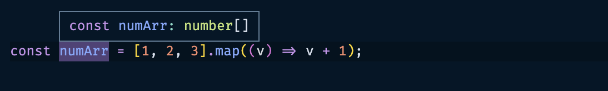
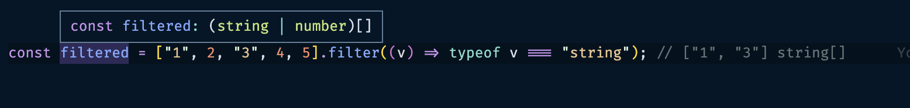

## lib.es5.d.ts 분석

> lib.es5.d.ts 훌륭한 예시는 가까이에 있다. 자주보고 익히자

### forEach, map 제네릭 분석

제네릭 사용에 대한 예시를 살펴보면서 분석해보자

```tsx
interface Array<T> {
  forEach(callbackfn: (value: T, index: number, array: T[]) => void, thisArg?: any): void;
}
```

위 forEach 함수에 대한 타입 정의를 찾아보면 `lib.es5.d.ts`로 연결되고, 거기에서 찾은 forEach 타이핑은 위와 같음
위와 같이 제네릭으로 함수 타입이 정의되어 있기 때문에 아래와 같은 코드가 모두 가능해진다.

```tsx
const a: Array<number> = [1, 2, 3];
a.forEach((v) => console.log(v)); // v를 number로 알아서 추론

["1", "2", "3"].forEach((v) => console.log(v)); // v를 string로 알아서 추론
[true, false, true].forEach((v) => console.log(v)); // v를 boolean로 알아서 추론
[1, "2", true].forEach((v) => console.log(v)); // v를 number | string | boolean로 알아서 추론
```

[](4-2-ts-all-in-one-basic.md)
코드 작성 시에는 타입이 불분명한 상태에서 실제 사용 시 타입을 설정할 수 있어서 좋다.
근데 제네릭을 굳이 설정하지 않고 모두 타이핑을 해도 되지 않을까? [기본 문법 정리](4-2-ts-all-in-one-basic.md) 에서 논의했던 내용이므로 넘어감

다음, map도 알아보자.

```tsx
interface Array<T> {
  map<U>(callbackfn: (value: T, index: number, array: T[]) => U, thisArg?: any): U[];
}

[1, 2, 3].map((v) => v.toString());
```

map 타입에 대해 가지고 왔다. 이해하는 과정을 따라가보자.

위 공식에서 T는 숫자 배열이므로 number가 됨

즉, `map<U>(callbackfn: (value: number, index: number, array: number[]) => U, thisArg?: any): U[];`

다음으로는 v.toString[]이 string 으로 값을 도출한다는 것을 의미하므로 U는 string 타입이 된다.

`map<string>(callbackfn: (value: number, index: number, array: number[]) => U, thisArg?: any): string[];`

위와 같은 과정으로 이해하면 제네릭도 충분히 이해할 수 있는 것임

![위 과정을 이해하면 stringArr 변수가 string[]로 추론되는 것을 이해할 수 있게된다.](../img/221220-1.png)



### filter 제네릭 분석

filter 타입도 분석해본다. 실제 filter타입에 대한 타입 정의를 찾아보면 아래와 같이 두 개를 찾을 수 있다.

```tsx
interface Array<T> {
  filter<S extends T>(predicate: (value: T, index: number, array: T[]) => value is S, thisArg?: any): S[];
  filter(predicate: (value: T, index: number, array: T[]) => unknown, thisArg?: any): T[];
}
```

같은 함수가 여러가지 방법으로 사용되는 경우 타입을 여러번 선언할 수도 있다. filter가 타입을 제대로 못찾는 경우도 있다.

```tsx
const filtered = [1, 2, 3, 4, 5].filter((v) => v % 2);
```

먼저 잘 찾는 경우에 대한 위 예시를 보자

`filter<S extends number>(predicate: (value: number, index: number, array: number[]) => value is number, thisArg?: any): number[];`

위와 같이 T 타입의 제네릭에 `number` 타입이 들어간 경우라고 보면 된다.



위와 같은 문자열만 추출하는 filter 함수가 있다고 하자. filtered 변수는 `(string | number)[]` 타입으로 추론된다. typeof string를 해도 동일

이럴 때는 어떻게 개선할 수 있을까? 저 내부 filter 구현 함수를 별도로 타이핑해주면 된다.

```tsx
const predicate = (value: string | number): value is string => typeof value === "string";
const filtered = ["1", 2, "3", 4, 5].filter(predicate); // ["1", "3"] string[]
```

위와 같이 predicate 함수에 value is string이라고 직접 명시해준다.

![원하는 대로 string[]로 반환](../img/221222-1.png)

다양한 타이핑 방법으로 지정할 수도 있겠지만 형식조건자가 지정되어 에러가 날 확률이 높다.

```tsx
predicate: (value: T, index: number, array: T[]) => value is S
```

위 predicate 함수 구조와 맞도록 최대한 구현해주어야 바람직한 결과를 반환받을 수 있음.

lib.es5.d.ts를 분석하는 것이 큰 도움이 된다. 타인이 만든 타입에 대해 볼 수 있고, 자바스크립트 사전을 보는 것 같은 느낌이 든다.

### forEach 타입 직접 만들기

이제 반대로 타입을 직접 만들어본다.

```tsx
const a: Arr = [1, 2, 3];

a.forEach((item) => {
  console.log(item);
});

const b: Arr = ["1", "2", "3"];

b.forEach((item) => {
  console.log(item);
});
```

간단한 여러 타입의 배열을 forEach 함수로 실행시킬 때 Arr 에 대한 타이핑을 한다면 어떻게 할 수 있을까?

```tsx
interface Arr<T> {
  forEach(callback: (item: T, index: number) => void): void;
  // forEach(callbackfn: (value: T, index: number, array: T[]) => void, thisArg?: any): void;
}

const a: Arr<number> = [1, 2, 3];

a.forEach((item) => {
  console.log(item);
  item.toFixed(1);
});

const b: Arr<string> = ["1", "2", "3"];

b.forEach((item) => {
  console.log(item);
  item.charAt(3);
});
```

위처럼 제네릭 T를 통해 설정한 타입이 데이터에 들어오는 것을 명시해주면 에러가 발생하지 않는다.
아래 주석이 실제 forEach 함수에 대한 타이핑 코드임. forEach 사용 시 index나 추가적인 thisArg 등을 사용하게 될 경우 타입을 추가해서 확장해주면 된다.

### map 타입 직접 만들기

map도 만들어본다. 가장 기본적인 내용으로만 구현해보면 아래와 같다

```tsx
interface Arr<T> {
  map(callback: (item: T, index: number) => T): T[];
}

const a: Arr<number> = [1, 2, 3];

a.map((item) => item + 1); // Ok
a.map((item) => item.toString()); // Error
```

위 숫자 리턴의 map 함수에서는 정상적으로 동작하지만, 두 번째 문자열을 반환하는 map 함수는 당연히 에러를 뱉는다.
즉, 반환값의 T가 잘못되었다는 의미임. 따라서 이를 아래와 같이 쓸 수 있다.

```tsx
interface Arr<T> {
  map<S>(callback: (item: T, index: number) => S): S[];
}
const a: Arr<number> = [1, 2, 3];

// or
interface Arr<T, S> {
  map(callback: (item: T) => S): S[];
}

const a: Arr<number, number> = [1, 2, 3];

// 어느 방법으로든 아래의 모든 경우를 수렴한다.
const b = a.map((item) => item + 1); // number[]
const c = a.map((item) => item.toString()); // string[]
const d = a.map((item) => !(item % 2)); // boolean[]

const e: Arr<string> = ["1", "2", "3"];
const f = e.map((item) => +item); // number[]
```

`map<U>(callbackfn: (value: T, index: number, array: T[]) => U, thisArg?: any): U[];` 실제 map 타이핑 코드와 비교해보면 거의 비슷하다!

### filter 타입 직접 만들기

마지막으로 filter도 만들어본다. filter는 조금 어렵당

```tsx
interface Arr<T> {
  filter<S extends T>(callback: (v: T) => v is S): S[];
}

const a: Arr<number> = [1, 2, 3];
const b = a.filter((v): v is number => !(v % 2));

const c: Arr<number | string> = [1, "2", 3, "4", 5];
const d = c.filter((v): v is string => typeof v === "string"); // ["2", "4"]

const predicate = (v: string | number): v is number => typeof v === "number";
const e = c.filter(predicate); // [1, 3, 5]
```

`S`는 `T`의 부분 집합임을 제네릭으로 표현해서 완성했다.
`is`는 반환값에 대한 타입을 지정해주는 메서드이므로 `T`의 부분집합인 `S`가 반환값의 타입이라고 지정해줄 수 있음

다른 함수들도 이런 식으로 타입을 직접 만들어주는 연습을 하다보면 자연스럽게 실력을 쌓을 수 있다.

- some 타이핑 혼자 해 봄

  ```tsx
  interface Arr<T> {
    // 정답은 요거임
    // some(predicate: (value: T, index: number, array: T[]) => unknown, thisArg?: any): boolean;
    some(callback: (value: T, index: number) => unknown): boolean;
  }

  const a: Arr<number> = [1, 2, 3];
  const b = a.some((v) => !(v % 2)); // true

  const c: Arr<number | string> = [1, "2", 3, "4", 5];
  const d = c.some((v) => typeof v === "string"); // true

  const predicate = (v: string | number) => typeof v === "boolean";
  const e = c.some(predicate); // false
  ```

  함수 리턴에 어떤 값이 들어갈지 몰라서 void가 아닌 unknown으로 썻는데, 적절했던 것 같음

### 공변성과 반공변성

공변성과 반공변성에 대해 알아보자. 조금 어려운 개념임

```tsx
function a(x: string): number {
  return +x;
}
a("1"); // 1

type B = (x: string) => number | string;
const b: B = a; // Ok, why...??????????
```

위와 같이 문자열을 넣어 숫자로 반환하는 함수가 있다고 했을 때
type B는 동일한 `string` 타입의 매개변수를 받아 `number` 또는 `string` 타입을 반환한다. `number` 타입만 반환하는 a가 왜 대입이 가능할까?

정답은 `리턴 값은 더 넓은 값은 대입이 가능하다.` 이다. 즉 `number ⊂ number | string` 이지만, `number | string ⊄ number`이다.

```tsx
function a(x: string): number | string {
  return +x;
}

type B = (x: string) => number; // (x: string) => number (ok), (x: string) => string (x)
const b: B = a; // Error!
```

풀어서 이해하면 쉽게 수용 가능함. 반면에 매개변수는 좀 다르다.

```tsx
function a(x: string): number {
  return +x;
}

type B = (x: string | number) => number;
const b: B = a; // Error
// '(x: string) => number' 형식은 'B' 형식에 할당할 수 없습니다.
// 'x' 및 'x' 매개 변수의 형식이 호환되지 않습니다.
// 'string | number' 형식은 'string' 형식에 할당할 수 없습니다.

function a(x: string | number): number {
  return +x;
}

type B = (x: string) => number;
const b: B = a; // Ok, why.......??????????????????
```

`매개변수는 좁은 타입으로만 대입이 가능하다.`

즉, 즉 `number | string ⊂ number` 이지만, `number ⊄ string | number`이다.

이해하기 어려우니 리턴 값은 넓은 타입으로 확장하여 대입이 가능하고, 매개변수는 좁은 타입으로만 대입이 가능하다. 라고 납득, 수용한다.

공변성, 반공변성에 대해서 이해하기가 매우 복잡하므로 법칙처럼 이해하는 것이 좋겠다.

### 다양한 경우의 수가 있을 때, 하나에는 걸리겠지(overloading)

같은 타입을 여러번 선언하는 것을 오버로딩이라고 한다.
자바스크립트는 함수를 여러번 선언할 수 있기 때문에 이러한 개념이 생겼다.

```tsx
// declare function overAdd(x: number, y: number, z?: number): number;
declare function overAdd(x: number, y: number): number;
declare function overAdd(x: string, y: string): string;
declare function overAdd(x: number, y: number, z: number): number;

overAdd(1, 2); // Ok
overAdd(2, 3, 4); // Ok
overAdd("1", "2"); // Ok
```

optional type method인 `?`를 모르는 상태에서 위와 같이 overAdd 함수를 두 번 선언할 수 있으며, 위 선언으로 인해 하위 함수는 모두 tsc 를 통과하게 된다.

즉, 다양한 경우의 수에 대한 타이핑이 어려울 경우, 급한대로 위와 같이 오버로딩 처리할 수 있다.

위 오버로딩 방법은 클래스에서도 동일하게 구현 가능함

```tsx
class A {
  add(x: number, y: number): number;
  add(x: string, y: string): string;
  // 오버로딩을 해놨을 경우 실제 구현부에서는 any로 처리해도 알아서 number, string으로 처리한다.
  add(x: any, y: any) {
    return x + y;
  }
}

const c = new A().add(1, 2); // number, Ok
const d = new A().add("가", "나"); // string, Ok
```
