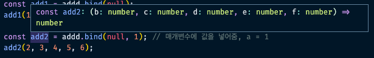

## Utility Types

이번에는 타입스크립트의 유틸리티 타입을 분석해본다.

### Partial 타입 분석

Partial 유틸리티는 타이핑 코드를 모두 optional한 속성으로 바꿔준다.
따라서 아래의 코드가 정상 동작한다.

```tsx
interface Profile {
  name: string;
  age: number;
  married: boolean;
}

const vicky: Profile = {
  name: "vicky",
  age: 33,
  married: false,
};

const filteredVicky: Partial<Profile> = {
  name: "vicky",
  age: 33,
};
```

그럼 이 Partial 유틸리티 자체는 어떻게 동작할까?
일단 보기 전에 비스무리하게 만들어본다. 들어오는 타입이 어떤 것이든 optional하게 구현하면 된다.

```tsx
type P<T> = {
  [P in keyof T]?: T[P];
};

// P<Profile> 는 아래와 같아질 것이다.
interface Profile {
  name?: string;
  age?: number;
  married?: boolean;
}
```

이런 느낌이 될 것이다. 실제 `lib.es5.d.ts`에서 확인한 Partial도 비슷하게 타이핑 되어있다.

```tsx
/**
 * Make all properties in T optional
 */
type Partial<T> = {
  [P in keyof T]?: T[P];
};
```

### Pick 타입 분석

Partial은 모든 속성을 optional하게 해주기 때문에 딱히 좋은 기능이라고 할 수 없다.
아무 것도 안넣어도 성립하는 마법.. 따라서 잘 사용하지 않고 Pick, Omit을 자주 활용하게 된다.

Omit과 Pick의 예시를 한번 보자.

```tsx
interface Profile {
  name: string;
  age: number;
  married: boolean;
}

const vicky: Pick<Profile, "name" | "age"> = {
  name: "vicky",
  age: 33,
};

const vicky: Omit<Profile, "married"> = {
  name: "vicky",
  age: 33,
};
```

Pick은 정확히 사용할 타입만 명시하는 유틸리티이고, Omit은 특정 속성을 제외하고 나머지를 가져오는 타입이다. Omit의 경우 많은 속성 가운데 소수의 타입을 제외할 때 자주 사용한다.

위 역할을 하는 Pick 타입을 직접 만들어보자..

```tsx
// custom Pick
type P<T, S extends keyof T> = {
  [P in S]: T[P];
};

const vicky: P<Profile, "name" | "age"> = {
  name: "vicky",
  age: 33,
};
```

위와 같이 T의 key 중에 S가 속하게 되고, 이 키 값을 기준으로 기존 T에서 Key 값에 대한 type value를 가져오도록 구성하면 된다. 실제 문서와 거의 동일하다.

```tsx
/**
 * From T, pick a set of properties whose keys are in the union K
 */
type Pick<T, K extends keyof T> = {
  [P in K]: T[P];
};
```

매우 흡사하다.

### Omit, Exclude, Extract 타입 분석

Omit을 알기 전에 Exclude를 알아야 한다.

```tsx
/**
 * Exclude from T those types that are assignable to U
 */
type Exclude<T, U> = T extends U ? never : T;

/**
 * Extract from T those types that are assignable to U
 */
type Extract<T, U> = T extends U ? T : never;
```

Exclude는 위 정의와 같이 T 타입에서 U 타입을 뺀 것이다. Extract는 정반대다.
즉 Exclude는 제외, Extract는 추출의 의미를 가진다.

- Exclude는 T가 U의 부분집합이면 없애고, 아니면 남겨준다.
- Extract는 T가 U의 부분집합이면 남기고, 아니면 없앤다.

```tsx
type Animal = "Cat" | "Dog" | "Human";

type Mammal = Exclude<Animal, "Human">; // type Mammal = "Cat" | "Dog"
type Human = Extract<Animal, "Human">; // type Human = "Human"
```

```tsx
interface Profile {
  name: string;
  age: number;
  married: boolean;
}

type A = Exclude<keyof Profile, "married">; // type A = "name" | "age"
```

위와 같은 코드가 있다면 A 타입은 `name` 혹은 `age`를 나타낸다.
(`keyof Profile = “name” | “age” | “married”`)

즉 위 타입 A로 아래와 같은 Pick 타입 구현이 가능해진다.

```tsx
const testVicky: Pick<Profile, Exclude<keyof Profile, "married">> = {
  name: "vicky",
  age: 33,
};
```

즉 위 코드는 O라는 커스텀 타이핑을 하여 Omit 역할을 하게 하면 아래와 같다.

```tsx
type O<T, S extends keyof any> = Pick<T, Exclude<keyof T, S>>;
const OmitVicky: O<Profile, "married"> = {
  name: "vicky",
  age: 33,
};
```

즉 Omit은 Pick과 Exclude를 활용하여 만들어내는 타입이다.
`S extends keyof any` 라는 의미는 S가 string | number | symbol 타입이라는 제약조건을 건 것이다.

이 제약조건을 넣지 않으면 Profile 등의 interface obj를 넣을 수도 있게 된다.

### Required, Record, NonNullable 타입 분석

Required 타입은 optional 속성을 필수값으로 바꿔주는 타입이다.

```tsx
interface Profile {
  name?: string;
  age?: number;
  married?: boolean;
}

const vicky: Required<Profile> = {
  name: "vicky",
  age: 33,
  married: false,
};
```

모든 속성을 필수값으로 바꿔주므로 하나의 속성이라도 제외되면 에러가 발생한다.
위 Required 속성을 실제 구현하면 아래와 같다.

```tsx
type R<T> = {
  [key in keyof T]-?: T[key];
};

const vicky: R<Profile> = {
  name: "vicky",
  age: 33,
  married: false,
};
```

`-?`는 modifier로 optional을 모두 제거하라는 의미를 가진다. (반대로 `+?`도 있으나 굳이 쓸 필요가 없다)

위 vicky 객체에 name은 쉽게 수정할 수 있다. 하지만 수정하지 못하게 하려면? `Readonly`를 쓴다.

```tsx
const vicky: Readonly<Profile> = {
  name: "vicky",
  age: 33,
  married: false,
};

// 혹은
type R<T> = {
  readonly [key in keyof T]-?: T[key];
};

const vicky: R<Profile> = {
  name: "vicky",
  age: 33,
  married: false,
};

vicky.name = "woniee"; // Error!
```

아래와 같이 `-readonly`라고 쓰면 readonly 속성을 제외하라는 의미가 된다.

```tsx
interface Profile {
  readonly name?: string;
  readonly age?: number;
  readonly married?: boolean;
}

type R<T> = {
  -readonly [key in keyof T]-?: T[key];
};

const vicky: R<Profile> = {
  name: "vicky",
  age: 33,
  married: false,
};

vicky.name = "vicky"; // Ok
```

Record 타입은 사용하고자 하는 타입을 간단히 적어놓은 것이다. (`IObj` 같은 느낌)

```tsx
interface Obj {
  [key: string]: number;
}

// 아래 둘은 같은 타입을 가진다.
const obj: Obj = { a: 3, b: 5, c: 7 };
const recordObj: Record<string, number> = { a: 3, b: 5, c: 7 };
```

Record 타입을 직접 만들면 아래와 같다.

```tsx
type R<T extends keyof any, S> = {
  [key in T]: S;
};
const recordObj: R<string, number> = { a: 3, b: 5, c: 7 };
```

NonNullable 타입은 키에 적용되는 타입이다. nullable 하지 않은 값만 가져온다.

```tsx
type A = string | null | undefined | boolean | number;
type B = NonNullable<A>; // type B = string | number | boolean
```

NonNullable은 아래와 같이 삼항 연산자로 만들 수 있음

```tsx
type N<T> = T extends null | undefined ? never : T;
type B = N<A>; // type B = string | number | boolean
```

실제는 아래와 같이 되어 있다.

```tsx
/**
 * Exclude null and undefined from T
 */
type NonNullable<T> = T & {};
```

T가 `undefined`, `null`이면 `&`에서 아예 걸러지기 때문에 위와 같이 간단히 적을 수 있음

### infer 타입 분석

먼저 Parameters, ReturnType 타입에 대해 알아보자.
Parameters는 인자에 대한 타입을, ReturnType은 리턴 값에 대한 타입을 추론해서 가져올 수 있다.

```tsx
function zip(x: number, y: string, z: boolean): { x: number; y: string; z: boolean } {
  return { x, y, z };
}

type Params = Parameters<typeof zip>; // type Params = [number, string, boolean]
type Return = ReturnType<typeof zip>; // type Return = { x: number; y: string; z: boolean }
type First = Params[0]; // number
```

Params, Return 타입 변수에 담기는 값은 튜플로 담기므로 배열의 index로 해당 타입에 접근할 수 있다.
실제 예시를 만들어보자

```tsx
type P<T extends (...args: any) => any> = T extends (...args: infer P) => any ? P : never;
type Params = P<typeof zip>; // type Params = [number, string, boolean]
type First = Params[0]; // number
```

`<T extends (...args: any) => any>` 의 의미는 T는 무조건 함수여야 한다는 뜻임

infer는 타입스크립트가 알아서 추론한다는 의미를 가진다.

- `추론 조건 ? 추론 성공 시의 값 : 추론 실패 시의 값`
- `T extends (...args: infer P) => any ? P : never;`
  - 매개변수에 추론 값이 있으면 그걸 쓰고, 없으면 쓰지 않는다는 의미를 가진다.

만약 리턴타입에 대한 값 추론을 하려면 어떻게 만들면 될까?

```tsx
type R<T extends (...args: any) => any> = T extends (...args: any) => infer P ? P : never;
type Return = R<typeof zip>; // type Return = { x: number; y: string; z: boolean }
```

이번에는 instanceType과 ContructorParameters에 대해 알아본다.
이는 생성자를 대상으로 사용하는 타입이다.

```tsx
/**
 * Obtain the parameters of a constructor function type in a tuple
 */
type ConstructorParameters<T extends abstract new (...args: any) => any> = T extends abstract new (
  ...args: infer P
) => any
  ? P
  : never;

/**
 * Obtain the return type of a constructor function type
 */
type InstanceType<T extends abstract new (...args: any) => any> = T extends abstract new (...args: any) => infer R
  ? R
  : any;
```

위 타입은 아래와 같이 사용함

```tsx
class A {
  a: string;
  b: number;
  c: boolean;

  constructor(a: string, b: number, c: boolean) {
    this.a = a;
    this.b = b;
    this.c = c;
  }
}

const d = new A("vicky", 33, true);
type D = ConstructorParameters<typeof A>; // type D = [a: string, b: number, c: boolean] - 생성자의  파라미터
type I = InstanceType<typeof A>; // type I = Test

const e: A = new A("woniee", 32, true); // 인스턴스(new)
```

위의 메서드를 앎으로서 더 다양한 타입 확장이 가능해진다.
공부할 때는 구현이 어떤 원리로 되어있는지 집중하는 것이 좋다.

이 외에도 `Uppercase`, `Lowercase`, `Capitalize`, `Upcapitalize`, `ThisType` 등이 있다.
위 코드는 대거 intrinsic 타입 형태로 만들어져있다. (타입스크립트에서 별도의 커스텀 코드로 구현)

### 완전 복잡한 타입 분석하기(Promise와 Awaited 편)

infer에 대해서 좀 더 공부해본다. 아래 예제를 보자

```tsx
// Promise는 Promise<결괏값> 타입으로 표현함
const p1 = Promise.resolve(1)
  .then((a) => a + 1)
  .then((a) => a + 1)
  .then((a) => a.toString());

const p2 = Promise.resolve(2);
const p3 = new Promise((res, _) => setTimeout(res, 1000));

Promise.all([p1, p2, p3]).then((result) => console.log(result)); // ['3', 2, unknown]
```

위 코드는 프로미스 객체인 p1, p2, p3가 모두 실행된 뒤 그 값을 반환하는 코드이다.
위 코드 실행 결과는 아마도 `['3', 2, unknown]`일 것이며 타입스크립트는 이를 똑똑하게 추론해낸다.


어떻게 반환 값을 모두 다 추론해낼 수 있는 것일까? 특히 p1의 중첩 then문을 어떻게 예측 할 수 있었을까?
우선 lib.es2015.promise.d.ts에 all 메서드에 대한 타입정의를 참고해보자

```tsx
/**
 * Creates a Promise that is resolved with an array of results when all of the provided Promises
 * resolve, or rejected when any Promise is rejected.
 * @param values An array of Promises.
 * @returns A new Promise.
 */
all<T extends readonly unknown[] | []>(values: T): Promise<{ -readonly [P in keyof T]: Awaited<T[P]> }>;
```

위 코드에서 T는 `[p1, p2, p3]`를 의미한다.
이는 `{ ‘0’: p1, ‘1’: p2, ‘2’: p3, Length: 3 }`이라는 객체로 정의할 수도 있다.
그렇다면 keyof T는 뭘까? `keyof T = '0' | '1' | '2' | 'Length'` 이다.

```tsx
const arr = [1, 2, 3];
type Arr = keyof typeof arr; // type Arr = keyof number[]

const arr = [1, 2, 3] as const;
type Arr = keyof typeof arr; // type Arr = keyof readonly [1, 2, 3]
const key1: Arr = "2"; // Ok
const key2: Arr = "3"; // Error
```

즉 T[P]는 배열의 값들을 의미하고 이를 Awaited 타입이 해결해준다.

```tsx
/**
 * Recursively unwraps the "awaited type" of a type. Non-promise "thenables" should resolve to `never`. This emulates the behavior of `await`.
 */
type Awaited<T> = T extends null | undefined
  ? T // special case for `null | undefined` when not in `--strictNullChecks` mode
  : T extends object & { then(onfulfilled: infer F, ...args: infer _): any } // `await` only unwraps object types with a callable `then`. Non-object types are not unwrapped
  ? F extends (value: infer V, ...args: infer _) => any // if the argument to `then` is callable, extracts the first argument
    ? Awaited<V> // recursively unwrap the value
    : never // the argument to `then` was not callable
  : T; // non-object or non-thenable
```

Awaited 타입은 위와 같음. 복잡해보이지만 이해하면 쉽다.

- `T extends null | undefined ? T` 는 T 값이 null, undefined일 경우를 고려하므로 생략한다.
- `T extends object & { then(onfulfilled: infer F, ...args: infer _): any }`
  - 프로미스는 object이며 `T extends object` 이 성립
  - `{ then(onfulfilled: infer F, ...args: infer _): any }`
    - promise가 then 메서드를 가졌는지를 체크하므로 성립
- `F extends ((value: infer V, ...args: infer _) => any)`
  - F는 함수형태인지 확인하므로 성립 ⇒ `Awaited<V>`로 처리된다.

반환형태가 `Awaited<number>`가 되므로 그 다음 메서드가 계속 number로 이어질 수 있게되는 것이다.

```
const p1 = Promise.resolve(1).then((a) => a + 1).then((a) => a + 1).then((a) => a.toString());
// Promise<number> => Promise<number> => Promise<number> => Promise<string>
const p2 = Promise.resolve(2); // Promise<number>
const p3 = new Promise((res, _) => setTimeout(res, 1000)); // Promise<unknown>
```

위와 같이 처리되므로 [string, number, unknown] 이 추론되게 되는 것이다. (어렵지만 몇 번보면 쉬워질 듯)
Awaited는 중첩된 Promise 타입 과정을 풀어서 최종 타입으로 추론해내는 타입이라고 볼 수 있다.

```tsx
type Result = Awaited<Promise<Promise<Promise<number>>>>; // type Result = number
```

즉, 재귀적으로 추론됨을 위 `Awaited` 타입을 보고 확인할 수 있음
또한, `infer`를 사용해 새로운 타입을 만들어내고 추론할 수 있다. 왜 이미 존재하는 Promise 타입을 Awaited 타입 안에서 사용하지 않까? 그 이유는 Promise 객체 외에 별도로 만들어진 프로미스와 유사한 형태의 커스텀 타이핑도 포함할 수 있는 duck typing을 타입스크립트에서 채택하고 있기 때문이다.

즉 아래와 같은 타이핑을 허용함을 의미한다.

```tsx
type Result = Awaited<{ then(onfulfilled: (v: number) => number): any }>; // thenable
```

위 Result 타입은 then을 사용할 수 있는 타입으로 허용되며, 타입 추론도 성공적으로 이루어짐.
이를 `thenable`한 타입이라고 한다. (_~~어렵다~~_)

### 완전 복잡한 타입 분석하기(bind 편)

이번에는 bind 타입에 대해 알아본다. bind 타이핑은 아래와 같다.

```tsx
/**
 * For a given function, creates a bound function that has the same body as the original function.
 * The this object of the bound function is associated with the specified object, and has the specified initial parameters.
 * @param thisArg The object to be used as the this object.
 * @param args Arguments to bind to the parameters of the function.
 */
bind<T>(this: T, thisArg: ThisParameterType<T>): OmitThisParameter<T>;
bind<T, A0, A extends any[], R>(this: (this: T, arg0: A0, ...args: A) => R, thisArg: T, arg0: A0): (...args: A) => R;
bind<T, A0, A1, A extends any[], R>(this: (this: T, arg0: A0, arg1: A1, ...args: A) => R, thisArg: T, arg0: A0, arg1: A1): (...args: A) => R;
bind<T, A0, A1, A2, A extends any[], R>(this: (this: T, arg0: A0, arg1: A1, arg2: A2, ...args: A) => R, thisArg: T, arg0: A0, arg1: A1, arg2: A2): (...args: A) => R;
bind<T, A0, A1, A2, A3, A extends any[], R>(this: (this: T, arg0: A0, arg1: A1, arg2: A2, arg3: A3, ...args: A) => R, thisArg: T, arg0: A0, arg1: A1, arg2: A2, arg3: A3): (...args: A) => R;
bind<T, AX, R>(this: (this: T, ...args: AX[]) => R, thisArg: T, ...args: AX[]): (...args: AX[]) => R;
```

bind 타입을 이해하기 위해서는 ThisParameterType, OmitParameterType을 알

```tsx
/**
 * Extracts the type of the 'this' parameter of a function type, or 'unknown' if the function type has no 'this' parameter.
 */
type ThisParameterType<T> = T extends (this: infer U, ...args: never) => any ? U : unknown;
```

`ThisParameterType` 는 this를 추론해내는 파라미터이다. 
즉 위 파라미터로 아래와 같은 타입 추론이 가능해진다.

```tsx
function bindTest(this: Window | typeof obj) {
  console.log(this); // window
}

const obj = { name: "vicky" };
const b = bindTest.bind(obj);
b(); // vicky

type T = ThisParameterType<typeof bindTest>; // type T = Window | { name: string; }
```

`T` 타입은 Window 혹은 { name: string } 값을 가진다. 만약 this가 any라면 `T` 타입은 any로 추론될 것이다.

```tsx
/**
 * Removes the 'this' parameter from a function type.
 */
type OmitThisParameter<T> = unknown extends ThisParameterType<T> ? T : T extends (...args: infer A) => infer R ? (...args: A) => R : T;
```

`OmitThisParameter` 는 this 파라미터가 unknown일 때(this 추론이 안될 때) 타이핑을 의미한다.

`unknown extends ThisParameterType<T>` 즉, 타입 추론이 실패했을 때 즉, this가 없을 경우에는 그 타입대로 그대로 가고, 타입 추론이 성공했을 때에는 this를 제외한 남은 매개변수와 리턴값을 그대로 함수로 만들어 반환한다는 의미를 가진다.

```tsx
const obj = { name: "vicky" };
function bindTest(this: Window | typeof obj, param: string) {
  console.log(this); // window
}
bindTest.bind(obj); 

type T = ThisParameterType<typeof bindTest>; // type T = Window | { name: string; }
type NoThis = OmitThisParameter<typeof bindTest>; // type NoThis = (param: string) => void
```

NoThis는 this만 제외한 나머지를 반환한다. 이제 bind를 자세히 알아보자

bind는 this를 쓰는 경우와 this를 쓰지 않는 경우가 나눠진다.

```tsx
const vicky = {
  name: "vicky",
  sayHello(this: { name: string }) {
    console.log(`hi ${this.name}`);
  },
};

const sayHello = vicky.sayHello; // const sayHello: (this: { name: string; }) => void
const sayHi = vicky.sayHello.bind({ name: "wonny" }); // const sayHi: () => void
sayHi(); // hi wonny
```

위의 경우 this를 쓰는 경우이다. 초기 sayHello는 `this: { name: string; }` 이란 정보를 가지고 있는데, bind로 새롭게 묶어준 sayHi는 this를 잃어버린 상태로 `() ⇒ void`로 추론된다. 
이는 bind 함수의 아래 타이핑 코드가 실행된 것이라고 보면 됨

`bind<T>(this: T, thisArg: ThisParameterType<T>): OmitThisParameter<T>;`

- OmitThisParameter로 This를 제외한 원래 함수가 튀어나온다.

```tsx
function addd(a: number, b: number, c: number, d: number, e: number, f: number) {
  return a + b + c + d + e + f;
}

const add1 = addd.bind(null);
add1(1, 2, 3, 4, 5, 6);

const add2 = addd.bind(null, 1); // 매개변수에 값을 넣어줌, a = 1
add2(2, 3, 4, 5, 6);

const add3 = addd.bind(null, 1, 2); // a = 1, b = 2
add3(3, 4, 5, 6);

const add4 = addd.bind(null, 1, 2, 3);
add4(4, 5, 6);

const add5 = addd.bind(null, 1, 2, 3, 4);
add5(5, 6);
```

위 예시는 this를 사용하지 않는 경우이다. bind의 첫번째 인수인 null은 this 값을 의미하며, 그 이후 값부터 a 값에 대입되는 것이다. 위와 같이 처리할 경우 알아서 매개변수 데이터가 추론된다.



그런데 아래의 경우 에러가 난다.

```tsx
const add6 = addd.bind(null, 1, 2, 3, 4, 5);
add6(6); // Error '6' 형식의 인수는 '1 | 2 | 3 | 4 | 5' 형식의 매개 변수에 할당될 수 없습니다.
```

왜일까? 이는 bind 타입을 보면 이해가 될 것이다. 먼저 add2 bind 경우부터 보자

```tsx
const add2 = addd.bind(null, 1); // 매개변수에 값을 넣어줌, a = 1
add2(2, 3, 4, 5, 6);
```

위 `add2`의 경우 아래의 bind 타이핑이 실행된다고 할 수 있다.

`bind<T, A0, A extends any[], R>(this: (this: T, arg0: A0, ...args: A) => R, thisArg: T, arg0: A0): (...args: A) => R;`

- thisArg=null, arg0은 전달된 1을 의미한다. 그 외의 실행 시 넣는 매개변수는 `…args: A` 에 속함

```tsx
const add3 = addd.bind(null, 1, 2); // a = 1, b = 2
add3(3, 4, 5, 6);
```

비슷하게 위 `add3`은 아래의 bind 타이핑이 실행된다.

`bind<T, A0, A1, A extends any[], R>(this: (this: T, arg0: A0, arg1: A1, ...args: A) => R, thisArg: T, arg0: A0, arg1: A1): (...args: A) => R;`

- thisArg=null, arg0, arg1에 각각 1, 2값이 들어간다. 그 외 실행시 넣는 매개변수가 `…args: A` 에 속한다.

```tsx
const add4 = addd.bind(null, 1, 2, 3);
add4(4, 5, 6);

// bind<T, A0, A1, A2, A extends any[], R>(this: (this: T, arg0: A0, arg1: A1, arg2: A2, ...args: A) => R, thisArg: T, arg0: A0, arg1: A1, arg2: A2): (...args: A) => R;

const add5 = addd.bind(null, 1, 2, 3, 4);
add5(5, 6);

// bind<T, A0, A1, A2, A3, A extends any[], R>(this: (this: T, arg0: A0, arg1: A1, arg2: A2, arg3: A3, ...args: A) => R, thisArg: T, arg0: A0, arg1: A1, arg2: A2, arg3: A3): (...args: A) => R;
```

나머지 `add4`, `add5`도 설정된 타이핑으로 실행된다. 
하지만 전달인자가 4개가 넘어가는 시점에는 아래의 타이핑 코드가 실행된다.

```tsx
bind<T, AX, R>(this: (this: T, ...args: AX[]) => R, thisArg: T, ...args: AX[]): (...args: AX[]) => R;
```

4개 이후의 전달인자는 추론하지 않는 코드인 것이다. 
이 때문에 `addd.bind(null, 1, 2, 3, 4, 5)(6);`에서 타입 에러가 발생한다.

타입스크립트는 여전히 보완하고 있으며 아직 완성형이라고 할 수 없다. 
즉, 위와 같은 케이스처럼 표현력의 한계가 존재하는 것이다. (매개변수에 따른 동적 추론)

정리하자면, bind 함수의 경우 타입스크립트에서는 4개까지만 타입 추론을 지원하고 그 이후부터는 타입 추론을 지원하지 않는다는 것을 알 수 있다. 그럴 일이 빈번하지는 않겠지만 만약 발생한다면, 이는 다른 방법으로 개선해야할 수도 있다.