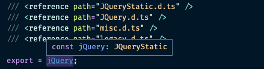

## 제이쿼리 타입 분석

### 분석 전: 타입 지원 여부 확인하기

보통 npm에서 라이브러리 타이틀 우측에 TS 마크를 보고 타입 지원 여부를 확인할 수 있다.
하지만 위 타입 지원 형태는 라이브러리에 따라 조금씩 다를 수 있음

먼저 Redux의 경우는 아예 typescript로 작성된 코드가 주를 이룬다.


package.json에도 type 정보에 대한 내용을 확인할 수 있다.

```json
{
  "name": "redux",
  // ..
  "main": "lib/redux.js",
  "typings": "./index.d.ts"
  // ..
}
```

Axios의 경우 JavaScript 코드로 작성되어 있다.


pacakge.json에도 동일하게 파일 root 위치와 types 정보를 안내하고 있음

```json
{
  "name": "axios",
  // ..
  "main": "index.js",
  "types": "index.d.ts"
  // ..
}
```

jQuery의 경우에는 라이브러리 자체에서 types 를 지원하지 않는다. DT 아이콘으로 노출됨
`@types/jquery` 를 함께 받아야하며, 다양한 사람들이 타이핑을 만들어놓은 것, 누구나 contributor가 될 수 있음. 단, 틀린 타입이 제공될 수 있다.

아무것도 붙어있지 않은 타입 파일 미지원 라이브러리는 필요 시 직접 타이핑을 해야 한다. (index.d.ts 생성)

### @types/jquery 설치하기

우선 jquery 타입 분석을 위해 `@types/jquery`를 설치한다.

코드 타입을 보기 위해서 코드 상 바로 d.ts 파일로 이동할 수도 있지만, 큰 흐름을 읽기 위해서는 github에서 제공되는 핵심 로직을 훑어보는 것이 바람직함

[https://github.com/DefinitelyTyped/DefinitelyTyped/tree/master/types/jquery](https://github.com/DefinitelyTyped/DefinitelyTyped/tree/master/types/jquery) 해당 페이지에 jquery 파일이 존재하며, 그 중에서도 `index.d.ts`파일을 열어보자

`index.d.ts`

```tsx
// Type definitions for jquery 3.5
// Project: https://jquery.com
// Definitions by: Leonard Thieu <https://github.com/leonard-thieu>
//                 ..
// Definitions: https://github.com/DefinitelyTyped/DefinitelyTyped
// TypeScript Version: 2.7

/// <reference types="sizzle" />
/// <reference path="JQueryStatic.d.ts" />
/// <reference path="JQuery.d.ts" />
/// <reference path="misc.d.ts" />
/// <reference path="legacy.d.ts" />

export = jQuery;
```

- Definitions by : 컨트리뷰터에 대한 안내
- TypeScript Version : 지원하는 TS 버전(해당 버전 하위는 지원 하지 않는다.)
- <reference types=”..”> : 해당 타입 파일이 참조하고 있는 파일이다.
  - reference 종류
    - types: npm 라이브러리
      - @types/sizzle은 @types/jquery 설치 시 같이 설치되어 node_module에 존재한다.
    - path: 현재 라이브러리 파일
    - lib: TS 기본 제공 라이브러리
- 실제 위 path에 담긴 파일은 index.d.ts가 존재하는 같은 선상에 존재한다.

### commonjs 모듈 타이핑 방법 및 esModuleInterop

또한 위 index.d.ts 파일에서 주목할 부분은 `export = jQuery;` 부분이다.

타입스크립트는 기본적으로 import, export를 쓴다. node의 경우 require 즉, commonjs 문법을 쓰는데 타입스크립트에서 commonjs 형식으로 만들어진 라이브러리를 표시하기 위해 위와 같은 방법으로 표시한다.

즉 `module.exports = jQuery;` 와 같은 의미라고 할 수 있다.

`const $ = require(’jquery’);` 로 쓰여진 부분은 타입스크립트에서는 `import $ = require(’jquery);`로 작성한다. 그런데 이렇게 작성하는 것이 헷갈리므로 주로 아래와 같이 썻었다.

```tsx
import * as $ from "jquery";
```

그런데 우리는 실제 작업 시 위와 같이 쓰지 않는다.

```tsx
import $ from "jquery";
import React from "react"; // 사실 react도 commonjs 기반의 라이브러리임
```

위 코드가 어떻게 에러가 안날까? 이는 `tsconfig.json`에 `esModuleInterop` 설정 때문에 가능하다

`tsconfig.json`

```json
{
  // ..
  "esModuleInterop": true /* Enables emit interoperability between CommonJS and ES Modules via creation of namespace objects for all imports. Implies 'allowSyntheticDefaultImports'. */
}
```

`esModuleInterop` 설정을 `false`로 설정하면 위와 같이 작성한 모든 구간에서 에러가 발생할 것이다.

```json
{
  // ..
  "module": "commonjs" // 이렇게 설정해도 import $가 가능함
}
```

즉, `index.d.ts`에서 마지막이 어떤 형태인지에 따라 해당 파일이 esmodule 형태인지, commonjs 형태인지 알 수 있다.

```json
export default $; // esmodule
export = $; // commonjs
```

만약 작업 파일의 최상단에 아래와 같이 import 문이 들어있게되면 파일은 자동적으로 모듈 시스템으로 인식한다.

```tsx
import $ from "jquery";

$(tag).html(function (i: number) {
  console.log(this); // this Error 발생
});
```

만약 위 import 없이 코드만 적혀있다면 파일을 전역 스크립트로 인식해서 해당 타입들이 코드에 이미 존재한다고 파악하고 별다른 에러가 발생하지 않는다.

### 네임스페이스(namespace)

index.d.ts의 `export = jQuery`에 마우스를 올려보면 jQueryStatic이 추론되는 것을 확인할 수 있다.



이를 타고 들어가보면 jQuery와 $ 모두 JQueryStatic으로 되어있는 것을 확인할 수 있음

```tsx
declare const jQuery: JQueryStatic;
declare const $: JQueryStatic;
```

declare는 실제 구현은 없이 타입만 선언해놓는 것이다. 실제 구현물은 다른 곳에 있다고 여기는 것이다.
이런 것으로 ambient 선언이라고도 한다.

즉 위와 같은 선언으로 인해 아래 코드는 같은 기능을 실행한다는 것을 알 수 있음

```tsx
$("p").removeClass("myClass noClass").addClass("yourClass");
jQuery("p").removeClass("myClass noClass").addClass("yourClass");
```

그럼 위 $ 텍스트에 [정의로 이동]을 눌러 해당 타입 정의로 이동해보자

```tsx
<TElement extends HTMLElement = HTMLElement>(html: JQuery.htmlString, ownerDocument_attributes?: Document | JQuery.PlainObject): JQuery<TElement>;
```

위와 같이 뜸. html 영역에 `JQuery.htmlString`이라고 뜨는데 htmlString에 대한 정의를 찾아보면 `type htmlString = string;` 로 연결된다. 그럼 `JQuery.` 은 무슨 의미일까?

해당 코드를 감싸는 상단 wrapper를 보면 아래와 같다,

```tsx
declare namespace JQuery {
  // ..

  /**
   * A string is designated htmlString in jQuery documentation when it is used to represent one or more DOM elements, typically to be created and inserted in the document. When passed as an argument of the jQuery() function, the string is identified as HTML if it starts with <tag ... >) and is parsed as such until the final > character. Prior to jQuery 1.9, a string was considered to be HTML if it contained <tag ... > anywhere within the string.
   */
  type htmlString = string;

  // ..
}
```

namespace JQuery라고 적혀있는데 네임스페이스는 script src로 불러오는 라이브러리에서 주로 쓴다(전역)
하위 타입을 하나로 묶어주는 개념인 것이다. 이를 하나로 묶은 것은 같은 타입명에 대한 충돌을 방지하기 위함임

그냥 `htmlString`은 다른 d.ts 파일에 존재할 수 있는 개념이므로 `JQuery.htmlString`으로 가두는 것임

```tsx
declare namespace Vicky {
  const happy: string;
  const worry: string;
}

// Vicky.happy로 사용 가능
```

결국 네임스페이스는 그냥 string이라고 받아들이면 된다. 또한 위 타이핑에 `JQuery<TElement>` 부분이 궁금하다. 먼저 TElement는 `<TElement extends HTMLElement = HTMLElement>`라고 나와있다. HTMLElement가 들어갈 것이라고 추론된다. 그럼 바깥의 JQuery는 좀 전의 네임스페이스를 의미할까? 아니다.


위 이미지처럼 JQuery는 namespace 정의도 있지만 interface도 존재, 뒤 제네릭 구조를 받을 수 있는 있는 것은 인터페이스이므로 인터페이스 JQuery 객체로 판단된다는 것을 알 수 있음


즉 위 내용을 통해 `$(”p”)`가 `JQuery<HTMLElement>`로 추론된다는 것을 이해할 수 있다.
