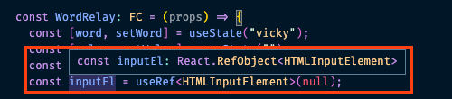
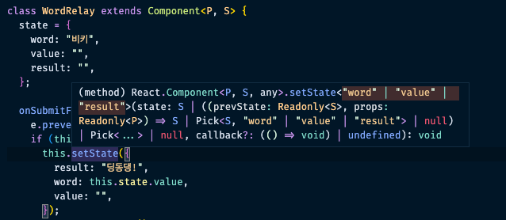
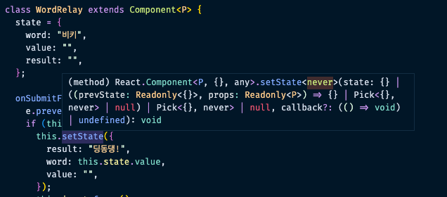

## React 타입 분석

### UMD 모듈과 tsconfig.json jsx 설정

React 타입을 분석해보기에 앞서 react 와 @types/react를 설치해준다.

```bash
> npm i -D react @types/react
```

위와 같이 설치 후 react.ts 파일에 기본 보일러플레이트 코드를 깔아서 React 정의를 찾아가보면 아래와 같다.

`@types/react/index.d.ts`

```bash
// ..
export = React;
export as namespace React;

declare namespace React { ... }
```

위와 같이 `export as namespace React` 까지만 적혀있으면 UMD 모듈이다.

기본적으로는 `import React = require(’react’)`적어야하지만 tsconfig 설정을 바꿔주면 import 가능함

```json
{
  "compilerOptions": {
    // ..
    "jsx": "react", // ts 파일이 jsx를 인식하도록 설정
    "esModuleInterop": true // commonjs 모듈을 esmodule처럼 사용하게 해준다.
  }
}
```

`jsx`, `esModuleInterop` 설정으로 리액트 환경에 필요한 설정을 추가해준다.

함수형 구조의 리액트 코드는 이미 타입이 만들어져 있다. 아래 예시를 보자

```tsx
import React, { useState, useCallback, useRef, useEffect, FunctionComponent } from "react";

// (prop) => JSX

const WordRelay: FunctionComponent = () => {
  const [word, setWord] = useState("제로초");
  const [value, setValue] = useState("");
  const [result, setResult] = useState("");
  const inputEl = useRef(null);

  useEffect(() => {
    console.log("useEffect");
  }, []);

  const onSubmitForm = useCallback(
    (e) => {
      // ..
    },
    [word, value]
  );

  const onChange = useCallback((e) => { ... }, []);

  return (
    <>
			<form onSubmit={onSubmitForm}>
				{/* ... */}
			</form>
    </>
  );
};

export default WordRelay;
```

위 코드를 보면 WordRelay 라는 이름의 함수형 컴포넌트에 `FunctionComponent` 타입을 적용했다.
이 타입에 대해 자세히 알아보자

```tsx
type FC<P = {}> = FunctionComponent<P>;

interface FunctionComponent<P = {}> {
  (props: P, context?: any): ReactElement<any, any> | null;
  propTypes?: WeakValidationMap<P> | undefined;
  contextTypes?: ValidationMap<any> | undefined;
  defaultProps?: Partial<P> | undefined;
  displayName?: string | undefined;
}

interface ReactElement<P = any, T extends string | JSXElementConstructor<any> = string | JSXElementConstructor<any>> {
  type: T;
  props: P;
  key: Key | null;
}
```

위 타입을 보고, return 내부의 데이터는 ReactElement라는 것을 알 수 있음
또, 위 return 내부의 form 태그를 기준으로 타입 정의를 보면 아래와 같은 타입으로 연결됨

```tsx
declare global {
  namespace JSX {
    // ..

    interface IntrinsicElements {
      // HTML
      // ..
      form: React.DetailedHTMLProps<React.FormHTMLAttributes<HTMLFormElement>, HTMLFormElement>;
    }
  }
}

type DetailedHTMLProps<E extends HTMLAttributes<T>, T> = ClassAttributes<T> & E;
```

위 타입을 이루는 하위 속성들은 계속 타고 들어가면서 확인해보면 된다.

### 함수 컴포넌트(FC vs VFC), Props 타이핑

위 FunctionComponent를 안써주면 JSX.Element로 타입 추론이 된다.

```tsx
declare global {
  namespace JSX {
    interface Element extends React.ReactElement<any, any> {}
    // ..
  }
}
```

JSX.Element 도 타입을 살펴보면 위와 같이 ReactElement로 타입추론되므로 결국 같은 거라고 보면 되겠다.

함수형 컴포넌트를 타이핑 하는 방법은 크게 두가지가 있다.

1. 매개변수와 리턴 값을 각각 타이핑해주는 방법(리턴 값은 선택적)

   ```tsx
   interface P {
     name: string;
     title: string;
   }
   const WordRelay = (props: P): JSX.Element => { ... };
   ```

2. 이미 만들어진 FunctionComponent를 활용하는 방법

   ```tsx
   import React, { FunctionComponent, FC } from "react";

   interface P {
     name: string;
     title: string;
   }

   const WordRelay: FunctionComponent<P> = (props) => {
     console.log(props.name, props.title);
   };

   // 혹은

   const WordRelay: FC<P> = (props) => {
     console.log(props.name, props.title);
   };
   ```

개인적으로 2번이 더 좋아보인다.

또, 기존에는 VFC, FC가 분리되어 사용했었는데, FC로 통합되버림. 즉, children 값에 대해 모두 별도 타이핑을 해줘야한다. (하위 P interface 참고)

```tsx
interface P {
  name: string;
  title: string;
  children?: React.ReactNode | undefined;
}

const WordRelay: FC<P> = (props) => {
  return (
    <>
      {/* ok */}
      <div>{props.children}</div>
    </>
  );
};

const Parent = () => {
  return (
    <WordRelay name="vicky" title="react">
      <div>vicky</div>
    </WordRelay>
  );
};
```

위와 같은 P 타이핑을 통해 children 상속을 구현할 수 있게된다.

### useState, useEffect 타이핑

useState에 대한 타이핑을 한번 살펴보자

```tsx
function useState<S>(initialState: S | (() => S)): [S, Dispatch<SetStateAction<S>>];

type SetStateAction<S> = S | ((prevState: S) => S);
type Dispatch<A> = (value: A) => void;
```

위 내용만 보면 initialState에 함수도 넣을 수 있는 것으로 보인다. lazy init을 할 때 위 방법을 사용한다.
setState는 S 나 함수가 들어가므로 위 타입에 따라 아래와 같은 코드 구현이 가능해진다.

```tsx
const WordRelay: FC = (props) => {
  const [word, setWord] = useState("vicky");
  // ..

  useEffect(() => {
    // setState에 함수를 아래와 같이 쓸 수 있음
    setWord((prev) => {
      return prev + "2";
    });
  }, []);

  return <>{/* ... */}</>;
};

export default WordRelay;
```

setState에 함수가 들어있는 형태가 가능한 이유임. 다음으로 useEffect 타입을 보자

```tsx
function useEffect(effect: EffectCallback, deps?: DependencyList): void;
type EffectCallback = () => void | Destructor;
```

useEffect의 반환타입은 void 혹은 Destructor로 고정되어 있다.
따라서 typescript는 아래와 같이 사용 시 에러를 뿜는다

```tsx
const WordRelay: FC = (props) => {
	// ..

  useEffect(async () => { // type Error
		await func() ...
  }, []);

  return (
    <>
      {/* ... */}
    </>
  );
};
```

async 함수의 리턴값은 무조건 Promise이므로 에러가 발생함.. 따라서 async ~ await 구조는 이렇게 쓴다

```tsx
const WordRelay: FC = (props) => {
  // ..

  useEffect(() => {
    const func = async () => {
      await axios.post();
    };
    func(); // func라는 async ~ await 함수를 생성 후 별도 실행
  }, []);

  return <></>;
};
```

또한 useEffect의 두 번째 인자 타입인 DependencyList는 ReadonlyArray<unknown>으로 읽기전용 배열을 의미한다는 것을 알 수 있다.

### 타입스크립트 브랜딩 기법

useEffect의 return 값에 속하는 Destructor에 대해 더 알아본다

```tsx
function useEffect(effect: EffectCallback, deps?: DependencyList): void;
type EffectCallback = () => void | Destructor;
type Destructor = () => void | { [UNDEFINED_VOID_ONLY]: never };
```

위 내용에서 `{ [UNDEFINED_VOID_ONLY]: never }` 이 코드는 어떤 것일까? 바로 타입스크립트의 브랜딩 개념이다. 타입스크립트에는 브랜딩 기법을 통해 별도의 타입 케이스를 구현할 수 있다. 아래 코드를 보자.

```tsx
const usd = 10;
const eur = 10;
const krw = 2000;

// 유로를 달러로 바꾸는 함수이다.
function euroToUsd(euro: number): number {
  return (euro * 1.18) as USD;
}

euroToUsd(eur); // Ok, 2.36
euroToUsd(krw); // Ok, 만약 타입이 없다면 반드시 유로만 들어가야하는 자리에 krw이 들어감! 오류다!!
```

유로를 달러로 바꿔서 리턴하는 함수가 있다고 하자.

위 구조 대로라면 euroToUsd 함수에 krw가 들어가도 문제가 없을 것이며 이는 옳지않는 계산으로 값이 도출될 것이다. 코드가 복잡한 가운데에세 전무한 지식 상태로 위 함수를 건들인다면 충분히 생길 수 있는 오류이다.

이를 브랜딩 기법으로 아래와 같이 개선할 수 있다.

```tsx
type BRAND<K, T> = K & { __brand: T };

type USD = BRAND<number, "USD">;
type EUR = BRAND<number, "EUR">;
type KRW = BRAND<number, "KRW">;

const usd = 10 as USD; // 강제 타입 변환
const eur = 10 as EUR; // 강제 타입 변환
const krw = 2000; // 혹은 2000 as KRW도 가능
const bankAccount = 20 as EUR;

function euroToUsd(euro: EUR): USD {
  return (euro * 1.18) as USD;
}

euroToUsd(krw); // Error! 'number' 형식의 인수는 'EUR' 형식의 매개 변수에 할당될 수 없습니다.
euroToUsd(bankAccount); // Ok, 2.36
```

위와 같이 타입스크립트의 브랜딩 기법을 통해 새로운 타입을 만들어낼 수 있고, EUR 데이터만 사용될 수 있도록 오류 없이 구현할 수 있다.

### useCallback, useRef 타이핑

useCallback 타입을 보면 아래와 같음

```tsx
// v17 버전에서는 이랬다
// function useCallback<T extends (...args: any[]) => any>(callback: T, deps: DependencyList): T;
function useCallback<T extends Function>(callback: T, deps: DependencyList): T;
```

T가 Function 타입으로 정해져있는데, 해당 타입의 경우 callback과 리턴값을 별도로 설정해주지 않으면 에러를 뿜는다. (원래 v17버전에는 모든 타입을 any로 처리해서 에러가 나지 않았음)

```tsx
const WordRelay: FC = (props) => {
  // ..

  const onSubmitForm = useCallback(
    (e) => {
      // error
      // ..
    },
    [word, value]
  );

  const onChange = useCallback((e) => {
    // error
    setValue(e.currentTarget.value);
  }, []);

  return <></>;
};
```

따라서 위와 같은 useCallback 함수에도 에러가 뿜어져나온다. 이는 아래와 같이 정확히 기입해준다.

```tsx
const WordRelay: FC = (props) => {
  const inputEl = useRef(null);
  // ..

  const onSubmitForm = useCallback(
    (e: FormEvent<HTMLFormElement>) => {
      // ok
      e.preventDefault();
      const input = inputEl.current;
      if (word[word.length - 1] === value[0]) {
        setResult("딩동댕");
        setWord(value);
        setValue("");
        if (input) {
          input.focus(); // error
        }
      } else {
        setResult("땡");
        setValue("");
        if (input) {
          input.focus(); // error
        }
      }
    },
    [word, value]
  );

  const onChange = useCallback((e: ChangeEvent<HTMLInputElement>) => {
    // ok
    setValue(e.currentTarget.value);
  }, []);

  return <></>;
};
```

이 밖에도 onSubmitForm 이벤트 내의 input.focus(); 영역에 타입 에러가 발생한다.
위 타입 에러는 useRef에서 뿜는 에러로 useRef 타입 정의는 아래와 같이 3개가 있다.

```tsx
function useRef<T>(initialValue: T): MutableRefObject<T>;
function useRef<T>(initialValue: T | null): RefObject<T>;
function useRef<T = undefined>(): MutableRefObject<T | undefined>;
```

지금 위에서 에러가 나는 부분은 MutableRefObject가 아닌 RefObject가 되도록 해야한다.
위와 같이 바꾸는 방법은 제네릭을 사용해서 바꿔주는 방법이 있음

```tsx
const WordRelay: FC = (props) => {
  // 직접 HTMLInputElement 라는 타입을 준다.
  const inputEl = useRef<HTMLInputElement>(null);

  const onSubmitForm = useCallback(
    (e: FormEvent<HTMLFormElement>) => {
      e.preventDefault();
      const input = inputEl.current;
      if (word[word.length - 1] === value[0]) {
        setResult("딩동댕");
        setWord(value);
        setValue("");
        if (input) {
          input.focus(); // ok
        }
      } else {
        setResult("땡");
        setValue("");
        if (input) {
          input.focus(); // ok
        }
      }
    },
    [word, value]
  );

  return <></>;
};
```



그런데 위 코드가 왜 MutableRefObject가 아닌 RefObject로 처리될 수 있는걸까?

```tsx
function useRef<T>(initialValue: T): MutableRefObject<T>;
const inputEl = useRef<HTMLInputElement>(null); // T = null..?
const mutaRef = useRef<number>(0); // ok, MutableRefObject!
```

위 타입일 경우 initialValue인 T가 그대로 값에 적용되기 때문.
하지만 초기값은 null이고 T로 전달 준 타입은 HTMLInputElement 이므로 아래 타입으로 적용된다.

```tsx
function useRef<T>(initialValue: T | null): RefObject<T>; // T = null | HTMLInputElement
```

만약 inputEl에 초깃값을 모두 안넣어주면 세 번째 타입으로 처리된다.

```tsx
function useRef<T = undefined>(): MutableRefObject<T | undefined>;
const inputEl = useRef<HTMLInputElement>(); // React.MutableRefObject<HTMLInputElement | undefined>
```

즉 RefObject로 처리하려면 반드시 null 값을 넣어줘야 한다는 것을 깨달을 수 있음

### 클래스 컴포넌트 타이핑

이번에는 클래스 컴포넌트에 대한 타이핑을 해본다.

`WordRelayClass.tsx`

```tsx
import React, { Component } from "react";

class WordRelay extends Component {
  state = {
    word: "비키",
    value: "",
    result: "",
  };

  onSubmitForm = (e) => {
    // e: error
    e.preventDefault();
    if (this.state.word[this.state.word.length - 1] === this.state.value[0]) {
      this.setState({
        result: "딩동댕!",
        word: this.state.value,
        value: "",
      });
      this.input.focus(); // this.input: error
    } else {
      this.setState({
        result: "땡",
        value: "",
      });
      this.input.focus(); // this.input: error
    }
  };

  onChange = (e) => {
    // e: error
    this.setState({ value: e.currentTarget.value });
  };

  onRefInput = (c) => {
    // c: error
    this.input = c; // this.input: error
  };

  render() {
    return <>{/* ... */}</>;
  }
}
```

위 코드에서 에러가 나는 영역은 매개변수자리이다. 가장 먼저 Component에 대한 타입을 타고 들어가면 아래와 같다.

```tsx
// Base component for plain JS classes
interface Component<P = {}, S = {}, SS = any> extends ComponentLifecycle<P, S, SS> { }
class Component<P, S> { .. }
```

위와 같이 Compnent 타이핑에는 <P, S> 즉 props와 state 값이 들어간다는 것을 알 수 있다.
이를 활용해 타입을 넣는다면 아래와 같이 넣을 수 있겠다.

```tsx
import React, { ChangeEvent, Component, FormEvent } from "react";

interface P {
  name: string;
  title: string;
}

interface S {
  word: string;
  value: string;
  result: string;
}

class WordRelay extends Component<P, S> {
	// 나머지 타입 에러도 아래와 같이 개선
	state = {
    word: "비키",
    value: "",
    result: "",
  };

  onSubmitForm = (e: FormEvent) => {
    e.preventDefault();
    const input = this.input;
    // ..
    }
  };

  onChange = (e: ChangeEvent<HTMLInputElement>) => {
    this.setState({ value: e.currentTarget.value });
  };

  input: HTMLInputElement | null = null; // this.input을 생성

  onRefInput = (c: HTMLInputElement) => {
    this.input = c;
  };

	render(){
		// ..
	}
}
```



위와 같은 Component 내 제네릭 타이핑으로 통해 아래에 이어지는 다양한 이벤트 코드에서 실행될 setState에도 위처럼 명확한 타입 전달이 가능해진다.
만약 state 에 주입하는 타입이 따로 없을 경우에는 아래와 같이 never로 추론된다.



사실 위 부분을 제거해도 크게 타입 에러가 날 경우는 없지만 뭐든 명확하게 구분하는게 좋다. 다다익타이핑..?
이에 연결해서 setState에 대한 타이핑은 아래와 같다.

```tsx
setState<K extends keyof S>(
    state: ((prevState: Readonly<S>, props: Readonly<P>) => (Pick<S, K> | S | null)) | (Pick<S, K> | S | null),
    callback?: () => void
): void;
```

K는 keyof S에서 확장되었다. keyof S는 state 타이핑의 key값을 의미하므로 이는 즉 word, value, result이 된다는 것을 쉽게 이해할 수 있다.

state 자리에는 `(prevState: Readonly<S>, props: Readonly<P>) => (Pick<S, K> | S | null)` 라는 함수 형태 혹은 `Pick<S, K> | S | null` 값이 들어갈 수 있다는 걸 확인할 수 있다. (null도 들어갈 수 있네..? 몰랐음)

이 밖에 `render()` 에 대한 타입도 보자.

```tsx
type ReactNode = ReactElement | string | number | ReactFragment | ReactPortal | boolean | null | undefined;
render(): ReactNode;
```

위 타이핑 코드를 보면 React render에는 React 엘리먼트만이 아닌 string, number, boolean 등의 원시값도 들어가는 것을 확인할 수 있다.

```tsx
class WordRelay extends Component<P> {
  // ..

  render() {
    return "vicky";
  }
}
```

위와 같이 render 내에 리액트 엘리먼트를 제외한 값이 들어갈 수 있다는 점 ! 타입을 봄으로서 알 수 있다. 함수형 컴포넌트는 불가능. 아래 타이핑을 보면 알 수 있다.

```tsx
type FC<P = {}> = FunctionComponent<P>;

interface FunctionComponent<P = {}> {
  (props: P, context?: any): ReactElement<any, any> | null; // 반환값이 ReactElement or null
  // ..
}

// 즉 아래의 경우 에러가 발생
const WordRelay: FC = () => {
  // Error! return 값이 ReactElement가 아님!
  // ..
  return "vicky";
};
```

### Ref 타이핑 내 타입 객체에 직접 접근하는 경우

useRef 타입을 확인하기 위해 index.d.ts 파일을 타고 올라가던 중 아래 `RefCallback` 타입을 보게 되었다.

```tsx
type RefCallback<T> = { bivarianceHack(instance: T | null): void }["bivarianceHack"];
type Ref<T> = RefCallback<T> | RefObject<T> | null;
```

위 타이핑을 보면 `{ bivarianceHack(instance: T | null): void }["bivarianceHack"]` 이 타이핑 방법은 새로보는 방식처럼 보임
좀 더 쉽게 이해하자면 아래 구조와 비슷하다.

```tsx
type AA = {
	aa: string;
	bb: (x: number): string;
}

type AAA = AA["aa"]; // type AAA = string;
type AAA = { aa: string; bb: (x: number): string; }["aa"]; // 이렇게 쓸 수도 있음

type BBB = AA["bb"]; // type BBB = (x: number) => string
type BBB = { aa: string; bb: (x: number): string; }["bb"]; // 이렇게 쓸 수도 있음
```

즉 위와 같이 직접 타입 객체 key 값에 접근하는 타이핑 방법을 사용했다는 것을 알 수 있다.

```tsx
type RefCallback<T> = {
  bivarianceHack(instance: T | null): void;
}["bivarianceHack"];
```

위 사용 방법에 대해 조금 친숙해질 필요가 있다 🙂 (`type AAA = AA["aa"]`)와 같은 구조로 작성하지 않은 이유는? gitblame을 보고 그 이유를 알아갈 수도 있다.

덧, 다른 컴포넌트에 존재하는 ref에 접근하는 방법: [useImperativeHandle](https://developer-alle.tistory.com/372)(함수형), forwardRef(클래스형) 사용
