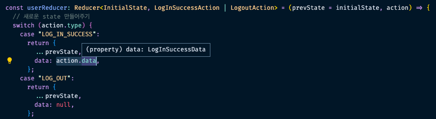

## Redux 타입 분석

### named exports만 있는 Redux 알아보기

Redux 타입을 분석하기 위해 먼저 redux 라이브러리를 설치해준다.
이후 `redux/index.d.ts` 에 접근해보면 별도 export 되고 있는 부분을 확인할 수 없음
각 메서드들이 직접 export function(named exports라고도 불린다.)으로 구현되어 있는데, 이는 redux의 경우 모듈 자체를 export 해주지 않으며 각 메서드들을 아래와 같이 가져와야 한다는 것을 의미한다.

```tsx
// import redux from "redux"; // 이렇게 쓸 일은 없다.
import { combineReducers, legacy_createStore as createStore } from "redux"; // 이렇게 직접 사용할 named export

const initialState = {
  user: {
    isLoggingIn: true,
    data: null,
  },
  posts: [],
};

// type Error
const reducer = combineReducers({
  user: null,
  posts: null,
});

const store = createStore(reducer, initialState);
```

위와 같이 기본 포맷을 하나씩 타이핑 해보면, 가장 먼저 reducer에서 타입 에러가 발생한다.
아마도 user, posts 값이 올바르지 않아서 인 것으로 느껴진다. combineReducers 타입을 확인해보자

```tsx
// index.d.ts
export function combineReducers<S>(reducers: ReducersMapObject<S, any>): Reducer<CombinedState<S>>;
export function combineReducers<S, A extends Action = AnyAction>(
  reducers: ReducersMapObject<S, A>
): Reducer<CombinedState<S>, A>;
export function combineReducers<M extends ReducersMapObject<any, any>>(
  reducers: M
): Reducer<CombinedState<StateFromReducersMapObject<M>>, ActionFromReducersMapObject<M>>;
// ..
```

오버로딩된 3가지 타입이 위와 같이 적혀있음.. 위 타입 중 Reducer 타입을 상세히 보자

```
export type Reducer<S = any, A extends Action = AnyAction> = (
  state: S | undefined,
  action: A
) => S
```

위와 같이 state, action을 매개변수로 해서 state를 리턴해주는 구조라는 것을 알 수 있다.

```tsx
const reducer = combineReducers({
  user: (state, action) => state,
  posts: (state, action) => state,
});
```

이에 따라 위와 같이 combineReducers에 필요한 데이터를 넣어주면 reducer 타입 에러가 사라짐.
이 밖에도 `combineReducers` 타입에 적용된 `ReducersMapObject` 타입을 보면 아래와 같다.

```tsx
/**
 * Object whose values correspond to different reducer functions.
 *
 * @template A The type of actions the reducers can potentially respond to.
 */
export type ReducersMapObject<S = any, A extends Action = Action> = {
  [K in keyof S]: Reducer<S[K], A>;
};
```

위 타이핑으로 코드에 적용된 정보를 대입해보면 아래와 같다.

```tsx
const initialState = {
  // S = initialState
  user: {
    // S[k] or keyof S
    isLoggingIn: true,
    data: null,
  },
  posts: [], // S[k] or keyof S
};
```

위 타입 적용 구조를 이해해두고, 사용법을 알아둬야 나중에 직접 타이핑 시 활용할 수 있음

### action, reducer 타이핑하기

reducer 내부에 posts 데이터를 업데이트하는 코드를 작성하던 중 에러가 발생한다.

```tsx
// ..
const reducer = combineReducers({
  user: (state, action) => {
    // ..
  },
  posts: (state, action) => {
    switch (action.type) {
      case "ADD_POST":
        return [...state, action.data]; // state is unknown
      default:
        return state;
    }
  },
});
```

위 이슈는 아래와 같은 타입 가드를 넣어 해결할 수 있다.

```tsx
// ..
const reducer = combineReducers({
  user: (state, action) => {
    // ..
  },
  posts: (state, action) => {
    if (!Array.isArray(state)) return; // type guard 추가
    switch (action.type) {
      case "ADD_POST":
        return [...state, action.data]; // state is unknown
      default:
        return state;
    }
  },
});
```

또 다른 방법으로는 애초에 해당 데이터에 대한 타이핑을 하는 것이 있음
(위 이슈 확인을 위해 스토어구조를 아래와 같이 구조화한다.)

```tsx
.
├── actions
│   ├── post.ts
│   └── user.ts
├── reducers
│   ├── index.ts
│   ├── post.ts
│   └── user.ts
└── redux.ts (이 파일에 스토어 파일 포함)
```

먼저 reducers에 발생하는 타입에러부터 수정해본다.

`./reducers/user.ts`

```tsx
const initialState = {
  isLoggingIn: false,
  data: null,
};

const userReducer = (prevState = initialState, action) => {
  // action에서 Error 발생
  // 새로운 state 만들어주기
  switch (action.type) {
    case "LOG_IN_SUCCESS":
      return {
        ...prevState,
        data: action.data,
      };
    case "LOG_OUT":
      return {
        ...prevState,
        data: null,
      };
    default:
      return prevState;
  }
};

export default userReducer;
```

위 action를 정의하기 위해서는 우선 아래와 같이 타입을 만들어서 넣어준다.

```tsx
import { LogInSuccessData, LogInSuccessAction, LogoutAction } from "../actions/user";

interface InitialState {
  isLoggingIn: boolean;
  data: LogInSuccessData | null;
}

// ..
const userReducer: Reducer<InitialState, LogInSuccessAction | LogoutAction> =
	(prevState = initialState, action) => { .. };
```

`./actions/user.ts`

```tsx
// ..

// 필요한 LogInSuccessAction 타입 생성
export type LogInSuccessData = { userId: number; nickname: string };
export type LogInSuccessAction = {
  type: "LOG_IN_SUCCESS";
  data: LogInSuccessData;
};

// LogInSuccessData 타입 적용
const logInSuccess = (data: LogInSuccessData): LogInSuccessAction => {
  return {
    type: "LOG_IN_SUCCESS",
    data,
  };
};

// 필요한 LogoutAction 타입 생성
export type LogoutAction = { type: "LOG_OUT" };

// LogoutAction 타입 적용
export const logOut = (): LogoutAction => {
  return {
    type: "LOG_OUT",
  };
};
```

위와 같이 처리하면 에러가 사라지며, action.data에 정의한 data 타입이 잘 들어오는 것을 확인할 수 있다.



만약 LOG_OUT 이벤트의 data 부분에 null이 아닌 action.data를 넣어주면 LogoutAction 타입에 전달되는 data 값이 없으므로 에러가 발생할 것이다. ('LogoutAction' 형식에 'data' 속성이 없습니다.) 이렇게 코드 실수를 막아주는 것이 유용한 것임

따라서 AnyAction으로 처리해버리지말고 최대한 상세히 타입을 넣어주는 것이 좋겠다.
post reducer도 동일하게 타이핑을 해준다.

`./reducers/post.ts`

```tsx
import { Reducer } from "redux";
import { AddPostAction, AddPostData } from "../actions/post";

const initialState: AddPostData[] = [];

// Reducer generic typing 추가
const postReducer: Reducer<AddPostData[], AddPostAction> = (prevState = initialState, action) => {
  // 새로운 state 만들어주기
  switch (action.type) {
    case "ADD_POST":
      return [...prevState, action.data];
    default:
      return prevState;
  }
};
```

`./actions/post.ts`

```tsx
// 필요한 AddPostAction 타입 생성
export type AddPostData = { title: string; content: string };
export type AddPostAction = {
  type: "ADD_POST";
  data: AddPostData;
};

// AddPostAction 타입 적용
export const addPost = (data: AddPostData): AddPostAction => {
  return {
    type: "ADD_POST",
    data,
  };
};
```

위와 같이 state 와 action에 대한 타이핑을 순차적으로 처리해주면 된다.
